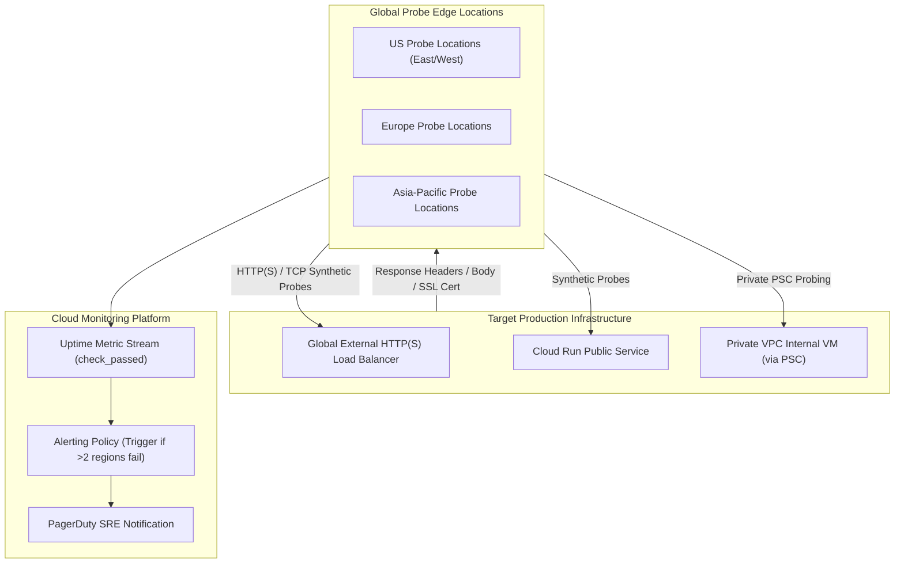

# Topic 98: Uptime Checks

---

## 1. What Is It?

**Google Cloud Monitoring Uptime Checks** provide active synthetic availability monitoring, external health probing, and multi-region latency validation for public or private network endpoints running across GCP, hybrid clouds, or on-premises environments.

Uptime Checks deliver four core availability monitoring features:
1. **Multi-Region Global Probing**: Dispatches automated synthetic HTTP, HTTPS, or TCP health probes from 6 geographic probe locations worldwide (Americas, Europe, Asia Pacific).
2. **Internal VPC Probing**: Leverages **Private Service Connect** or Internal HTTP Load Balancers to probe private IP endpoints inside a GCP Virtual Private Cloud (VPC).
3. **Response Validation**: Validates HTTP status codes (e.g., 200 OK), response header values, content body text matching, and SSL/TLS certificate expiration dates.
4. **Integrated Alerting Policies**: Triggers Cloud Monitoring Alerting Policies instantly when a minimum number of global probe regions report endpoint failure.

### Real-World Analogy
Think of Uptime Checks like mystery shoppers hired by a retail chain:
- **Internal Server Metrics (Cash Register Logs)**: The store manager checking internal register receipts, assuming the store is open because the registers are powered on.
- **Uptime Checks**: Sending mystery shoppers (Global Probe Agents) to walk up to the front doors of store locations in New York, London, Tokyo, and Sydney every 1 minute. The shoppers physically try to open the front door (HTTP GET request), verify that store lights are on (Status Code 200), check that the display banner is displayed correctly (Content String Match), and verify that the security lock isn't expired (SSL Certificate Check)—calling central operations the moment a door is locked.

---

## 2. Where Does It Fit?

Uptime Checks sit externally from application workloads, measuring end-to-end user connectivity from the public internet or private VPC networks into target endpoints.



---

## 3. Core Concepts

| Concept | Description | Production Best Practice |
|---|---|---|
| **Check Protocol** | Supported network protocols: HTTP, HTTPS, or raw TCP port checks. | Use HTTPS for web applications and TCP for database/gRPC ports. |
| **Check Frequency** | Probing interval (1 min, 5 min, 15 min). | Set 1-minute probing frequency for critical production services. |
| **Content Matcher** | Rule validating specific text strings or regex matches within the HTTP response body. | Require a specific JSON key (e.g., `"status": "HEALTHY"`). |
| **SSL Certificate Validation** | Automatic tracking of TLS certificate validity and expiration thresholds. | Configure SSL alerts to fire 30 days prior to certificate expiration. |
| **Internal Uptime Check** | Probing private IP endpoints inside a VPC using Cloud Pub/Sub or Private Service Connect. | Mandatory for validating private internal microservices. |

---

## 4. How It Works

A synthetic uptime probe execution sequence functions as follows:

```text
Global Probe Agents (6 Locations) initiate parallel HTTP GET requests every 60s
                               ↓
Endpoints receive requests -> Return HTTP Response Headers & Body Payload
                               ↓
Agents evaluate criteria: Status Code == 200 AND Body contains "HEALTHY" AND SSL Valid
                               ↓
Criteria Met -> Record `check_passed = 1` in Monarch DB
                               ↓
Criteria Failed (3+ Probe Regions fail) -> Record `check_passed = 0` -> Trigger PagerDuty Alert
```

1. **Quorum Alerting**: Requiring multiple probe locations (e.g., at least 2 or 3 regions) to confirm an endpoint failure prevents false alarms caused by localized internet routing issues.
2. **Static IP Ranges**: Google publishes static IP address ranges for external probe locations, allowing security teams to whitelist uptime checkers in Cloud Armor WAF rules.

---

## 5. Production Scenario

### Enterprise Global HTTPS Uptime Check with Content Matching & SSL Expiration Alerting

```text
Requirement: Establish a 1-minute global HTTPS uptime check for `api.company.com` that validates a JSON `{"status":"ok"}` body payload and alerts SREs 30 days before TLS certificate expiration.
    ↓
Architecture: Terraform `google_monitoring_uptime_check_config` + Alerting Policy + PagerDuty.
    ↓
Step 1: Declare Uptime Check in Terraform:
    resource "google_monitoring_uptime_check_config" "api_check" {
      display_name = "API Public Endpoint Health"
      timeout      = "10s"
      period       = "60s"
      monitored_resource {
        type = "uptime_url"
        labels = {
          host = "api.company.com"
        }
      }
      http_check {
        path         = "/healthz"
        port         = 443
        use_ssl      = true
        validate_ssl = true
        content_matchers {
          content = "\"status\":\"ok\""
          matcher = "CONTAINS_STRING"
        }
      }
    }
    ↓
Step 2: Attach Alerting Policy triggering PagerDuty if > 2 regions fail for 2 consecutive check periods.
    ↓
Result: Continuous global synthetic monitoring protecting end-user availability and preventing unexpected SSL certificate expiration outages.
```

*Why Selected*: Demonstrates native GCP synthetic health verification combining status, payload, and SSL validation.

---

## 6. Hands-On Lab

### Prerequisites
- Active GCP Project with Cloud Monitoring API enabled.
- Cloud Shell or local machine with `gcloud` CLI installed.

### CLI Method

```bash
# 1. Environment configuration
export PROJECT_ID=$(gcloud config get-value project)

# 2. Enable Monitoring API
gcloud services enable monitoring.googleapis.com

# 3. Create a public HTTP Uptime Check probing a sample domain
gcloud monitoring uptime create "Google Public Site Uptime Check" \
  --resource-type="uptime_url" \
  --resource-labels=host="google.com" \
  --path="/" \
  --period=1 \
  --timeout=10

# 4. List configured uptime checks
gcloud monitoring uptime list-configs

# 5. Describe created uptime check configuration details
CHECK_ID=$(gcloud monitoring uptime list-configs --format='value(name)' --filter='displayName="Google Public Site Uptime Check"')
gcloud monitoring uptime describe-config ${CHECK_ID}
```

### Verification
Execute `gcloud monitoring uptime describe-config ${CHECK_ID}` and confirm `period: 60s` and `httpCheck` parameters are accurately set.

### Cleanup

```bash
gcloud monitoring uptime delete-config ${CHECK_ID} --quiet
```

---

## 7. Security

### Uptime Check Security Controls
- **Cloud Armor Whitelisting**: If Cloud Armor WAF rules restrict public access, whitelist Google's official Uptime Check IP ranges (`gcloud monitoring uptime list-ips`).
- **Private VPC Probing Isolation**: Use Internal Uptime Checks with Private Service Connect to probe private internal endpoints without opening public internet firewall ports.

```text
BAD PRACTICE:
Disabling Cloud Armor security policies globally or opening public 0.0.0.0/0 firewall ingress rules just to allow uptime probes.

PRODUCTION PRACTICE:
Whitelist official Google Uptime Check IP ranges in Cloud Armor or use Internal Uptime Checks via Private Service Connect for private VPC targets.
```

---

## 8. Scaling & High Availability

Multi-region probe distribution architecture:

```text
Synthetic Probe Engine -> Dispatches parallel probes from 6 global regions:
├── USA East & West
├── Europe West & Central
└── Asia Pacific South & East
```

- **False Positive Elimination**: Requiring a quorum of global probe regions to fail before triggering an alert prevents single-ISP network degradation from triggering false P1 pages.

---

## 9. Cost

### Pricing Structure

| Component | Cost Model | Note |
|---|---|---|
| **Uptime Checks Ingestion** | $0.30 per 1,000 check executions | Extremely low cost (~$13 / month for 1-min checks). |
| **First 1 Million Executions / Month** | Included in free tier credits | Covers basic multi-endpoint monitoring free. |

---

## 10. Monitoring & Troubleshooting

### Probe Debugging & Metrics
- **Metric Type**: Filter `monitoring.googleapis.com/uptime_check/check_passed` in Metrics Explorer to visualize uptime success percentages.
- **Latency Metric**: Monitor `monitoring.googleapis.com/uptime_check/request_latency` to track global network response times per region.

### Troubleshooting Matrix

| Symptom | Cause | Resolution |
|---|---|---|
| Uptime check failing from all regions | Target service down or HTTP 500 error returned | Test path directly using `curl -v https://your-domain.com/healthz`. |
| Uptime check failing from specific regions | Cloud Armor WAF blocking probe IP addresses | Whitelist Google Uptime Check IP ranges in Cloud Armor. |
| SSL validation error | TLS certificate expired or untrusted root CA | Renew SSL certificate or attach trusted intermediate CA certs. |

---

## 11. Common Mistakes

```text
Mistake: Probing heavy application endpoints (e.g., dynamic SQL query pages) every 60 seconds.
Why: Pointing uptime checks at main application routes.
Impact: Generates artificial load and inflates database query costs across 6 global probe locations.
Correct Approach: Create dedicated lightweight `/healthz` endpoints that execute fast in-memory health checks.

Mistake: Triggering P1 alerts when a single probe location fails.
Why: Overly sensitive alert policy conditions.
Impact: Transient internet routing issues in one geographic region trigger false midnight P1 pages.
Correct Approach: Set alert conditions to require failures across at least 2 or 3 probe regions.
```

---

## 12. Production Best Practices

- [ ] Create dedicated lightweight **`/healthz`** endpoints for uptime probing.
- [ ] Use **HTTPS** with **SSL Validation** enabled.
- [ ] Configure **Content Matchers** to verify expected JSON string responses (`"status":"ok"`).
- [ ] Require failures across **3+ Probe Regions** before dispatching P1 alerts.
- [ ] Whitelist **Official Google Probe IPs** in Cloud Armor WAF rules.
- [ ] Use **Internal Uptime Checks** for private VPC microservices.

---

## 13. Hyperscaler / Enterprise Perspective

```text
Personal / Learning
  Basic HTTP Uptime Check → 5-Minute Frequency → Single URL Probe
        ↓
Small Production
  HTTPS Check + Content Matcher → 1-Minute Frequency → Email Alerts
        ↓
Enterprise Environment
  Terraform Provisioned Checks → SSL Expiration Alerts → Cloud Armor IP Whitelisting
        ↓
Hyperscaler Environment
  Internal VPC Probes via Private Service Connect → Multi-Region SLO Latency Tracking → Automated Cloud DNS Failover Routing
```

Enterprise hyperscalers tie Uptime Check metrics directly to **Cloud DNS Health Checks**, enabling automated cross-region DNS failover routing if an entire primary region's uptime probes report failure.

---

## 14. Real Project Questions

### Q1: Why should an Uptime Check point to a dedicated `/healthz` endpoint instead of the home page (`/`)?
**Answer:** Probing the home page causes global checkers to render dynamic assets, execute database queries, or consume bandwidth every 60 seconds across 6 regions. A dedicated `/healthz` endpoint returns a fast, lightweight in-memory JSON response, reducing server load while accurately validating application process health.

### Q2: How do you monitor the availability of a private internal GKE microservice that has no public IP address?
**Answer:** Use an **Internal Uptime Check**. Internal uptime checks leverage Private Service Connect or internal VPC connectors to route synthetic probe traffic privately across your GCP VPC without exposing the target microservice to the public internet.

### Q3: How do Uptime Checks protect against sudden website outages caused by expired TLS certificates?
**Answer:** Uptime Checks include native **SSL Certificate Validation**. When enabled, the probe monitors the expiration date of the target endpoint's TLS certificate and emits metrics that trigger alerts X days (e.g., 30 days) before the certificate expires, allowing SREs to renew certificates proactively.

---

## 15. Quick Decision Guide

| Endpoint Type | Recommended Check Configuration | Advantage |
|---|---|---|
| Public Web Application / API | External HTTPS + Content Matcher + SSL Check | Validates end-to-end global user experience and TLS health. |
| Private Internal Microservice | Internal Uptime Check via PSC | Probes private RFC1918 IPs securely within the VPC. |
| Database / Non-HTTP Service | TCP Port Check (e.g., Port 5432) | Verifies raw socket connectivity and port listening status. |

### When to Use Uptime Checks
- Essential for synthetic end-user availability monitoring, SSL certificate tracking, and SLA verification.

### When NOT to Use Uptime Checks
- Internal application performance profiling or deep code tracing (use Cloud Trace or Cloud Profiler).

---

## 16. Related Services

```text
                  [98. Uptime Checks]
                 /         |         \
      Cloud Monitoring Alerting Policy Cloud Armor
     (Monarch Metrics) (SRE Paging)   (WAF Whitelisting)
            |              |                 |
      Stores Latency  Triggers Outage   Permits Probe IP
      & Status Data   Alerts            Traffic Ingress
```

- **Cloud Monitoring**: Telemetry database storing uptime metric streams.
- **Alerting Policies**: Incident engine dispatching pages when uptime checks fail.
- **Cloud Armor**: WAF service whitelisting synthetic probe IP ranges.

---

## 17. Cheat Sheet

### Common gcloud Uptime Check Commands

```bash
# List all configured uptime checks
gcloud monitoring uptime list-configs

# List official Google Uptime Check probe IP ranges
gcloud monitoring uptime list-ips

# Create a TCP Uptime Check probing port 443
gcloud monitoring uptime create "Database Port Check" --resource-type="uptime_url" --resource-labels=host="db.example.com" --port=5432 --period=1
```

---

## 18. Learning Connection

- **Previous Topic**: [97. Alerting Policies](../97-alerting-policies/README.md)
- **Next Topic**: [99. Cloud Trace](../99-cloud-trace/README.md)
