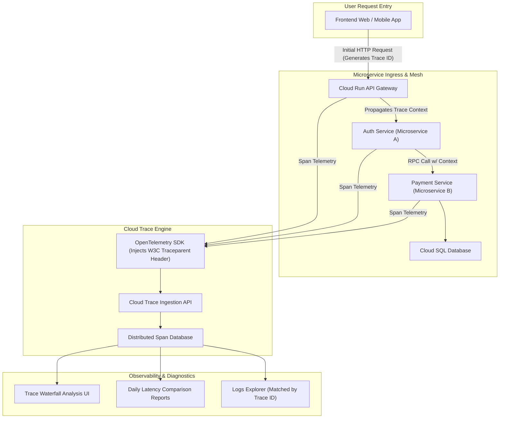

# Topic 99: Cloud Trace

---

## 1. What Is It?

**Google Cloud Trace** is a fully managed, real-time distributed tracing system on Google Cloud Platform that collects, visualizes, and analyzes latency telemetry across complex microservice architectures, API gateways, Cloud Run services, and GKE cluster workloads.

Cloud Trace delivers four core distributed performance capabilities:
1. **Distributed Request Waterfall Tracking**: Tracks end-to-end HTTP/gRPC request propagation through multi-tier microservices, generating visual waterfall latency charts for individual trace IDs.
2. **Automated Latency Bottleneck Analysis**: Identifies slow downstream database queries, external API call bottlenecks, and RPC network delays across releases.
3. **Trace-to-Log Correlation**: Integrates seamlessly with Cloud Logging, automatically linking structured log entries to specific trace spans via the `logging.googleapis.com/trace` context field.
4. **OpenTelemetry Interoperability**: Fully compatible with W3C Trace Context headers and OpenTelemetry SDK standards for vendor-neutral instrumentation.

### Real-World Analogy
Think of Cloud Trace like a GPS parcel tracking system for an online package delivery order:
- **Basic Metrics (Package Received Notification)**: Knowing an order took 3 days to arrive, but having zero visibility into where delays occurred.
- **Cloud Trace**: Inspecting a detailed GPS timeline (Trace ID) showing exact time spent at each hop: 10 mins in Sorting Warehouse A (Service A), 2 hours stalled in Customs Clearance (Database Query), and 15 mins in Final Delivery Van (Service B)—allowing logistics managers to pinpoint the exact customs bottleneck instantly.

---

## 2. Where Does It Fit?

Cloud Trace sits alongside Cloud Monitoring and Cloud Logging as the third core pillar of GCP's Observability Suite.



---

## 3. Core Concepts

| Concept | Description | Production Best Practice |
|---|---|---|
| **Trace** | The complete end-to-end journey of a single request across all microservices, identified by a unique `Trace ID`. | Propagate W3C `traceparent` headers across all HTTP/gRPC downstream calls. |
| **Span** | A single named, timed block of execution representing work done by an individual service or database call. | Add custom span attributes for high-value business metadata (e.g., `customer_tier`). |
| **Context Propagation** | Passing trace headers (`traceparent`) downstream across service boundaries. | Use OpenTelemetry automatic context propagation middlewares. |
| **Sampling Rate** | Percentage of total incoming requests recorded as trace spans (e.g., 10% or 100%). | Use adaptive sampling (e.g., 1-5% of total traffic) to manage costs while capturing anomalies. |
| **Analysis Reports** | Automated daily or release-to-release latency comparison reports generated by Cloud Trace. | Compare latency distributions before and after major application deployments. |

---

## 4. How It Works

Trace span capture and context propagation follow a standardized distributed telemetry flow:

```text
1. Client sends HTTP Request -> Gateway creates Trace ID: `4bf92f3577b34da6a3ce929d0e0e4736`
                               ↓
2. Gateway invokes Microservice A -> Pass header `traceparent: 00-4bf92f...-01`
                               ↓
3. Microservice A starts Span 1 -> Queries Database -> Starts Child Span 1.1
                               ↓
4. Microservice A invokes Microservice B -> Pass header `traceparent`
                               ↓
5. Spans streamed to Cloud Trace API -> Rendered as unified Waterfall Graph in Console
```

1. **Automatic GCP Service Tracing**: Google Cloud App Engine, Cloud Run, and Cloud Functions automatically create root trace spans without application code changes.
2. **Log Correlation**: Including `projects/PROJECT_ID/traces/TRACE_ID` in Cloud Logging JSON payloads embeds a direct "View Trace" button inside Logs Explorer.

---

## 5. Production Scenario

### OpenTelemetry Microservice Tracing with Cloud Logging Integration

```text
Requirement: Instrument a multi-tier Node.js and Go microservice architecture on GKE using OpenTelemetry to identify slow SQL queries and correlate error logs with specific trace IDs.
    ↓
Architecture: OpenTelemetry Node/Go SDKs + Cloud Trace Exporter + Cloud Logging.
    ↓
Step 1: Install OpenTelemetry SDK and GCP Trace Exporter in application code.
Step 2: Configure HTTP client middleware to inject W3C `traceparent` headers on downstream calls.
Step 3: Update application logger to inject trace ID into JSON logs:
    {
      "severity": "ERROR",
      "message": "Database connection timeout",
      "logging.googleapis.com/trace": "projects/my-proj/traces/4bf92f3577b34da6a3ce929d0e0e4736"
    }
    ↓
Step 4: Analyze latency in Cloud Trace -> Click correlated error log directly from span UI.
    ↓
Result: Reduces Mean Time to Detection (MTTD) of microservice latency bottlenecks from hours to minutes.
```

*Why Selected*: Demonstrates modern OpenTelemetry standards and cross-service log-to-trace correlation.

---

## 6. Hands-On Lab

### Prerequisites
- Active GCP Project with Cloud Trace API enabled.
- Cloud Shell or local machine with `gcloud` CLI installed.

### CLI Method

```bash
# 1. Environment configuration
export PROJECT_ID=$(gcloud config get-value project)

# 2. Enable Cloud Trace API
gcloud services enable cloudtrace.googleapis.com

# 3. Create a sample trace with custom spans using gcloud API simulation
TRACE_ID=$(openssl rand -hex 16)
SPAN_ID=$(openssl rand -hex 8)
START_TIME=$(date -u +%Y-%m-%dT%H:%M:%SZ)
END_TIME=$(date -u -d '500 milliseconds' +%Y-%m-%dT%H:%M:%SZ)

# 4. Inspect Cloud Trace API status and permissions
gcloud projects get-iam-policy ${PROJECT_ID} \
  --flatten="bindings[].members" \
  --format='table(bindings.role)' \
  --filter="bindings.role:roles/cloudtrace.agent"

# 5. List trace data using gcloud CLI
gcloud trace traces list --limit=5
```

### Verification
Execute `gcloud trace traces list` and verify command execution completes successfully (returning recent traces if active traffic exists).

### Cleanup
No persistent infrastructure created; no cleanup required.

---

## 7. Security

### Cloud Trace Security & Compliance
- **Trace Agent Role**: Restrict application deployment service accounts to `roles/cloudtrace.agent` (Write-only permission to push spans).
- **Data Privacy**: Ensure span names and custom span attributes DO NOT store raw credit card numbers, passwords, or PII.

```text
BAD PRACTICE:
Adding customer credit card numbers or raw SQL passwords as custom span attributes (`span.setAttribute("db.password", secret)`).

PRODUCTION PRACTICE:
Use sanitized SQL statement templates (`SELECT * FROM users WHERE id = ?`) and restrict span writing to `roles/cloudtrace.agent`.
```

---

## 8. Scaling & High Availability

Trace sampling and ingestion throughput tuning:

```text
High Traffic Application (100,000 requests / sec -> Heavy Trace Payload Costs)
                       ↓ (Adaptive Sampling Architecture)
Sampling Configuration:
├── Probabilistic Sampler: Record 1% of successful HTTP 200 requests
├── Tail-Based Sampler: Record 100% of HTTP 5xx error requests
└── Slow Request Sampler: Record 100% of requests exceeding 2,000ms latency
```

- **Cost Management via Sampling**: Use OpenTelemetry head-based or tail-based samplers to capture 100% of errors while sampling a small fraction of normal traffic.

---

## 9. Cost

### Cloud Trace Pricing Model

| Component | Free Monthly Allowance | Paid Ingestion Rate |
|---|---|---|
| **Span Ingestion** | First 2.5 Million spans / month FREE | $0.20 per million spans |
| **Trace Analysis Reports** | FREE | Included free in Cloud Trace. |

---

## 10. Monitoring & Troubleshooting

### Trace Analysis & Debugging
- **Latency Distribution Graph**: Use the scatter plot UI in Cloud Trace to isolate outlier requests running significantly slower than the median.
- **Trace Compare**: Generate comparison reports evaluating latency differences between two deployment releases.

### Troubleshooting Matrix

| Symptom | Cause | Resolution |
|---|---|---|
| Traces broken into disconnected spans | Microservice A failed to pass W3C `traceparent` header to Microservice B | Enable OpenTelemetry HTTP client context propagation middleware. |
| Traces missing in Cloud Trace Console | Service Account missing `roles/cloudtrace.agent` or sampling rate set to 0% | Grant `roles/cloudtrace.agent` and check sampling rules in app code. |
| High Cloud Trace monthly bill | High request volume combined with 100% sampling rate | Lower sampling rate to 1-5% for successful HTTP requests. |

---

## 11. Common Mistakes

```text
Mistake: Failing to propagate HTTP trace headers (`traceparent`) when making downstream microservice calls.
Why: Developer uses raw `http.Get()` calls without forwarding request context.
Impact: Cloud Trace renders fragmented, disconnected single-span graphs instead of a unified end-to-end request waterfall.
Correct Approach: Always pass request context using OpenTelemetry instrumented HTTP clients.

Mistake: Leaving sampling rate configured at 100% in high-throughput production environments.
Why: Keeping default local development sampling settings.
Impact: Ingests millions of unneeded spans, generating unexpectedly high monthly Cloud Trace bills.
Correct Approach: Configure adaptive sampling in production (e.g., 1% sample rate for normal traffic).
```

---

## 12. Production Best Practices

- [ ] Instrument applications using **OpenTelemetry (OTel)** standard libraries.
- [ ] Propagate **W3C `traceparent` headers** across all HTTP and gRPC microservice calls.
- [ ] Correlate logs and traces by injecting `logging.googleapis.com/trace` into JSON logs.
- [ ] Set production **Sampling Rates to 1-5%** to manage costs.
- [ ] Grant `roles/cloudtrace.agent` to microservice runtime service accounts.
- [ ] Use **Trace Analysis Reports** to validate latency improvements after software deployments.

---

## 13. Hyperscaler / Enterprise Perspective

```text
Personal / Learning
  Automatic Cloud Run Tracing → Default Sampling → Web Console Inspection
        ↓
Small Production
  OpenTelemetry Manual Instrumentation → Basic W3C Header Propagation → Log Correlation
        ↓
Enterprise Environment
  OTel Collector Deployment → Tail-Based Sampling (100% Errors / 1% Success) → Automated Release Latency Comparison Reports
        ↓
Hyperscaler Environment
  Service Mesh (Istio/ASM) Zero-Code Tracing → Cross-Cloud Trace Ingestion → Automated Error Budget SLO Latency Triggering
```

Enterprise hyperscalers leverage **Anthos Service Mesh (ASM)** or **Istio** to perform zero-code sidecar trace context injection, automatically tracing all microservice communication across multi-cluster GKE environments without modifying application code.

---

## 14. Real Project Questions

### Q1: What is context propagation in distributed tracing and why is it critical?
**Answer:** Context propagation is the practice of transmitting trace metadata (such as the unique `Trace ID` and `Parent Span ID` contained in the W3C `traceparent` HTTP header) from an upstream microservice to a downstream microservice during API calls. Without context propagation, tracing systems cannot correlate independent service calls into a single unified request waterfall graph.

### Q2: How does Cloud Trace integrate with Cloud Logging to speed up incident resolution?
**Answer:** When structured JSON application logs include the `logging.googleapis.com/trace` context field populated with the current request's GCP Trace ID, Cloud Logging automatically embeds a direct link to the trace waterfall in Logs Explorer. Conversely, Cloud Trace displays matching log entries directly inside span details, enabling instant correlation between latency spikes and error logs.

### Q3: Why is sampling important when configuring Cloud Trace for high-throughput production applications?
**Answer:** Ingesting 100% of trace spans for applications handling tens of thousands of requests per second creates massive network overhead and high billing costs. Setting an adaptive sampling rate (e.g., 1% of normal requests + 100% of errors/slow requests) captures all critical operational anomalies while maintaining negligible billing charges.

---

## 15. Quick Decision Guide

| Observability Requirement | Recommended Tool | Benefit |
|---|---|---|
| Pinpointing Microservice Latency Bottlenecks | Cloud Trace | Renders end-to-end multi-service waterfall timelines. |
| Aggregated Numeric System Health Telemetry | Cloud Monitoring | High-performance time-series dashboards and alerts. |
| Event Logs & Exception Stack Traces | Cloud Logging | Full-text searchable JSON event logs. |

### When to Use Cloud Trace
- Essential for microservice architectures, gRPC APIs, distributed transaction debugging, and latency profiling.

### When NOT to Use Cloud Trace
- Storing bulk application logs or system metrics (use Cloud Logging or Cloud Monitoring).

---

## 16. Related Services

```text
                    [99. Cloud Trace]
                   /        |        \
        Cloud Logging  OpenTelemetry  Cloud Run / GKE
       (Log Correlation)(OTel SDK)    (Auto-Tracing)
             |              |                |
        Embeds Trace    Provides Standard  Emits Native
        IDs in Logs     Span Instrumentation Spans
```

- **Cloud Logging**: Correlates structured logs with trace IDs.
- **OpenTelemetry**: Vendor-neutral SDK standard used to instrument trace spans.
- **Cloud Run / GKE**: Serverless and container runtimes supporting trace propagation.

---

## 17. Cheat Sheet

### OpenTelemetry W3C Header Format & gcloud Commands

```text
# W3C Traceparent Header Format:
# version - trace_id (32 hex) - parent_span_id (16 hex) - trace_flags (2 hex)
traceparent: 00-4bf92f3577b34da6a3ce929d0e0e4736-00f067aa0ba902b7-01
```

```bash
# List recent traces in a project
gcloud trace traces list --limit=10

# Describe a specific trace ID
gcloud trace traces describe TRACE_ID
```

---

## 18. Learning Connection

- **Previous Topic**: [98. Uptime Checks](../98-uptime-checks/README.md)
- **Next Topic**: [100. Cloud Profiler](../100-cloud-profiler/README.md)
