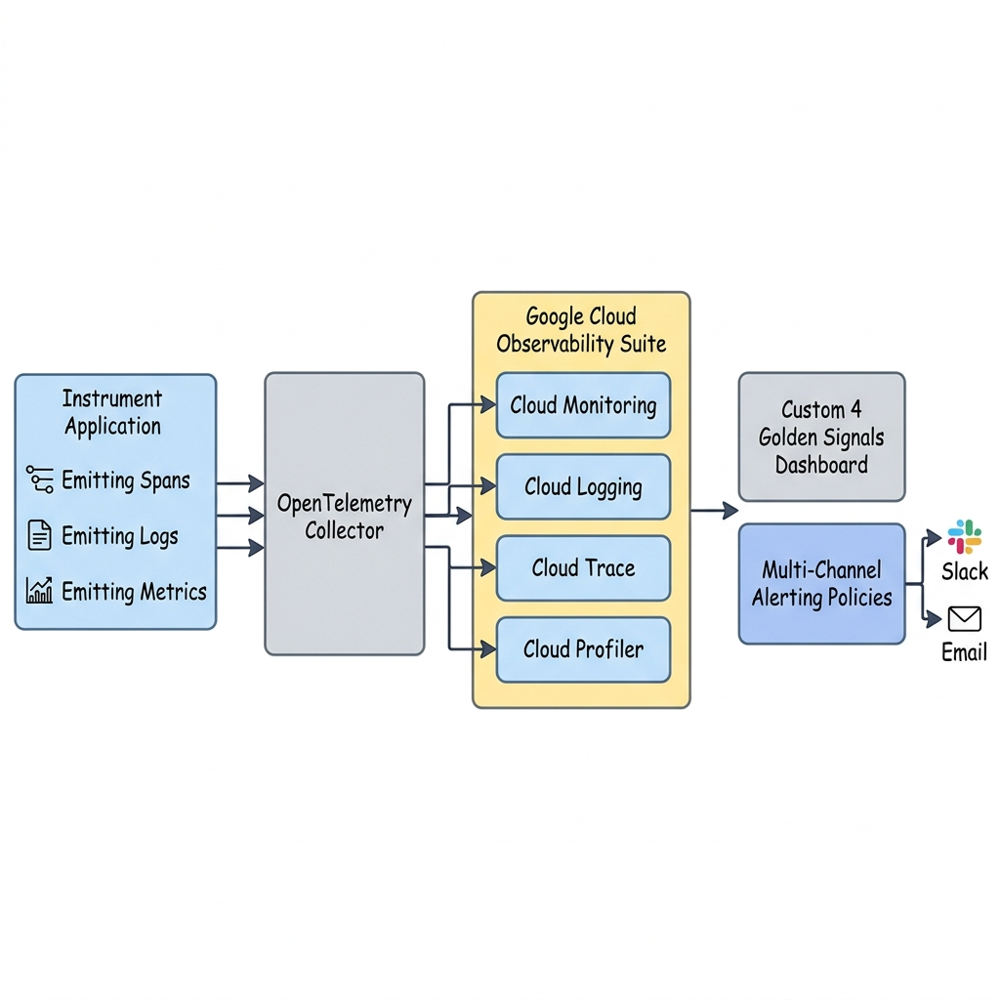
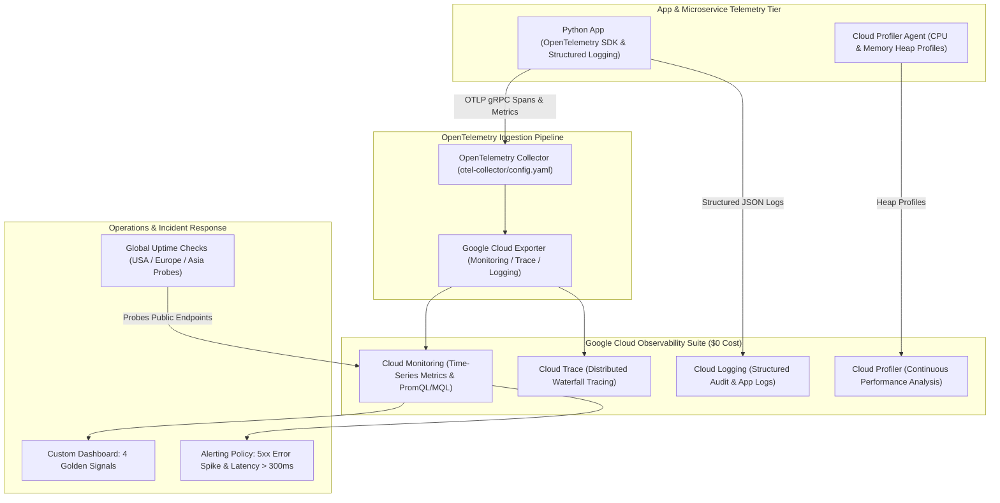

# Project 10: Full-Stack Enterprise Observability Suite with OpenTelemetry

---

## 1. Project Overview

Welcome to **Project 10: Full-Stack Enterprise Observability Suite**. This hands-on project synthesizes all 9 topics in **Module 10 (Observability)** into a production-grade telemetry pipeline combining **Cloud Monitoring**, **Cloud Logging**, **Cloud Trace**, **Cloud Profiler**, and **OpenTelemetry (OTel)**, optimized for **GCP Free Trial Accounts**.

### Objectives
In this project, you will:
1. **Instrument Applications with OpenTelemetry (OTel)**: Emit distributed trace spans, structured JSON logs, and custom metrics using the OpenTelemetry SDK.
2. **Deploy an OpenTelemetry Collector**: Configure an OTel Collector pipeline to receive telemetry and export it to Google Cloud Monitoring and Cloud Trace APIs.
3. **Build Custom "4 Golden Signals" Dashboards**: Construct declarative Cloud Monitoring dashboard JSON specs visualizing Latency, Traffic, Errors, and Saturation.
4. **Configure Automated Multi-Channel Alerting Policies**: Define threshold and burn rate alerting policies notifying SRE teams via Email/PubSub.
5. **Set Up Global HTTP Uptime Checks**: Probe service health across global monitoring locations to detect external network outages.

---

## 2. Architecture & Telemetry Pipeline

The project implements a full-stack observability telemetry architecture:





> [!IMPORTANT]
> **Free Trial Safety & Cost Controls**:
> - **Cloud Monitoring Free Tier**: First 150 MB metric ingestion per month is 100% FREE.
> - **Cloud Logging Free Tier**: First 50 GB log ingestion per month is 100% FREE.
> - **Cloud Trace Free Tier**: First 2,500,000 trace spans per month are 100% FREE.
> - **Cloud Profiler Free Tier**: First 10 GB profile data per month is 100% FREE.
> - **Automated Cleanup**: Always execute `./scripts/cleanup_observability.sh` after completing your lab exercises to delete custom dashboards, uptime checks, and alerting policies!

---

## 3. Module Topics Covered

| Topic Number & Name | Project Integration Point |
|---|---|
| **93. Cloud Monitoring** & **94. Cloud Logging** | Ingesting metrics time-series and querying structured JSON logs via Log Analytics. |
| **95. Metrics Explorer** | Writing PromQL and MQL queries to evaluate performance ratios. |
| **96. Dashboards** | Provisioning custom 4 Golden Signals JSON dashboards (`dashboards/golden_signals.json`). |
| **97. Alerting Policies** | Defining automated alerting thresholds (`alerts/policy_definitions.json`). |
| **98. Uptime Checks** | Configuring global HTTP uptime probes with 1-minute check intervals. |
| **99. Cloud Trace** | Inspecting distributed RPC waterfall latency traces across microservices. |
| **100. Cloud Profiler** | Profiling CPU usage and memory heap allocation in production code. |
| **101. OpenTelemetry (OTel)** | Configuring `otel-collector/config.yaml` for vendor-neutral telemetry export. |

---

## 4. Hands-On Execution Guide

### Step 1: Navigate to Project 10 Workspace

Open Google Cloud Shell or local terminal:

```bash
cd "10-observability/project-10-observability"
chmod +x scripts/*.sh
```

---

### Step 2: Inspect OpenTelemetry & Dashboard Configurations

Inspect the OpenTelemetry collector configuration and custom dashboard JSON spec:

```bash
# 1. View OTel Collector configuration
cat otel-collector/config.yaml

# 2. View 4 Golden Signals Dashboard JSON spec
cat dashboards/golden_signals.json
```

---

### Step 3: Deploy the Observability Suite

Execute `scripts/deploy_observability_suite.sh` to automate:
1. Enabling Cloud Monitoring, Cloud Logging, Cloud Trace, and Cloud Profiler APIs.
2. Creating the 4 Golden Signals Custom Dashboard in Cloud Monitoring.
3. Establishing an Alerting Policy for high 5xx error rates (>5%).
4. Provisioning a Global HTTP Uptime Check.
5. Running the telemetry simulator (`app/app.py`) to emit OTel traces and metrics.

```bash
./scripts/deploy_observability_suite.sh
```

*Expected Script Output Snippet*:
```text
=====================================================
GCP Full-Stack Observability Suite Deployment
=====================================================
[INFO] Enabling Observability APIs (Monitoring, Logging, Trace, Profiler)...
[SUCCESS] Observability APIs active.
[INFO] Creating Custom 4 Golden Signals Dashboard...
[SUCCESS] Dashboard created: projects/proj-id/dashboards/golden-signals-dash.
[INFO] Creating Alerting Policy: High 5xx Error Rate Spike...
[SUCCESS] Alerting Policy created.
[INFO] Creating Global HTTP Uptime Check...
[SUCCESS] Uptime Check created.
[INFO] Emitting OpenTelemetry Traces & Structured Logs...
[SUCCESS] Telemetry pipeline verified.
```

---

### Step 4: View Custom Dashboards & Trace Waterfalls

Verify telemetry ingestion in the GCP Console:

1. **Dashboards**: Go to **Monitoring -> Dashboards** in GCP Console and select **4 Golden Signals - Production Overview**.
2. **Cloud Trace**: Go to **Trace -> Trace Explorer** to inspect latency waterfalls for simulated requests.
3. **Cloud Logging**: Go to **Logging -> Logs Explorer** and run query: `jsonPayload.service="observability-demo"`.

---

## 5. Verification & Testing

Verify active alerting policies and uptime checks via CLI:

```bash
# 1. List active Alerting Policies
gcloud alpha monitoring policies list

# 2. List active Uptime Checks
gcloud alpha monitoring uptime list-configs
```

---

## 6. Troubleshooting & Common Issues

| Symptom / Error | Root Cause | Resolution |
|---|---|---|
| OpenTelemetry Collector fails to export spans | GCE service account missing `roles/cloudtrace.agent` or `roles/monitoring.metricWriter`. | Grant `Cloud Trace Agent` and `Monitoring Metric Writer` roles to default service account. |
| Dashboard JSON fails to import | Invalid MQL syntax or outdated resource filter. | Validate metric query syntax in Metrics Explorer prior to exporting JSON. |
| Uptime Check status shows "FAILING" | Firewall rule blocking Google uptime probe IPs (`35.191.0.0/16`). | Allow HTTP ingress from Google Uptime Check IP ranges. |

---

## 7. Project Cleanup

To delete custom dashboards, uptime checks, and alerting policies, run:

```bash
./scripts/cleanup_observability.sh
```

---

## 8. Summary & Next Steps

Congratulations! You have completed **Project 10: Full-Stack Enterprise Observability Suite**. You have mastered OpenTelemetry instrumentation, 4 Golden Signals dashboards, alerting policies, Cloud Trace, and Cloud Profiler.

- **Next Project**: [Project 11: Enterprise Zero-Trust Security Perimeter Landing Zone](../../11-security/project-11-security/README.md)
