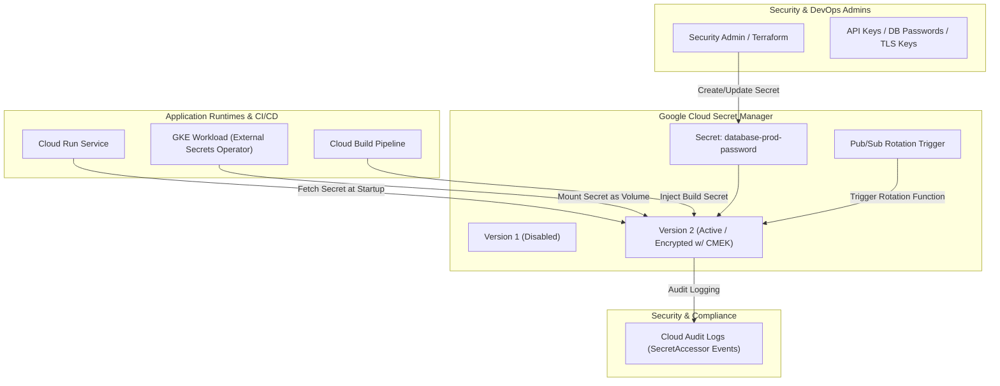

# Topic 102: Secret Manager

---

## 1. What Is It?

**Google Cloud Secret Manager** is a secure, fully managed, global secret storage and versioning service on Google Cloud Platform. It provides a centralized, hardware-encrypted repository for storing, accessing, rotating, and auditing sensitive application credentials, API keys, database passwords, OAuth tokens, TLS private keys, and SSH certificates.

Secret Manager delivers four core security capabilities:
1. **Global Immutable Versioning**: Secrets are stored as logical containers containing immutable, numbered secret versions (`version 1`, `version 2`, `latest`).
2. **Granular IAM Access Control**: Secret-level and version-level Cloud IAM permissions controlling who or what service account can access specific secret payloads.
3. **Automatic Secret Rotation**: Built-in integration with Cloud Functions and Cloud Pub/Sub to execute scheduled, automated secret rotation workflows.
4. **Audit Logging & Compliance**: Detailed Cloud Audit Logs recording every secret creation, payload access (`SecretAccessor`), modification, and deletion event.

### Real-World Analogy
Think of Secret Manager like a high-security bank safety deposit box system:
- **Hardcoded Secrets (Writing Passwords on Post-It Notes)**: Writing your safe combination on a piece of paper and taping it to the front door of your house.
- **Secret Manager**: Storing your valuable documents inside a digital bank vault. When an authorized representative (Service Account with `roles/secretmanager.secretAccessor`) presents biometric identification (OAuth Token), the bank vault officer opens the specific safe box version (Secret Payload), hands over the document, and writes an entry in the master ledger (Cloud Audit Logs) noting who accessed the vault at what exact second.

---

## 2. Where Does It Fit?

Secret Manager acts as the central security broker between secret administrators and application runtime environments.



---

## 3. Core Concepts

| Concept | Description | Production Best Practice |
|---|---|---|
| **Secret Container** | The top-level logical resource holding secret versions and access policies. | Use clear naming conventions (e.g., `prod-db-postgres-password`). |
| **Secret Version** | The actual immutable payload bytes (string/binary) bound to a secret container. | Destroy compromised or retired secret versions immediately. |
| **Automatic Replication** | Secret Manager automatically replicates payloads across multiple GCP regions. | Use Automatic Replication unless specific data residency rules apply. |
| **User-Managed Replication** | Explicitly specifying exact GCP regions where secret payloads reside. | Use when regulatory compliance requires data residency containment. |
| **Secret Accessor Role** | IAM role (`roles/secretmanager.secretAccessor`) granting permission to read secret payloads. | Grant secret accessor permissions to specific Service Accounts, never to individuals. |

---

## 4. How It Works

Secret creation, retrieval, and access evaluation proceed through a secure API lifecycle:

```text
1. Admin creates Secret Container & adds Version Payload
                               ↓
2. Payload encrypted at rest using AES-256 (or Cloud KMS CMEK)
                               ↓
3. Application Workload requests payload: `v1/projects/PROJ/secrets/MY_SECRET/versions/latest:access`
                               ↓
4. IAM checks caller identity -> Verifies `roles/secretmanager.secretAccessor` permission
                               ↓
5. Payload decrypted in memory -> Transmitted over TLS -> Event logged to Cloud Audit Logs
```

1. **Native Runtime Volume Mounts**: Cloud Run and GKE can mount Secret Manager secrets directly as environment variables or volume files without writing custom API fetching code.
2. **Version Pinning**: Applications can request `latest` dynamically or pin to specific version numbers (e.g., `version 2`) for strict release control.

---

## 5. Production Scenario

### Direct Secret Mounting in Cloud Run with Automated Rotation

```text
Requirement: Store a production Cloud SQL password securely, inject it as an environment variable into a Cloud Run microservice without hardcoding, and log all access events.
    ↓
Architecture: Secret Manager + Cloud Run Secret Environment Binding + Cloud IAM.
    ↓
Step 1: Create secret and add version in Secret Manager:
    gcloud secrets create prod-db-password --replication-policy="automatic"
    echo -n "super-secret-password-123" | gcloud secrets versions add prod-db-password --data-file=-
    ↓
Step 2: Grant Cloud Run Service Account accessor permissions:
    gcloud secrets add-iam-policy-binding prod-db-password \
      --member="serviceAccount:cloudrun-sa@proj.iam.gserviceaccount.com" \
      --role="roles/secretmanager.secretAccessor"
    ↓
Step 3: Deploy Cloud Run service mounting secret as environment variable:
    gcloud run deploy api-service \
      --image=us-central1-docker.pkg.dev/proj/app/api:v1 \
      --set-secrets="DB_PASSWORD=prod-db-password:latest"
    ↓
Result: Zero plain-text credentials in source code or deployment manifests; credentials decrypted in-memory by Cloud Run runtime.
```

*Why Selected*: Illustrates standard enterprise pattern for secret injection into serverless workloads.

---

## 6. Hands-On Lab

### Prerequisites
- Active GCP Project with Secret Manager API enabled.
- Cloud Shell or local machine with `gcloud` CLI installed.

### CLI Method

```bash
# 1. Environment configuration
export PROJECT_ID=$(gcloud config get-value project)
export SECRET_NAME="lab-api-key"

# 2. Enable Secret Manager API
gcloud services enable secretmanager.googleapis.com

# 3. Create Secret Container
gcloud secrets create ${SECRET_NAME} \
  --replication-policy="automatic" \
  --labels="environment=development,managed-by=gcloud"

# 4. Add Secret Version payload
echo -n "sk_live_998877665544332211" | gcloud secrets versions add ${SECRET_NAME} --data-file=-

# 5. Access and print secret payload
gcloud secrets versions access latest --secret=${SECRET_NAME}
echo ""

# 6. List versions of the secret
gcloud secrets versions list ${SECRET_NAME}

# 7. Add a new rotated secret version payload
echo -n "sk_live_112233445566778899" | gcloud secrets versions add ${SECRET_NAME} --data-file=-

# 8. Disable the old version (Version 1)
gcloud secrets versions disable 1 --secret=${SECRET_NAME}
```

### Verification
Execute `gcloud secrets versions list ${SECRET_NAME}` and confirm `Version 1` shows `DISABLED` and `Version 2` shows `ENABLED`.

### Cleanup

```bash
gcloud secrets delete ${SECRET_NAME} --quiet
```

---

## 7. Security

### Secret Security & Compliance Controls
- **Least Privilege Access**: Grant `roles/secretmanager.secretAccessor` at the individual secret level, NOT at the project level, to prevent one microservice from reading another microservice's secrets.
- **Customer-Managed Encryption Keys (CMEK)**: Protect secret payloads with Cloud KMS keys for strict regulatory compliance.
- **Audit Logging**: Monitor `SecretManager.AccessSecretVersion` events in Cloud Logging to detect unauthorized secret access attempts.

```text
BAD PRACTICE:
Hardcoding secrets in source code, committing `.env` files to Git, or granting `roles/secretmanager.admin` to application service accounts.

PRODUCTION PRACTICE:
Store secrets in Secret Manager, mount via native runtime bindings, enforce least-privilege `secretAccessor` roles, and audit access logs.
```

---

## 8. Scaling & High Availability

Secret Manager global availability and performance caching:

```text
Application Instances (1,000+ Cloud Run / GKE Pods)
                      ↓ (Local In-Memory Caching)
Request Secret at Boot -> Cache Payload in Memory -> Zero Per-Request Secret Manager API Calls
                      ↓
Global Multi-Region Replication -> High Availability Across Regions
```

- **Client-Side Caching**: Applications should cache secret payloads in memory during process startup to prevent API rate-limiting and minimize latency on high-throughput endpoints.

---

## 9. Cost

### Secret Manager Pricing Structure

| Component | Free Monthly Allowance | Paid Rate |
|---|---|---|
| **Active Secret Versions** | 6 active versions / month FREE | $0.06 per active version / month |
| **API Access Operations** | 10,000 access operations FREE | $0.03 per 10,000 operations |
| **Rotation Notifications** | Free | Standard Pub/Sub messaging rates |

---

## 10. Monitoring & Troubleshooting

### Operational Telemetry & Troubleshooting
- **Metrics Explorer**: Monitor `secretmanager.googleapis.com/api/access_events` to track access volumes and error rates.
- **Auditing Secret Access**: Filter Cloud Audit Logs for `protoPayload.methodName="google.cloud.secretmanager.v1.SecretManagerService.AccessSecretVersion"`.

### Troubleshooting Matrix

| Symptom | Cause | Resolution |
|---|---|---|
| `PermissionDenied (403)` when accessing secret | Calling Service Account lacks `roles/secretmanager.secretAccessor` role | Add IAM policy binding granting `secretAccessor` on the specific secret. |
| `NotFound (404)` on `latest` version | Secret container exists but contains no active enabled versions | Add a secret version using `gcloud secrets versions add`. |
| Cloud Run deployment fails on startup | Secret referenced in `--set-secrets` does not exist or typo in name | Verify exact secret name and version string in deployment command. |

---

## 11. Common Mistakes

```text
Mistake: Granting `roles/secretmanager.secretAccessor` at the Project level.
Why: Convenience in IAM setup.
Impact: Every service account in the project can read every database password, API key, and private key stored in Secret Manager.
Correct Approach: Grant `roles/secretmanager.secretAccessor` bound strictly to individual secret resources.

Mistake: Making API calls to Secret Manager on every single incoming HTTP request.
Why: Reading secrets dynamically inside HTTP handler functions.
Impact: Increases API request latency and incurs unnecessary Secret Manager API operation costs.
Correct Approach: Read and cache secret payloads in memory at application startup or use native runtime volume mounts.
```

---

## 12. Production Best Practices

- [ ] Store all API keys, database passwords, and private certificates in **Secret Manager**.
- [ ] Bind **`roles/secretmanager.secretAccessor`** to specific secrets, not at project level.
- [ ] Inject secrets using **native Cloud Run / GKE volume bindings** or environment variables.
- [ ] Cache secret payloads in memory at application startup to reduce API calls.
- [ ] Destroy or disable compromised secret versions immediately.
- [ ] Enable **Automatic Secret Rotation** using Cloud Pub/Sub and Cloud Functions.

---

## 13. Hyperscaler / Enterprise Perspective

```text
Personal / Learning
  Hardcoded `.env` Files → Plain Text ConfigMaps → Manual API Key Entry
        ↓
Small Production
  Secret Manager Web UI → Manual Version Addition → Project-Level IAM Access
        ↓
Enterprise Environment
  Terraform Provisioned Secrets → Resource-Level IAM Bindings → External Secrets Operator on GKE
        ↓
Hyperscaler Environment
  Automated Pub/Sub Secret Rotation Pipelines → CMEK KMS Encryption → 100% Audited Zero-Trust Access
```

Enterprise hyperscalers deploy **External Secrets Operator (ESO)** on GKE, synchronizing Secret Manager payloads automatically into native Kubernetes Secrets while enforcing strict separation of duties between SRE developers and security keys.

---

## 14. Real Project Questions

### Q1: What is the security risk of granting `roles/secretmanager.secretAccessor` at the GCP Project level?
**Answer:** Granting `secretAccessor` at the project level permits the service account to read the plaintext payload of *every* secret stored within that GCP project. In production, roles should be bound to individual secret resources so each microservice can only read its own designated credentials.

### Q2: How does Cloud Run mount secrets from Secret Manager without storing them on disk?
**Answer:** Cloud Run resolves secret references during container pod initialization, retrieving the payload from Secret Manager over encrypted TLS and injecting it directly into the container's in-memory environment variables or tmpfs volume mounts, ensuring secrets never touch persistent disk storage.

### Q3: What is the difference between disabling a secret version and destroying a secret version?
**Answer:** **Disabling** a secret version halts all payload access operations immediately, but retains the encrypted payload data in GCP, allowing it to be re-enabled later. **Destroying** a secret version permanently deletes the underlying payload bytes, making recovery impossible.

---

## 15. Quick Decision Guide

| Operational Requirement | Recommended Strategy | Advantage |
|---|---|---|
| Microservice Credential Injection | Mount via Cloud Run / GKE Native Binding | Decrypts in memory without application API code. |
| Automatic Kubernetes Secret Sync | External Secrets Operator (ESO) | Native K8s secret integration backed by GCP IAM. |
| Compliance Data Residency Containment | User-Managed Replication | Restricts secret payloads to specific geographic regions. |

### When to Use Secret Manager
- Mandatory service for storing API keys, passwords, private keys, certificates, and sensitive credentials across GCP.

### When NOT to Use Secret Manager
- Storing non-sensitive environment configuration parameters (use standard environment variables or ConfigMaps).

---

## 16. Related Services

```text
                 [102. Secret Manager]
                /          |          \
      Cloud KMS       Cloud Run / GKE  Cloud Audit Logs
    (CMEK Keys)      (Secret Mounts)   (Access Logging)
          |                |                 |
    Provides Payload  Injects Secrets   Audits Payload
    Encryption        In-Memory         Read Events
```

- **Cloud KMS**: Key management service providing CMEK keys to encrypt secret payloads.
- **Cloud Run / GKE**: Compute runtimes natively mounting Secret Manager payloads.
- **Cloud Audit Logs**: Audit trail recording all secret access and modification operations.

---

## 17. Cheat Sheet

### Essential CLI Secret Manager Commands

```bash
# Create a secret container
gcloud secrets create my-secret --replication-policy="automatic"

# Add a new version payload
echo -n "my-secret-password" | gcloud secrets versions add my-secret --data-file=-

# Access the latest version payload
gcloud secrets versions access latest --secret=my-secret

# Grant secret accessor permission to a service account on a specific secret
gcloud secrets add-iam-policy-binding my-secret \
  --member="serviceAccount:my-app-sa@my-proj.iam.gserviceaccount.com" \
  --role="roles/secretmanager.secretAccessor"

# Destroy a specific secret version
gcloud secrets versions destroy 1 --secret=my-secret --quiet
```

---

## 18. Learning Connection

- **Previous Topic**: [101. OpenTelemetry](../../10-observability/101-opentelemetry/README.md)
- **Next Topic**: [103. Cloud KMS](../103-cloud-kms/README.md)
