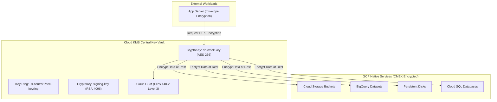

# Topic 103: Cloud KMS

---

## 1. What Is It?

**Google Cloud Key Management Service (Cloud KMS)** is a cloud-hosted cryptographic key management service on Google Cloud Platform that enables organizations to generate, use, rotate, store, and manage symmetric and asymmetric encryption keys across GCP services, hybrid workloads, and multi-cloud applications.

Cloud KMS delivers four core enterprise cryptographic capabilities:
1. **Centralized Key Hierarchy**: Organized structure managing **Key Rings**, **CryptoKeys**, and **CryptoKeyVersions** across global, regional, or multi-regional locations.
2. **Customer-Managed Encryption Keys (CMEK)**: Integrates natively with Cloud Storage, BigQuery, Compute Engine, Cloud SQL, and Secret Manager to encrypt data at rest using customer-controlled keys.
3. **Hardware Security Module (Cloud HSM)**: FIPS 140-2 Level 3 validated hardware modules protecting cryptographic keys from physical tampering.
4. **External Key Manager (Cloud EKM)**: Enables customers to retain cryptographic keys inside on-premises or third-party HSM vaults while authorizing GCP services to query keys via secure API connections.

### Real-World Analogy
Think of Cloud KMS like a certified master locksmith and safe key vault in a high-security facility:
- **Default Google Keys (Google-Managed Encryption Keys)**: The building developer providing standard locks on every apartment door. Google keeps the master key safely in its management office, encrypting data automatically without tenant effort.
- **Cloud KMS (Customer-Managed Encryption Keys / CMEK)**: Replacing the standard locks with your own custom high-security lock cylinder (CryptoKey). Only your authorized security guards (IAM Roles) hold the keys to lock or unlock your apartment door. If you revoke the guard's key permission in the master registry (KMS IAM Binding), even the building owner cannot open your door.

---

## 2. Where Does It Fit?

Cloud KMS serves as the central cryptographic root of trust powering data encryption across all GCP services.



---

## 3. Core Concepts

| Concept | Description | Production Best Practice |
|---|---|---|
| **Key Ring** | Logical container organizing keys within a specific GCP location (`global`, `us-central1`). | Organize key rings by location and environment tier. |
| **CryptoKey** | Named key resource defining key purpose (Symmetric Encryption, Asymmetric Signing, MAC). | Enable automatic key rotation (e.g., every 90 days). |
| **CryptoKeyVersion** | Specific cryptographic material representing a version of a CryptoKey. | Keep old versions enabled to allow decryption of legacy archives. |
| **Envelope Encryption** | Pattern encrypting raw data with a Data Encryption Key (DEK), then encrypting the DEK with a KMS Key Encryption Key (KEK). | Use envelope encryption for large files or high-throughput data streams. |
| **Protection Level** | Hardware tier hosting the key material (`SOFTWARE`, `HSM`, `EXTERNAL`). | Use `HSM` for regulatory compliance requiring FIPS 140-2 Level 3 validation. |

---

## 4. How It Works

Envelope Encryption using Cloud KMS follows a 2-tier key hierarchy:

```text
Data Payload (10 GB File)
           ↓
1. Generate local Data Encryption Key (DEK) -> Encrypt 10 GB File locally via AES-GCM
           ↓
2. Send DEK to Cloud KMS API -> Encrypt DEK using Key Encryption Key (KEK / CMEK)
           ↓
3. Store Encrypted 10 GB File alongside Encrypted DEK on Cloud Storage
           ↓
4. Decryption: Send Encrypted DEK to Cloud KMS -> Receive Plaintext DEK -> Decrypt 10 GB File
```

1. **Separation of Duties**: Cloud KMS handles key management; storage services handle bulk data storage, eliminating the need to transmit massive datasets to KMS APIs.
2. **Key Rotation Mechanics**: Rotating a CryptoKey generates a new key version used for *future* encryption operations while retaining older versions to decrypt legacy data.

---

## 5. Production Scenario

### Provisioning a CMEK-Encrypted Cloud Storage Bucket

```text
Requirement: Establish a CMEK-encrypted Cloud Storage bucket in `us-central1` using a Cloud KMS key with 90-day automatic key rotation and strict IAM separation of duties.
    ↓
Architecture: Cloud KMS Key Ring + CryptoKey + GCS CMEK Binding + IAM Policy.
    ↓
Step 1: Create Key Ring and CryptoKey with 90-day automatic rotation:
    gcloud kms keyrings create prod-keyring --location=us-central1
    gcloud kms keys create gcs-cmek-key \
      --location=us-central1 \
      --keyring=prod-keyring \
      --purpose=encryption \
      --rotation-period=90d \
      --next-rotation-time=$(date -u -d '+90 days' +%Y-%m-%dT%H:%M:%SZ)
    ↓
Step 2: Grant GCS Service Agent KMS Encrypter/Decrypter permissions:
    GCS_SA=$(gcloud storage service-agent)
    gcloud kms keys add-iam-policy-binding gcs-cmek-key \
      --location=us-central1 \
      --keyring=prod-keyring \
      --member="serviceAccount:${GCS_SA}" \
      --role="roles/cloudkms.cryptoKeyEncrypterDecrypter"
    ↓
Step 3: Provision GCS bucket assigned to CMEK key:
    gcloud storage buckets create gs://cmek-sec-bucket \
      --location=us-central1 \
      --default-kms-key=projects/PROJ/locations/us-central1/keyRings/prod-keyring/cryptoKeys/gcs-cmek-key
    ↓
Result: Data written to GCS is encrypted at rest using customer-controlled hardware keys rotated automatically every 90 days.
```

*Why Selected*: Demonstrates standard enterprise CMEK implementation for regulatory data protection.

---

## 6. Hands-On Lab

### Prerequisites
- Active GCP Project with Cloud KMS API enabled.
- Cloud Shell or local machine with `gcloud` CLI installed.

### CLI Method

```bash
# 1. Environment configuration
export PROJECT_ID=$(gcloud config get-value project)
export REGION="us-central1"
export KEYRING_NAME="lab-keyring"
export KEY_NAME="lab-symmetric-key"

# 2. Enable Cloud KMS API
gcloud services enable cloudkms.googleapis.com

# 3. Create Key Ring
gcloud kms keyrings create ${KEYRING_NAME} --location=${REGION}

# 4. Create Symmetric Encryption Key
gcloud kms keys create ${KEY_NAME} \
  --location=${REGION} \
  --keyring=${KEYRING_NAME} \
  --purpose="encryption" \
  --protection-level="software"

# 5. Encrypt a sample text payload using gcloud KMS CLI
echo "Confidential Enterprise Data Payload" > plain.txt
gcloud kms encrypt \
  --location=${REGION} \
  --keyring=${KEYRING_NAME} \
  --key=${KEY_NAME} \
  --plaintext-file=plain.txt \
  --ciphertext-file=encrypted.bin

# 6. Decrypt payload using gcloud KMS CLI
gcloud kms decrypt \
  --location=${REGION} \
  --keyring=${KEYRING_NAME} \
  --key=${KEY_NAME} \
  --ciphertext-file=encrypted.bin \
  --plaintext-file=decrypted.txt

# 7. Print decrypted payload to verify
cat decrypted.txt
echo ""
```

### Verification
Execute `cat decrypted.txt` and confirm the output matches `"Confidential Enterprise Data Payload"`.

### Cleanup

```bash
# Destroy key version (Schedule for deletion)
gcloud kms keys versions destroy 1 \
  --location=${REGION} \
  --keyring=${KEYRING_NAME} \
  --key=${KEY_NAME} --quiet

rm -f plain.txt encrypted.bin decrypted.txt
```

---

## 7. Security

### Cryptographic Security & Separation of Duties
- **Separation of Roles**: Enforce strict IAM separation: grant `roles/cloudkms.admin` to Security Operations (who manage keys) and `roles/cloudkms.cryptoKeyEncrypterDecrypter` to Service Accounts (who use keys). Never grant Key Admin roles to application workloads.
- **Key Immutability**: Cryptographic key material cannot be exported from Cloud KMS or Cloud HSM in plaintext.
- **Disable Key Versions for Emergency Revocation**: Disabling a key version instantly revokes access to all data encrypted by that key version without deleting underlying data.

```text
BAD PRACTICE:
Granting `roles/cloudkms.admin` to application deployment service accounts or storing raw cryptographic keys in application source code.

PRODUCTION PRACTICE:
Enforce IAM separation of duties (KMS Admin vs CryptoKey Encrypter/Decrypter) and use CMEK for all storage tier data.
```

---

## 8. Scaling & High Availability

Cloud KMS regional availability and quota scaling:

```text
Cloud KMS Regional Endpoints (us-central1 / europe-west1)
                      ↓ (Location Colocation Rule)
Colocate KMS Key Ring in SAME region as Target Service (e.g., GCS in us-central1)
                      ↓
Low-Latency Encryption Operations + High Availability Across Multi-Zone HSM Clusters
```

- **Location Matching**: Always place Key Rings in the identical GCP region as the target resources (Cloud SQL, BigQuery, GCS) to eliminate cross-region network latency during encryption/decryption calls.

---

## 9. Cost

### Cloud KMS Pricing Structure

| Component | Protection Level | Price per Month |
|---|---|---|
| **Software Key Versions** | `SOFTWARE` | $0.06 per key version / month |
| **HSM Key Versions** | `HSM` (FIPS 140-2 L3) | $1.00 per key version / month |
| **Cryptographic Operations** | All Levels | $0.03 per 10,000 operations |

---

## 10. Monitoring & Troubleshooting

### Operational Telemetry & Audit Logs
- **Cloud Audit Logs**: Filter `cloudkms.googleapis.com` API logs to trace who encrypted, decrypted, or destroyed key versions.
- **Key Version Status**: Check `gcloud kms keys versions list` to verify active key version states.

### Troubleshooting Matrix

| Symptom | Cause | Resolution |
|---|---|---|
| `PermissionDenied (403)` on GCS CMEK upload | Service Account lacks `roles/cloudkms.cryptoKeyEncrypterDecrypter` | Grant `cryptoKeyEncrypterDecrypter` on the key to the GCS service agent. |
| Cannot decrypt legacy data | Key version used to encrypt data was disabled or destroyed | Re-enable disabled key version (`gcloud kms keys versions enable`). |
| High KMS operational API bill | Application calling KMS API directly for every small database row | Implement local Envelope Encryption using Data Encryption Keys (DEKs). |

---

## 11. Common Mistakes

```text
Mistake: Destroying old key versions after rotating to a new key version.
Why: Assuming old key versions are no longer needed.
Impact: All historical backups, snapshots, and archived files encrypted with the old key version become permanently un-decryptable and lost.
Correct Approach: Keep old key versions in `ENABLED` status so legacy data can still be decrypted.

Mistake: Creating global Key Rings for regional resources.
Why: Trying to centralize all keys into a single global key ring.
Impact: Introduces cross-region latency and violates data sovereignty laws.
Correct Approach: Create regional Key Rings colocated in the exact region as target GCP resources.
```

---

## 12. Production Best Practices

- [ ] Use **Customer-Managed Encryption Keys (CMEK)** for enterprise data compliance.
- [ ] Colocate **Key Rings** in the same region as target GCP resources.
- [ ] Configure **Automatic Key Rotation** (e.g., every 90 days).
- [ ] Enforce IAM **Separation of Duties** (KMS Admins vs. Key Users).
- [ ] Retain old key versions in **ENABLED** status to allow legacy data decryption.
- [ ] Implement **Envelope Encryption** for high-volume custom application data.

---

## 13. Hyperscaler / Enterprise Perspective

```text
Personal / Learning
  Google-Managed Default Keys → Single Software Key → Manual Encrypt Commands
        ↓
Small Production
  Regional CMEK Keys → GCS & Compute Disk CMEK Encryption → 90-Day Auto Rotation
        ↓
Enterprise Environment
  Cloud HSM (FIPS 140-2 L3) → Strict IAM Separation of Duties → Multi-Region Key Rings
        ↓
Hyperscaler Environment
  External Key Manager (Cloud EKM) → Hold-Your-Own-Key (HYOK) On-Premises HSM Integration → Automated CMEK Compliance Auditing
```

Enterprise hyperscalers deploy **Cloud EKM (External Key Manager)**, allowing them to store cryptographic keys inside on-premises HSM vaults while permitting GCP services to perform encryption operations via secure TLS channels.

---

## 14. Real Project Questions

### Q1: What is the difference between Google-Managed Encryption Keys (GMEK) and Customer-Managed Encryption Keys (CMEK)?
**Answer:** **GMEK** is the default encryption applied automatically to all GCP data at rest for free, where Google owns and manages key lifecycle. **CMEK** uses Cloud KMS keys created, owned, rotated, and controlled by the customer, allowing customers to revoke key access or destroy key versions independently to enforce regulatory compliance.

### Q2: What is Envelope Encryption and why is it used for large datasets?
**Answer:** **Envelope Encryption** encrypts raw data locally using a fast, temporary Data Encryption Key (DEK), and then encrypts the DEK using a master Key Encryption Key (KEK) stored in Cloud KMS. It eliminates sending massive data payloads over network APIs to Cloud KMS, combining local performance with centralized key governance.

### Q3: Why should key rings be colocated in the same region as the resources they encrypt?
**Answer:** Colocating key rings in the same region (e.g., `us-central1` key ring for `us-central1` Cloud SQL instance) minimizes network latency during cryptographic operations, eliminates cross-region data egress charges, and prevents regional outage cascading failures.

---

## 15. Quick Decision Guide

| Encryption Requirement | Recommended KMS Option | Advantage |
|---|---|---|
| Standard Compliance Data Protection | Cloud KMS CMEK (Software) | Customer control over key rotation and revocation. |
| FIPS 140-2 Level 3 Hardware Security | Cloud HSM | Hardware tamper resistance for financial/healthcare data. |
| Absolute Key Sovereignty (On-Prem Key Vault) | Cloud EKM (External Key Manager) | Retains raw keys inside customer on-premise HSMs. |

### When to Use Cloud KMS
- Essential for CMEK data encryption, custom cryptographic signing, envelope encryption, and FIPS compliance.

### When NOT to Use Cloud KMS
- Storing passwords or API keys in plain text (use Secret Manager instead).

---

## 16. Related Services

```text
                     [103. Cloud KMS]
                    /       |        \
          Secret Manager   GCS / BQ   Cloud EKM
         (Secret CMEK)   (CMEK Data)  (On-Prem Keys)
               |            |              |
         Encrypts Secret  Encrypts Data   Integrates External
         Payloads         at Rest         Hardware Vaults
```

- **Secret Manager**: Uses Cloud KMS CMEK keys to encrypt secret payloads.
- **Cloud Storage / BigQuery**: Native storage services accepting CMEK key bindings.
- **Cloud EKM**: Extension connecting Cloud KMS to external on-premises HSMs.

---

## 17. Cheat Sheet

### Essential gcloud KMS Commands

```bash
# Create a Key Ring
gcloud kms keyrings create my-keyring --location=us-central1

# Create a CryptoKey with 90-day automatic rotation
gcloud kms keys create my-key --location=us-central1 --keyring=my-keyring --purpose=encryption --rotation-period=90d --next-rotation-time=$(date -u -d '+90 days' +%Y-%m-%dT%H:%M:%SZ)

# Grant Encrypter/Decrypter role on a key to a service account
gcloud kms keys add-iam-policy-binding my-key --location=us-central1 --keyring=my-keyring --member="serviceAccount:sa@proj.iam.gserviceaccount.com" --role="roles/cloudkms.cryptoKeyEncrypterDecrypter"

# Disable a key version
gcloud kms keys versions disable 1 --location=us-central1 --keyring=my-keyring --key=my-key
```

---

## 18. Learning Connection

- **Previous Topic**: [102. Secret Manager](../102-secret-manager/README.md)
- **Next Topic**: [104. Security Command Center](../104-security-command-center/README.md)
