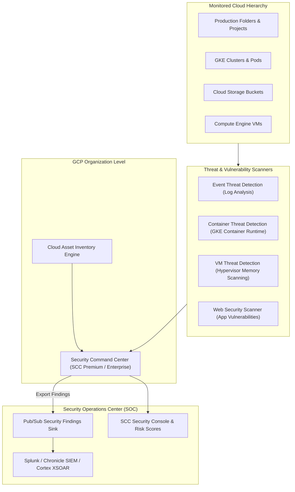

# Topic 104: Security Command Center

---

## 1. What Is It?

**Security Command Center (SCC)** is Google Cloud's centralized security risk management, threat detection, vulnerability assessment, and compliance monitoring platform. It provides enterprise security teams with real-time visibility into organization-wide asset inventories, misconfigurations, vulnerabilities, and active security threats.

Security Command Center delivers four core defense capabilities:
1. **Asset Discovery & Inventory**: Continuously scans and maintains a real-time inventory of all GCP assets (VMs, buckets, service accounts, IAM policies, subnets) across an entire Organization.
2. **Vulnerability Assessment**: Scans for infrastructure misconfigurations (open firewall ports, public GCS buckets, disabled MFA) and software vulnerabilities (OS CVEs, web app XSS/SQLi).
3. **Threat Detection Engines**: Leverages Event Threat Detection (analyzing Audit Logs), Container Threat Detection (analyzing GKE container behavior), and Virtual Machine Threat Detection (analyzing VM memory).
4. **Compliance Management**: Continuously benchmarks GCP infrastructure against regulatory standards including CIS Benchmarks, PCI-DSS, ISO 27001, HIPAA, and NIST 800-53.

### Real-World Analogy
Think of Security Command Center like the central security monitoring command tower of a international bank headquarters:
- **Un-monitored Cloud (Fragmented Security)**: Individual branch managers checking their own door locks, unaware that a side door was left propped open or that an unauthorized person is wandering through the basement vault.
- **Security Command Center**: A master 24/7 security control room with motion sensors (Event Threat Detection), automated door lock inspectors (Vulnerability Scanners), live CCTV camera feeds (Asset Discovery), and compliance auditors continuously generating risk scores and alerting security guards (Findings) the instant a lock is compromised or anomalous activity occurs.

---

## 2. Where Does It Fit?

Security Command Center sits at the Organization level, monitoring all underlying Folders, Projects, and Cloud Resources.



---

## 3. Core Concepts

| Feature / Tier | Standard Tier | Premium / Enterprise Tier |
|---|---|---|
| **Asset Discovery** | Asset inventory & basic discovery. | Full historical asset change tracking. |
| **Vulnerability Detection** | Basic Security Health Analytics (Open firewalls, public buckets). | Advanced Web Security Scanner, OS Vulnerability scanning, Container scans. |
| **Threat Detection** | Basic log anomaly detection. | Event Threat Detection (ETD), Container Threat Detection (CTD), VM Threat Detection (VMTD). |
| **Compliance Benchmarking** | Basic CIS GCP Foundations Benchmark. | PCI-DSS, ISO 27001, HIPAA, NIST, CIS v1.3/v2.0 compliance suites. |
| **Automated Remediation** | Manual console review. | Pub/Sub notifications + Cloud Functions for automated threat response. |

---

## 4. How It Works

Threat ingestion, analysis, and security finding generation follow a continuous pipeline:

```text
GCP Resources emit API Audit Logs, VM Memory States & Container Events
                               ↓
Detection Engines (ETD / CTD / VMTD) analyze event streams against Threat Intelligence
                               ↓
Violation detected (e.g., Cryptomining process detected in VM memory)
                               ↓
Generates "Finding" with Severity (CRITICAL/HIGH/MEDIUM/LOW) & Remediation Steps
                               ↓
Streams Finding to SCC Dashboard & Pub/Sub Topic -> Triggers Automated SOC Playbook
```

1. **Agentless VM Threat Detection**: VMTD analyzes VM hypervisor memory externally without requiring agent installation inside guest operating systems.
2. **Security Findings Lifecycle**: Findings move from `ACTIVE` to `MUTED` or `RESOLVED` as security teams remediate underlying misconfigurations.

---

## 5. Production Scenario

### Automated Incident Response for Public GCS Buckets via SCC & Cloud Functions

```text
Requirement: Detect whenever a Cloud Storage bucket is made publicly accessible, generate an SCC High-Severity Finding, and automatically revoke public access within 60 seconds.
    ↓
Architecture: SCC Security Health Analytics + Pub/Sub Findings Sink + Cloud Function.
    ↓
Step 1: SCC detects public bucket rule (`PUBLIC_BUCKET_ACL`).
Step 2: SCC streams finding to Pub/Sub topic `scc-findings-topic`.
Step 3: Cloud Function triggers on Pub/Sub message:
    - Parses Finding payload -> Extracts bucket name `gs://my-exposed-bucket`.
    - Calls GCS API -> Enforces `gcloud storage buckets update gs://my-exposed-bucket --uniform-bucket-level-access`.
Step 4: Marks Finding state as `RESOLVED`.
    ↓
Result: Zero-human-intervention automated security enforcement preventing accidental sensitive data leaks.
```

*Why Selected*: Illustrates enterprise Security Operations (SecOps) automated remediation integration.

---

## 6. Hands-On Lab

### Prerequisites
- Active GCP Project with Security Command Center API enabled.
- Cloud Shell or local machine with `gcloud` CLI installed.

### CLI Method

```bash
# 1. Environment configuration
export PROJECT_ID=$(gcloud config get-value project)

# 2. Enable Security Command Center API
gcloud services enable securitycenter.googleapis.com

# 3. List active SCC findings in the project
gcloud scc findings list projects/${PROJECT_ID} --limit=5

# 4. Filter findings by HIGH severity
gcloud scc findings list projects/${PROJECT_ID} \
  --filter="state=\"ACTIVE\" AND severity=\"HIGH\"" \
  --limit=5

# 5. List asset inventory tracked by SCC
gcloud scc assets list projects/${PROJECT_ID} --limit=5
```

### Verification
Execute `gcloud scc findings list projects/${PROJECT_ID}` and verify the command executes successfully, returning active security findings if any exist.

### Cleanup
No persistent infrastructure created; no cleanup required.

---

## 7. Security

### SCC IAM Roles & SecOps Governance
- **Security Center Admin (`roles/securitycenter.admin`)**: Grants full access to manage SCC configurations, notification sinks, and finding states.
- **Security Center Findings Viewer (`roles/securitycenter.findingsViewer`)**: Grants read-only access to view findings and asset inventories for SOC analysts.
- **Mute Rules**: Create Mute Rules to suppress expected false positives without deleting historical finding records.

```text
BAD PRACTICE:
Ignoring HIGH and CRITICAL SCC findings or granting developers `securitycenter.admin` permissions to resolve their own violations.

PRODUCTION PRACTICE:
Enforce least privilege via `securitycenter.findingsViewer`, route findings to a central SIEM via Pub/Sub, and automate remediation for critical misconfigurations.
```

---

## 8. Scaling & High Availability

Multi-project security posture management:

```text
GCP Organization Root (1,000+ Projects across Folders)
                       ↓ (Centralized Security Command Center)
Continuous Scanning Engines:
├── Security Health Analytics (Scans all Projects for Misconfigurations)
├── Event Threat Detection (Scans Organization-Wide Audit Log Stream)
└── Web Security Scanner (Scans Public Web Endpoints & Load Balancers)
```

- **Organization-Wide Scope**: SCC automatically inherits and monitors new GCP projects created anywhere within the organization hierarchy without requiring per-project agent deployments.

---

## 9. Cost

### Pricing Structure

| Tier | Features Included | Price Model |
|---|---|---|
| **Standard Tier** | Basic asset discovery, Security Health Analytics | 100% FREE for all GCP customers |
| **Premium Tier** | Threat Detection (ETD/CTD/VMTD), Compliance, Custom Mute Rules | Percentage of project compute/storage spend or fixed multi-year subscription |
| **Enterprise Tier** | Multi-cloud support (AWS/Azure), advanced threat hunting | Enterprise subscription model |

---

## 10. Monitoring & Troubleshooting

### Security Telemetry & Notification Integration
- **Pub/Sub Notification Sinks**: Create continuous export sinks to stream SCC findings directly to Splunk, Chronicle SIEM, or Datadog.
- **Security Health Analytics Rules**: Filter findings by category (e.g., `MFA_NOT_ENFORCED`, `PUBLIC_IP_ADDRESS`).

### Troubleshooting Matrix

| Symptom | Cause | Resolution |
|---|---|---|
| SCC findings not visible in project | SCC enabled at Project level instead of Organization level | Enable SCC at the GCP Organization root level. |
| Findings notifications not reaching SIEM | Pub/Sub topic permissions missing for SCC service account | Grant `roles/pubsub.publisher` to the SCC service agent. |
| High noise from expected development setups | Unfiltered test projects generating findings | Create Mute Rules for non-production folders. |

---

## 11. Common Mistakes

```text
Mistake: Enabling Security Command Center at the individual Project level instead of Organization level.
Why: Testing in a sandbox project.
Impact: Lacks cross-project visibility, misses ETD log stream analysis, and fails to enforce centralized enterprise security guardrails.
Correct Approach: Enable SCC at the Organization root level.

Mistake: Treating Security Command Center purely as a passive reporting dashboard.
Why: Failing to integrate Pub/Sub export sinks.
Impact: Security teams learn about critical misconfigurations days later during manual dashboard reviews.
Correct Approach: Stream findings real-time to Pub/Sub to trigger automated remediation Cloud Functions.
```

---

## 12. Production Best Practices

- [ ] Enable **Security Command Center** at the GCP Organization root level.
- [ ] Upgrade to **Premium/Enterprise Tier** for real-time threat detection (ETD/CTD/VMTD).
- [ ] Stream Findings to a central **SIEM via Cloud Pub/Sub**.
- [ ] Implement **Automated Remediation Cloud Functions** for high-risk findings (public buckets, open RDP/SSH).
- [ ] Continuously track compliance against **CIS GCP Foundations Benchmarks**.
- [ ] Use **Mute Rules** to manage false positives in development sandboxes.

---

## 13. Hyperscaler / Enterprise Perspective

```text
Personal / Learning
  Standard Tier → Web Console Inspection → Manual Finding Review
        ↓
Small Production
  Premium Tier -> Event Threat Detection -> Email Security Alerts
        ↓
Enterprise Environment
  Pub/Sub SIEM Integration (Chronicle / Splunk) → Custom Mute Rules → CIS Benchmark Compliance Tracking
        ↓
Hyperscaler Environment
  100% Automated SecOps Remediation → Multi-Cloud Security Command Center Enterprise → Real-Time Threat Intelligence Feed Integration
```

Enterprise hyperscalers integrate SCC with **Google Chronicle SIEM** and automated SOAR playbooks, executing sub-minute automated quarantines (revoking IAM tokens or isolating VMs) when critical threat findings are detected.

---

## 14. Real Project Questions

### Q1: What is the primary operational difference between Security Health Analytics and Event Threat Detection in SCC?
**Answer:** **Security Health Analytics** scans cloud resource configurations to detect static vulnerabilities and misconfigurations (e.g., public GCS buckets, open firewall ports). **Event Threat Detection (ETD)** continuously analyzes real-time streaming GCP Cloud Audit Logs using threat intelligence to detect active behavioral threats (e.g., cryptomining, brute-force SSH attacks, IAM privilege escalation).

### Q2: How does VM Threat Detection (VMTD) discover malware without installing an agent inside the guest OS?
**Answer:** VMTD operates at the hypervisor level. It performs agentless memory scanning directly from the Google Cloud hypervisor layer into the VM's guest memory space, detecting stealthy malware, kernel rootkits, and cryptomining processes without consuming VM CPU/RAM resources or altering guest OS configurations.

### Q3: How do you automate response actions when a critical finding is generated in Security Command Center?
**Answer:** Configure an SCC **Notification Filter** to export matching findings to a Cloud Pub/Sub topic. Connect a Cloud Function or Cloud Run service to subscribe to the Pub/Sub topic. When a finding occurs, the Cloud Function executes gcloud/REST API calls to remediate the vulnerability (e.g., closing a firewall port or removing a public IAM binding) automatically.

---

## 15. Quick Decision Guide

| Security Goal | Recommended SCC Component | Benefit |
|---|---|---|
| Detecting Open Firewall Ports & Public Buckets | Security Health Analytics (SHA) | Scans infrastructure configurations against security best practices. |
| Detecting Active Compromises & Privilege Escalation | Event Threat Detection (ETD) | Analyzes streaming Cloud Audit Logs for malicious behavior patterns. |
| Agentless Malware & Cryptomining Detection | VM Threat Detection (VMTD) | Hypervisor-level memory scanning with zero guest OS overhead. |

### When to Use Security Command Center
- Mandatory enterprise security platform for asset tracking, threat detection, vulnerability management, and regulatory compliance on GCP.

### When NOT to Use Security Command Center
- Simple single-developer sandbox projects where Standard Tier features are sufficient.

---

## 16. Related Services

```text
             [104. Security Command Center]
            /              |               \
     Cloud Audit Logs   Pub/Sub Topic    Chronicle SIEM
    (ETD Log Stream)   (Findings Export)(SOC Analytics)
          |                |                |
    Provides Threat    Streams Real-time Accepts SCC
    Event Data         Alert Payload     Security Events
```

- **Cloud Audit Logs**: Streaming log source analyzed by Event Threat Detection.
- **Cloud Pub/Sub**: Message bus exporting findings to automated remediation scripts.
- **Chronicle SIEM**: Google Cloud's security analytics platform receiving SCC telemetry.

---

## 17. Cheat Sheet

### Common gcloud Security Command Center Commands

```bash
# List active findings across an organization
gcloud scc findings list organizations/ORG_ID --filter="state=\"ACTIVE\""

# List active CRITICAL findings
gcloud scc findings list organizations/ORG_ID --filter="state=\"ACTIVE\" AND severity=\"CRITICAL\""

# Create a Pub/Sub notification channel for HIGH/CRITICAL findings
gcloud scc notifications create scc-high-alerts \
  --organization=ORG_ID \
  --pubsub-topic=projects/PROJ_ID/topics/scc-alerts \
  --filter="state=\"ACTIVE\" AND (severity=\"HIGH\" OR severity=\"CRITICAL\")"

# Mark a finding state as INACTIVE (Resolved)
gcloud scc findings update organizations/ORG_ID/sources/SOURCE_ID/findings/FINDING_ID --state="INACTIVE"
```

---

## 18. Learning Connection

- **Previous Topic**: [103. Cloud KMS](../103-cloud-kms/README.md)
- **Next Topic**: [105. Certificate Manager](../105-certificate-manager/README.md)
