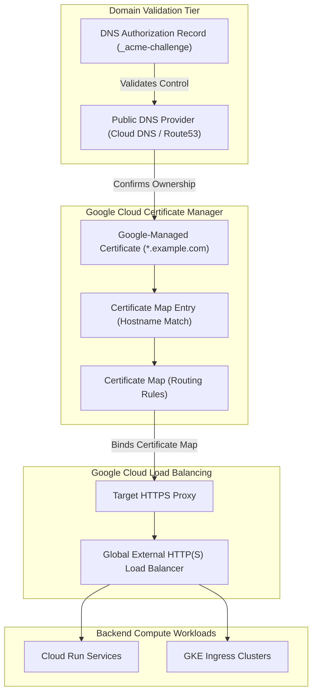

# Topic 105: Certificate Manager

---

## 1. What Is It?

**Google Cloud Certificate Manager** is a scalable, fully managed SSL/TLS certificate management service on Google Cloud Platform. It enables organizations to acquire, provision, validate, deploy, renew, and manage public and private TLS certificates at scale across Google Cloud Load Balancers, Cloud CDN, and Cloud Run endpoints.

Certificate Manager delivers four core TLS infrastructure capabilities:
1. **Google-Managed Free TLS Certificates**: Automates domain verification, issuance, deployment, and zero-downtime 90-day renewals for public TLS certificates via Let's Encrypt or Google Trust Services CAs.
2. **High-Scale Certificate Maps**: Decouples TLS certificate management from Load Balancer target proxies, allowing a single load balancer to serve hundreds of thousands of distinct domain certificates via Certificate Maps.
3. **Wildcard & Single-Domain Support**: Native support for single-domain, multi-domain (SAN), and wildcard (`*.example.com`) certificates using DNS authorization.
4. **Private CA Integration**: Integrates natively with **Google Cloud Private CA** to issue and manage internal TLS certificates for zero-trust private VPC microservices.

### Real-World Analogy
Think of Certificate Manager like a centralized municipal passport and ID issuance office:
- **Legacy SSL Deployment (Manual Server Certs)**: Individual store owners physically printing paper business permits, manually keeping track of expiration dates, and taping them to store windows every year. If a manager forgets, the police close the store down (Expired SSL Errors).
- **Certificate Manager**: An automated digital city agency. Store owners register their business domain name once (DNS Authorization). The agency automatically issues digital IDs (Google-Managed TLS Certs), attaches them to public entry gates (Load Balancers via Certificate Maps), and seamlessly issues new digital IDs behind the scenes prior to expiration—guaranteeing zero store closures or expired permit warnings.

---

## 2. Where Does It Fit?

Certificate Manager sits between public DNS providers, Certificate Authorities, and Google Cloud External/Internal Load Balancers.



---

## 3. Core Concepts

| Concept | Description | Production Best Practice |
|---|---|---|
| **DNS Authorization** | Resource proving domain control by creating a CNAME record in public DNS. | Mandatory for provisioning wildcard (`*.domain.com`) certificates. |
| **Google-Managed Certificate** | Certificate issued and automatically renewed by Google Trust Services or Let's Encrypt. | Use for all public web endpoints to eliminate manual renewal overhead. |
| **Self-Managed Certificate** | Custom TLS certificate and private key uploaded directly by the customer. | Use only for legacy enterprise custom Certificate Authority requirements. |
| **Certificate Map** | Resource defining mapping rules matching domain hostnames to specific certificates. | Use Certificate Maps to manage >100 certificates on a single Load Balancer. |
| **Certificate Map Entry** | An individual rule inside a Certificate Map binding a hostname pattern to a Certificate. | Use exact hostnames or wildcard patterns (`*.api.company.com`). |

---

## 4. How It Works

Provisioning a Google-Managed Wildcard TLS Certificate follows an automated workflow:

```text
1. Create DNS Authorization in Certificate Manager -> Generates CNAME target
                               ↓
2. Add CNAME record to Public DNS (e.g., `_acme-challenge.example.com` -> `gcp.acmedns.net`)
                               ↓
3. Create Google-Managed Certificate referencing DNS Authorization
                               ↓
4. Certificate Manager validates DNS CNAME -> Issues TLS Certificate -> Status = ACTIVE
                               ↓
5. Bind Certificate to Load Balancer via Certificate Map -> Automatic 90-day renewals
```

1. **Pre-Issuance DNS Verification**: DNS Authorization enables certificate issuance *before* directing live HTTP traffic to Google Cloud, guaranteeing zero downtime during migration.
2. **Automated Renewal Window**: Certificate Manager initiates renewal checks 30 days prior to certificate expiration, updating target proxies without dropping active connections.

---

## 5. Production Scenario

### Provisioning a Managed Wildcard TLS Certificate for Global Load Balancing

```text
Requirement: Issue a Google-Managed wildcard TLS certificate (`*.app.company.com`), bind it to a Global External HTTP(S) Load Balancer, and ensure automated zero-downtime renewals.
    ↓
Architecture: Certificate Manager + DNS Authorization + Certificate Map + HTTPS Load Balancer.
    ↓
Step 1: Create DNS Authorization:
    gcloud certificate-manager dns-authorizations create app-dns-auth \
      --domain="app.company.com"
    ↓
Step 2: Add generated CNAME record to Cloud DNS.
    ↓
Step 3: Create Google-Managed Wildcard Certificate:
    gcloud certificate-manager certificates create app-wildcard-cert \
      --domains="*.app.company.com,app.company.com" \
      --dns-authorizations="app-dns-auth"
    ↓
Step 4: Create Certificate Map & Entry:
    gcloud certificate-manager maps create app-cert-map
    gcloud certificate-manager maps entries create app-map-entry \
      --map="app-cert-map" \
      --certificates="app-wildcard-cert" \
      --hostname="*.app.company.com"
    ↓
Step 5: Attach Certificate Map to Target HTTPS Proxy:
    gcloud compute target-https-proxies update app-https-proxy \
      --certificate-map="app-cert-map"
    ↓
Result: High-scale HTTPS termination with automated Let's Encrypt / Google Trust Services TLS renewals.
```

*Why Selected*: Demonstrates native high-scale wildcard TLS certificate management on GCP.

---

## 6. Hands-On Lab

### Prerequisites
- Active GCP Project with Certificate Manager API enabled.
- Cloud Shell or local machine with `gcloud` CLI installed.

### CLI Method

```bash
# 1. Environment configuration
export PROJECT_ID=$(gcloud config get-value project)

# 2. Enable Certificate Manager API
gcloud services enable certificatemanager.googleapis.com

# 3. Create a DNS Authorization resource
gcloud certificate-manager dns-authorizations create lab-dns-auth \
  --domain="demo.example.com"

# 4. Describe DNS Authorization to inspect CNAME record target
gcloud certificate-manager dns-authorizations describe lab-dns-auth

# 5. Create a Certificate Map
gcloud certificate-manager maps create lab-cert-map

# 6. List Certificate Maps in the project
gcloud certificate-manager maps list
```

### Verification
Execute `gcloud certificate-manager maps list` and confirm `lab-cert-map` is listed as active.

### Cleanup

```bash
gcloud certificate-manager maps delete lab-cert-map --quiet
gcloud certificate-manager dns-authorizations delete lab-dns-auth --quiet
```

---

## 7. Security

### TLS Security & Key Protection
- **Private Key Security**: Private keys for Google-Managed Certificates are generated in secure hardware, stored encrypted at rest, and NEVER exposed via API or console interfaces.
- **TLS Policy Enforcement**: Attach modern **SSL Policies** to Load Balancers restricting incoming connections to TLS 1.2 or TLS 1.3 with secure cipher suites.

```text
BAD PRACTICE:
Storing raw un-encrypted `.pem` TLS private keys on developer laptops or committing them into Git source repositories.

PRODUCTION PRACTICE:
Use Google-Managed Certificates with DNS Authorization, enforcing TLS 1.3 SSL Policies on Load Balancer target proxies.
```

---

## 8. Scaling & High Availability

Certificate Map scale and multi-domain architecture:

```text
Legacy Target HTTPS Proxy (Limited to 15 SSL Certificates -> Manual Cert Swapping)
                       ↓ (Certificate Map Scaling)
Certificate Map Architecture:
├── Single Target HTTPS Proxy -> Bound to 1 Certificate Map
├── Supports up to 1,000,000 distinct Domain Certificates
└── Dynamic Hostname Matching (`api.domain.com`, `shop.domain.com`, `*.client.com`)
```

- **SaaS Platform Scale**: Certificate Maps enable multi-tenant SaaS platforms to serve millions of customer custom domains on a single shared GCP Load Balancer IP address.

---

## 9. Cost

### Certificate Manager Pricing Structure

| Feature | Cost Model | Note |
|---|---|---|
| **Google-Managed Certificates** | 100% FREE | Issuance and 90-day auto-renewals are free. |
| **Certificate Map Entries** | $5.00 per certificate map entry / month | Charges apply per active hostname mapping. |
| **First 5 Certificate Map Entries** | FREE | Free tier included for small environments. |

---

## 10. Monitoring & Troubleshooting

### Operational Telemetry & State Tracking
- **State Monitoring**: Track certificate status fields (`PROVISIONING`, `FAILED`, `ACTIVE`).
- **DNS Authorization Debugging**: Verify DNS CNAME record propagation using `dig` or `nslookup` if certificate provisioning stays stuck in `PROVISIONING`.

### Troubleshooting Matrix

| Symptom | Cause | Resolution |
|---|---|---|
| Certificate stuck in `PROVISIONING` | CNAME record missing or incorrect in public DNS | Inspect `dnsAuthorizations describe` and verify CNAME in DNS provider. |
| `FAILED` status during issuance | Domain CAA records block Google/Let's Encrypt CAs | Update CAA DNS records to permit `pki.goog` and `letsencrypt.org`. |
| Load Balancer rejecting HTTPS traffic | Certificate Map not attached to Target HTTPS Proxy | Run `gcloud compute target-https-proxies update --certificate-map=...`. |

---

## 11. Common Mistakes

```text
Mistake: Attempting to issue a wildcard certificate (`*.domain.com`) using HTTP Load Balancer validation instead of DNS Authorization.
Why: Forgetting protocol requirements.
Impact: Certificate issuance fails; wildcard certificates strictly require DNS-01 challenge verification via DNS Authorization.
Correct Approach: Always use DNS Authorization for wildcard TLS certificate provisioning.

Mistake: Forgetting to add CAA DNS records when restricting Certificate Authorities.
Why: Updating DNS records without checking CAA restrictions.
Impact: Google Trust Services or Let's Encrypt cannot issue the certificate, causing provisioning timeouts.
Correct Approach: Ensure CAA records permit `pki.goog` or `letsencrypt.org` in public DNS.
```

---

## 12. Production Best Practices

- [ ] Use **Google-Managed Certificates** for all public web application endpoints.
- [ ] Use **DNS Authorization** for wildcard (`*.domain.com`) certificate management.
- [ ] Provision certificates via **Certificate Maps** to support high-scale multi-domain routing.
- [ ] Configure **Cloud DNS CNAME records** prior to migrating live HTTP traffic.
- [ ] Attach modern **TLS 1.2+ SSL Policies** to Load Balancer Target HTTPS Proxies.
- [ ] Automate Certificate Manager deployment using **Terraform**.

---

## 13. Hyperscaler / Enterprise Perspective

```text
Personal / Learning
  Single-Domain SSL → Manual File Upload → Classic Target Proxy Binding
        ↓
Small Production
  Google-Managed Cert → HTTP Load Balancer Validation → Auto-Renewals
        ↓
Enterprise Environment
  DNS Authorization → Wildcard Managed Certs → Certificate Maps Deployment
        ↓
Hyperscaler Environment
  SaaS Multi-Tenant Certificate Maps (100k+ Customer Domains) → Google Cloud Private CA Integration → Automated Zero-Trust mTLS
```

Enterprise hyperscalers integrate Certificate Manager with **Google Cloud Private CA** to automate mutual TLS (mTLS) certificate issuance across internal microservices in zero-trust VPC networks.

---

## 14. Real Project Questions

### Q1: Why is DNS Authorization mandatory for issuing wildcard TLS certificates in Certificate Manager?
**Answer:** Wildcard certificates (`*.example.com`) cover all subdomains under a domain. HTTP load balancer path validation can only prove control of a single specific HTTP endpoint. DNS Authorization requires adding a unique cryptographic CNAME record at the root DNS zone level (`_acme-challenge`), proving full administrative control over the entire domain namespace.

### Q2: How do Certificate Maps solve the traditional Load Balancer certificate scaling limit?
**Answer:** Standard target HTTPS proxies have strict limits on the number of attached SSL certificates (typically 15). **Certificate Maps** decouple certificate storage from target proxies, creating a high-performance routing lookup table capable of matching over 1,000,000 certificates on a single Load Balancer IP address.

### Q3: What happens to user traffic when a Google-Managed Certificate undergoes automatic 90-day renewal?
**Answer:** Zero downtime or disruption. Certificate Manager provisions the new certificate version in the background, validates domain control, updates the target proxy binding atomically, and retires the old certificate version without dropping a single active TCP connection.

---

## 15. Quick Decision Guide

| Certificate Requirement | Recommended Certificate Manager Model | Benefit |
|---|---|---|
| Standard Public Web Application | Google-Managed Cert + Load Balancer Binding | Free, automated 90-day renewals with zero maintenance. |
| Multi-Subdomain SaaS Platform | Google-Managed Wildcard + DNS Authorization | Covers all current and future subdomains (`*.app.com`). |
| Multi-Tenant Custom Domains (>100 Domains) | Certificate Maps + Certificate Map Entries | High-scale domain matching on a single Load Balancer. |

### When to Use Certificate Manager
- Mandatory service for managing TLS/SSL certificates, wildcard domains, SaaS custom domains, and HTTPS load balancers on GCP.

### When NOT to Use Certificate Manager
- Simple single-instance Cloud Run custom domains where Cloud Run manages domain mapping automatically.

---

## 16. Related Services

```text
               [105. Certificate Manager]
              /            |            \
      Cloud DNS       HTTPS Load Balancer Cloud Private CA
     (DNS Auth CNAME) (TLS Termination)  (Internal Certs)
            |              |                   |
      Validates Domain Provides High-Scale   Issues Private mTLS
      Ownership        Certificate Binding  Microservice Certs
```

- **Cloud DNS**: DNS hosting provider managing ACME challenge CNAME records.
- **HTTPS Load Balancer**: Target proxy terminating TLS connections using Certificate Maps.
- **Cloud Private CA**: Managed private certificate authority for internal VPC mTLS.

---

## 17. Cheat Sheet

### Common gcloud Certificate Manager Commands

```bash
# Create a DNS Authorization
gcloud certificate-manager dns-authorizations create my-dns-auth --domain="example.com"

# Create a Google-Managed Wildcard Certificate
gcloud certificate-manager certificates create my-wildcard-cert --domains="*.example.com,example.com" --dns-authorizations="my-dns-auth"

# Create a Certificate Map
gcloud certificate-manager maps create my-cert-map

# Add an entry to a Certificate Map
gcloud certificate-manager maps entries create my-map-entry --map="my-cert-map" --certificates="my-wildcard-cert" --hostname="*.example.com"

# Attach Certificate Map to Target HTTPS Proxy
gcloud compute target-https-proxies update my-https-proxy --certificate-map="my-cert-map"
```

---

## 18. Learning Connection

- **Previous Topic**: [104. Security Command Center](../104-security-command-center/README.md)
- **Next Topic**: [106. Cloud Armor](../106-cloud-armor/README.md)
