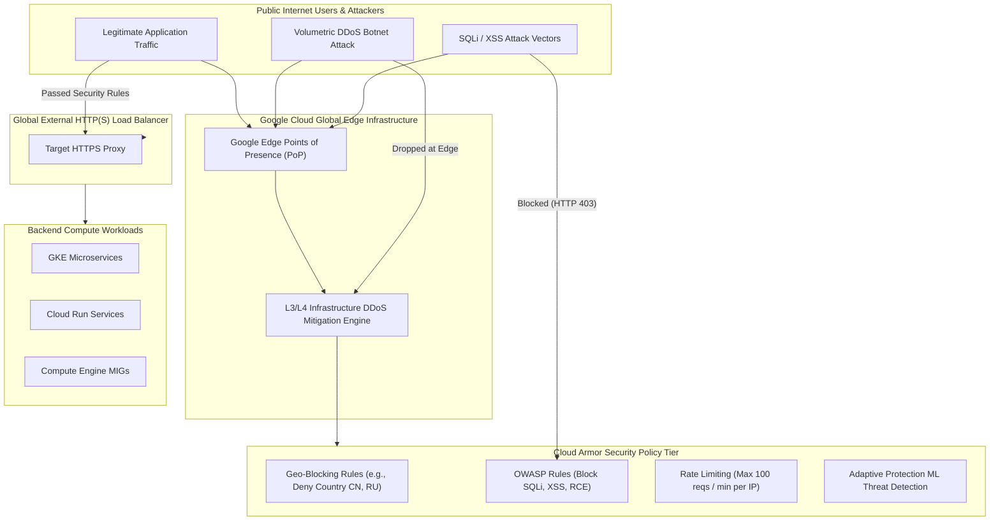

# Topic 106: Cloud Armor

---

## 1. What Is It?

**Google Cloud Armor** is an enterprise Web Application Firewall (WAF) and Distributed Denial of Service (DDoS) protection platform on Google Cloud Platform. Built directly into Google's global edge network infrastructure, Cloud Armor protects applications, APIs, Cloud Run services, and GKE workloads attached to Global External HTTP(S) Load Balancers against volumetric DDoS attacks, OWASP Top 10 vulnerabilities, and malicious web traffic.

Cloud Armor delivers four core perimeter defense capabilities:
1. **L3/L4 Infrastructure & L7 Volumetric DDoS Mitigation**: Leverages Google's global edge capacity to absorb massive volumetric DDoS floods before traffic reaches backend VPC networks.
2. **Out-of-the-Box WAF Rules (OWASP Top 10)**: Pre-configured security rules detecting and blocking SQL Injection (SQLi), Cross-Site Scripting (XSS), Local File Inclusion (LFI), Remote Code Execution (RCE), and Remote File Inclusion (RFI).
3. **Adaptive Protection & Rate Limiting**: AI/ML-driven threat detection that learns normal baseline traffic patterns and automatically generates custom firewall rules to block volumetric layer 7 attacks, combined with granular client IP rate limiting.
4. **Geo-Blocking & Custom IP Enforcement**: Granular rules filtering incoming web traffic based on client IPv4/IPv6 CIDRs, geographic origin countries, HTTP headers, or cookies.

### Real-World Analogy
Think of Cloud Armor like the border security checkpoints and perimeter walls surrounding a nation's capital city:
- **Un-protected Server (Direct Compute Instance)**: An open office building on a public street with no security guards. Anyone can walk in, flood the lobby with thousands of fake visitors (DDoS), or throw malicious items into offices (SQL Injection).
- **Cloud Armor**: Operating high-speed border security checkpoints at the country's outer perimeter (Google Edge Points of Presence). Border agents inspect every incoming vehicle (Packet Inspection), block fake traffic surges at the border highway (DDoS Absorption), screen cargo for prohibited weapons (WAF OWASP Rules), check passports for approved countries (Geo-Blocking), and issue temporary access passes (Rate Limiting) before allowing legitimate traffic near the capital city (Backend VPC).

---

## 2. Where Does It Fit?

Cloud Armor sits at Google's global edge network tier, filtering traffic *before* it passes through Global Load Balancers into backend compute workloads.



---

## 3. Core Concepts

| Concept | Description | Production Best Practice |
|---|---|---|
| **Security Policy** | Named container holding prioritized security rules attached to backend services. | Use standardized security policies per application tier. |
| **Rule Priority** | Numerical order (0-2147483647) evaluating rules sequentially (Lowest number evaluated first). | Place explicit Deny and Rate Limit rules at low numbers (e.g., Priority 100-500). |
| **OWASP Pre-configured Rules** | Built-in ModSecurity rules targeting SQLi (`sqli-v33-stable`), XSS (`xss-v33-stable`), etc. | Enable OWASP rules in `preview` mode first to test for false positives. |
| **Adaptive Protection** | Machine learning engine analyzing traffic patterns to auto-detect L7 DDoS attacks. | Enable Adaptive Protection on all production web application policies. |
| **Rate Limiting** | Rules restricting client HTTP request velocity based on IP, cookie, or header attributes. | Set rate limits on login (`/login`) and checkout endpoints (e.g., 10 reqs/min). |

---

## 4. How It Works

Security evaluation proceeds sequentially through rule priorities at Google's edge:

```text
Incoming HTTP Request hits Google Edge PoP
               ↓
L3/L4 DDoS Engine validates SYN floods & volumetric UDP traffic
               ↓
Cloud Armor Security Policy evaluates Rules in Priority Order (0 -> 2147483647)
               ↓
Rule Match Found?
├── YES -> Apply Action: DENY (403/404/502), RATE_LIMIT, or ALLOW -> Stop Evaluation
└── NO -> Fall through to Default Rule (Priority 2147483647: ALLOW) -> Forward to LB
```

1. **Preview Mode**: Setting `preview = true` on a rule logs what *would* have happened without actually blocking user traffic, allowing SREs to test new WAF rules safely.
2. **Edge Execution**: Rules execute at Google's global edge PoPs, ensuring blocked traffic consumes ZERO backend VPC bandwidth or compute CPU.

---

## 5. Production Scenario

### Enterprise WAF Policy Protecting Public Payment APIs

```text
Requirement: Establish a production Cloud Armor policy protecting a Cloud Run payment API against OWASP SQLi/XSS attacks, rate-limiting IP addresses exceeding 60 requests/minute, and geo-blocking unauthorized regions.
    ↓
Architecture: Terraform + Cloud Armor Security Policy + Global External HTTP(S) Load Balancer.
    ↓
Step 1: Declare Cloud Armor Policy in Terraform (`policy.tf`):
    resource "google_compute_security_policy" "api_waf" {
      name = "prod-api-waf-policy"

      # Priority 100: Rate Limiting (Max 60 reqs/min per IP)
      rule {
        action   = "rate_based_ban"
        priority = 100
        match {
          versioned_expr = "SRC_IPS_V1"
          config { src_ip_ranges = ["*"] }
        }
        rate_limit_options {
          rate_limit_threshold { count = 60; interval_sec = 60 }
          ban_duration_sec = 600
          conform_action   = "allow"
          exceed_action    = "deny(429)"
          enforce_on_key   = "IP"
        }
      }

      # Priority 200: OWASP SQL Injection Protection
      rule {
        action   = "deny(403)"
        priority = 200
        match {
          expr { expression = "evaluatePreconfiguredExpr('sqli-v33-stable')" }
        }
      }

      # Priority 2147483647: Default Allow
      rule {
        action   = "allow"
        priority = 2147483647
        match {
          versioned_expr = "SRC_IPS_V1"
          config { src_ip_ranges = ["*"] }
        }
      }
    }
    ↓
Step 2: Attach policy to Load Balancer backend service.
    ↓
Result: Comprehensive edge security blocking SQL injection and brute-force API attacks before reaching Cloud Run containers.
```

*Why Selected*: Illustrates standard enterprise defense-in-depth combining rate limiting, WAF rules, and default allow semantics.

---

## 6. Hands-On Lab

### Prerequisites
- Active GCP Project with Compute Engine API enabled.
- Cloud Shell or local machine with `gcloud` CLI installed.

### CLI Method

```bash
# 1. Environment configuration
export PROJECT_ID=$(gcloud config get-value project)
export POLICY_NAME="lab-cloud-armor-policy"

# 2. Enable Compute Engine API
gcloud services enable compute.googleapis.com

# 3. Create Cloud Armor Security Policy
gcloud compute security-policies create ${POLICY_NAME} \
  --description="Enterprise WAF Security Policy"

# 4. Add OWASP SQL Injection rule (Priority 1000)
gcloud compute security-policies rules create 1000 \
  --security-policy=${POLICY_NAME} \
  --expression="evaluatePreconfiguredExpr('sqli-v33-stable')" \
  --action="deny-403" \
  --description="Block SQL Injection attacks"

# 5. Add IP Rate Limiting rule (Priority 2000)
gcloud compute security-policies rules create 2000 \
  --security-policy=${POLICY_NAME} \
  --expression="true" \
  --action="rate-based-ban" \
  --rate-limit-threshold-count=100 \
  --rate-limit-threshold-interval-sec=60 \
  --ban-duration-sec=300 \
  --conform-action="allow" \
  --exceed-action="deny-429" \
  --enforce-on-key="IP" \
  --description="Rate limit to 100 reqs/min per IP"

# 6. Describe rules in the security policy
gcloud compute security-policies describe ${POLICY_NAME}
```

### Verification
Execute `gcloud compute security-policies describe ${POLICY_NAME}` and verify Priority 1000 (SQLi Deny) and Priority 2000 (Rate Limit) are active.

### Cleanup

```bash
gcloud compute security-policies delete ${POLICY_NAME} --quiet
```

---

## 7. Security

### Perimeter Security Best Practices
- **Never Rely Solely on Network Tags**: Attach Cloud Armor policies directly to Global Load Balancer backend services for guaranteed edge enforcement.
- **Header Sanitization**: Strip internal headers (e.g., `X-Forwarded-For`) at the load balancer proxy to prevent client IP spoofing attacks.

```text
BAD PRACTICE:
Exposing Compute Engine VMs or Cloud Run containers directly to the public internet using direct public IP addresses without Cloud Armor edge protection.

PRODUCTION PRACTICE:
Force all public ingress through a Global External HTTP(S) Load Balancer protected by a Cloud Armor Security Policy with OWASP rules and rate limiting.
```

---

## 8. Scaling & High Availability

Cloud Armor edge infrastructure capacity:

```text
Global Volumetric DDoS Attack (1 Tbps UDP/SYN Flood + 1,000,000 L7 HTTP Requests/sec)
                               ↓
Google Global Edge Infrastructure (Multi-Terabit Anycast Ingress Network)
                               ↓
L3/L4 Infrastructure Engine absorbs network flood -> Cloud Armor drops L7 HTTP attack
                               ↓
Zero Impact on Backend GCP Infrastructure (VPC bandwidth & Compute CPUs remain 100% normal)
```

- **Global Anycast BGP Routing**: Incoming web traffic hits the nearest Google Edge Point of Presence worldwide, ensuring DDoS attack traffic is absorbed locally near the attack origin.

---

## 9. Cost

### Cloud Armor Pricing Model

| Tier / Feature | Standard Tier | Managed Protection Plus Tier |
|---|---|---|
| **Base Policy Charge** | $5.00 per policy / month | $3,000.00 / month (Flat Subscription) |
| **Rule Charge** | $1.00 per rule / month | Included in subscription |
| **HTTP Request Evaluation** | $0.75 per 1,000,000 requests | Included in subscription |
| **DDoS Protection & Named IP Support** | Basic L3/L4 Included | Full L7 Adaptive Protection + DDoS Bill Protection |

---

## 10. Monitoring & Troubleshooting

### WAF Logging & Telemetry
- **Cloud Logging**: Filter Load Balancer logs (`resource.type="http_load_balancer"`) for `jsonPayload.enforcedSecurityPolicy.outcome="DENY"` to inspect blocked attack payloads.
- **Security Command Center**: SCC automatically surfaces high-frequency Cloud Armor block events as security findings.

### Troubleshooting Matrix

| Symptom | Cause | Resolution |
|---|---|---|
| Legitimate user traffic receiving `HTTP 403` | OWASP rule false positive on valid application payload | Enable `preview` mode on rule, inspect log payload, and tune rule signature parameters. |
| Rate limiting triggering on all users | Rate limit configured to enforce on `ALL` instead of `IP` | Change `--enforce-on-key` to `IP` or HTTP Header. |
| Cloud Armor policy not blocking traffic | Security policy created but not attached to Backend Service | Run `gcloud compute backend-services update --security-policy=...`. |

---

## 11. Common Mistakes

```text
Mistake: Deploying new OWASP WAF rules directly in `ENFORCE` mode without prior testing.
Why: Wanting immediate security enforcement.
Impact: False positives block legitimate user transactions, breaking core application features.
Correct Approach: Always deploy new WAF rules in `PREVIEW` mode first, monitor Cloud Logging for 48 hours to tune false positives, then switch to `ENFORCE`.

Mistake: Rate limiting using `--enforce-on-key=ALL` instead of `IP`.
Why: Misunderstanding rate limit key options.
Impact: Aggregates ALL global user traffic into a single global counter, banning ALL users worldwide as soon as combined traffic exceeds the threshold.
Correct Approach: Always specify `--enforce-on-key=IP` or `--enforce-on-key=HTTP-HEADER`.
```

---

## 12. Production Best Practices

- [ ] Attach Cloud Armor Security Policies to all **Global Load Balancer Backend Services**.
- [ ] Test new WAF rules in **Preview Mode** before enforcing in production.
- [ ] Enable **OWASP Pre-configured Rules** (SQLi, XSS, RCE, LFI).
- [ ] Implement **Rate Limiting** on sensitive authentication and payment endpoints.
- [ ] Enable **Adaptive Protection** for AI-driven L7 DDoS threat detection.
- [ ] Use **Geo-Blocking** rules to restrict traffic from non-operational countries.

---

## 13. Hyperscaler / Enterprise Perspective

```text
Personal / Learning
  Direct Instance Exposure → No Edge Firewall → Basic IP Allow Lists
        ↓
Small Production
  Global Load Balancer → Cloud Armor Standard Policy → Basic IP Rate Limiting
        ↓
Enterprise Environment
  Managed Protection Plus Subscription → OWASP Pre-configured WAF Rules → Geo-Blocking
        ↓
Hyperscaler Environment
  AI Adaptive Protection ML Auto-Mitigation → SOC Pub/Sub SIEM Logging → Global DDoS Financial Loss Protection
```

Enterprise hyperscalers subscribe to **Cloud Armor Managed Protection Plus**, granting access to Google Security Response Team (SRT) 24/7 incident assistance and financial protection against DDoS-induced compute auto-scaling billing spikes.

---

## 14. Real Project Questions

### Q1: What is the key functional difference between Rule Preview Mode and Enforce Mode in Cloud Armor?
**Answer:** In **Enforce Mode**, a matching Cloud Armor rule actively executes its action (e.g., blocking HTTP 403 or rate-limiting). In **Preview Mode**, the rule evaluates incoming traffic and logs what action *would* have been taken in Cloud Logging without actually dropping or blocking user traffic, allowing engineers to test for false positives safely in production.

### Q2: How does Cloud Armor rate limiting protect applications against layer 7 brute-force attacks?
**Answer:** Cloud Armor rate limiting tracks HTTP request velocity per client IP address over a defined time interval (e.g., max 20 requests per 60 seconds). If a client exceeds this threshold, Cloud Armor automatically executes a `rate_based_ban`, returning `HTTP 429 Too Many Requests` or dropping traffic at Google's edge for a designated ban duration (e.g., 10 minutes).

### Q3: Why is executing WAF rules at Google's Global Edge superior to running WAF software inside Kubernetes Pods?
**Answer:** Edge execution absorbs malicious volumetric floods and filters attack payloads at Google's global Points of Presence *before* traffic reaches your cloud infrastructure. This eliminates wasted VPC network bandwidth, prevents compute CPU/RAM exhaustion, and eliminates scaling costs associated with processing malicious traffic inside application containers.

---

## 15. Quick Decision Guide

| Threat Vector | Recommended Cloud Armor Feature | Advantage |
|---|---|---|
| SQL Injection & Cross-Site Scripting | OWASP Pre-configured Rules (`sqli`, `xss`) | Industry-standard ModSecurity signatures updated by Google. |
| API Brute-Force & Credential Stuffing | Rate Limiting (`rate-based-ban`) | Automatically bans abusive client IPs at Google's edge. |
| Volumetric Layer 7 DDoS Attacks | Adaptive Protection | AI/ML threat detection auto-generating real-time block rules. |

### When to Use Cloud Armor
- Essential for all public web applications, REST/gRPC APIs, Cloud Run services, and GKE workloads exposed via Global External Load Balancers.

### When NOT to Use Cloud Armor
- Internal VPC-only microservices that do not accept public internet ingress traffic.

---

## 16. Related Services

```text
                    [106. Cloud Armor]
                   /        |         \
      Global Load Balancer Cloud Run / GKE  Cloud Logging
     (Target Endpoint)    (Backend Service)(WAF Audit Logs)
            |                   |                 |
      Executes Edge       Protected Backend Logs Enforced
      WAF Policies        Compute Workloads Security Rules
```

- **Global Load Balancers**: Ingress points where Cloud Armor policies are attached.
- **Cloud Run / GKE**: Backend compute services protected by edge security rules.
- **Cloud Logging**: Destination for WAF security evaluation logs and blocked request payloads.

---

## 17. Cheat Sheet

### Essential gcloud Cloud Armor Commands

```bash
# Create a Security Policy
gcloud compute security-policies create my-policy --description="WAF Policy"

# Add OWASP SQL Injection Rule (Priority 1000)
gcloud compute security-policies rules create 1000 --security-policy=my-policy --expression="evaluatePreconfiguredExpr('sqli-v33-stable')" --action="deny-403"

# Add Geo-Blocking Rule (Priority 1500 - Deny specific country codes)
gcloud compute security-policies rules create 1500 --security-policy=my-policy --expression="origin.region_code == 'CN' || origin.region_code == 'RU'" --action="deny-403"

# Attach Security Policy to a Backend Service
gcloud compute backend-services update my-backend-service --security-policy=my-policy --global
```

---

## 18. Learning Connection

- **Previous Topic**: [105. Certificate Manager](../105-certificate-manager/README.md)
- **Next Topic**: [107. Identity-Aware Proxy (IAP)](../107-identity-aware-proxy/README.md)
