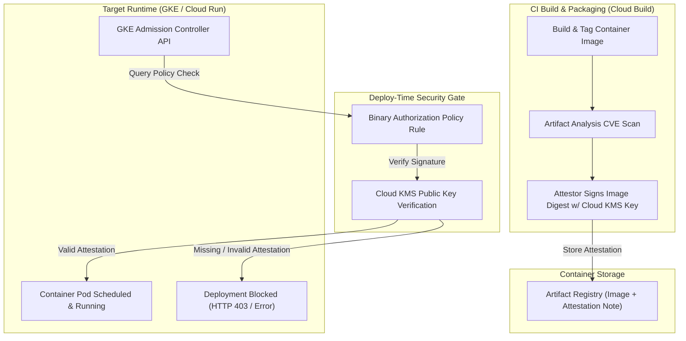

# Topic 108: Binary Authorization

---

## 1. What Is It?

**Google Cloud Binary Authorization** is a deploy-time security control platform on Google Cloud Platform that enforces strict supply chain security policies on Google Kubernetes Engine (GKE) and Cloud Run. It ensures that only cryptographically signed, verified container images built by authorized CI/CD pipelines can be scheduled and executed in production environments.

Binary Authorization delivers four core software supply chain security capabilities:
1. **Cryptographic Attestations**: Uses Cloud KMS asymmetric keys to digitally sign container images (Attestations) verifying that specific pipeline checks (unit tests, vulnerability scans, security approvals) were completed.
2. **Policy Enforcement at Deployment**: Intercepts Kubernetes pod creation requests (`admission webhook`) and Cloud Run deployment API calls, blocking un-signed or non-compliant container images from booting.
3. **Break-Glass Emergency Overrides**: Allows on-call SREs to bypass policy checks during critical production outages, while generating high-priority audit log alerts.
4. **SLSA Level 3 Supply Chain Compliance**: Integrates natively with Cloud Build and Artifact Analysis to provide verifiable supply chain provenance (Supply Chain Levels for Software Artifacts).

### Real-World Analogy
Think of Binary Authorization like a strict passport control officer at a international airport boarding gate:
- **Un-enforced Deployments (Traditional GKE)**: Anyone wearing a pilot uniform can board an airplane (Deploy a container to GKE) simply by carrying a printed boarding pass (`image: nginx:latest`). No one verifies where the airplane came from or whether safety checks were performed.
- **Binary Authorization**: A biometric boarding gate inspector (Admission Controller). Before allowing any pilot onto the plane (Scheduling Pod), the officer checks that the boarding pass carries three tamper-proof cryptographic seals (Attestations): 1) Factory Quality Audit (Unit Tests Passed), 2) Security Screening Clearance (Vulnerability Scan Passed), and 3) Chief Pilot Signature (KMS Signature). If any seal is missing or altered, the gate remains locked (Deployment Blocked).

---

## 2. Where Does It Fit?

Binary Authorization acts as the final security gate separating CI/CD build artifact registries from live Kubernetes/Cloud Run runtime clusters.



---

## 3. Core Concepts

| Concept | Description | Production Best Practice |
|---|---|---|
| **Policy** | Top-level set of rules defining deployment requirements for a GCP project or GKE cluster. | Enforce `REQUIRE_ATTESTATION` on all production GKE clusters. |
| **Attestor** | Security authority (e.g., Vulnerability Scanner, QA Team) verified by a Cloud KMS public key. | Create separate attestors for Build, Vulnerability Scan, and QA approval stages. |
| **Attestation** | Cryptographic payload signed by an Attestor's KMS key binding a specific container image digest. | Always sign using exact container image digests (`image@sha256:...`). |
| **Dry Run Mode** | Policy mode logging policy violations to Cloud Audit Logs without blocking pod deployment. | Test new policies in Dry Run mode prior to enforcing blocks. |
| **Break-Glass** | Emergency override mechanism allowing manual deployment of un-attested images during outages. | Monitor Break-Glass audit logs (`BreakGlassUsed`) in Cloud Monitoring. |

---

## 4. How It Works

Container image verification during pod scheduling follows a strict admission webhook workflow:

```text
Developer / Pipeline executes `kubectl apply -f deployment.yaml`
                               ↓
GKE Admission Controller intercepts request -> Passes image digest to Binary Authorization API
                               ↓
Binary Authorization evaluates Policy -> Fetches required Attestors
                               ↓
Queries Artifact Analysis for Attestations signed by matching Cloud KMS Key
                               ↓
Valid Attestation Found?
├── YES -> Approve Admission -> GKE Schedules Pod
└── NO  -> Reject Admission -> Return Error `Deployment blocked by Binary Authorization`
```

1. **Digest Immutability Requirement**: Binary Authorization ONLY verifies images referenced by explicit SHA256 digests (`image@sha256:abc...`), rejecting mutable tags like `latest`.
2. **KMS Asymmetric Signing**: Attestors generate signatures using asymmetric keys (RSA or ECDSA) stored in Cloud KMS or Cloud HSM.

---

## 5. Production Scenario

### Enterprise GKE Supply Chain Gate enforcing Vulnerability Scan Attestations

```text
Requirement: Enforce a Binary Authorization policy on a production GKE cluster requiring all container images to possess a valid cryptographic attestation from the `vulnerability-scan-attestor` before pod scheduling.
    ↓
Architecture: Cloud Build + Cloud KMS Asymmetric Key + Artifact Analysis + Binary Authorization Policy.
    ↓
Step 1: Create Asymmetric Signing Key in Cloud KMS:
    gcloud kms keys create binauth-key \
      --location=us-central1 \
      --keyring=sec-keyring \
      --purpose=asymmetric-signing \
      --default-algorithm=rsa-sign-pkcs1-4096-sha256
    ↓
Step 2: Create Attestor in Binary Authorization:
    gcloud container analysis note create vuln-scan-note --project=PROJ
    gcloud container attestors create vulnerability-scan-attestor \
      --attestation-authority-note=vuln-scan-note \
      --attestation-authority-note-project=PROJ
    ↓
Step 3: Attach KMS Public Key to Attestor:
    gcloud container attestors public-keys add \
      --attestor=vulnerability-scan-attestor \
      --keyversion-project=PROJ \
      --keyversion-location=us-central1 \
      --keyversion-keyring=sec-keyring \
      --keyversion-key=binauth-key \
      --keyversion=1
    ↓
Step 4: Configure Binary Authorization Policy (`policy.yaml`):
    defaultAdmissionRule:
      evaluationMode: REQUIRE_ATTESTATION
      enforcementMode: ENFORCE_SINGLE_SIGNATURE
      requireAttestationsBy:
      - projects/PROJ/attestors/vulnerability-scan-attestor
    ↓
Result: GKE automatically blocks any container deployment lacking a valid KMS signature from the vulnerability scanning pipeline step.
```

*Why Selected*: Illustrates the gold standard for enterprise container software supply chain security.

---

## 6. Hands-On Lab

### Prerequisites
- Active GCP Project with Binary Authorization, Container Analysis, and Cloud KMS APIs enabled.
- Cloud Shell or local machine with `gcloud` CLI installed.

### CLI Method

```bash
# 1. Environment configuration
export PROJECT_ID=$(gcloud config get-value project)

# 2. Enable necessary GCP APIs
gcloud services enable binaryauthorization.googleapis.com \
  containeranalysis.googleapis.com \
  cloudkms.googleapis.com

# 3. View default Binary Authorization policy for the project
gcloud container binauthz policy export

# 4. Create an Attestor Note in Container Analysis
cat <<EOF > note_payload.json
{
  "name": "projects/${PROJECT_ID}/notes/lab-attestor-note",
  "shortDescription": "Lab Security Attestation Note",
  "longDescription": "Container Analysis Note for Binary Authorization Lab",
  "attestation": {
    "hint": {
      "humanReadableName": "Lab Attestor Note"
    }
  }
}
EOF

curl -X POST -H "Authorization: Bearer $(gcloud auth print-access-token)" \
  -H "Content-Type: application/json" \
  -d @note_payload.json \
  "https://containeranalysis.googleapis.com/v1/projects/${PROJECT_ID}/notes?noteId=lab-attestor-note"

# 5. Create Binary Authorization Attestor
gcloud container attestors create lab-attestor \
  --attestation-authority-note=lab-attestor-note \
  --attestation-authority-note-project=${PROJECT_ID}

# 6. List attestors in project
gcloud container attestors list
```

### Verification
Execute `gcloud container attestors list` and confirm `lab-attestor` is listed as active.

### Cleanup

```bash
gcloud container attestors delete lab-attestor --quiet
curl -X DELETE -H "Authorization: Bearer $(gcloud auth print-access-token)" \
  "https://containeranalysis.googleapis.com/v1/projects/${PROJECT_ID}/notes/lab-attestor-note"
rm -f note_payload.json
```

---

## 7. Security

### Software Supply Chain Protection
- **Separation of Duties**: Restrict KMS signing key access (`roles/cloudkms.signerVerifier`) strictly to the CI/CD pipeline Service Account. Never allow developers to sign attestations manually on local machines.
- **Break-Glass Audit Monitoring**: Set up a Cloud Monitoring alert for `binaryauthorization.googleapis.com/continuous_validation/break_glass_events` to alert SRE managers immediately when emergency overrides occur.

```text
BAD PRACTICE:
Deploying un-verified third-party container images directly from public registries (`docker.io/library/ubuntu:latest`) onto production GKE clusters.

PRODUCTION PRACTICE:
Copy third-party images into Artifact Registry, run vulnerability scanners, sign images via Cloud KMS Attestors, and enforce Binary Authorization on GKE.
```

---

## 8. Scaling & High Availability

Policy enforcement latency and continuous validation architecture:

```text
GKE Cluster Deployment (High-Throughput Pod Scheduling)
                       ↓
GKE Admission Webhook queries Binary Authorization Cache (<50ms latency)
                       ↓
Continuous Validation Service (Asynchronously re-checks running pods every 1 hour)
                       ↓
Discovers newly revoked key or newly published CVE -> Generates Alerting Event
```

- **Continuous Validation**: Beyond initial deployment admission control, Binary Authorization continuously monitors running Pods, alerting if an active container's attestation becomes invalid after deployment.

---

## 9. Cost

### Binary Authorization Pricing Model

| Component | Software License | Charge Rate |
|---|---|---|
| **Binary Authorization Policy Engine** | Standard Feature | $0.00 / month (Free on GKE) |
| **Continuous Validation** | Advanced Feature | $0.0016 per cluster-hour |
| **Cloud KMS Key Usage for Signing** | Standard KMS rates | $0.06 per key / month + $0.03 per 10,000 sign operations |

---

## 10. Monitoring & Troubleshooting

### Operational Telemetry & Log Inspection
- **Cloud Audit Logs**: Inspect `protoPayload.methodName="google.container.v1.ClusterManager.CreateCluster"` and `binaryauthorization.googleapis.com` events.
- **Denied Deployments**: Filter GKE logs for `eventCode: "DENIED"` to debug blocked pod scheduling requests.

### Troubleshooting Matrix

| Symptom | Cause | Resolution |
|---|---|---|
| `Deployment blocked by Binary Authorization` | Container image lacks valid KMS attestation | Verify CI pipeline executed image signing step using `gcloud container attestors`. |
| `Image tag not supported` | Manifest uses mutable tag like `v1.0` instead of SHA256 digest | Update deployment manifest to use full image SHA digest (`image@sha256:...`). |
| Attestor signature validation fails | KMS public key updated or missing from attestor config | Re-add KMS public key to attestor via `gcloud container attestors public-keys add`. |

---

## 11. Common Mistakes

```text
Mistake: Attempting to deploy container images referenced by mutable tags (e.g., `image: my-app:v1.0`) when Binary Authorization is enabled.
Why: Following standard Docker tag conventions.
Impact: GKE admission controller blocks deployment instantly; tags are mutable and cannot guarantee image payload integrity.
Correct Approach: Always deploy using explicit immutable SHA256 digests (`image: my-app@sha256:4bf92f...`).

Mistake: Forgetting to whitelist system Google system images in Binary Authorization policies.
Why: Setting strict `REQUIRE_ATTESTATION` without exemptions.
Impact: Blocks internal GKE system pods (kube-dns, metrics-server, CNI plugins) from booting, breaking the cluster.
Correct Approach: Enable system policy exemptions (`evaluationMode: ALWAYS_ALLOW`) for Google-managed system images.
```

---

## 12. Production Best Practices

- [ ] Reference container images using **immutable SHA256 digests** (`image@sha256:...`).
- [ ] Enforce **`REQUIRE_ATTESTATION`** on all production GKE clusters.
- [ ] Sign attestations using **Asymmetric Keys in Cloud KMS**.
- [ ] Create separate attestors for **Build Verification** and **Vulnerability Scanning**.
- [ ] Test new policies in **Dry Run Mode** prior to active enforcement.
- [ ] Monitor **Break-Glass Emergency Overrides** using Cloud Monitoring alerts.

---

## 13. Hyperscaler / Enterprise Perspective

```text
Personal / Learning
  No Attestations → Deploy by Mutable Tag → `ALWAYS_ALLOW` Policy
        ↓
Small Production
  Cloud Build Auto-Signing → Single Attestor → Manual Policy Review
        ↓
Enterprise Environment
  Multi-Attestor Gate (Build + Vuln Scan + QA Approval) → KMS Asymmetric Key Signing → SLSA Level 3 Provenance
        ↓
Hyperscaler Environment
  Continuous Validation Daemon → Automated Break-Glass Alerting Playbooks → Multi-Cluster Fleet Policy Synchronization via Anthos
```

Enterprise hyperscalers enforce **SLSA Level 3/4 Provenance**, requiring multiple independent cryptographic attestations (Code Review Signed + Hermetic Build Signed + Vulnerability Passed) before allowing any artifact into production banking or healthcare clusters.

---

## 14. Real Project Questions

### Q1: Why does Binary Authorization require container images to be specified by SHA256 digest rather than image tag?
**Answer:** Image tags (like `:v1.0` or `:latest`) are mutable and can be overwritten in an artifact registry, allowing malicious or untested code to be pushed under an existing tag. SHA256 digests are cryptographically immutable representations of the exact container layer contents. Binary Authorization validates attestations bound to specific digests to guarantee code integrity.

### Q2: What is the purpose of the "Break-Glass" mechanism in Binary Authorization?
**Answer:** "Break-Glass" is an emergency override flag (`gcloud ... --break-glass`) that allows on-call SREs to deploy an un-attested or non-compliant container image to GKE during critical production outages. Utilizing Break-Glass emits a high-priority Cloud Audit Log entry that triggers immediate security team alerts for post-incident review.

### Q3: What is the role of Cloud KMS in Binary Authorization?
**Answer:** Cloud KMS provides the cryptographic key pair used for signing and verifying attestations. The CI/CD pipeline uses the private key in Cloud KMS to sign a digest attestation, and Binary Authorization uses the public key associated with the Attestor to verify the signature at deployment admission time.

---

## 15. Quick Decision Guide

| Supply Chain Requirement | Recommended Security Strategy | Advantage |
|---|---|---|
| Blocking Un-tested Code on GKE | Binary Authorization (`REQUIRE_ATTESTATION`) | Enforces cryptographic signature checks at admission time. |
| Verifying Image Source Integrity | SLSA Provenance Attestations in Cloud Build | Proves container image was built by authorized build triggers. |
| Safe Pre-Enforcement Policy Validation | Dry Run Policy Mode | Identifies non-compliant workloads without breaking active pipelines. |

### When to Use Binary Authorization
- Mandatory for enterprise GKE clusters, Cloud Run production releases, regulated industries (finance/healthcare), and SLSA supply chain compliance.

### When NOT to Use Binary Authorization
- Isolated developer sandbox clusters where rapid un-signed local container testing is required.

---

## 16. Related Services

```text
               [108. Binary Authorization]
              /            |            \
     Cloud KMS     Artifact Analysis    GKE Kubernetes API
    (Signing Keys) (Attestation Notes)  (Admission Webhook)
          |                |                    |
     Provides Asymmetric Stores Cryptographic   Enforces Policy
     Key Pair          Attestation Records      Prior to Scheduling
```

- **Cloud KMS**: Holds asymmetric keys used to sign and verify container attestations.
- **Artifact Analysis**: Metadata storage engine holding attestation notes and occurrences.
- **GKE Admission Controller**: Kubernetes API component enforcing policy checks.

---

## 17. Cheat Sheet

### Common gcloud Binary Authorization Commands

```bash
# Export the current Binary Authorization policy
gcloud container binauthz policy export > policy.yaml

# Import an updated Binary Authorization policy
gcloud container binauthz policy import policy.yaml

# Create an Attestor
gcloud container attestors create my-attestor --attestation-authority-note=my-note --attestation-authority-note-project=my-project

# Add a Cloud KMS public key to an Attestor
gcloud container attestors public-keys add --attestor=my-attestor --keyversion-project=my-project --keyversion-location=us-central1 --keyversion-keyring=my-keyring --keyversion-key=my-key --keyversion=1

# Create an Attestation signature for an image digest
gcloud container binauthz attestations create --artifact-url="us-central1-docker.pkg.dev/PROJ/REPO/img@sha256:abc..." --attestor=projects/PROJ/attestors/my-attestor --keyversion-project=PROJ --keyversion-location=us-central1 --keyversion-keyring=my-keyring --keyversion-key=my-key --keyversion=1
```

---

## 18. Learning Connection

- **Previous Topic**: [107. Identity-Aware Proxy (IAP)](../107-identity-aware-proxy/README.md)
- **Next Topic**: [109. Billing Reports](../../12-cost-management/109-billing-reports/README.md)
