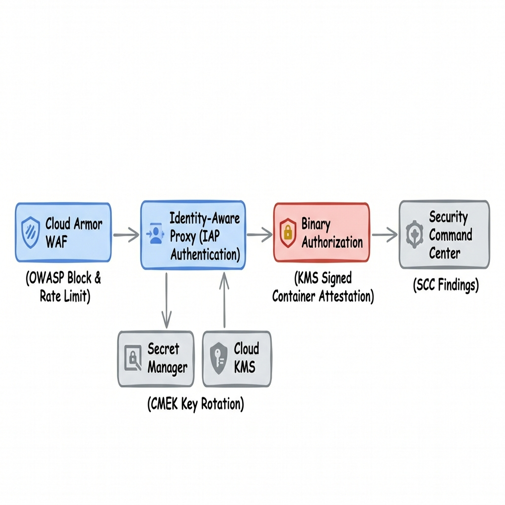
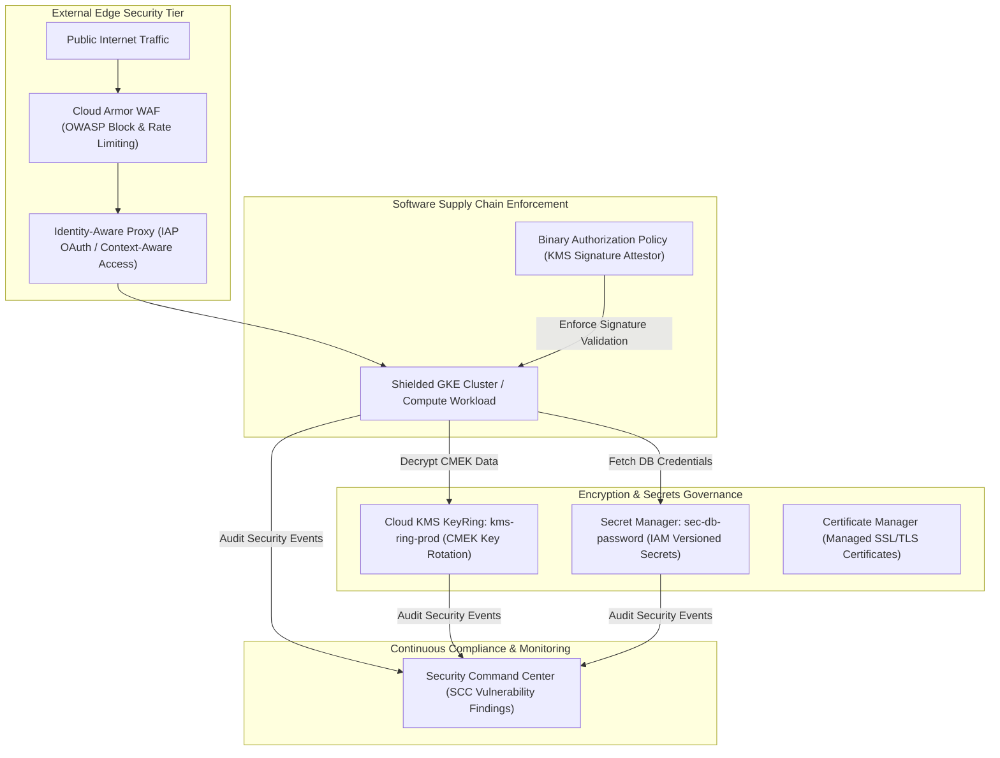

# Project 11: Enterprise Zero-Trust Security Perimeter Landing Zone

---

## 1. Project Overview

Welcome to **Project 11: Enterprise Zero-Trust Security Perimeter Landing Zone**. This hands-on project synthesizes all 7 topics in **Module 11 (Security)** into an enterprise-grade defense-in-depth security perimeter on GCP, optimized for **GCP Free Trial Accounts**.

### Objectives
In this project, you will:
1. **Store Encrypted Secrets in Secret Manager**: Store and access sensitive credentials with IAM secret accessor roles and version control.
2. **Manage Symmetric/Asymmetric Keys in Cloud KMS**: Provision Customer-Managed Encryption Keys (CMEK) with automated key rotation policies.
3. **Audit Vulnerabilities in Security Command Center (SCC)**: Analyze security posture, asset risks, and misconfigurations in SCC Standard.
4. **Enforce WAF Protection with Cloud Armor**: Define WAF security policies mitigating OWASP Top 10 vulnerabilities and IP rate-limiting.
5. **Secure Edge Ingress with IAP & Binary Authorization**: Establish Identity-Aware Proxy (IAP) zero-trust authentication and enforce container image signature validation before GKE pod execution.

---

## 2. Architecture & Zero-Trust Security Perimeter

The project provisions a defense-in-depth zero-trust security perimeter:





> [!IMPORTANT]
> **Free Trial Safety & Cost Controls**:
> - **Secret Manager Allowance**: Includes 6 active secret versions free per month.
> - **Cloud KMS Allowance**: Includes 20 active key versions free per month.
> - **Security Command Center Standard**: 100% FREE for all GCP projects.
> - **Cloud Armor & IAP Guardrails**: Firewall rules and security policies carry $0 idle cost.
> - **Automated Cleanup**: Always execute `./scripts/cleanup_security.sh` after completing your lab exercises to delete secrets, KMS keyrings, and security policies!

---

## 3. Module Topics Covered

| Topic Number & Name | Project Integration Point |
|---|---|
| **102. Secret Manager** | Storing versioned secrets (`sec-db-password`) and granting accessor roles. |
| **103. Cloud KMS** | Provisioning CMEK KeyRings (`kms-ring-prod`) with automated key rotation. |
| **104. Security Command Center** | Auditing SCC asset inventory, security posture, and threat findings. |
| **105. Certificate Manager** | Managing Google-managed SSL/TLS certificates for HTTPS domain maps. |
| **106. Cloud Armor** | Writing Cloud Armor WAF rules (`policies/cloud_armor_waf.tf`) blocking OWASP attacks. |
| **107. Identity-Aware Proxy** | Configuring zero-trust IAP TCP tunneling for SSH/RDP without public IPs. |
| **108. Binary Authorization** | Enforcing container image signing policies (`binauth/policy.yaml`). |

---

## 4. Hands-On Execution Guide

### Step 1: Navigate to Project 11 Workspace

Open Google Cloud Shell or local terminal:

```bash
cd "11-security/project-11-security"
chmod +x scripts/*.sh
```

---

### Step 2: Inspect Cloud Armor WAF & Binary Authorization Specs

Inspect the security policy configuration files:

```bash
# 1. View Cloud Armor WAF Security Policy (Terraform HCL)
cat policies/cloud_armor_waf.tf

# 2. View Binary Authorization Policy Spec
cat binauth/policy.yaml
```

---

### Step 3: Deploy the Security Perimeter Architecture

Execute `scripts/deploy_security_perimeter.sh` to automate:
1. Enabling Secret Manager, Cloud KMS, SCC, Cloud Armor, IAP, and Binary Authorization APIs.
2. Creating an encrypted Secret in Secret Manager (`sec-db-password`).
3. Provisioning a Cloud KMS KeyRing (`kms-ring-prod`) and CMEK Encryption Key (`key-cmek-data`).
4. Creating a Cloud Armor WAF Security Policy (`ca-policy-waf`) blocking SQL Injection & XSS attacks.
5. Setting up Identity-Aware Proxy (IAP) firewall rules.
6. Applying Binary Authorization policy (`binauth/policy.yaml`).

```bash
./scripts/deploy_security_perimeter.sh
```

*Expected Script Output Snippet*:
```text
=====================================================
GCP Zero-Trust Security Perimeter Deployment
=====================================================
[INFO] Enabling Security APIs (Secret Manager, KMS, SCC, Cloud Armor, IAP, BinAuth)...
[SUCCESS] Security APIs active.
[INFO] Creating Secret in Secret Manager: sec-db-password...
[SUCCESS] Secret created with Version 1.
[INFO] Provisioning Cloud KMS KeyRing & CMEK Key...
[SUCCESS] CMEK Key active: key-cmek-data.
[INFO] Deploying Cloud Armor WAF Security Policy (OWASP Protection)...
[SUCCESS] Cloud Armor WAF active.
[INFO] Applying Binary Authorization Policy...
[SUCCESS] Binary Authorization enforced.
```

---

### Step 4: Access Secret Manager Secret via gcloud CLI

Access the encrypted secret payload securely using IAM permissions:

```bash
gcloud secrets versions access 1 --secret="sec-db-password"
```

*Expected Secret Payload Output*: `P@ssw0rd_SuperSecret_2026!`

---

### Step 5: Verify Cloud KMS Key Details & Rotation Policy

Inspect the Customer-Managed Encryption Key attributes in Cloud KMS:

```bash
gcloud kms keys describe key-cmek-data \
  --keyring=kms-ring-prod \
  --location=us-central1
```

---

## 5. Verification & Testing

Verify active security policies via CLI:

```bash
# 1. Check Cloud Armor Security Policy rules
gcloud compute security-policies describe ca-policy-waf

# 2. Verify Binary Authorization Policy configuration
gcloud container binauth policy export
```

---

## 6. Troubleshooting & Common Issues

| Symptom / Error | Root Cause | Resolution |
|---|---|---|
| Secret access fails with `Permission Denied` | User/Service Account missing `roles/secretmanager.secretAccessor`. | Grant `Secret Manager Secret Accessor` role to target identity. |
| KMS key creation fails with `Resource Already Exists` | KMS KeyRings cannot be deleted in GCP once created. | Use unique KeyRing names or reuse existing KeyRing. |
| GKE deployment rejected by Binary Authorization | Image lacks valid KMS attestor signature. | Sign image digest using KMS key or set policy evaluation mode to `ALWAYS_ALLOW` during testing. |

---

## 7. Project Cleanup

To delete secrets, Cloud Armor policies, IAP firewall rules, and Binary Authorization policies, run:

```bash
./scripts/cleanup_security.sh
```

---

## 8. Summary & Next Steps

Congratulations! You have completed **Project 11: Enterprise Zero-Trust Security Perimeter Landing Zone**. You have mastered Secret Manager, Cloud KMS CMEK keys, Cloud Armor WAF, IAP, and Binary Authorization.

- **Next Project**: [Project 12: Automated FinOps Cost Governance & Recommender Pipeline](../../12-cost-management/project-12-cost-management/README.md)
