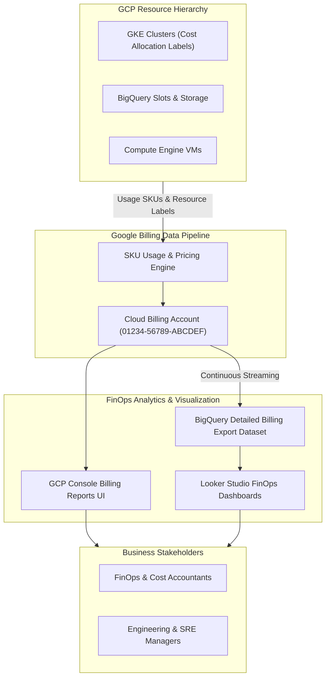

# Topic 109: Billing Reports

---

## 1. What Is It?

**Google Cloud Billing Reports** provide the interactive cost visualization, spend analytics, SKU-level cost allocation, and automated data export infrastructure on Google Cloud Platform. It enables FinOps practitioners, engineering leads, and finance managers to monitor, analyze, forecast, and optimize cloud expenditures across multi-project organizations.

Billing Reports deliver four core cost governance capabilities:
1. **Interactive Visual Cost Exploration**: Dynamic charting UI filtering cloud spend by GCP Project, Service, Region, Resource Label, SKU, and Billing Account.
2. **BigQuery Detailed Billing Export**: Automated daily streaming of granular billing data (standard usage, detailed usage, pricing data, and committed use discounts) into BigQuery for custom SQL cost modeling.
3. **Cost Trend Forecasting**: Predictive machine-learning algorithms forecasting end-of-month spending based on historical consumption trends.
4. **Committed Use Discount (CUD) Analysis**: Native reporting tracking CUD coverage, utilization percentages, and cost savings metrics.

### Real-World Analogy
Think of Cloud Billing Reports like an itemized electric utility bill combined with a smart home energy dashboard:
- **Un-monitored Cloud (Lump-Sum Invoice)**: Receiving a single $50,000 monthly paper bill from the power company with zero details on which rooms or appliances consumed electricity.
- **Billing Reports**: An interactive digital dashboard showing real-time power consumption broken down by specific appliances (GCP Services like BigQuery vs. GKE), specific rooms (Projects / Subnets), specific times of day (Hourly SKU Breakdown), and tagged by family member (Resource Labels)—with an automated forecast warning you on day 10 that your air conditioner usage will double your budget by month-end.

---

## 2. Where Does It Fit?

Billing Reports sit above GCP Projects and Infrastructure, consolidating cost metrics at the Cloud Billing Account level.



---

## 3. Core Concepts

| Concept | Description | Production Best Practice |
|---|---|---|
| **Cloud Billing Account** | Master administrative resource managing payment profiles, invoices, and project linkage. | Restrict Billing Account Admin roles to central finance/procurement leads. |
| **SKU (Stock Keeping Unit)** | Granular billing item representing a specific unit of service (e.g., `N2 CPU in us-central1`). | Analyze high-cost SKUs in BigQuery to identify optimization targets. |
| **Cost Allocation Labels** | Key-value metadata tags attached to resources (`env=prod`, `cost-center=checkout`). | Mandate cost allocation labels on all Terraform-provisioned resources. |
| **BigQuery Detailed Export** | Continuous streaming export of itemized usage and pricing records into BigQuery. | Enable BigQuery Detailed Export on Day 1 of Cloud Billing Account setup. |
| **Credit Adjustments** | Sustained Use Discounts (SUD), Committed Use Discounts (CUD), and promotional credits. | Separate gross cost from net cost when calculating unit economics. |

---

## 4. How It Works

Billing data collection and export follow a high-throughput daily streaming workflow:

```text
GCP Resources emit SKU consumption metrics (Storage GB-hours, Compute vCPU-hours)
                               ↓
Billing Engine applies pricing rules, CUD discounts & regional tier rates
                               ↓
Populates GCP Console Billing Reports UI (Updated every 2-4 hours)
                               ↓
Streams detailed usage records to BigQuery dataset `gcp_billing_export`
                               ↓
Looker Studio / FinOps dashboards execute SQL queries for business unit showback/chargeback
```

1. **Label Propagation**: Resource labels (e.g., `cost-center: marketing`) propagate to billing export records, enabling precise cost attribution to specific business teams.
2. **Export Dataset Schema**: Standard export tables contain individual rows per SKU per project per hour, specifying gross cost, applied discounts, and net cost.

---

## 5. Production Scenario

### Enterprise BigQuery Billing SQL Query for Team Chargeback

```text
Requirement: Establish a BigQuery SQL query analyzing monthly GCP spend grouped by cost center label (`cost_center`) and environment (`env`), identifying top cost-driving services.
    ↓
Architecture: BigQuery Detailed Billing Export + Custom SQL Query + Looker Studio.
    ↓
Step 1: Enable BigQuery Detailed Billing Export in Billing Console to dataset `billing_ds`.
    ↓
Step 2: Execute SQL cost attribution query in BigQuery:
    SELECT
      (SELECT value FROM UNNEST(labels) WHERE key = "cost_center") AS cost_center,
      (SELECT value FROM UNNEST(labels) WHERE key = "env") AS environment,
      service.description AS service_name,
      ROUND(SUM(cost), 2) AS gross_cost,
      ROUND(SUM((SELECT SUM(amount) FROM UNNEST(credits))), 2) AS total_discounts,
      ROUND(SUM(cost + (SELECT SUM(amount) FROM UNNEST(credits))), 2) AS net_cost
    FROM
      `my-billing-project.billing_ds.gcp_billing_export_v1_012345_678910_ABCDEF`
    WHERE
      _PARTITIONDATE >= "2026-08-01"
    GROUP BY 1, 2, 3
    ORDER BY net_cost DESC;
    ↓
Result: Precise engineering team chargeback report separating gross spend from committed use discount savings.
```

*Why Selected*: Illustrates standard enterprise FinOps SQL query patterns for cost showback/chargeback.

---

## 6. Hands-On Lab

### Prerequisites
- Active GCP Project with Billing Account access.
- Cloud Shell or local machine with `gcloud` CLI installed.

### CLI Method

```bash
# 1. Environment configuration
export PROJECT_ID=$(gcloud config get-value project)

# 2. List linked Cloud Billing Accounts
gcloud billing accounts list

# 3. View billing project linkage details
gcloud billing projects describe ${PROJECT_ID}

# 4. Enable BigQuery API for billing export destination
gcloud services enable bigquery.googleapis.com

# 5. Create BigQuery dataset for billing export
gcloud alpha bq datasets create gcp_billing_export_ds --location=us-central1
```

### Verification
Execute `gcloud alpha bq datasets describe gcp_billing_export_ds` and confirm the dataset exists in `us-central1`.

### Cleanup

```bash
gcloud alpha bq datasets delete gcp_billing_export_ds --delete-contents --quiet
```

---

## 7. Security

### Billing IAM & Financial Governance
- **Billing Account Administrator (`roles/billing.admin`)**: Grants full control over payment profiles and project linkages. Restrict to finance/procurement leads.
- **Billing Account Viewer (`roles/billing.viewer`)**: Grants read-only access to view billing reports. Assign to engineering leads and FinOps analysts.
- **Dataset Access Controls**: Restrict read permissions on the BigQuery billing export dataset to authorized financial auditors.

```text
BAD PRACTICE:
Granting `roles/billing.admin` to engineering team members or leaving resource labels un-enforced in IaC pipelines.

PRODUCTION PRACTICE:
Grant `roles/billing.viewer` for SRE cost visibility, restrict `roles/billing.admin` to procurement, and enforce resource labeling policies in Terraform.
```

---

## 8. Scaling & High Availability

Billing data export scaling and partitioning:

```text
Millions of Daily SKU Usage Records across 500 Projects
                       ↓
BigQuery Detailed Billing Export (Inverted Storage Architecture)
                       ↓
Partitioned by Day (`_PARTITIONDATE`) & Clustered by `project.id` and `service.description`
                       ↓
Fast Sub-Second SQL Queries for Enterprise FinOps Dashboards
```

- **BigQuery Partition Pruning**: Always filter queries by `_PARTITIONDATE` (e.g., `WHERE _PARTITIONDATE >= "2026-08-01"`) to avoid scanning multi-year historical billing datasets and minimize BigQuery query billing.

---

## 9. Cost

### Billing Tools Cost Structure

| Billing Feature | Cost Model | Note |
|---|---|---|
| **GCP Console Billing Reports UI** | 100% FREE | Included free with all GCP Billing Accounts. |
| **BigQuery Detailed Billing Export** | Standard BigQuery Storage & Query rates | Minimal cost (~$1-5 / month for typical org storage). |
| **Looker Studio Dashboarding** | 100% FREE | Free visualization connecting to BigQuery. |

---

## 10. Monitoring & Troubleshooting

### Operational Telemetry & Troubleshooting
- **Billing Export Latency**: BigQuery Detailed Billing Export streams data continuously, with final daily reconciliation taking up to 24-48 hours.
- **Unlabeled Resource Tracking**: Query BigQuery for records where `labels IS NULL` to identify un-tagged infrastructure resources.

### Troubleshooting Matrix

| Symptom | Cause | Resolution |
|---|---|---|
| BigQuery billing export dataset empty | Export configured in Console but missing dataset write permissions | Re-save billing export settings in Billing Console to re-bind permissions. |
| High BigQuery query costs when analyzing billing | SQL query executing full table scans without partition filters | Add `WHERE _PARTITIONDATE >= ...` filter to SQL queries. |
| Cost allocation labels missing in billing reports | Labels added to resources *after* creation date | Note that labels do not retroactively apply to historical billing records. |

---

## 11. Common Mistakes

```text
Mistake: Failing to enable BigQuery Detailed Billing Export on Day 1 of GCP organization setup.
Why: Relying solely on the basic web UI reports.
Impact: Historical SKU-level billing data prior to export creation is lost forever, preventing deep retrospective FinOps analysis.
Correct Approach: Enable BigQuery Detailed Billing Export immediately during landing zone creation.

Mistake: Querying the BigQuery billing export table without specifying `_PARTITIONDATE`.
Why: Writing basic `SELECT * FROM table` SQL queries.
Impact: Scans gigabytes or terabytes of historical billing data, incurring high BigQuery query charges.
Correct Approach: Always include `WHERE _PARTITIONDATE >= DATE_SUB(CURRENT_DATE(), INTERVAL 30 DAY)` in billing SQL queries.
```

---

## 12. Production Best Practices

- [ ] Enable **BigQuery Detailed Billing Export** on Day 1 of Billing Account creation.
- [ ] Enforce **Resource Labeling Standards** (`env`, `team`, `cost-center`) via Terraform.
- [ ] Restrict **`roles/billing.admin`** to finance and procurement personnel.
- [ ] Partition and cluster BigQuery billing datasets by `_PARTITIONDATE` and `project.id`.
- [ ] Build automated **Looker Studio FinOps Dashboards** for team cost visibility.
- [ ] Conduct monthly **CUD (Committed Use Discount)** coverage reviews.

---

## 13. Hyperscaler / Enterprise Perspective

```text
Personal / Learning
  Web Console Summary → No Resource Labels → Single Project Spend
        ↓
Small Production
  Basic Billing Export → Resource Labeling → Monthly Invoice Verification
        ↓
Enterprise Environment
  BigQuery Detailed Billing Export → Looker Studio Chargeback Dashboards → CUD Coverage Optimization
        ↓
Hyperscaler Environment
  Automated Unit Economics Tracking (Cost Per Transaction) → Anomaly Detection Alerts → Multi-Cloud FinOps Integration
```

Enterprise hyperscalers tie BigQuery Billing Export data directly to business application metrics, calculating **Unit Economics** (e.g., GCP infrastructure cost per active user or cost per payment transaction) rather than inspecting raw server costs.

---

## 14. Real Project Questions

### Q1: What is the primary advantage of BigQuery Detailed Billing Export over the GCP Console Billing Reports UI?
**Answer:** The GCP Console UI provides high-level visual charts with limited customization. BigQuery Detailed Billing Export streams itemized, SKU-level usage data (including raw usage, un-nested resource labels, gross pricing, and specific CUD discount allocations) into BigQuery, allowing custom SQL queries, join operations with business metrics, and automated Looker Studio chargeback dashboards.

### Q2: Why are resource labels essential for enterprise cloud cost management?
**Answer:** Resource labels (e.g., `cost-center: checkout`, `environment: prod`) propagate to billing export records, allowing FinOps teams to group and attribute cloud spend to specific business units, applications, or engineering teams regardless of how many GCP projects or shared services are utilized.

### Q3: What is the difference between gross cost and net cost in GCP billing exports?
**Answer:** **Gross Cost** represents the baseline list price of consumed GCP SKUs before any discounts are applied. **Net Cost** represents the final invoiced amount after applying Sustained Use Discounts (SUD), Committed Use Discounts (CUD), custom contract discounts, and promotional credits.

---

## 15. Quick Decision Guide

| Cost Analysis Goal | Recommended Tool | Advantage |
|---|---|---|
| Fast Visual Cost Checking | GCP Console Billing Reports UI | Interactive web charts requiring zero SQL code. |
| Engineering Team Cost Chargeback | BigQuery Export + Looker Studio | Itemized SQL attribution by resource labels. |
| Long-Term FinOps Trend Modeling | BigQuery Detailed Billing Dataset | Multi-year historical SQL analytics engine. |

### When to Use Billing Reports
- Essential for cloud cost governance, budget tracking, FinOps chargeback/showback, and CUD optimization.

### When NOT to Use Billing Reports
- Real-time application performance latency tracking (use Cloud Monitoring instead).

---

## 16. Related Services

```text
                   [109. Billing Reports]
                  /          |           \
       Cloud Billing      BigQuery     Looker Studio
      (Account Master) (Detailed Export) (FinOps Dashboards)
             |               |                |
       Manages Invoices Streams Detailed  Visualizes Unit
       & Contracts      SKU Records       Cost Analytics
```

- **Cloud Billing Account**: Master administrative entity managing GCP billing agreements.
- **BigQuery**: Analytical database target for detailed billing exports.
- **Looker Studio**: Free visualization platform rendering billing SQL dashboards.

---

## 17. Cheat Sheet

### Common BigQuery Billing SQL Snippet

```sql
-- Monthly Cost by GCP Service (Last 30 Days)
SELECT
  service.description AS service_name,
  ROUND(SUM(cost), 2) AS gross_cost,
  ROUND(SUM((SELECT SUM(amount) FROM UNNEST(credits))), 2) AS total_credits,
  ROUND(SUM(cost + (SELECT SUM(amount) FROM UNNEST(credits))), 2) AS net_cost
FROM
  `my-project.billing_export_ds.gcp_billing_export_v1_XXXXXX_XXXXXX_XXXXXX`
WHERE
  _PARTITIONDATE >= DATE_SUB(CURRENT_DATE(), INTERVAL 30 DAY)
GROUP BY 1
ORDER BY net_cost DESC;
```

---

## 18. Learning Connection

- **Previous Topic**: [108. Binary Authorization](../../11-security/108-binary-authorization/README.md)
- **Next Topic**: [110. Budgets & Alerts](../110-budgets-and-alerts/README.md)
