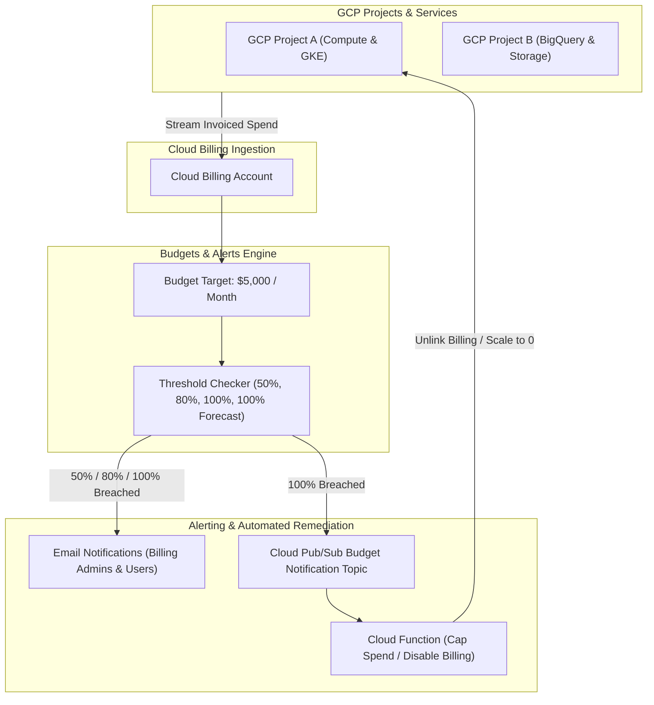

# Topic 110: Budgets & Alerts

---

## 1. What Is It?

**Google Cloud Budgets & Alerts** provide automated financial guardrails, threshold notification triggers, and programmatic cost control mechanisms on Google Cloud Platform. It enables organization administrators and SRE teams to set target spend limits across projects, services, or billing accounts, automatically dispatching alerts or triggering programmatic capping actions when spend breaches defined threshold percentages.

Budgets & Alerts deliver four core financial governance capabilities:
1. **Target Spend Boundaries**: Define fixed monthly monetary targets (e.g., $10,000/month) or dynamic targets based on previous month spend.
2. **Multi-Threshold Triggers**: Configure alerts at specific percentage thresholds (e.g., 50%, 80%, 100% of budget) or forecasted spend thresholds (e.g., 100% forecast breach).
3. **Multi-Channel Notifications**: Dispatch alerts via Email to Billing Admins/Users and publish message payloads to Cloud Pub/Sub topics.
4. **Programmatic Cost Capping**: Connect Pub/Sub notifications to Cloud Functions or Cloud Run to automatically disable billing, downscale Compute Engine instance groups, or revoke IAM roles when budgets are exceeded.

### Real-World Analogy
Think of Budgets & Alerts like a smart credit card with automated spending controls for a teenager:
- **Un-monitored Credit (No Budgets)**: Handing a credit card to a teenager without a monthly limit. You only discover they bought $5,000 worth of video games when the monthly bill arrives 30 days later.
- **Budgets & Alerts**: Setting a $200 monthly limit. When spending hits $100 (50% Threshold), an SMS text goes to the parent (Email Alert). When spending hits $160 (80% Forecast), the app warns that month-end spend will exceed the limit. If spending reaches $200 (100% Threshold), the card system automatically locks the account (Pub/Sub Programmatic Auto-Disable), preventing further purchases.

---

## 2. Where Does It Fit?

Budgets & Alerts sit above Cloud Billing Accounts and Projects, monitoring real-time spending streams.



---

## 3. Core Concepts

| Concept | Description | Production Best Practice |
|---|---|---|
| **Budget Amount** | Specified monetary limit (Specified Amount or Last Month's Spend). | Set realistic monthly budgets based on historical baselines + growth margins. |
| **Actual Spend Threshold** | Alert triggered when real-time accumulated spend crosses a percentage (e.g., 80%). | Set actual thresholds at 50%, 80%, and 100%. |
| **Forecasted Spend Threshold** | Alert triggered when ML algorithms predict month-end spend will breach 100% of budget. | Use 100% Forecasted Spend threshold for early warning intervention. |
| **Pub/Sub Integration** | Publishing JSON budget payloads to a Cloud Pub/Sub topic for automated handling. | Mandatory for building automated emergency cost-capping scripts. |
| **Disable Billing Action** | Programmatic action un-linking a project from its Cloud Billing Account upon budget breach. | Exercise extreme caution; un-linking billing shuts down all project resources instantly. |

---

## 4. How It Works

Budget evaluation and automated notification dispatch operate continuously:

```text
GCP Billing Engine processes resource SKU consumption
                               ↓
Budgets Engine compares accumulated spend vs. Budget Amount
                               ↓
Threshold Breached (e.g., Actual Spend >= 80% of $10,000)
                               ↓
Dispatches Email to Billing Admins & publishes JSON payload to Pub/Sub
                               ↓
Pub/Sub triggers Cloud Function -> Executes custom cost-capping script (optional)
```

1. **Non-Enforcing Default**: By default, Cloud Budgets are **informational only** and DO NOT automatically stop or shut down GCP services when a budget is exceeded unless programmatic actions (Cloud Functions) are explicitly implemented.
2. **Notification Frequency**: Budget notifications are evaluated several times per day as billing data updates.

---

## 5. Production Scenario

### Programmatic Cost Capping via Cloud Pub/Sub and Cloud Functions

```text
Requirement: Establish a $1,000 monthly budget for a sandbox development project (`proj-sandbox`), sending email alerts at 50% and 80%, and automatically disabling billing if actual spend reaches 100% to prevent runaway costs.
    ↓
Architecture: Cloud Budget + Pub/Sub Topic + Cloud Function (Disable Billing API).
    ↓
Step 1: Create Pub/Sub topic `budget-auto-disable-topic`.
Step 2: Deploy Cloud Function subscribed to topic:
    - Node.js script parses payload -> Checks `costAmount >= budgetAmount`.
    - If true, calls Google Billing API: `google.billing.v1.CloudBillingClient.updateProjectBillingInfo({ name: "projects/proj-sandbox", projectBillingInfo: { billingAccountName: "" } })`.
Step 3: Create Budget in Billing Console:
    Target: Project `proj-sandbox`, Amount: $1,000 / month.
    Threshold Rules: 50% (Actual), 80% (Actual), 100% (Actual).
    Pub/Sub Topic: `budget-auto-disable-topic`.
    ↓
Result: Sandbox project spend is strictly capped at $1,000/month; billing unlinked automatically if budget exhausted.
```

*Why Selected*: Illustrates standard FinOps pattern for hard spend capping on dev/test sandboxes.

---

## 6. Hands-On Lab

### Prerequisites
- Active GCP Project with Billing Account Access.
- Cloud Shell or local machine with `gcloud` CLI installed.

### CLI Method

```bash
# 1. Environment configuration
export PROJECT_ID=$(gcloud config get-value project)
export BILLING_ACCOUNT_ID=$(gcloud billing projects describe ${PROJECT_ID} --format='value(billingAccountId)')

# 2. Enable Billing Budgets & Pub/Sub APIs
gcloud services enable billingbudgets.googleapis.com pubsub.googleapis.com

# 3. Create a Pub/Sub topic for budget alerts
gcloud pubsub topics create lab-budget-notifications

# 4. Create a $500 monthly budget using gcloud CLI
gcloud billing budgets create \
  --billing-account=${BILLING_ACCOUNT_ID} \
  --display-name="Lab Project Spend Guardrail" \
  --budget-amount=500USD \
  --threshold-rule=percent=0.5,basis=current-spend \
  --threshold-rule=percent=0.8,basis=current-spend \
  --threshold-rule=percent=1.0,basis=forecasted-spend \
  --all-updates-rule-pubsub-topic="projects/${PROJECT_ID}/topics/lab-budget-notifications"

# 5. List active budgets for the billing account
gcloud billing budgets list --billing-account=${BILLING_ACCOUNT_ID}
```

### Verification
Execute `gcloud billing budgets list --billing-account=${BILLING_ACCOUNT_ID}` and confirm `"Lab Project Spend Guardrail"` is active.

### Cleanup

```bash
BUDGET_ID=$(gcloud billing budgets list --billing-account=${BILLING_ACCOUNT_ID} --filter='displayName="Lab Project Spend Guardrail"' --format='value(name)')
gcloud billing budgets delete ${BUDGET_ID} --quiet
gcloud pubsub topics delete lab-budget-notifications --quiet
```

---

## 7. Security

### Financial Security & Role Delegation
- **Billing Budget Roles**: Setting or modifying budgets requires `roles/billing.costsManager` or `roles/billing.admin`.
- **Pub/Sub Topic Security**: Restrict write access on the budget Pub/Sub topic to `serviceAccount:billing-budgets@system.gserviceaccount.com`.

```text
BAD PRACTICE:
Assuming setting a Cloud Budget automatically stops GCP infrastructure when spend exceeds 100%.

PRODUCTION PRACTICE:
Understand that default budgets are informational; implement automated Pub/Sub Cloud Functions for strict hard spend capping on non-production sandboxes.
```

---

## 8. Scaling & High Availability

Multi-project enterprise budget architecture:

```text
Enterprise Organization (100+ Production & Developer Projects)
                       ↓ (Tiered Budget Strategy)
Budget Architecture:
├── Organization Master Budget (Overall GCP Monthly Spend Limit)
├── Environment Budgets (Production vs. Staging vs. Sandbox Projects)
└── High-Cost Service Budgets (BigQuery & GKE Service-Specific Budgets)
```

- **Targeted Scope**: Create specific budgets per project or per service (e.g., dedicated BigQuery budget) to detect localized cost anomalies early.

---

## 9. Cost

### Budgets & Alerts Cost Structure

| Feature | Cost Model | Note |
|---|---|---|
| **Budgets Creation & Evaluation** | 100% FREE | Unlimited budgets can be created free of charge. |
| **Email Alert Notifications** | 100% FREE | No charges for email dispatches. |
| **Pub/Sub Notifications** | Standard Pub/Sub rates | Negligible cost (< $0.01 / month). |

---

## 10. Monitoring & Troubleshooting

### Operational Telemetry & Troubleshooting
- **Notification Delay**: Billing data processing takes 2-4 hours; budget alerts evaluate as billing records are processed.
- **Forecasted Thresholds**: Use `forecasted-spend` thresholds to receive alerts days BEFORE a budget breach occurs.

### Troubleshooting Matrix

| Symptom | Cause | Resolution |
|---|---|---|
| Budget emails not received | Email recipient missing `Billing Account Header` or `Viewer` IAM role | Add user to Billing Account or specify explicitly in notification list. |
| Pub/Sub topic not receiving alerts | Missing IAM permissions for billing budgets service account | Grant `roles/pubsub.publisher` to `billing-budgets@system.gserviceaccount.com`. |
| Services didn't stop at 100% budget | Cloud Budgets do not shut down services automatically | Deploy a Cloud Function subscribed to the budget Pub/Sub topic to cap spend. |

---

## 11. Common Mistakes

```text
Mistake: Believing that creating a Cloud Budget automatically prevents GCP from billing beyond the set amount.
Why: Expecting hard spend caps out of the box.
Impact: Compute instances and BigQuery queries continue running, resulting in surprise billing overages.
Correct Approach: Implement programmatic Pub/Sub automation (Cloud Functions) if hard spend capping is required.

Mistake: Disabling billing on production projects when a budget is exceeded.
Why: Copying sandbox auto-disable scripts into production environments.
Impact: Unlinking billing from a production project instantly terminates all running VMs, databases, and GKE clusters, causing massive outages and data loss.
Correct Approach: Use email/Slack alerts for production; reserve billing disabling strictly for disposable developer sandboxes.
```

---

## 12. Production Best Practices

- [ ] Create **Budgets & Alerts** for every GCP project and Cloud Billing Account.
- [ ] Set threshold rules at **50%, 80% (Actual)**, and **100% (Forecasted Spend)**.
- [ ] Connect budgets to **Cloud Pub/Sub** for automated Slack or PagerDuty alerting.
- [ ] Implement **Programmatic Auto-Disable Cloud Functions** ONLY on disposable developer sandboxes.
- [ ] Create dedicated budgets for high-cost services (BigQuery, GKE).
- [ ] Manage budget definitions as code using **Terraform**.

---

## 13. Hyperscaler / Enterprise Perspective

```text
Personal / Learning
  No Budget Guardrails → Web Console Monitoring → Unexpected Billing Surprises
        ↓
Small Production
  Manual Budget Creation → Email Alerts at 80% & 100% → Manual SRE Review
        ↓
Enterprise Environment
  Terraform Provisioned Budgets → Pub/Sub Automation to Slack/PagerDuty → Forecasted Spend Thresholds
        ↓
Hyperscaler Environment
  Automated Sandbox Hard Capping (Billing Unlink) → Machine Learning Anomaly Detection → Multi-Tier Business Unit Cost Guardrails
```

Enterprise hyperscalers deploy **ML-based Cost Anomaly Detection** alongside Budgets, identifying sudden localized spending spikes (e.g., a misconfigured script spawning 1,000 VMs) within hours rather than waiting for monthly threshold breaches.

---

## 14. Real Project Questions

### Q1: Do Google Cloud Budgets automatically stop resources or prevent billing charges when spend reaches 100%?
**Answer:** No. Cloud Budgets are **informational only** by default. They dispatch email notifications and publish messages to Pub/Sub when thresholds are breached, but they do NOT automatically shut down services or cap spend. Hard spend capping requires writing custom Cloud Functions triggered by Pub/Sub notifications.

### Q2: Why is the 100% Forecasted Spend threshold rule valuable for FinOps teams?
**Answer:** Actual spend thresholds (e.g., 80% of budget) only fire *after* money has already been spent. **100% Forecasted Spend** uses machine learning algorithms mid-month to predict whether current consumption velocity will breach the budget by month-end, providing early warning days or weeks before overspending occurs.

### Q3: What is the severe operational risk of un-linking a GCP Project from its Billing Account in a production environment?
**Answer:** Un-linking a project's billing account instantly halts all paid GCP services within that project. Compute Engine VMs are shut down, Cloud SQL instances stop, and GKE nodes are terminated, causing catastrophic production outages and potential data corruption. Billing un-linking should strictly be reserved for disposable sandbox environments.

---

## 15. Quick Decision Guide

| Financial Governance Goal | Recommended Budget Configuration | Advantage |
|---|---|---|
| Standard Spend Awareness | Email Alerts at 50%, 80%, 100% Actual | Zero code setup with native email notifications. |
| Early Mid-Month Overspend Detection | 100% Forecasted Spend Threshold | Warns SREs before budget overruns happen. |
| Sandbox Runaway Cost Prevention | Pub/Sub + Cloud Function (Unlink Billing) | Enforces hard spend cap on disposable developer projects. |

### When to Use Budgets & Alerts
- Mandatory for all GCP billing accounts, production projects, developer sandboxes, and FinOps governance.

### When NOT to Use Budgets & Alerts
- Real-time application performance metrics (use Cloud Monitoring instead).

---

## 16. Related Services

```text
                 [110. Budgets & Alerts]
                /           |           \
      Cloud Billing     Cloud Pub/Sub   Cloud Functions
     (Spend Engine)    (Alert Topics)  (Auto-Cap Scripts)
           |                |                 |
     Tracks Real-time   Receives Budget  Executes Billing
     Usage & Costs      JSON Payloads    Un-linking Actions
```

- **Cloud Billing**: Ingestion engine evaluating spending against budget targets.
- **Cloud Pub/Sub**: Messaging bus receiving budget notification payloads.
- **Cloud Functions**: Serverless engine executing automated spend-capping scripts.

---

## 17. Cheat Sheet

### Common gcloud Budget Commands

```bash
# List all budgets for a billing account
gcloud billing budgets list --billing-account=BILLING_ACCOUNT_ID

# Create a $1,000 budget with 50%, 80%, 100% thresholds
gcloud billing budgets create \
  --billing-account=BILLING_ACCOUNT_ID \
  --display-name="App Team Monthly Budget" \
  --budget-amount=1000USD \
  --threshold-rule=percent=0.5,basis=current-spend \
  --threshold-rule=percent=0.8,basis=current-spend \
  --threshold-rule=percent=1.0,basis=forecasted-spend

# Delete a budget
gcloud billing budgets delete BUDGET_ID --billing-account=BILLING_ACCOUNT_ID
```

---

## 18. Learning Connection

- **Previous Topic**: [109. Billing Reports](../109-billing-reports/README.md)
- **Next Topic**: [111. Cost Optimization Techniques](../111-cost-optimization-techniques/README.md)
