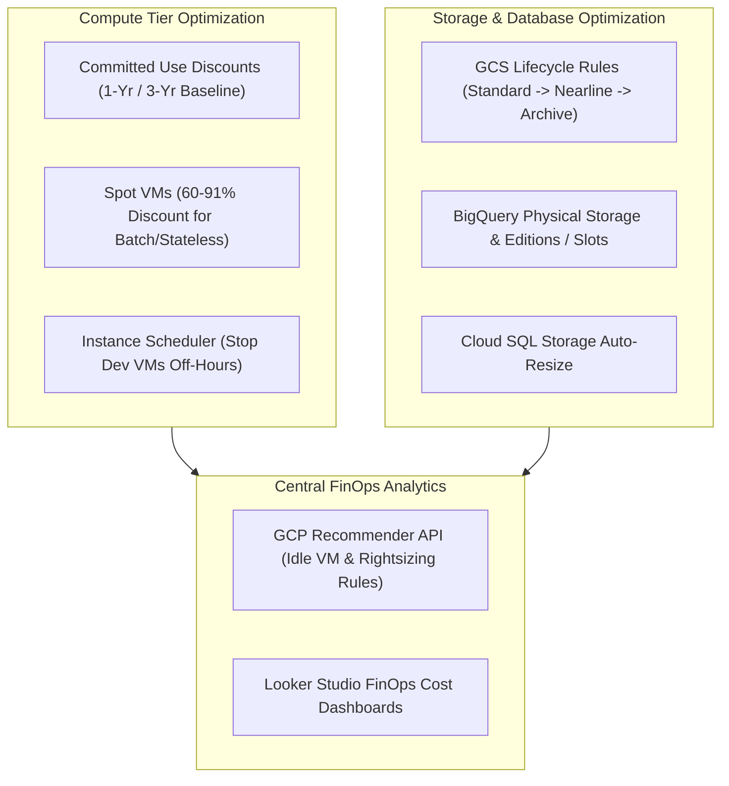

# Topic 111: Cost Optimization Techniques

---

## 1. What Is It?

**Google Cloud Cost Optimization Techniques** encompass the architectural strategies, pricing commitments, lifecycle policies, compute paradigms, and resource tuning practices designed to minimize cloud expenditures on Google Cloud Platform while maintaining high performance, reliability, and security standards.

Cost Optimization centers around four core FinOps pillars:
1. **Committed Use Discounts (CUDs)**: Financial commitments (1-year or 3-year) offering up to 57% savings on Compute Engine, GKE, Cloud SQL, and Spanner in exchange for baseline resource usage commitments.
2. **Spot VMs & Preemptible Compute**: Excess GCP compute capacity available at up to 60-91% discounts for fault-tolerant, stateless, or batch workloads.
3. **Storage Lifecycle Management**: Automated rules transitioning aged Cloud Storage objects to cheaper storage classes (Nearline, Coldline, Archive) or purging unneeded data.
4. **Compute & GKE Idle Resource Reduction**: Rightsizing VM machine families, autoscaling GKE nodes down to zero, and stopping non-production development environments outside business hours.

### Real-World Analogy
Think of Cost Optimization Techniques like managing household transportation expenses:
- **Un-optimized Cloud (Taxi Rides at Peak Rates)**: Taking an on-demand premium taxi (Standard On-Demand VMs) for every daily commute, leaving the taxi idling in your driveway all night (Idle VMs), and paying full storage locker rent for old junk you haven't opened in 5 years (Standard Storage Class).
- **Optimized Cloud (Smart Commuter System)**: Purchasing an annual discounted train pass for your daily baseline commute (Committed Use Discounts / CUDs), taking standby discount flights for non-urgent vacation trips (Spot VMs), turning off your car engine when parked (Automated Off-Hours Scheduling), and moving old household items to cheap basement storage lockers (GCS Archive Lifecycle Rules).

---

## 2. Where Does It Fit?

Cost Optimization techniques span compute, storage, data, and network layers across the entire GCP resource hierarchy.



---

## 3. Core Concepts

| Technique | Description | Typical Savings | Best Practice Use Case |
|---|---|---|---|
| **Resource-Based CUDs** | Commitment to specific vCPU/RAM quantities in a region. | 37% (1-Yr) to 57% (3-Yr) | Predictable, baseline Compute Engine VM workloads. |
| **Flexible CUDs** | Spend commitment ($/hour) across machine families and regions. | ~28% (1-Yr) to 46% (3-Yr) | Dynamic multi-region or evolving VM architecture. |
| **Spot VMs** | Unused capacity that GCP can reclaim with 30-second notice. | 60% to 91% | Stateless GKE Pods, CI/CD runners, batch processing. |
| **GCS Lifecycle Rules** | Automated transition of object storage classes based on age. | Up to 85% storage cost drop | Archiving log sinks, backups, and media assets. |
| **Instance Scheduling** | Automatically starting/stopping dev VMs on schedule (e.g., Mon-Fri 8am-6pm). | ~65% VM cost reduction | Non-production dev/stage Compute Engine VMs. |

---

## 4. How It Works

Implementing cost optimization techniques follows a systematic FinOps lifecycle:

```text
1. INFORM: Analyze usage & billing via BigQuery & GCP Recommender API
                               ↓
2. OPTIMIZE: Apply architectural changes:
   - Move stateless batch jobs to Spot VMs
   - Apply GCS Lifecycle Rules (Standard -> Coldline after 30 days)
   - Schedule Dev VMs to stop at 7:00 PM
                               ↓
3. OPERATE: Purchase CUD commitments for steady-state baseline compute
                               ↓
4. MONITOR: Track CUD Utilization (>95%) & CUD Coverage (>80%) in Billing Reports
```

1. **Spot VM Reclaim Handling**: GKE Autopilot and Spot Node Pools handle 30-second preemption notices automatically by draining nodes and rescheduling Pods onto available capacity.
2. **CUD Sharing**: Enable CUD sharing across all projects under a Cloud Billing Account to maximize commitment utilization across teams.

---

## 5. Production Scenario

### Enterprise Hybrid Cost Optimization Strategy for Microservices

```text
Requirement: Reduce monthly GCP infrastructure spend by 45% for a microservices platform consisting of 100 steady-state production GKE nodes, 50 stateless batch processing jobs, and 50 TB of backup logs.
    ↓
Architecture: Resource CUDs + Spot Node Pools + GCS Lifecycle Rules.
    ↓
Step 1: Analyze 30-day baseline compute usage -> Identify 80 vCPUs / 320 GB RAM steady-state baseline.
Step 2: Purchase 3-Year Compute Engine CUD for 80 vCPUs in `us-central1` (57% savings).
Step 3: Migrate 50 batch processing jobs to GKE Spot Node Pools (80% savings).
Step 4: Apply GCS Lifecycle Policy to `backup-logs-bucket`:
    - Move objects to Nearline after 30 days.
    - Move objects to Archive after 90 days.
    - Delete objects after 365 days.
    ↓
Result: Total monthly cloud expenditure reduced by 48% while maintaining 100% production SLA availability.
```

*Why Selected*: Demonstrates real-world combination of commitment discounts, Spot instances, and storage lifecycle policies.

---

## 6. Hands-On Lab

### Prerequisites
- Active GCP Project with Compute Engine and Cloud Storage APIs enabled.
- Cloud Shell or local machine with `gcloud` CLI installed.

### CLI Method

```bash
# 1. Environment configuration
export PROJECT_ID=$(gcloud config get-value project)
export BUCKET_NAME="cost-opt-lab-${PROJECT_ID}"

# 2. Enable Storage API
gcloud services enable storage.googleapis.com

# 3. Create Cloud Storage bucket
gcloud storage buckets create gs://${BUCKET_NAME} --location=us-central1

# 4. Create GCS Lifecycle Policy JSON definition
cat <<EOF > lifecycle.json
{
  "rule": [
    {
      "action": {
        "type": "SetStorageClass",
        "storageClass": "NEARLINE"
      },
      "condition": {
        "age": 30
      }
    },
    {
      "action": {
        "type": "SetStorageClass",
        "storageClass": "ARCHIVE"
      },
      "condition": {
        "age": 90
      }
    },
    {
      "action": {
        "type": "Delete"
      },
      "condition": {
        "age": 365
      }
    }
  ]
}
EOF

# 5. Apply lifecycle policy to Cloud Storage bucket
gcloud storage buckets update gs://${BUCKET_NAME} --lifecycle-file=lifecycle.json

# 6. Verify lifecycle policy on bucket
gcloud storage buckets describe gs://${BUCKET_NAME} --format="yaml(lifecycle)"
```

### Verification
Execute `gcloud storage buckets describe gs://${BUCKET_NAME} --format="yaml(lifecycle)"` and verify the Nearline, Archive, and Delete rules are configured.

### Cleanup

```bash
gcloud storage rm --recursive gs://${BUCKET_NAME}
rm -f lifecycle.json
```

---

## 7. Security

### Cost Governance & IAM Controls
- **CUD Purchase Permissions**: Restrict CUD purchasing permissions (`roles/billing.admin` or `roles/billing.purchaseReservations`) strictly to central finance/procurement leads to prevent accidental multi-year financial commitments.
- **Spot VM Security**: Ensure stateless batch workloads on Spot VMs do not store sensitive un-encrypted state locally on ephemeral disks.

```text
BAD PRACTICE:
Allowing individual developers to purchase un-coordinated 3-year CUD commitments or running stateful databases on Spot VMs.

PRODUCTION PRACTICE:
Centralize CUD purchasing with finance leads, enable CUD sharing across projects, and restrict Spot VMs strictly to stateless fault-tolerant workloads.
```

---

## 8. Scaling & High Availability

Spot VM fault tolerance architecture:

```text
Stateless Workload Batch Requests
               ↓
GKE Spot Node Pool (Uses multiple machine types: e2-standard-4, n2-standard-4, n1-standard-4)
               ↓
GCP reclaims instance with 30s notice -> GKE Node Auto-Provisioner spins up replacement in parallel zone
               ↓
Zero User Downtime (Pods rescheduled onto surviving nodes within seconds)
```

- **Machine Type Diversification**: Diversify Spot Node Pools across multiple machine families (`e2`, `n2`, `n1`) and zones to ensure high availability during capacity constraints.

---

## 9. Cost

### Cost Optimization Economics

| Optimization Tool | Implementation Cost | Potential Spend Reduction |
|---|---|---|
| **Committed Use Discounts (CUDs)** | 0 upfront fee (Monthly commit) | Up to 57% savings |
| **Spot VMs** | 100% FREE to use | 60% to 91% savings |
| **GCS Lifecycle Policies** | 100% FREE | Up to 85% storage savings |
| **Resource Instance Scheduler** | Free (Cloud Function / Native scheduler) | ~65% savings on dev VMs |

---

## 10. Monitoring & Troubleshooting

### Telemetry & Optimization Tracking
- **CUD Utilization Metric**: Monitor `CUD Utilization` in Billing Reports. Goal: Keep utilization >95%. (Low utilization indicates over-committed CUDs).
- **CUD Coverage Metric**: Monitor `CUD Coverage`. Goal: Keep coverage between 70-80% of total eligible compute spend.

### Troubleshooting Matrix

| Symptom | Cause | Resolution |
|---|---|---|
| Low CUD utilization (<80%) | CUD commitments exceed actual VM vCPU/RAM baseline | Downsize or migrate workloads into the CUD region/family. |
| GKE Pods crashing frequently on Spot nodes | Workload is stateful or lacks graceful termination handling | Add `gracePeriodSeconds: 30` and handle `SIGTERM` signals in app code. |
| High Early Deletion Fees on GCS | Objects deleted or moved before minimum storage duration | Ensure objects stay in Nearline (30d), Coldline (90d), Archive (365d) for minimum required periods. |

---

## 11. Common Mistakes

```text
Mistake: Purchasing 3-Year CUDs for 100% of peak compute capacity.
Why: Trying to maximize discount percentages.
Impact: Creates wasted un-utilized commitments during off-peak hours when traffic drops, erasing cost savings.
Correct Approach: Commit to 70-80% of minimum baseline capacity using CUDs, covering remaining dynamic peak traffic with Spot VMs and On-Demand instances.

Mistake: Deleting or modifying objects in GCS Archive class prior to the 365-day minimum storage duration.
Why: Cleaning up temporary files stored in Archive buckets.
Impact: Incurs early deletion penalty fees equivalent to the remaining days of storage.
Correct Approach: Store short-lived temporary files in Standard storage class; reserve Archive strictly for long-term immutable archives.
```

---

## 12. Production Best Practices

- [ ] Purchase **Committed Use Discounts (CUDs)** for 70-80% of minimum baseline compute spend.
- [ ] Enable **CUD Sharing** across all projects attached to the Cloud Billing Account.
- [ ] Utilize **Spot VMs** for stateless GKE workloads, batch jobs, and CI/CD pipelines.
- [ ] Implement **GCS Lifecycle Policies** to transition aged objects to Nearline/Archive classes.
- [ ] Automate **Instance Scheduling** to stop non-production VMs outside business hours.
- [ ] Continuously review **GCP Recommender API** suggestions for idle resources.

---

## 13. Hyperscaler / Enterprise Perspective

```text
Personal / Learning
  On-Demand VMs → Standard GCS Buckets → Always-On 24/7 Dev Instances
        ↓
Small Production
  1-Year CUD Commitments → Basic GCS Lifecycle Rules → Spot VMs for Batch Jobs
        ↓
Enterprise Environment
  3-Year Flexible CUD Portfolio → Automated Instance Schedulers → Machine Type Diversified Spot Node Pools
        ↓
Hyperscaler Environment
  Automated Continuous FinOps Optimization Pipelines → Multi-Cloud Unit Cost Tracking → Dynamic Real-Time Spot Auto-Scalers
```

Enterprise hyperscalers operate dedicated **FinOps Centers of Excellence (CoE)**, using automated pipelines to maintain a blended portfolio of 3-Year CUDs (for baseline), Flexible CUDs (for agility), and Spot VMs (for burst workloads), consistently achieving 40-60% lower unit costs than list prices.

---

## 14. Real Project Questions

### Q1: What is the main difference between Resource-Based CUDs and Flexible CUDs in GCP?
**Answer:** **Resource-Based CUDs** require committing to specific quantities of vCPUs and RAM within a specific machine family (e.g., N2) and region (e.g., us-central1), offering higher discounts (up to 57%). **Flexible CUDs** commit to a dollar-per-hour spend limit across multiple machine families (N1, N2, C2, E2) and regions globally, offering lower discounts (~46%) but maximum architecture agility.

### Q2: What happens when a Spot VM is preempted by Google Cloud?
**Answer:** GCP sends a 30-second preemption notice (`SIGTERM` signal) to the instance before terminating it. GKE Spot node pools handle this notice automatically by cordoning the node, gracefully draining running Pods, and rescheduling them onto other available nodes in the cluster.

### Q3: Why should temporary short-lived files NOT be stored in GCS Coldline or Archive storage classes?
**Answer:** Coldline and Archive classes carry strict minimum storage duration requirements ( Coldline: 90 days, Archive: 365 days). Deleting or modifying objects prior to the minimum duration incurs **Early Deletion Fees** equal to the storage cost for the remaining days, making short-lived storage in Archive classes significantly more expensive than Standard class.

---

## 15. Quick Decision Guide

| Workload Type | Recommended Cost Optimization Technique | Benefit |
|---|---|---|
| 24/7 Steady-State Database / Core Server | 3-Year Resource CUD | Maximum discount (up to 57% savings). |
| Evolving Multi-Region Web Microservices | 3-Year Flexible CUD | High savings (~46%) with cross-region flexibility. |
| Stateless CI/CD Workers & Batch Analytics | Spot VMs | Massive savings (60-91% off-list price). |

### When to Use Cost Optimization Techniques
- Essential for all production cloud architectures, enterprise FinOps programs, and multi-project GCP environments.

### When NOT to Use Cost Optimization Techniques
- Do not run single-instance stateful production databases on Spot VMs.

---

## 16. Related Services

```text
            [111. Cost Optimization Techniques]
           /                 |                 \
     Cloud Billing       Compute Engine      Cloud Storage
    (CUD Commitments)   (Spot & Schedulers) (Lifecycle Rules)
          |                  |                  |
    Manages Financial   Executes Low-Cost   Automates Class
    Discount Commitments Compute Nodes      Transitions
```

- **Cloud Billing**: Central interface for purchasing and monitoring CUD commitments.
- **Compute Engine**: Infrastructure runtime hosting Spot VMs and instance schedulers.
- **Cloud Storage**: Object storage engine implementing lifecycle transition policies.

---

## 17. Cheat Sheet

### Common gcloud Commands for Cost Optimization

```bash
# Create a GCS Lifecycle Policy
gcloud storage buckets update gs://my-bucket --lifecycle-file=lifecycle.json

# Create a Compute Engine VM as a Spot Instance
gcloud compute instances create spot-worker-vm \
  --zone=us-central1-a \
  --machine-type=e2-standard-4 \
  --provisioning-model=SPOT \
  --instance-termination-action=STOP

# Create an Instance Schedule stopping VMs at 7pm Mon-Fri
gcloud compute resource-policies create instance-schedules stop-dev-schedule \
  --region=us-central1 \
  --vm-stop-schedule="0 19 * * 1-5" \
  --timezone="America/New_York"
```

---

## 18. Learning Connection

- **Previous Topic**: [110. Budgets & Alerts](../110-budgets-and-alerts/README.md)
- **Next Topic**: [112. Rightsizing Resources](../112-rightsizing-resources/README.md)
