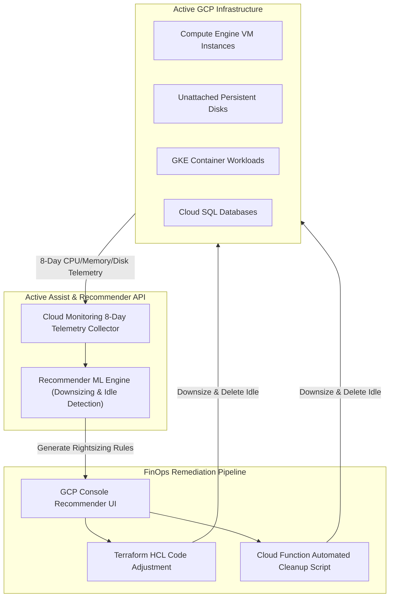

# Topic 112: Rightsizing Resources

---

## 1. What Is It?

**Rightsizing Resources** on Google Cloud Platform is the continuous operational discipline of analyzing real-time compute, memory, storage, database, and network utilization metrics to adjust infrastructure allocations to match actual workload demands, eliminating waste from overprovisioned or idle cloud resources.

Rightsizing on GCP leverages four core Active Assist & Recommender engines:
1. **Compute Engine VM Rightsizing Recommendations**: Machine-learning algorithms analyzing 8-day CPU, memory, and disk I/O metrics to recommend downsizing overprovisioned VMs (e.g., e2-standard-8 to e2-standard-2) or changing machine families.
2. **Idle Resource Recommendations**: Identifies completely idle Compute Engine instances, unattached Persistent Disks, unused IP addresses, and stale Cloud SQL databases for automated deletion.
3. **GKE Workload Rightsizing (VPA)**: Utilizing Vertical Pod Autoscaler (VPA) to automatically tune GKE container Pod CPU and memory request/limit boundaries based on actual consumption.
4. **Cloud SQL & BigQuery Rightsizing**: Recommends downsizing overprovisioned Cloud SQL database instances or converting BigQuery flat-rate slots based on historical query execution patterns.

### Real-World Analogy
Think of Rightsizing Resources like adjusting the size of a fleet of delivery trucks for a small bakery:
- **Overprovisioned Infrastructure (Traditional Sizing)**: Buying 50 massive 18-wheeler semi-trucks (e2-standard-32 VMs) to deliver small boxes of cupcakes. The trucks drive around 99% empty, using massive amounts of fuel and costing millions in unnecessary vehicle leases.
- **Rightsizing**: Equipping every delivery vehicle with cargo sensors (Active Assist Recommender). The sensors analyze actual delivery volumes over 30 days and recommend replacing 45 semi-trucks with small hybrid delivery vans (e2-standard-2 VMs) and selling 5 unused trucks parked in the lot (Idle VM Deletion)—cutting fuel and lease bills by 75% while delivering 100% of the cupcakes on time.

---

## 2. Where Does It Fit?

Rightsizing operates as an automated recommendation layer sitting above GCP compute, database, and storage tiers.



---

## 3. Core Concepts

| Concept | Description | Production Best Practice |
|---|---|---|
| **GCP Recommender API** | REST API providing machine-learning powered recommendations for cost, security, performance, and IAM. | Automate Recommender API queries in weekly FinOps reporting. |
| **Active Assist** | Google Cloud's suite of intelligent tools (Recommender, Network Analyzer, Policy Intelligence). | Review Active Assist recommendations weekly in the GCP Console. |
| **Idle VM Recommendation** | Identifies VMs running <3% CPU and minimal network I/O over an 8-day period. | Stop or delete idle VMs after verifying ownership. |
| **Custom Machine Types** | Tailoring exact vCPU and RAM ratios (e.g., 3 vCPUs, 11 GB RAM) rather than standard rigid shapes. | Use Custom Machine Types when workloads require non-standard CPU/RAM ratios. |
| **Vertical Pod Autoscaler (VPA)** | GKE controller automatically adjusting Pod CPU and memory requests/limits. | Run VPA in `Off` (Recommender-only) mode first to collect pod sizing metrics safely. |

---

## 4. How It Works

VM and workload rightsizing execution follows a continuous analytical workflow:

```text
Cloud Monitoring collects CPU, Memory & Disk I/O telemetry over 8+ days
                               ↓
Recommender ML Engine analyzes percentiles -> Identifies overprovisioned capacity
                               ↓
Generates Recommendation (e.g., "Downsize n2-standard-16 to n2-standard-4. Saves $320/mo")
                               ↓
SRE inspects recommendation -> Updates Terraform HCL (`machine_type = "n2-standard-4"`)
                               ↓
Executes `terraform apply` -> VM instance resized -> Marks recommendation as CLAIMED
```

1. **Custom Machine Sizing**: Compute Engine allows custom vCPU and memory configurations, allowing exact rightsizing matching workload needs without paying for unused pre-defined instance steps.
2. **Safety Thresholds**: Recommender algorithms build in safety margins (e.g., accounting for peak 99th percentile traffic bursts) to ensure downsized machines do not experience OOM (Out Of Memory) crashes.

---

## 5. Production Scenario

### Enterprise Automated Idle Disk Cleanup & VM Rightsizing Pipeline

```text
Requirement: Establish an automated FinOps pipeline that queries the GCP Recommender API weekly, identifies unattached Persistent Disks and overprovisioned VMs across 50 projects, and dispatches a Slack report to engineering leads.
    ↓
Architecture: GCP Recommender API + Cloud Function + Pub/Sub + Slack Webhook.
    ↓
Step 1: Enable Recommender API: `recommender.googleapis.com`.
Step 2: Deploy weekly Cloud Scheduler job triggering a Cloud Function.
Step 3: Cloud Function queries Recommender API for:
  - `google.compute.disk.IdleResourceRecommender` (Unattached Disks)
  - `google.compute.instance.MachineTypeRecommender` (VM Rightsizing)
Step 4: Formats payload into Slack markdown message:
    "🚨 *Weekly FinOps Rightsizing Report:*
     - Found 14 Unattached Disks ($450/mo waste).
     - Found 8 Overprovisioned VMs ($1,200/mo waste).
     Click to review: https://console.cloud.google.com/recommendations"
    ↓
Result: Continuous, automated cost reduction preventing dormant infrastructure from inflating monthly cloud invoices.
```

*Why Selected*: Illustrates standard enterprise FinOps workflow automating rightsizing visibility across multi-project environments.

---

## 6. Hands-On Lab

### Prerequisites
- Active GCP Project with Compute Engine API enabled.
- Cloud Shell or local machine with `gcloud` CLI installed.

### CLI Method

```bash
# 1. Environment configuration
export PROJECT_ID=$(gcloud config get-value project)

# 2. Enable Recommender API
gcloud services enable recommender.googleapis.com

# 3. Query VM Machine Type Rightsizing Recommendations for the project
gcloud recommender recommendations list \
  --project=${PROJECT_ID} \
  --location=us-central1-a \
  --recommender=google.compute.instance.MachineTypeRecommender \
  --format="table(name, content.overview.recommendedAction, primaryImpact.costProjection.cost.units)"

# 4. Query Idle Persistent Disk Recommendations
gcloud recommender recommendations list \
  --project=${PROJECT_ID} \
  --location=us-central1-a \
  --recommender=google.compute.disk.IdleResourceRecommender

# 5. Query Unused IP Address Recommendations
gcloud recommender recommendations list \
  --project=${PROJECT_ID} \
  --location=global \
  --recommender=google.compute.address.IdleResourceRecommender
```

### Verification
Execute `gcloud recommender recommendations list` commands above and confirm the API executes cleanly (returning recommended actions if overprovisioned assets exist).

### Cleanup
No persistent infrastructure created; no cleanup required.

---

## 7. Security

### Rightsizing Governance & Role Security
- **Recommender Viewer (`roles/recommender.viewer`)**: Grants read-only access to view rightsizing recommendations.
- **Recommender Admin (`roles/recommender.admin`)**: Grants permission to mark recommendations as `CLAIMED`, `DISMISSED`, or `FAILED`.
- **Safe Rightsizing Approval**: Rightsizing modifications (e.g., resizing Cloud SQL or VM instances) require instance restarts; enforce change management approval processes before applying downsizing updates in production.

```text
BAD PRACTICE:
Automatically applying VM or Cloud SQL downsizing modifications directly in production without testing, causing unexpected application downtime or OOM crashes.

PRODUCTION PRACTICE:
Review Recommender recommendations in staging environments, update declarative Terraform code, and execute rightsizing changes during scheduled maintenance windows.
```

---

## 8. Scaling & High Availability

Dynamic GKE Pod rightsizing architecture:

```text
GKE Cluster Workload Pods (Running in Autopilot or Standard)
                       ↓ (Vertical Pod Autoscaler - VPA)
VPA Metrics Collector analyzes historical CPU/Memory request vs. actual usage
                       ↓
VPA automatically adjusts `resources.requests` & `resources.limits` in Pod specs
                       ↓
Optimizes GKE Node Bin-Packing -> Triggers Cluster Autoscaler to shrink node pool count
```

- **GKE Autopilot Auto-Rightsizing**: GKE Autopilot automatically bin-packs Pods onto optimal node sizes, adjusting billing dynamically based strictly on Pod resource requests.

---

## 9. Cost

### Rightsizing Economics

| Feature | Cost Model | Financial Benefit |
|---|---|---|
| **GCP Recommender API** | 100% FREE | Identifies 15% to 40% immediate compute spend reduction. |
| **Active Assist Console** | 100% FREE | Direct visual callouts of idle resources. |
| **GKE Vertical Pod Autoscaler (VPA)** | 100% FREE | Optimizes container CPU/RAM allocations. |

---

## 10. Monitoring & Troubleshooting

### Operational Telemetry & Validation
- **GCP Cost Hub**: View aggregated financial impact of all Active Assist recommendations across the entire GCP Organization in Cloud Console.
- **Post-Rightsizing Telemetry**: Monitor CPU and Memory metrics in Cloud Monitoring for 48 hours following a VM downsize to confirm memory usage stays below 85%.

### Troubleshooting Matrix

| Symptom | Cause | Resolution |
|---|---|---|
| Recommender API returns empty lists | Project created recently (<8 days of metric history) | Allow 8-14 days of operational telemetry collection for ML model initialization. |
| VM experiences OOM crash after downsizing | Machine downsized based on average CPU, ignoring memory burst spikes | Increase memory allocation using Custom Machine Types (`--custom-vm-type`). |
| Recommender advice disappeared | Recommendation expired or marked as claimed/dismissed | Check recommendation state filters (`--status=CLAIMED`). |

---

## 11. Common Mistakes

```text
Mistake: Downsizing Compute Engine instances based on 24-hour metric trends.
Why: Trying to act quickly on initial cost reports.
Impact: Ignores weekly batch jobs or end-of-month processing spikes, causing server crashes during high-load periods.
Correct Approach: Analyze at least 8 to 30 days of continuous telemetry data before applying rightsizing modifications.

Mistake: Manual resizing of Compute Engine VMs directly via gcloud/Console without updating Terraform code.
Why: Quick operational fix.
Impact: Creates configuration drift; the next CI/CD `terraform apply` overwrites the change, restoring the overprovisioned VM size.
Correct Approach: Update the `machine_type` attribute inside declarative Terraform HCL code and apply via IaC pipelines.
```

---

## 12. Production Best Practices

- [ ] Query the **GCP Recommender API** weekly for idle resources and machine downsizing.
- [ ] Delete **Unattached Persistent Disks** and **Unused External Static IP Addresses**.
- [ ] Use **Custom Machine Types** to tailor precise vCPU and RAM ratios.
- [ ] Implement **GKE Vertical Pod Autoscaler (VPA)** to tune container pod requests/limits.
- [ ] Update **Terraform HCL code** when applying machine type downsizing.
- [ ] Test rightsizing changes in staging environments prior to production maintenance windows.

---

## 13. Hyperscaler / Enterprise Perspective

```text
Personal / Learning
  Default Machine Sizes → Manual Console Inspection → Static Overprovisioned Sizing
        ↓
Small Production
  GCP Recommender UI → Weekly Machine Downsizing → Delete Unattached Disks
        ↓
Enterprise Environment
  Recommender API Automated FinOps Pipelines → Custom Machine Types Tuning → GKE VPA Auto-Scaling
        ↓
Hyperscaler Environment
  Automated Infrastructure-as-Code Drift-Free Rightsizing → Continuous FinOps Unit-Cost Optimization → ML-Driven Workload Profile Fitting
```

Enterprise hyperscalers deploy automated FinOps bots that scan Recommender APIs, generate pull requests directly in GitHub repositories to downsize Terraform `machine_type` definitions, and tag assigned SRE leads for fast one-click approval.

---

## 14. Real Project Questions

### Q1: How long must a Compute Engine VM run before the GCP Recommender API generates accurate Machine Type rightsizing recommendations?
**Answer:** The Recommender ML engine requires at least **8 continuous days** of performance telemetry (CPU utilization, memory usage, network I/O) to build an accurate workload profile that accounts for daily peak traffic cycles before outputting machine type recommendations.

### Q2: What is the main advantage of Compute Engine Custom Machine Types over standard predefined machine families?
**Answer:** Standard machine families follow rigid 1:4 vCPU-to-RAM ratios (e.g., 2 vCPU / 8 GB RAM). Custom Machine Types allow engineers to specify exact vCPU counts and memory quantities (e.g., 3 vCPUs and 6 GB RAM), matching actual application resource requirements precisely and avoiding paying for unused excess memory or CPU capacity.

### Q3: How does the GKE Vertical Pod Autoscaler (VPA) assist with container rightsizing?
**Answer:** VPA monitors actual CPU and memory consumption of container Pods in a GKE cluster. It computes recommended `cpu` and `memory` resource requests and limits, automatically adjusting Pod manifests or providing recommendations to eliminate container overprovisioning and increase cluster node packing density.

---

## 15. Quick Decision Guide

| Waste Reduction Requirement | Recommended Active Assist / Tool | Advantage |
|---|---|---|
| Overprovisioned VM Compute/Memory | Compute Engine MachineTypeRecommender | Machine-learning recommendations based on 8-day telemetry. |
| Dormant Storage Cost Waste | IdleResourceRecommender (Disks & IPs) | Identifies unattached disks and unused static IPs. |
| Overprovisioned GKE Container Pods | Vertical Pod Autoscaler (VPA) | Automatically tunes container CPU/RAM requests and limits. |

### When to Use Rightsizing
- Essential for continuous FinOps cost optimization, post-migration infrastructure tuning, and GKE bin-packing efficiency.

### When NOT to Use Rightsizing
- Do not downsize infrastructure during active high-traffic promotional events or major product launches.

---

## 16. Related Services

```text
                 [112. Rightsizing Resources]
                /             |              \
      Recommender API    Cloud Monitoring    Compute Engine
     (ML Recommendations) (8-Day Telemetry)   (Custom Machines)
            |                 |                      |
      Generates Downsize Tracks CPU/RAM      Executes Resized
      & Idle Suggestions Utilization Data    Machine Shapes
```

- **Recommender API**: Core machine-learning engine generating rightsizing suggestions.
- **Cloud Monitoring**: Telemetry database storing historical CPU and memory metrics.
- **Compute Engine**: Target compute service supporting custom machine types and resizing.

---

## 17. Cheat Sheet

### Common gcloud Rightsizing & Recommender Commands

```bash
# List VM Machine Type Rightsizing Recommendations
gcloud recommender recommendations list --project=PROJECT_ID --location=us-central1-a --recommender=google.compute.instance.MachineTypeRecommender

# List Idle Persistent Disk Recommendations
gcloud recommender recommendations list --project=PROJECT_ID --location=us-central1-a --recommender=google.compute.disk.IdleResourceRecommender

# Mark a Recommendation as CLAIMED (Applied)
gcloud recommender recommendations mark-claimed RECOMMENDATION_ID --project=PROJECT_ID --location=us-central1-a --recommender=google.compute.instance.MachineTypeRecommender --etag=ETAG

# Resize a Compute Engine VM using Custom Machine Type (2 vCPU, 6 GB RAM)
gcloud compute instances set-machine-type my-vm --zone=us-central1-a --custom-cpu=2 --custom-memory=6144MB
```

---

## 18. Learning Connection

- **Previous Topic**: [111. Cost Optimization Techniques](../111-cost-optimization-techniques/README.md)
- **Next Topic**: [113. BigQuery](../../13-data-and-analytics/113-bigquery/README.md)
