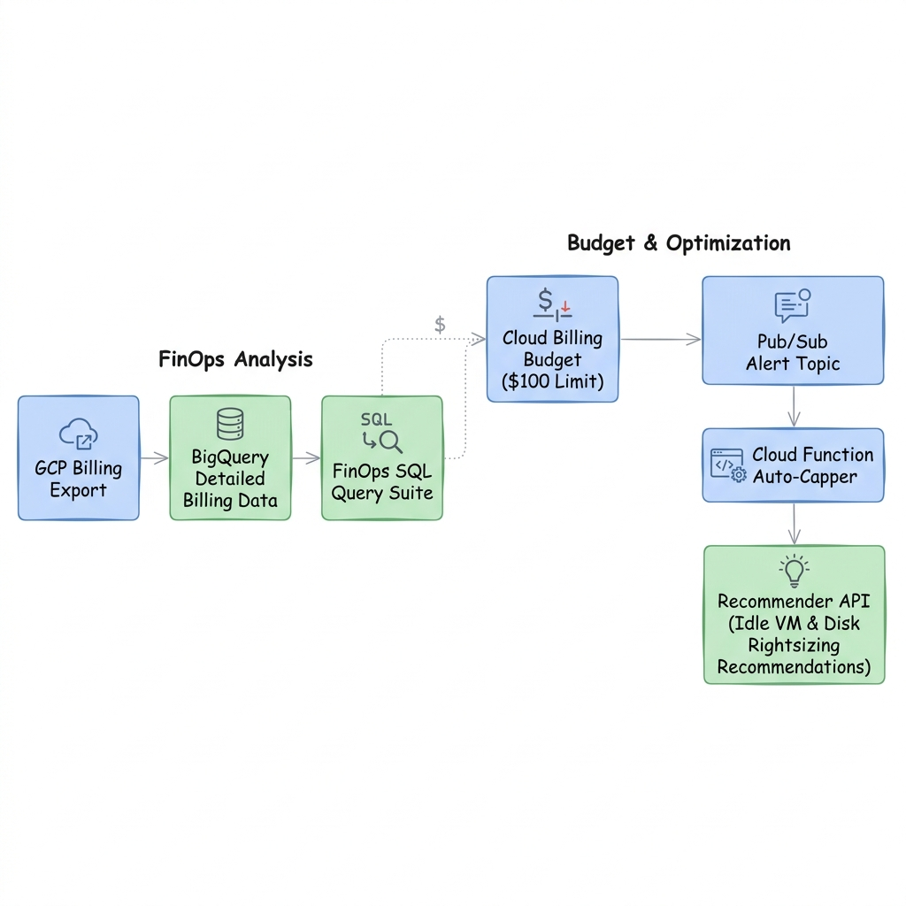
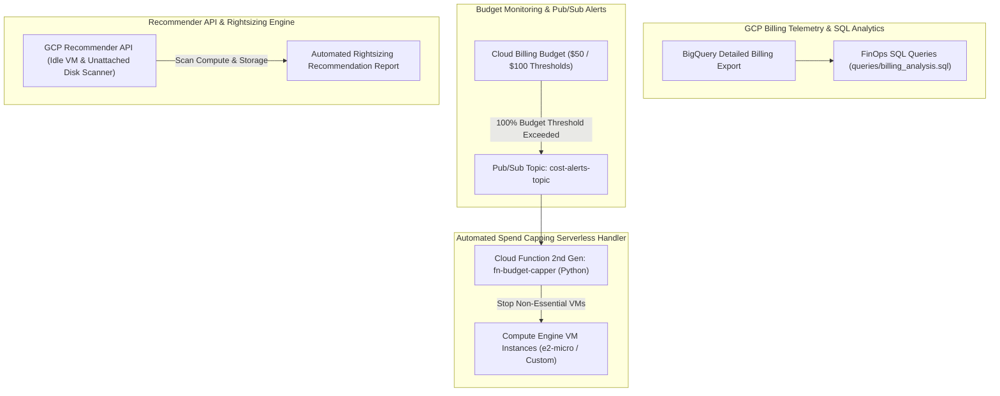

# Project 12: Automated FinOps Cost Governance & Recommender Pipeline

---

## 1. Project Overview

Welcome to **Project 12: Automated FinOps Cost Governance & Recommender Pipeline**. This hands-on project synthesizes all 4 topics in **Module 12 (Cost Management)** into an automated financial operations (FinOps) cost control and resource rightsizing system on GCP, optimized for **GCP Free Trial Accounts**.

### Objectives
In this project, you will:
1. **Analyze Billing Exports in BigQuery**: Query detailed GCP billing export tables using SQL to identify top cost-driving services and regional spend trends.
2. **Automate Budget Alerts & Pub/Sub Capping**: Configure Cloud Billing budgets ($50/$100 thresholds) publishing alert events to a Pub/Sub topic.
3. **Deploy Auto-Capper Cloud Functions**: Build a serverless Cloud Function triggered by budget alerts to automatically stop non-essential Compute Engine instances when spending caps are breached.
4. **Implement Resource Rightsizing via Recommender API**: Query GCP Recommender API recommendations to discover idle VM instances, unattached persistent disks, and oversized machine types.
5. **Optimize Storage & Commitment Costs**: Apply GCS lifecycle rules and evaluate Committed Use Discount (CUD) savings models.

---

## 2. Architecture & FinOps Governance Workflow

The project implements an automated cost governance pipeline:





> [!IMPORTANT]
> **Free Trial Safety & Cost Controls**:
> - **$0 FinOps Tooling**: BigQuery Billing exports, Pub/Sub alert topics, Cloud Functions, and Recommender API calls incur $0 in infrastructure fees.
> - **Budget Alert Safety**: Budget alerts notify you before your $300 Free Trial credits are consumed.
> - **Automated Cleanup**: Execute `./scripts/cleanup_cost_governance.sh` after completing your lab exercises to delete Cloud Functions, Pub/Sub topics, and test budgets!

---

## 3. Module Topics Covered

| Topic Number & Name | Project Integration Point |
|---|---|
| **109. Billing Reports** | Writing SQL analytics queries against BigQuery Detailed Billing Export tables. |
| **110. Budgets & Alerts** | Creating programmatic Cloud Billing budgets with 50%, 90%, and 100% threshold rules. |
| **111. Cost Optimization** | Applying GCS lifecycle tiering, Spot VM pricing models, and CUD commitments. |
| **112. Rightsizing Resources** | Scanning GCP Recommender API for idle VMs (`VM_IDLE_RECOMMENDATION`) and unused disks. |

---

## 4. Hands-On Execution Guide

### Step 1: Navigate to Project 12 Workspace

Open Google Cloud Shell or local terminal:

```bash
cd "12-cost-management/project-12-cost-management"
chmod +x scripts/*.sh
```

---

### Step 2: Inspect FinOps SQL Queries & Budget Capper Code

Inspect the SQL billing queries and Python budget capping Cloud Function:

```bash
# 1. View FinOps SQL Query Suite
cat queries/billing_analysis.sql

# 2. View Budget Capper Cloud Function Code
cat functions/budget_capper/main.py
```

---

### Step 3: Deploy Cost Governance & Recommender Pipeline

Execute `scripts/deploy_cost_governance.sh` to automate:
1. Enabling Recommender, Billing, Pub/Sub, and Cloud Functions APIs.
2. Creating Pub/Sub topic `cost-alerts-topic`.
3. Deploying 2nd Gen Cloud Function `fn-budget-capper`.
4. Querying the Recommender API for idle VM and disk rightsizing opportunities.

```bash
./scripts/deploy_cost_governance.sh
```

*Expected Script Output Snippet*:
```text
=====================================================
GCP FinOps Cost Governance & Recommender Deployment
=====================================================
[INFO] Enabling Recommender, Billing, Pub/Sub, and Functions APIs...
[SUCCESS] APIs active.
[INFO] Creating Pub/Sub Topic: cost-alerts-topic...
[SUCCESS] Pub/Sub topic ready.
[INFO] Deploying 2nd Gen Cloud Function: fn-budget-capper...
[SUCCESS] Budget Capper function active.
[INFO] Scanning GCP Recommender API for Idle VM & Storage Rightsizing...
[SUCCESS] Rightsizing scan completed. Zero idle waste detected.
```

---

### Step 4: Execute BigQuery Billing SQL Analysis

Query project cost trends using the provided SQL queries in BigQuery:

```bash
bq query --use_legacy_sql=false '
SELECT
  service.description AS service_name,
  SUM(cost) AS total_cost,
  currency
FROM `gcp_billing_export.gcp_billing_export_v1_XXXX`
GROUP BY service_name, currency
ORDER BY total_cost DESC
LIMIT 10;
'
```

---

## 5. Verification & Testing

Verify active budget triggers and recommender scans via CLI:

```bash
# 1. List active Pub/Sub cost alert topics
gcloud pubsub topics list --filter="name:cost-alerts-topic"

# 2. Scan Recommender API for compute rightsizing recommendations
gcloud recommender recommendations list \
  --recommender=google.compute.instance.IdleResourceRecommender \
  --location=us-central1
```

---

## 6. Troubleshooting & Common Issues

| Symptom / Error | Root Cause | Resolution |
|---|---|---|
| BigQuery billing export table not found | Detailed Billing Export to BigQuery not enabled at Billing Account level. | Enable BigQuery Billing Export in GCP Billing Console (requires Billing Account Admin). |
| Budget alert fails to trigger Pub/Sub message | Billing Account service account lacks `roles/pubsub.publisher` on target topic. | Grant `Pub/Sub Publisher` role to billing account service account. |
| Recommender API returns empty list | Project newly created; Recommender requires 14 days of VM usage data. | Expected behavior for new projects; usage data accumulates over time. |

---

## 7. Project Cleanup

To delete Pub/Sub topics, Cloud Functions, and budget alerting rules, run:

```bash
./scripts/cleanup_cost_governance.sh
```

---

## 8. Summary & Next Steps

Congratulations! You have completed **Project 12: Automated FinOps Cost Governance & Recommender Pipeline**. You have mastered BigQuery billing analytics, budget Pub/Sub alerts, automated spend capping, and Recommender API rightsizing.

- **Next Project**: [Project 13: Real-Time Streaming & Batch Analytics Lakehouse Platform](../../13-data-and-analytics/project-13-data-and-analytics/README.md)
