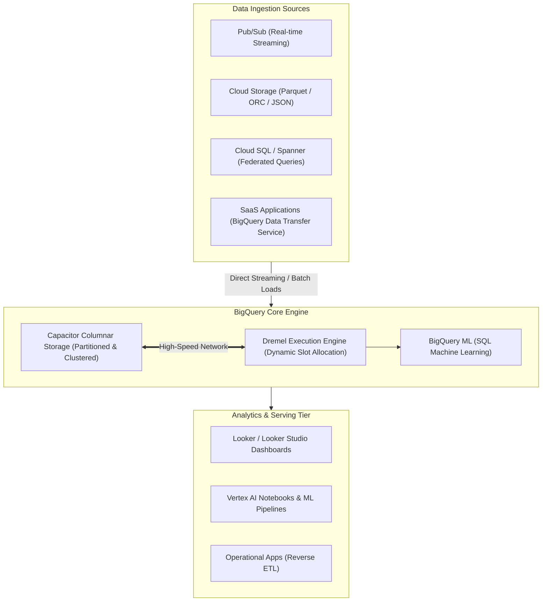

# Topic 113: BigQuery

---

## 1. What Is It?

**Google BigQuery** is a fully managed, serverless, highly scalable enterprise data warehouse on Google Cloud Platform designed to execute petabyte-scale ANSI SQL queries, real-time analytics, machine learning (BigQuery ML), and geospatial operations in seconds without requiring database administrators to manage clusters, indexes, or storage infrastructure.

BigQuery delivers four core analytical architecture pillars:
1. **Decoupled Compute & Storage**: Separates query execution compute (Slots) from storage engines (Colossus / Capacitor), scaling compute and storage independently for near-infinite elasticity.
2. **Columnar Storage Format**: Utilizes Google's proprietary Capacitor columnar format and Capacitor storage algorithms for sub-second execution across billions of rows.
3. **Partitioning & Clustering**: Native table optimization strategies reducing query data scan volumes and costs by up to 99%.
4. **Built-in Advanced Analytics**: Native SQL extensions for machine learning (BigQuery ML), geospatial GIS functions, time-series forecasting, and federated queries across Cloud Storage, Spanner, and Cloud SQL.

### Real-World Analogy
Think of BigQuery like an automated city library containing 50 million books:
- **Traditional RDBMS Database (Filing Cabinets)**: A single librarian searching page-by-page through alphabetical paper books stored in physical filing cabinets to count how many times the word "Cloud" appears. It takes days to answer a single question.
- **BigQuery**: A futuristic digital library. When you ask a question (SQL Query), the library instantly assigns 2,000 automated robotic workers (Compute Slots). Each robot reads one specific column of 25,000 books simultaneously (Columnar Storage), ignores non-relevant chapters (Table Partitioning), groups books by subject (Clustering), and returns the exact answer to your screen in 1.2 seconds.

---

## 2. Where Does It Fit?

BigQuery serves as the central enterprise analytics engine ingesting data from streaming, batch, and operational database platforms.



---

## 3. Core Concepts

| Concept | Description | Production Best Practice |
|---|---|---|
| **Dataset** | Top-level container organizing tables, views, and access controls within a GCP project. | Set default dataset location to match data residency requirements. |
| **Partitioned Table** | Table divided into segments based on a date, timestamp, or integer range column. | Always partition large tables (>1 GB) by event date or ingestion time. |
| **Clustered Table** | Table sorting data internally based on up to 4 user-defined columns. | Cluster tables by frequently filtered or grouped columns (e.g., `user_id`, `status`). |
| **Slots** | Virtual CPUs used by BigQuery to execute SQL queries. | Use On-Demand pricing for variable workloads; use Slots Reservations for predictable enterprise spend. |
| **BigQuery ML (BQML)** | Feature creating and executing ML models (Regression, K-Means, XGBoost) directly using SQL statements. | Train ML models directly in BigQuery to avoid exporting massive datasets. |

---

## 4. How It Works

SQL query execution and data scanning proceed through a parallel execution pipeline:

```text
User executes SQL Query -> Dremel Engine parses & optimizes query execution plan
                               ↓
Determines required Partition & Cluster segments -> Prunes non-matching data blocks
                               ↓
Allocates Compute Slots (Parallel Execution Workers) -> Reads Capacitor Columnar Storage
                               ↓
Executes joins, aggregations, & transforms in parallel -> Returns JSON / Table Result
```

1. **Partition Pruning**: Including partition filters in `WHERE` clauses (e.g., `WHERE _PARTITIONDATE = '2026-08-01'`) instructs BigQuery to scan ONLY that specific date's data partition, dramatically reducing query billing charges.
2. **Columnar Scanning**: Queries selecting specific columns (`SELECT user_id, amount`) scan ONLY those specific column bytes, ignoring all unselected table columns.

---

## 5. Production Scenario

### Enterprise Partitioned & Clustered Data Warehouse with BQML Customer Churn Model

```text
Requirement: Establish a multi-terabyte e-commerce transactions table in BigQuery optimized for low-cost SQL analytics, and build an automated customer churn prediction model using SQL.
    ↓
Architecture: BigQuery Ingestion + Ingest-Time Partitioning + Clustering + BigQuery ML.
    ↓
Step 1: Create Partitioned and Clustered Table in DDL:
    CREATE TABLE `prod_analytics.orders` (
      order_id STRING,
      user_id STRING,
      order_date DATE,
      amount NUMERIC,
      status STRING
    )
    PARTITION BY order_date
    CLUSTER BY user_id, status;
    ↓
Step 2: Load historical data via `bq load` using Parquet format.
    ↓
Step 3: Create BigQuery ML Logistic Regression Model to predict churn:
    CREATE OR REPLACE MODEL `prod_analytics.churn_model`
    OPTIONS(model_type='logistic_reg', input_label_cols=['churned']) AS
    SELECT
      user_id,
      COUNT(order_id) AS total_orders,
      SUM(amount) AS total_spend,
      churned
    FROM `prod_analytics.orders`
    WHERE order_date >= DATE_SUB(CURRENT_DATE(), INTERVAL 90 DAY)
    GROUP BY user_id, churned;
    ↓
Result: Sub-second analytical queries scanning <1% of table data, alongside native SQL machine learning deployment without exporting data to external Python servers.
```

*Why Selected*: Demonstrates native BigQuery performance optimization (Partitioning + Clustering) and SQL-native Machine Learning (BQML).

---

## 6. Hands-On Lab

### Prerequisites
- Active GCP Project with BigQuery API enabled.
- Cloud Shell or local machine with `gcloud` CLI installed.

### CLI Method

```bash
# 1. Environment configuration
export PROJECT_ID=$(gcloud config get-value project)
export DATASET_NAME="bq_lab_dataset"

# 2. Enable BigQuery API
gcloud services enable bigquery.googleapis.com

# 3. Create BigQuery Dataset in us-central1
bq --location=us-central1 mk -d ${DATASET_NAME}

# 4. Create a Partitioned and Clustered Table using DDL via bq query
bq query --use_legacy_sql=false "
CREATE TABLE \`${PROJECT_ID}.${DATASET_NAME}.web_events\` (
  event_id STRING,
  event_timestamp TIMESTAMP,
  user_id STRING,
  event_type STRING,
  page_url STRING
)
PARTITION BY DATE(event_timestamp)
CLUSTER BY event_type, user_id;
"

# 5. Insert sample data into the partitioned table
bq query --use_legacy_sql=false "
INSERT INTO \`${PROJECT_ID}.${DATASET_NAME}.web_events\` (event_id, event_timestamp, user_id, event_type, page_url)
VALUES
  ('evt_1', CURRENT_TIMESTAMP(), 'usr_101', 'click', '/home'),
  ('evt_2', CURRENT_TIMESTAMP(), 'usr_102', 'view', '/checkout'),
  ('evt_3', CURRENT_TIMESTAMP(), 'usr_101', 'purchase', '/confirmation');
"

# 6. Execute a dry-run query to inspect scanned data bytes
bq query --use_legacy_sql=false --dry_run "
SELECT user_id, COUNT(*) AS event_count
FROM \`${PROJECT_ID}.${DATASET_NAME}.web_events\`
WHERE DATE(event_timestamp) = CURRENT_DATE() AND event_type = 'click'
GROUP BY user_id;
"
```

### Verification
Confirm the `bq query --dry_run` command returns an output displaying query processing estimates (e.g., `Query will process X bytes when run`).

### Cleanup

```bash
bq rm -r -f -d ${PROJECT_ID}:${DATASET_NAME}
```

---

## 7. Security

### BigQuery Security & Governance Controls
- **Column-Level & Row-Level Security**: Restrict access to specific sensitive columns (e.g., SSN, PII) using Policy Tags, or filter rows dynamically based on user IAM identity.
- **Dataset Authorized Views**: Allow users to query aggregated view results without granting them direct read access to underlying raw source tables.
- **CMEK Encryption**: Protect BigQuery datasets at rest using Customer-Managed Encryption Keys in Cloud KMS.

```text
BAD PRACTICE:
Granting `roles/bigquery.admin` or `roles/bigquery.dataEditor` to broad user groups, allowing unrestricted access to raw customer PII columns.

PRODUCTION PRACTICE:
Enforce Column-Level Security via Policy Tags on sensitive PII columns, use Authorized Views for user access, and encrypt datasets via CMEK.
```

---

## 8. Scaling & High Availability

BigQuery architecture scaling and slots reservations:

```text
On-Demand Pricing (Shared Slot Pool up to 2,000 Slots -> Pay $6.25 per TB scanned)
                       ↓ (Enterprise Capacity Scaling)
BigQuery Editions (Standard / Enterprise / Enterprise Plus):
├── Dedicated Capacity Reservations (Assigned baseline Slots e.g., 500 Slots)
├── Autopool Autoscale Slots (Dynamically bursts during peak complex queries)
└── Multi-Region Replication (Cross-region Disaster Recovery Failover)
```

- **BigQuery Editions**: Transition enterprise production workloads to BigQuery Editions (Enterprise/Enterprise Plus) for predictable monthly slot billing and advanced security controls.

---

## 9. Cost

### BigQuery Pricing Model

| Component | On-Demand Model | BigQuery Editions Model |
|---|---|---|
| **Query Compute Execution** | $6.25 per TB of data scanned | Charged per Slot-Hour (Standard / Enterprise / Enterprise Plus) |
| **Active Storage (First 10 GB Free)** | $0.020 per GB / month | $0.020 per GB / month |
| **Long-Term Storage (Unmodified 90d)** | $0.010 per GB / month (50% Discount) | $0.010 per GB / month (50% Discount) |
| **Streaming Ingestion** | $0.01 per 200 MB streamed | $0.01 per 200 MB streamed |

---

## 10. Monitoring & Troubleshooting

### Operational Telemetry & Troubleshooting
- **`INFORMATION_SCHEMA` Views**: Query `INFORMATION_SCHEMA.JOBS_BY_PROJECT` to audit top cost-driving queries, slot utilization, and long-running execution jobs.
- **Dry-Run API**: Execute `--dry_run` before running large ad-hoc SQL queries to calculate exact data scan volumes and costs before execution.

### Troubleshooting Matrix

| Symptom | Cause | Resolution |
|---|---|---|
| Single query costs hundreds of dollars | `SELECT *` executed against multi-terabyte non-partitioned table | Add explicit `WHERE` partition filters and select ONLY required columns. |
| Query running extremely slow | "Spaghetti SQL" joining massive un-clustered string columns | Cluster table by join keys (`user_id`, `order_id`) and optimize JOIN logic. |
| High storage billing charges | Accumulation of temporary intermediate tables and staging data | Set default table expiration periods on staging datasets (e.g., 7 days). |

---

## 11. Common Mistakes

```text
Mistake: Executing `SELECT *` queries on multi-terabyte BigQuery tables.
Why: Convenience during interactive ad-hoc SQL exploratory testing.
Impact: Scans every single column in the table, wasting hundreds of gigabytes/terabytes of data scan quota and incurring high charges.
Correct Approach: Select ONLY the specific columns required (`SELECT user_id, amount`), and always specify partition filters.

Mistake: Storing raw un-partitioned tables for high-frequency time-series datasets.
Why: Creating tables without `PARTITION BY` clauses.
Impact: Forces every subsequent query to scan the entire historical dataset from day 1, exploding processing latency and costs.
Correct Approach: Always partition time-series tables by `DATE(timestamp_column)` or `_PARTITIONDATE`.
```

---

## 12. Production Best Practices

- [ ] Always **Partition** tables >1 GB by date/timestamp and **Cluster** by high-frequency filter columns.
- [ ] Avoid `SELECT *`; select ONLY required column names.
- [ ] Use **`--dry_run`** in CLI/scripts to estimate query data scan costs prior to execution.
- [ ] Implement **Column-Level Security (Policy Tags)** to protect sensitive PII data.
- [ ] Set **Default Table Expiration** rules (e.g., 7 days) on staging datasets.
- [ ] Leverage **Long-Term Storage Discounts** by leaving historical partition data unmodified for 90+ days.

---

## 13. Hyperscaler / Enterprise Perspective

```text
Personal / Learning
  Single Un-partitioned Table → `SELECT *` On-Demand Queries → Web Console UI
        ↓
Small Production
  Ingestion-Time Partitioned Tables → Basic Column Clustering → Scheduled Queries
        ↓
Enterprise Environment
  BigQuery Editions Slot Reservations → Column-Level PII Policy Tags → Looker & BQML Pipelines
        ↓
Hyperscaler Environment
  Petabyte-Scale Real-Time Streaming Ingestion → Cross-Region Disaster Recovery Replication → Automated Reverse ETL & Vertex AI Integration
```

Enterprise hyperscalers deploy **BigQuery Omni**, enabling SRE and data engineering teams to execute BigQuery SQL queries across datasets residing in AWS S3 and Azure Blob Storage without moving raw data payloads across cloud boundaries.

---

## 14. Real Project Questions

### Q1: What is the technical difference between Table Partitioning and Table Clustering in BigQuery?
**Answer:** **Partitioning** divides a table into distinct physical segments based on a date, timestamp, or integer range column, allowing BigQuery to skip non-matching date partitions entirely during query execution. **Clustering** sorts data internally within each partition based on up to 4 specified columns (e.g., `user_id`, `status`), optimizing filtering and aggregation performance for high-cardinality columns.

### Q2: Why is BigQuery On-Demand pricing sensitive to column selection (`SELECT *`)?
**Answer:** BigQuery uses a **Columnar Storage Format** (Capacitor). Under On-Demand pricing, cost is calculated strictly based on the total bytes scanned in the columns referenced by the query. Executing `SELECT *` reads 100% of all table columns, whereas `SELECT user_id` reads ONLY the bytes stored in the `user_id` column, reducing cost and latency.

### Q3: What is BigQuery ML (BQML) and what business problem does it solve?
**Answer:** **BigQuery ML** allows data analysts to build, train, evaluate, and execute machine learning models (e.g., linear regression, logistic regression, K-Means, XGBoost) directly inside BigQuery using standard SQL queries. It eliminates the need to export terabytes of sensitive data out of BigQuery to external Python or R ML servers, accelerating time-to-insight and maintaining data security.

---

## 15. Quick Decision Guide

| Analytics Requirement | Recommended BigQuery Architecture | Advantage |
|---|---|---|
| Petabyte-Scale Real-Time SQL Analytics | Partitioned & Clustered Table + On-Demand / Slots | Sub-second SQL queries across billions of rows. |
| SQL-Native Machine Learning (Predictive Analytics) | BigQuery ML (BQML) | Train ML models directly in SQL without data export. |
| Querying Data Residing in Cloud Storage / Spanner | Federated Queries / BigQuery External Tables | Queries external data sources directly without loading. |

### When to Use BigQuery
- Mandatory for enterprise data warehousing, big data SQL analytics, business intelligence dashboards, and SQL machine learning on GCP.

### When NOT to Use BigQuery
- Low-latency transactional OLTP database workloads requiring sub-10ms point updates (use Cloud SQL or Cloud Spanner).

---

## 16. Related Services

```text
                      [113. BigQuery]
                     /       |       \
          Pub/Sub / Dataflow  Looker   BigQuery ML / Vertex
          (Streaming Data)  (BI Visuals)(Machine Learning)
                 |           |          |
          Streams Real-Time Visualizes SQL Direct SQL Machine
          Events            Queries     Learning Models
```

- **Pub/Sub & Dataflow**: Real-time event ingestion pipeline streaming data into BigQuery.
- **Looker**: Enterprise Business Intelligence platform executing SQL dashboards against BigQuery.
- **Vertex AI / BQML**: Machine learning tools integrated with BigQuery tables.

---

## 17. Cheat Sheet

### Common BigQuery CLI & DDL Commands

```sql
-- DDL: Create Partitioned and Clustered Table
CREATE TABLE `my_proj.my_dataset.orders` (
  order_id STRING,
  order_timestamp TIMESTAMP,
  customer_id STRING,
  amount NUMERIC
)
PARTITION BY DATE(order_timestamp)
CLUSTER BY customer_id;

-- Dry-run query via bq CLI to estimate scan size
bq query --use_legacy_sql=false --dry_run "SELECT customer_id, SUM(amount) FROM \`my_proj.my_dataset.orders\` WHERE DATE(order_timestamp) = '2026-08-01' GROUP BY customer_id"
```

```bash
# Load Parquet file into BigQuery table
bq load --source_format=PARQUET my_dataset.orders gs://my-bucket/data/*.parquet

# Make a dataset copy
bq mk --transfer_config --target_dataset=my_dataset_backup --display_name="Daily Backup"
```

---

## 18. Learning Connection

- **Previous Topic**: [112. Rightsizing Resources](../../12-cost-management/112-rightsizing-resources/README.md)
- **Next Topic**: [114. Pub/Sub](../114-pubsub/README.md)
