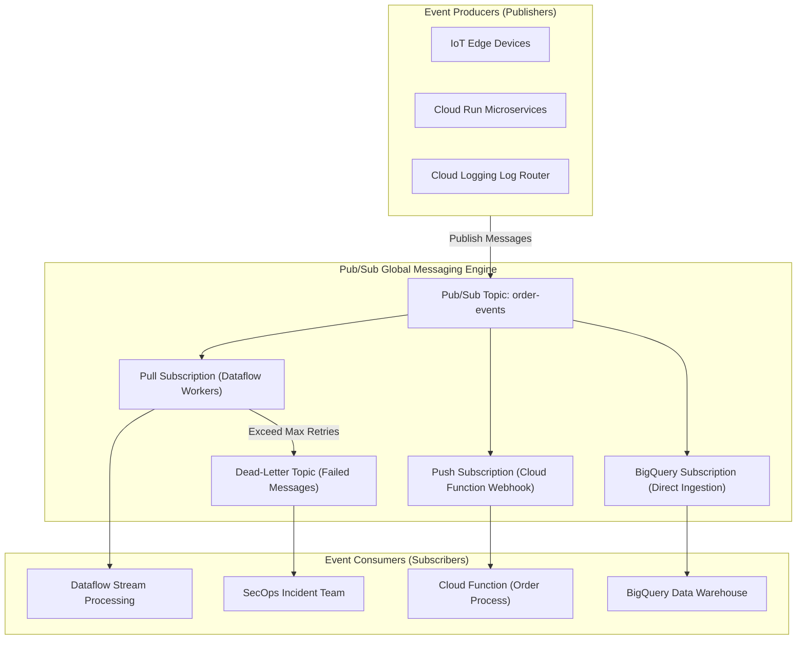

# Topic 114: Pub/Sub

---

## 1. What Is It?

**Google Cloud Pub/Sub** is a fully managed, serverless, highly available, global asynchronous messaging and event ingestion middleware service on Google Cloud Platform. It decouples event producers (publishers) from event consumers (subscribers), enabling real-time streaming data pipelines, event-driven microservices, and log ingestion at massive scale with low latency.

Pub/Sub delivers four core messaging architecture primitives:
1. **At-Least-Once Delivery**: Guarantees that published messages are delivered to subscribers at least once, buffering un-acknowledged messages for up to 7 days.
2. **Push and Pull Delivery Models**: Flexible message consumption via long-polling (Pull), Push (HTTP POST webhooks to Cloud Run/Functions), or Direct BigQuery/GCS ingestion subscriptions.
3. **Strict Message Ordering**: Optional ordering keys ensuring messages with matching keys are delivered to subscribers in the exact sequence they were published.
4. **Dead-Letter Queues (DLQ) & Seeking**: Routes failed un-acknowledgeable messages to dead-letter topics for debugging, and allows subscribers to "seek" back in time to replay historical message streams.

### Real-World Analogy
Think of Pub/Sub like a global newspaper publishing and home delivery network:
- **Direct Synchronous Calls (Old Method)**: A newspaper reporter calling 500,000 individual subscriber homes on the telephone every morning to read them the news. If a subscriber is asleep or doesn't answer, they miss the news permanently.
- **Pub/Sub**: The reporter posts breaking news stories to a central printing press topic (Publisher -> Topic). The printing press automatically distributes copies to local newsstands (Push Subscriptions to Webhooks) or holds paper copies in subscriber mailboxes (Pull Subscriptions). Subscribers read the paper at their own pace (Asynchronous Consumption), and if a dog chews up a paper (Delivery Failure), the carrier delivers a replacement copy (Dead-Letter Queue / Replay).

---

## 2. Where Does It Fit?

Pub/Sub sits at the core of GCP event-driven architectures, acting as the universal buffer connecting data producers to processing sinks.



---

## 3. Core Concepts

| Concept | Description | Production Best Practice |
|---|---|---|
| **Topic** | Named resource to which publishers send messages. | Use clear domain naming conventions (e.g., `telemetry-events-prod`). |
| **Subscription** | Resource representing the stream of messages from a single specific topic to be delivered to a subscriber. | Create separate subscriptions for independent consumer applications. |
| **Ack / Nack** | Subscriber signals confirming message processing success (Ack) or failure (Nack). | Set appropriate `ackDeadline` (default 10s, up to 600s) based on processing duration. |
| **Push vs Pull** | **Push**: Pub/Sub calls an HTTP POST endpoint. **Pull**: Subscriber initiates gcloud/API request. | Use Push for serverless webhooks; use Pull for high-throughput batch consumers. |
| **Dead-Letter Queue** | Secondary topic storing messages that fail subscriber processing after $N$ retry attempts. | Always attach Dead-Letter Queues to production subscriptions to catch poisoned messages. |

---

## 4. How It Works

Message publishing, buffering, and subscription processing operate through decoupled async steps:

```text
1. Publisher sends Message Payload (Bytes + Attributes) to Topic
                               ↓
2. Pub/Sub stores message globally -> Replicates across zones for High Availability
                               ↓
3. Message fan-out to all attached Subscriptions (Pull, Push, BigQuery)
                               ↓
4. Subscriber receives message -> Processes payload -> Returns Acknowledgement (ACK)
                               ↓
5. Pub/Sub deletes ACKed message from Subscription buffer
```

1. **Independent Fan-Out**: Adding a new subscription to a topic creates a 100% independent copy of the message stream without impacting existing subscribers.
2. **Direct BigQuery Subscriptions**: Writes incoming streaming JSON messages directly into BigQuery tables without requiring intermediate Dataflow or Cloud Function code.

---

## 5. Production Scenario

### Enterprise Order Event Pipeline with Dead-Letter Handling and BigQuery Streaming

```text
Requirement: Build a high-throughput order processing event pipeline using Pub/Sub that routes order events to a Cloud Run webhook, streams raw orders directly into BigQuery, and routes failed poison messages to a Dead-Letter Queue.
    ↓
Architecture: Pub/Sub Topic + Push Subscription + BigQuery Direct Subscription + Dead-Letter Topic.
    ↓
Step 1: Create Dead-Letter Topic & Main Order Topic:
    gcloud pubsub topics create order-dlq-topic
    gcloud pubsub topics create order-events-topic
    ↓
Step 2: Create BigQuery Direct Ingestion Subscription:
    gcloud pubsub subscriptions create order-bq-sub \
      --topic=order-events-topic \
      --bigquery-table=proj.ds.orders_table \
      --write-metadata
    ↓
Step 3: Create Push Subscription with DLQ configuration:
    gcloud pubsub subscriptions create order-push-sub \
      --topic=order-events-topic \
      --push-endpoint="https://order-processor-uc.a.run.app/events" \
      --dead-letter-topic=order-dlq-topic \
      --max-delivery-attempts=5 \
      --ack-deadline=30
    ↓
Result: Decoupled event-driven system with zero-code BigQuery ingestion and automatic isolation of corrupted payloads.
```

*Why Selected*: Illustrates advanced enterprise Pub/Sub patterns including zero-code BigQuery ingestion and Dead-Letter Queues.

---

## 6. Hands-On Lab

### Prerequisites
- Active GCP Project with Pub/Sub API enabled.
- Cloud Shell or local machine with `gcloud` CLI installed.

### CLI Method

```bash
# 1. Environment configuration
export PROJECT_ID=$(gcloud config get-value project)
export TOPIC_NAME="lab-orders-topic"
export SUB_NAME="lab-orders-sub"

# 2. Enable Pub/Sub API
gcloud services enable pubsub.googleapis.com

# 3. Create Pub/Sub Topic
gcloud pubsub topics create ${TOPIC_NAME}

# 4. Create Pull Subscription attached to the Topic
gcloud pubsub subscriptions create ${SUB_NAME} \
  --topic=${TOPIC_NAME} \
  --ack-deadline=30

# 5. Publish test messages to the Topic
gcloud pubsub topics publish ${TOPIC_NAME} --message="Order #1001 Created" --attribute="event_type=order_created,priority=high"
gcloud pubsub topics publish ${TOPIC_NAME} --message="Order #1002 Created" --attribute="event_type=order_created,priority=normal"

# 6. Pull and acknowledge messages using gcloud CLI
gcloud pubsub subscriptions pull ${SUB_NAME} --auto-ack --limit=5
```

### Verification
Execute the `gcloud pubsub subscriptions pull` command above and verify the output displays `"Order #1001 Created"` and `"Order #1002 Created"`.

### Cleanup

```bash
gcloud pubsub subscriptions delete ${SUB_NAME} --quiet
gcloud pubsub topics delete ${TOPIC_NAME} --quiet
```

---

## 7. Security

### Pub/Sub IAM & Transport Security
- **Publisher & Subscriber Roles**: Restrict event publishers to `roles/pubsub.publisher` and subscribers to `roles/pubsub.subscriber` on specific topics/subscriptions.
- **Push Endpoint Authentication**: Configure Push subscriptions to attach Google-signed OIDC ID tokens, requiring target HTTP webhooks (Cloud Run) to validate the token.
- **CMEK Encryption**: Protect Pub/Sub topics at rest using Customer-Managed Encryption Keys in Cloud KMS.

```text
BAD PRACTICE:
Exposing un-authenticated public HTTP webhooks as Pub/Sub Push targets without verifying Google OIDC identity tokens.

PRODUCTION PRACTICE:
Enforce least-privilege IAM roles, protect topics using CMEK encryption, and require Service Account OIDC tokens on Push subscriptions.
```

---

## 8. Scaling & High Availability

Pub/Sub global buffer scaling mechanics:

```text
Publisher Stream (1,000,000 messages / sec -> Sudden Traffic Burst)
                       ↓
Pub/Sub Global Ingestion Layer (Auto-Scales Horizontally Across All GCP Regions)
                       ↓
Buffers Un-Acked Messages Globally (Up to 7 Days Retention)
                       ↓
Subscribers Pull / Process at Safe Controlled Rate (Protects Backend Databases from Spikes)
```

- **Traffic Spike Buffering**: Pub/Sub absorbs massive ingestion surges, allowing downstream database systems (Cloud SQL, BigQuery) to process data at a steady, controlled rate without crashing.

---

## 9. Cost

### Pub/Sub Pricing Structure

| Component | Free Monthly Allowance | Paid Rate |
|---|---|---|
| **Data Volume Ingestion / Delivery** | 10 GiB per month FREE | $40.00 per TiB (~$0.04 per GB) |
| **BigQuery & Storage Subscriptions** | Standard Pub/Sub rates | Data volume ingestion rates apply |
| **Seek Feature / Retained Messages** | 100% FREE | Included free in Pub/Sub storage |

---

## 10. Monitoring & Troubleshooting

### Operational Telemetry & Troubleshooting
- **Cloud Monitoring Metrics**: Monitor `pubsub.googleapis.com/subscription/num_undelivered_messages` (Backlog Size) and `pubsub.googleapis.com/subscription/oldest_unacked_message_age`.
- **Seek / Replay**: Use `gcloud pubsub subscriptions seek` to rewind a subscription's cursor back to a specific timestamp to reprocess past events.

### Troubleshooting Matrix

| Symptom | Cause | Resolution |
|---|---|---|
| Undelivered message backlog growing steadily | Subscribers processing slower than publish rate or hanging | Increase subscriber container count or increase parallel workers. |
| Push subscription receiving HTTP 403 / 401 | Push endpoint missing authentication or invalid SA token | Verify OIDC service account token settings on Push subscription. |
| Duplicate message processing in app | Subscriber processing took longer than `ackDeadline` | Increase `ackDeadline` (e.g., from 10s to 60s) or make app idempotent. |

---

## 11. Common Mistakes

```text
Mistake: Assuming Pub/Sub guarantees Exactly-Once delivery in standard pull subscriptions.
Why: Expecting traditional single-consumer queue behavior.
Impact: Subscriber application breaks or creates duplicate database records when transient network retries deliver duplicate messages.
Correct Approach: Design subscriber application processing to be idempotent (e.g., deduplicating by message ID or order ID).

Mistake: Leaving `ackDeadline` at the default 10 seconds for long-running subscriber tasks (e.g., 45-second image processing).
Why: Not tuning subscription settings for workload duration.
Impact: Pub/Sub assumes subscriber crashed after 10 seconds, re-delivering the message to another worker repeatedly while the first worker is still processing.
Correct Approach: Increase `ackDeadline` to 60s or use dynamic ACK extension in client SDKs.
```

---

## 12. Production Best Practices

- [ ] Design subscriber applications to be **Idempotent** (handle duplicate messages safely).
- [ ] Attach **Dead-Letter Queues (DLQ)** to all production subscriptions.
- [ ] Set **`ackDeadline`** appropriate for application processing duration.
- [ ] Monitor **Un-acknowledged Message Backlog** and **Oldest Un-acked Message Age**.
- [ ] Use **Direct BigQuery Subscriptions** for zero-code data warehouse ingestion.
- [ ] Secure Push subscriptions with **Service Account OIDC Tokens**.

---

## 13. Hyperscaler / Enterprise Perspective

```text
Personal / Learning
  Single Topic & Subscription → Manual CLI Pull → Basic In-Memory Messages
        ↓
Small Production
  Push Subscriptions to Cloud Run → Dead-Letter Queue Setup → Basic Cloud Monitoring Alerts
        ↓
Enterprise Environment
  Direct BigQuery Subscriptions → OIDC Token Auth → Strict Message Ordering Keys
        ↓
Hyperscaler Environment
  Petabyte-Scale Ingestion Stream → Global Cross-Region Event Mesh → Automated Seek/Replay Incident Playbooks
```

Enterprise hyperscalers leverage **Pub/Sub Schema Validation** (Avro / Protocol Buffers), enforcing strict data contracts on topics so publishers cannot push corrupted or ill-formatted JSON payloads into downstream pipelines.

---

## 14. Real Project Questions

### Q1: What is the technical difference between At-Least-Once delivery and Message Ordering in Pub/Sub?
**Answer:** **At-Least-Once Delivery** guarantees that every published message is delivered to subscribers, but messages may arrive out of order or be delivered more than once due to network retries. **Message Ordering** guarantees that messages sharing the same `ordering_key` are delivered to subscribers in the exact order they were published, though at-least-once delivery semantics still apply.

### Q2: How does a Pub/Sub Dead-Letter Queue (DLQ) prevent "poison pill" messages from degrading application performance?
**Answer:** A "poison pill" message is a corrupted payload that causes subscriber code to crash continuously. A Dead-Letter Queue tracks delivery attempts (`maxDeliveryAttempts`). If a message fails processing $N$ times (e.g., 5 retries), Pub/Sub automatically moves the message out of the main subscription queue into the Dead-Letter Topic, preventing worker crashes and allowing SREs to inspect the corrupted payload safely.

### Q3: Why is Direct BigQuery Ingestion Subscription superior to writing a custom Cloud Function to load Pub/Sub data into BigQuery?
**Answer:** Direct BigQuery Subscriptions are fully managed and zero-code. Pub/Sub streams incoming JSON messages directly into BigQuery tables without requiring Cloud Functions or Dataflow code, eliminating serverless execution costs, reducing pipeline latency, and eliminating custom code maintenance.

---

## 15. Quick Decision Guide

| Event Requirement | Recommended Pub/Sub Feature | Advantage |
|---|---|---|
| Serverless HTTP Webhook Triggers | Push Subscription + Cloud Run | Serverless HTTP invocation with built-in auto-scaling. |
| Zero-Code Data Warehouse Ingestion | BigQuery Subscription | Direct high-throughput streaming into BigQuery tables. |
| High-Throughput Batch Stream Processing | Pull Subscription + Dataflow | Scalable long-polling for Apache Beam pipelines. |

### When to Use Pub/Sub
- Essential for event-driven microservices, real-time log ingestion, asynchronous background processing, and buffering traffic spikes.

### When NOT to Use Pub/Sub
- Synchronous request-response RPC calls requiring immediate sub-5ms return payloads (use Direct gRPC/REST APIs).

---

## 16. Related Services

```text
                     [114. Pub/Sub]
                    /       |      \
        Cloud Run / Functions  Dataflow   BigQuery
        (Push Webhooks)    (Stream Proc) (Direct Storage)
               |                |             |
        Invokes Async      Processes Complex Direct Zero-Code
        Microservices      Windowing Streams Ingestion
```

- **Cloud Run / Cloud Functions**: Serverless computing runtimes acting as Push subscribers.
- **Dataflow**: Stream processing engine (Apache Beam) processing Pub/Sub message streams.
- **BigQuery**: Target data warehouse receiving direct Pub/Sub streaming subscriptions.

---

## 17. Cheat Sheet

### Common gcloud Pub/Sub Commands

```bash
# Create a Pub/Sub Topic
gcloud pubsub topics create my-topic

# Create a Pull Subscription
gcloud pubsub subscriptions create my-pull-sub --topic=my-topic --ack-deadline=60

# Create a Push Subscription targeting Cloud Run
gcloud pubsub subscriptions create my-push-sub --topic=my-topic --push-endpoint="https://my-app.a.run.app" --push-auth-service-account="sa@proj.iam.gserviceaccount.com"

# Create a Dead-Letter Queue Subscription
gcloud pubsub subscriptions create my-main-sub --topic=my-topic --dead-letter-topic=my-dlq-topic --max-delivery-attempts=5

# Seek a subscription back 1 hour in time
gcloud pubsub subscriptions seek my-pull-sub --time=$(date -u -d '1 hour ago' +%Y-%m-%dT%H:%M:%SZ)
```

---

## 18. Learning Connection

- **Previous Topic**: [113. BigQuery](../113-bigquery/README.md)
- **Next Topic**: [115. Dataflow](../115-dataflow/README.md)
