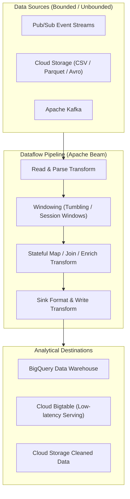

# Topic 115: Dataflow

---

## 1. What Is It?

**Google Cloud Dataflow** is a fully managed, serverless, highly scalable stream and batch data processing service on Google Cloud Platform powered by the open-source **Apache Beam** SDK. It enables data engineers to execute complex Extract-Transform-Load (ETL), real-time event streaming, stateful windowing, and continuous data enrichment pipelines with zero cluster management.

Dataflow delivers four core data processing capabilities:
1. **Unified Batch & Stream Programming**: Single Apache Beam programming model (Java, Python, Go) executing identically against bounded batch files or unbounded real-time event streams.
2. **Serverless Dynamic Autoscaling**: Automatically provisions, scales, and balances compute worker instances (vCPUs) up and down dynamically based on throughput pressure and backlog depth.
3. **Advanced Windowing & Triggering**: Native support for Fixed, Sliding, and Session windows, processing late-arriving data using watermarks and triggers.
4. **Dataflow Prime & Flex Templates**: Advanced resource optimization engine offering compute/memory autoscaling per step and reusable, versioned pipeline templates.

### Real-World Analogy
Think of Dataflow like a high-speed automated water purification and bottling plant:
- **Un-managed Data Processing (Manual Scripting)**: Workers carrying buckets of muddy river water (Raw Event Logs) to a single manual filter. If a flood occurs (Data Spike), the workers are overwhelmed, water overflows, and purification halts.
- **Dataflow**: An automated purification plant. Water flows continuously through multi-stage filters (Apache Beam Transforms). The plant automatically scales up 50 extra robotic filtration pipes during heavy rains (Dynamic Autoscaling), groups water samples into 5-minute quality control batches (Windowing), reroutes contaminated water (Dead-Letter Sinks), and fills sealed glass bottles (BigQuery Tables) at maximum velocity—billing only for the exact volume of water processed.

---

## 2. Where Does It Fit?

Dataflow acts as the core stream and batch processing engine connecting data ingestion platforms to storage and analytics warehouses.



---

## 3. Core Concepts

| Concept | Description | Production Best Practice |
|---|---|---|
| **Pipeline** | Directed Acyclic Graph (DAG) of data processing steps written using the Apache Beam SDK. | Keep pipeline logic modular using reusable `PTransform` blocks. |
| **PCollection** | Immutable, parallel dataset processed by a pipeline (Bounded for Batch, Unbounded for Stream). | Use schemas on `PCollection` for optimized binary serialization. |
| **DoFn / ParDo** | Processing function applied to each element in a `PCollection` (`ParDo` executes `DoFn`). | Avoid global state inside `DoFn`; keep element processing idempotent. |
| **Watermark** | Monotonically increasing timestamp tracking how far lagging data is in an unbounded stream. | Configure allowed lateness handling for out-of-order event streams. |
| **Flex Templates** | Containerized pipeline blueprints stored in Artifact Registry for reusable job submission. | Use Flex Templates for standardized enterprise CI/CD deployment pipelines. |

---

## 4. How It Works

Dataflow job execution, graph optimization, and autoscaling proceed through a managed control plane:

```text
Apache Beam Code compiled -> Graph submitted to Dataflow Service
                               ↓
Dataflow constructs execution DAG -> Optimizes step fusion (Combines ParDo transforms)
                               ↓
Dynamic Autoscaling provisions Worker VMs (e2-standard-4) in VPC
                               ↓
Streams/Batches data through DAG -> Dynamic Work Rebalancing distributes work chunks
                               ↓
Outputs results to BigQuery/Bigtable -> Destroys Worker VMs upon batch job completion
```

1. **Transform Fusion**: Dataflow automatically merges multiple adjacent Beam transforms into a single execution step to eliminate network serialization overhead between workers.
2. **Dynamic Work Rebalancing**: If a single worker VM gets stuck processing a heavy data partition ("straggler"), Dataflow dynamically splits the remaining work chunks and redistributes them to idle workers.

---

## 5. Production Scenario

### Real-Time Pub/Sub to BigQuery Streaming Pipeline with Sliding Windows and DLQ

```text
Requirement: Build a real-time event processing pipeline that ingests JSON clickstream events from Pub/Sub, calculates 5-minute sliding window event counts per user, routes malformed records to Cloud Storage, and writes aggregated metrics to BigQuery.
    ↓
Architecture: Pub/Sub + Dataflow (Apache Beam Python/Java) + BigQuery + GCS DLQ.
    ↓
Step 1: Write Apache Beam Pipeline in Python (`pipeline.py`):
    import apache_beam as beam
    from apache_beam.options.pipeline_options import PipelineOptions

    options = PipelineOptions(streaming=True, runner='DataflowRunner', project='proj', region='us-central1')
    with beam.Pipeline(options=options) as p:
        (p
         | 'ReadFromPubSub' >> beam.io.ReadFromPubSub(subscription='projects/proj/subscriptions/click-sub')
         | 'ParseJSON' >> beam.ParDo(ParseAndValidateFn()).with_outputs('dead_letter', main='valid')
         | 'Window5Min' >> beam.WindowInto(beam.window.SlidingWindows(size=300, period=60))
         | 'CountPerUser' >> beam.CombinePerKey(sum)
         | 'WriteToBigQuery' >> beam.io.WriteToBigQuery('proj:ds.user_metrics'))
    ↓
Step 2: Submit job via Dataflow Flex Template.
    ↓
Result: Fully autoscaling, fault-tolerant real-time stream processing pipeline with 5-minute sliding metrics and zero server management.
```

*Why Selected*: Illustrates standard enterprise streaming architecture utilizing windowing, custom transforms, and dead-letter routing.

---

## 6. Hands-On Lab

### Prerequisites
- Active GCP Project with Dataflow, Compute Engine, and Cloud Storage APIs enabled.
- Cloud Shell or local machine with `gcloud` CLI installed.

### CLI Method

```bash
# 1. Environment configuration
export PROJECT_ID=$(gcloud config get-value project)
export REGION="us-central1"
export BUCKET_NAME="df-lab-${PROJECT_ID}"

# 2. Enable Dataflow, Compute, and Storage APIs
gcloud services enable dataflow.googleapis.com compute.googleapis.com storage.googleapis.com

# 3. Create GCS bucket for staging and temp files
gcloud storage buckets create gs://${BUCKET_NAME} --location=${REGION}

# 4. Run a pre-built Google-provided Dataflow Batch Template (Text to BigQuery)
gcloud dataflow jobs run lab-wordcount-job \
  --gcs-location="gs://dataflow-templates-${REGION}/latest/Word_Count" \
  --region=${REGION} \
  --staging-location="gs://${BUCKET_NAME}/staging" \
  --parameters inputFile="gs://dataflow-samples/shakespeare/kinglear.txt",output="gs://${BUCKET_NAME}/counts"

# 5. List running/completed Dataflow jobs
gcloud dataflow jobs list --region=${REGION}
```

### Verification
Execute `gcloud dataflow jobs list --region=${REGION}` and verify `lab-wordcount-job` is listed with state `JOB_STATE_RUNNING` or `JOB_STATE_DONE`.

### Cleanup

```bash
gcloud storage rm --recursive gs://${BUCKET_NAME}
```

---

## 7. Security

### Dataflow Worker Security & Privacy
- **Private Worker IP Addresses**: Configure `--no-use-public-ips` so Dataflow worker VMs do not require public IP addresses, routing internal traffic via VPC Service Controls.
- **Dedicated Service Account**: Run Dataflow jobs using a dedicated user-managed Service Account with minimal IAM roles (`roles/dataflow.worker` + source/sink roles).
- **CMEK Encryption**: Encrypt temporary Dataflow disk storage and pipeline state using Cloud KMS CMEK keys.

```text
BAD PRACTICE:
Running Dataflow pipelines using default Compute Engine service accounts with public IP addresses enabled on worker VMs.

PRODUCTION PRACTICE:
Use `--no-use-public-ips`, specify custom VPC subnets, grant `roles/dataflow.worker` to dedicated service accounts, and encrypt temp disks with CMEK.
```

---

## 8. Scaling & High Availability

Dataflow dynamic worker scaling architecture:

```text
Unbounded Streaming Source (Pub/Sub Event Backlog Spikes to 5,000,000 Messages)
                               ↓
Dataflow Autoscaler detects target backlog duration violation (>30 seconds)
                               ↓
Scales Worker Pool up from 5 VMs to 50 VMs (e2-standard-4) automatically
                               ↓
Backlog cleared -> CPU utilization drops -> Scales Worker Pool back down to 5 VMs
```

- **Dataflow Prime**: Upgrade jobs to **Dataflow Prime** for vertical resource autoscaling (adjusting RAM/vCPU dynamically per pipeline step) to eliminate out-of-memory errors on un-even data distributions.

---

## 9. Cost

### Dataflow Pricing Economics

| Resource Type | Dataflow Batch Rate | Dataflow Streaming Rate |
|---|---|---|
| **vCPU-Hour** | ~$0.056 per vCPU-hour | ~$0.069 per vCPU-hour |
| **Memory-Hour (GB)** | ~$0.0035 per GB-hour | ~$0.0045 per GB-hour |
| **Persistent Disk (GB)** | ~$0.000054 per GB-hour | ~$0.000054 per GB-hour |
| **Dataflow Prime Compute** | Dataflow Capacity Units (DCUs) | Dataflow Capacity Units (DCUs) |

---

## 10. Monitoring & Troubleshooting

### Pipeline Telemetry & Debugging
- **Dataflow Execution Details UI**: Visualize step-by-step wall time, system lag, data freshness, and element throughput in the GCP Console.
- **System Lag Metric**: Track `dataflow.googleapis.com/job/system_lag` to measure processing delay on streaming pipelines.

### Troubleshooting Matrix

| Symptom | Cause | Resolution |
|---|---|---|
| Streaming pipeline system lag increasing | Worker pool capacity constrained or expensive DB queries in `DoFn` | Increase `--max-num-workers` or optimize external API calls using batching. |
| Job fails with `OutofMemoryError` | Large elements or un-bounded in-memory accumulators inside `ParDo` | Upgrade to Dataflow Prime or increase `--worker-machine-type` RAM. |
| Pipeline stuck in `JOB_STATE_PENDING` | Quota exceeded for vCPUs or IP addresses in target region | Request quota increase for `CPUS` or enable `--no-use-public-ips`. |

---

## 11. Common Mistakes

```text
Mistake: Executing synchronous external HTTP or SQL database calls inside a `ParDo` transform without batching.
Why: Enriching data records individually.
Impact: Creates severe network bottlenecks, stalling Dataflow worker threads and exploding pipeline latency.
Correct Approach: Use Beam `GroupIntoBatches` or asynchronous I/O transforms to batch external API calls.

Mistake: Storing mutable global state variables inside `DoFn` class instances.
Why: Assuming a single Python/Java process handles all elements.
Impact: Dataflow distributes elements across hundreds of parallel worker VMs; global process variables lead to corrupted or inconsistent state calculations.
Correct Approach: Use Beam State & Timers API (`ReadModifyWriteState`) for stateful element processing.
```

---

## 12. Production Best Practices

- [ ] Write modular, reusable pipeline transforms using **Apache Beam SDK**.
- [ ] Run workers in private VPC subnets with **`--no-use-public-ips`**.
- [ ] Assign dedicated Service Accounts with **`roles/dataflow.worker`**.
- [ ] Use **Flex Templates** stored in Artifact Registry for CI/CD deployments.
- [ ] Monitor **System Lag** and **Data Freshness** metrics on streaming jobs.
- [ ] Handle corrupt data using **Side Outputs / Dead-Letter Sinks**.

---

## 13. Hyperscaler / Enterprise Perspective

```text
Personal / Learning
  Local Runner → Single CSV File → Direct Console Job Execution
        ↓
Small Production
  DataflowRunner → Pub/Sub to BigQuery Streaming → Standard Autoscaling
        ↓
Enterprise Environment
  Flex Templates in CI/CD → Private Worker Subnets → CMEK Temp Encryption
        ↓
Hyperscaler Environment
  Dataflow Prime Vertical Autoscaling → Cross-Region High Availability Pipelines → Automated Multi-Tier Dead-Letter Remediation
```

Enterprise hyperscalers deploy **Dataflow Flex Templates** integrated with Cloud Build pipelines, enabling data teams to version control, test, and release stream processing pipelines across `dev`, `staging`, and `prod` GCP environments cleanly.

---

## 14. Real Project Questions

### Q1: What is the core advantage of the Apache Beam unified programming model in Dataflow?
**Answer:** Apache Beam provides a unified API abstractions layer for both batch (bounded) and streaming (unbounded) data processing. Developers write pipeline logic once in Java, Python, or Go, and it executes identically over historical batch files or real-time event streams simply by changing input sources and pipeline execution options.

### Q2: What is "Transform Fusion" in Dataflow and how does it optimize performance?
**Answer:** Transform Fusion is an automated optimization performed by the Dataflow service during execution graph construction. Dataflow fuses multiple sequential `ParDo` transforms into a single execution step running inside worker VM memory, eliminating expensive intermediate network serialization and disk I/O between pipeline steps.

### Q3: How does Dataflow handle late-arriving data in streaming pipelines?
**Answer:** Dataflow uses **Event Time Watermarks** and **Windowing Triggers**. Watermarks track expected event time progress in an unbounded stream. When late data arrives after a window's watermark has passed, Beam triggers allow developers to specify whether to accumulate, retract, or process late elements using allowed lateness rules.

---

## 15. Quick Decision Guide

| Data Processing Requirement | Recommended GCP Tool | Benefit |
|---|---|---|
| Unified Stream & Batch ETL Pipelines | Dataflow (Apache Beam) | Serverless autoscaling with advanced windowing & watermarks. |
| Managed Apache Spark / Hadoop Jobs | Dataproc | Migration path for existing open-source Spark/Hadoop code. |
| Simple Declarative Event Transformation | BigQuery Continuous Queries / PubSub Sub | Zero-code direct streaming transformations. |

### When to Use Dataflow
- Mandatory for complex real-time event streaming, stateful windowing, large-scale ETL pipelines, and Apache Beam workloads on GCP.

### When NOT to Use Dataflow
- Simple file copies or direct database loads (use Storage Transfer Service or BigQuery Data Transfer Service).

---

## 16. Related Services

```text
                     [115. Dataflow]
                    /       |       \
          Pub/Sub      Apache Beam   BigQuery
        (Stream Source) (SDK Engine) (Data Sink)
               |            |            |
          Ingests Raw   Processes    Stores Processed
          Event Stream  Transforms   Analytical Data
```

- **Pub/Sub**: Ingestion source platform feeding real-time streams into Dataflow.
- **Apache Beam**: Open-source SDK framework used to author Dataflow pipelines.
- **BigQuery**: Primary analytical data warehouse sink for Dataflow pipeline outputs.

---

## 17. Cheat Sheet

### Common gcloud Dataflow Commands

```bash
# List active Dataflow jobs in a region
gcloud dataflow jobs list --region=us-central1

# Cancel a running Dataflow job gracefully
gcloud dataflow jobs cancel JOB_ID --region=us-central1

# Drain a streaming Dataflow job (stop accepting new data & finish in-flight elements)
gcloud dataflow jobs drain JOB_ID --region=us-central1

# Run a Flex Template pipeline from Artifact Registry
gcloud dataflow flex-template run my-job \
  --template-file-gcs-location="gs://my-bucket/templates/my-template.json" \
  --region=us-central1 \
  --parameters inputSubscription="projects/PROJ/subscriptions/SUB",outputTable="PROJ:ds.tbl"
```

---

## 18. Learning Connection

- **Previous Topic**: [114. Pub/Sub](../114-pubsub/README.md)
- **Next Topic**: [116. Dataproc](../116-dataproc/README.md)
