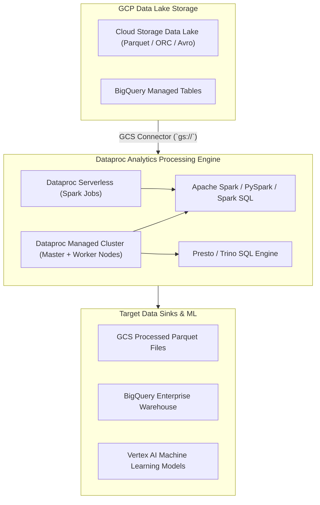

# Topic 116: Dataproc

---

## 1. What Is It?

**Google Cloud Dataproc** is a fully managed, highly scalable Apache Spark, Apache Hadoop, Presto, and open-source big data cluster processing service on Google Cloud Platform. It enables organizations to run open-source data processing, machine learning, and analytical workloads seamlessly without needing to manage physical server hardware or complex open-source cluster installations.

Dataproc delivers four core big data architecture capabilities:
1. **Sub-Minute Cluster Provisioning**: Provisions, configures, and boots fully operational multi-node Spark/Hadoop clusters in under 90 seconds.
2. **Ephemeral Cluster Paradigm**: Encourages creating short-lived, job-scoped clusters that boot, execute a Spark job, write results to Cloud Storage/BigQuery, and immediately self-delete to minimize costs.
3. **Dataproc Serverless for Spark**: Fully serverless execution model allowing developers to run PySpark, Spark SQL, or Spark Java workloads without managing clusters, master nodes, or worker VM sizes.
4. **GCS Connector Integration**: Replaces traditional HDFS (Hadoop Distributed File System) with Cloud Storage (`gs://`), decoupling storage from compute nodes and allowing clusters to be shut down without data loss.

### Real-World Analogy
Think of Dataproc like a fleet of heavy-duty construction excavators for a major earth-moving project:
- **On-Premises Hadoop (Buying & Owning Excavators)**: Purchasing 50 massive excavators, building a permanent garage to store them, hiring full-time mechanics to maintain them year-round, and paying insurance even when no digging is happening.
- **Dataproc (Ephemeral Fleet Rental)**: Renting a fleet of 50 excavators by the minute. When a hill needs to be cleared (Spark Job), the excavators arrive on-site within 90 seconds, dig the hill, load dirt into trucks (Cloud Storage), and return to the rental agency immediately—billing strictly for the exact 15 minutes of digging time.

---

## 2. Where Does It Fit?

Dataproc processes large-scale open-source analytics jobs, connecting Cloud Storage data lakes to enterprise analytical databases.



---

## 3. Core Concepts

| Concept | Description | Production Best Practice |
|---|---|---|
| **Ephemeral Cluster** | Temporary cluster created for a specific job execution and deleted immediately upon job completion. | Always use ephemeral clusters for batch processing jobs to minimize idle node costs. |
| **Dataproc Serverless** | Serverless Spark execution engine running PySpark/Spark SQL jobs with zero cluster setup. | Use Dataproc Serverless for new Spark workloads to eliminate cluster management. |
| **GCS Connector** | Native Java library enabling Spark/Hadoop to read/write directly from Cloud Storage (`gs://`). | Replace HDFS with Cloud Storage (`gs://`) for all persistent data storage. |
| **Primary vs Secondary Workers** | Primary workers run HDFS/YARN; Secondary workers are preemptible/Spot VMs running compute-only. | Use Spot VMs for Secondary Worker nodes to cut cluster compute costs by up to 80%. |
| **Initialization Actions** | Custom bash scripts executed on master/worker nodes during cluster creation. | Use initialization actions to install custom Python libraries or system dependencies. |

---

## 4. How It Works

Ephemeral cluster job execution follows a rapid 4-step automated lifecycle:

```text
1. Trigger Job -> Dataproc API receives Spark job submission
                       ↓
2. Provision Ephemeral Cluster -> Boots Master VM + Worker VMs in ~90 seconds
                       ↓
3. Execute Spark Job -> Reads data from GCS via Connector -> Executes PySpark / Spark SQL
                       ↓
4. Write Results to GCS / BigQuery -> Delete Ephemeral Cluster -> Stop Compute Billing
```

1. **Decoupled HDFS Storage**: Using Cloud Storage instead of HDFS allows clusters to scale worker nodes up or down dynamically during job execution without causing HDFS block corruption.
2. **Auto-zone Placement**: Dataproc can automatically select the GCP zone within a region with the highest compute capacity and lowest Spot VM preemption rates.

---

## 5. Production Scenario

### Ephemeral PySpark Data Lake Processing with Spot Workers and BigQuery Sink

```text
Requirement: Process 5 TB of raw nightly log files stored in Cloud Storage using PySpark, transform the data into parquet format, write to BigQuery, and ensure cluster costs are minimized.
    ↓
Architecture: Airflow / Cloud Composer + Dataproc Ephemeral Cluster + Spot Secondary Workers + BigQuery Connector.
    ↓
Step 1: Write PySpark transformation script (`transform.py`) and upload to `gs://my-code-bucket/`.
Step 2: Submit Dataproc workflow template or gcloud job submission:
    gcloud dataproc jobs submit pyspark gs://my-code-bucket/transform.py \
      --cluster=ephemeral-spark-cluster \
      --region=us-central1 \
      --jars=gs://spark-lib/bigquery/spark-bigquery-latest_2.12.jar \
      -- \
      --input=gs://raw-logs-bucket/2026-08-01/*.json \
      --output=proj:ds.cleaned_logs
    ↓
Step 3: Cluster automatically provisions e2-standard-4 master node + 10 Spot secondary worker nodes, executes job in 12 minutes, and deletes itself.
    ↓
Result: High-performance Spark batch ETL running at 80% discounted Spot rates with zero ongoing idle cluster maintenance costs.
```

*Why Selected*: Demonstrates native GCP big data pattern using ephemeral clusters, PySpark, and Spot secondary workers.

---

## 6. Hands-On Lab

### Prerequisites
- Active GCP Project with Dataproc, Compute Engine, and Cloud Storage APIs enabled.
- Cloud Shell or local machine with `gcloud` CLI installed.

### CLI Method

```bash
# 1. Environment configuration
export PROJECT_ID=$(gcloud config get-value project)
export REGION="us-central1"
export CLUSTER_NAME="lab-dataproc-cluster"
export BUCKET_NAME="dataproc-lab-${PROJECT_ID}"

# 2. Enable Dataproc, Compute Engine, and Cloud Storage APIs
gcloud services enable dataproc.googleapis.com compute.googleapis.com storage.googleapis.com

# 3. Create GCS staging bucket
gcloud storage buckets create gs://${BUCKET_NAME} --location=${REGION}

# 4. Create a lightweight Dataproc Cluster (1 Master, 2 Primary Workers)
gcloud dataproc clusters create ${CLUSTER_NAME} \
  --region=${REGION} \
  --single-node \
  --master-machine-type=e2-standard-2 \
  --bucket=${BUCKET_NAME}

# 5. Submit a sample PySpark job calculating Pi
gcloud dataproc jobs submit pyspark \
  --cluster=${CLUSTER_NAME} \
  --region=${REGION} \
  file:///usr/lib/spark/examples/src/main/python/pi.py 100
```

### Verification
Confirm the PySpark job command completes successfully and prints `"Pi is roughly 3.14159..."` in the console logs.

### Cleanup

```bash
gcloud dataproc clusters delete ${CLUSTER_NAME} --region=${REGION} --quiet
gcloud storage rm --recursive gs://${BUCKET_NAME}
```

---

## 7. Security

### Dataproc Security & Governance Controls
- **Internal IP Worker Nodes**: Deploy Dataproc clusters using `--no-address` so worker nodes execute inside private subnets without public IP exposure.
- **Dedicated Service Account**: Assign a user-managed Service Account (`roles/dataproc.worker`) to cluster nodes, restricting access to target GCS buckets and BigQuery datasets.
- **Kerberos & High Assurance**: Enable native Apache Hadoop Kerberos authentication and Ranger for enterprise multi-tenant data governance.

```text
BAD PRACTICE:
Deploying long-running, 24/7 Dataproc clusters with public IP addresses and default Compute Engine service accounts.

PRODUCTION PRACTICE:
Use Dataproc Serverless or Ephemeral Clusters with `--no-address` in private VPC subnets, using Spot secondary workers and GCS storage.
```

---

## 8. Scaling & High Availability

Dataproc cluster autoscaling architecture:

```text
Dataproc Cluster (Master Node + 2 Primary Workers)
                       ↓ (Dataproc Autoscaling Policy)
YARN Memory / Pending Jobs Metric Spikes -> Triggers Autoscaler
                       ↓
Dynamically Adds up to 100 Secondary Spot Worker Nodes (Compute Only)
                       ↓
Jobs Complete -> Scales Secondary Spot Workers Down to 0
```

- **Autoscaling Policies**: Attach Dataproc Autoscaling Policies to dynamically add secondary Spot worker nodes during YARN memory bottlenecks without risking cluster stability.

---

## 9. Cost

### Dataproc Pricing Structure

| Resource Component | Dataproc Fee | Underlying GCP Resource Fee |
|---|---|---|
| **Dataproc Management Fee** | $0.010 per vCPU-hour | Compute Engine VM rates apply |
| **Secondary Spot Worker Fee** | $0.010 per vCPU-hour | Spot VM rates (60-90% discount) |
| **Dataproc Serverless for Spark** | $0.050 per Data Compute Unit (DCU)-hour | Included in DCU rate |

---

## 10. Monitoring & Troubleshooting

### Cluster Telemetry & Diagnostic Tools
- **Cloud Monitoring Metrics**: Monitor `dataproc.googleapis.com/cluster/yarn/allocated_memory_percentage` and `dataproc.googleapis.com/cluster/job/completion_count`.
- **YARN & Spark Web UI**: Access Spark Application History UI via Component Gateway in the GCP Console.

### Troubleshooting Matrix

| Symptom | Cause | Resolution |
|---|---|---|
| PySpark job fails with `OutOfMemoryError` | YARN driver or executor memory underprovisioned | Add `--properties=spark.executor.memory=4g,spark.driver.memory=4g` to job submit command. |
| Job fails on initialization script | Script error or missing execution permissions | Inspect initialization script logs in GCS staging bucket. |
| Cluster creation fails due to IP limits | Target subnet lacks available private IP addresses | Expand subnet CIDR range or delete unused static IPs. |

---

## 11. Common Mistakes

```text
Mistake: Maintaining long-running, 24/7 static Dataproc clusters for daily batch processing jobs.
Why: Following legacy on-premises Hadoop patterns.
Impact: Pays full price for idle compute VM instances and storage disks overnight when no jobs are running.
Correct Approach: Use Ephemeral Clusters or Dataproc Serverless for Spark to provision compute strictly during job execution.

Mistake: Storing persistent application data inside HDFS on Dataproc local worker disks.
Why: Default Hadoop behavior.
Impact: When Dataproc clusters scale down or delete, all data stored in HDFS is permanently destroyed.
Correct Approach: Use Cloud Storage (`gs://`) for all persistent data lakes and storage files.
```

---

## 12. Production Best Practices

- [ ] Use **Ephemeral Clusters** or **Dataproc Serverless** for batch workloads.
- [ ] Store persistent data in **Cloud Storage (`gs://`)** instead of HDFS.
- [ ] Configure **Secondary Worker Nodes as Spot VMs** to reduce compute costs.
- [ ] Deploy clusters with **`--no-address`** inside private VPC subnets.
- [ ] Enable **Component Gateway** to access Spark History and YARN UIs securely.
- [ ] Use **Autoscaling Policies** to dynamically scale worker nodes based on YARN metrics.

---

## 13. Hyperscaler / Enterprise Perspective

```text
Personal / Learning
  Single-Node Cluster → Web Console Job Submit → Local HDFS Testing
        ↓
Small Production
  Standard 3-Node Cluster → Cloud Storage Input/Output → Manual Job Submission
        ↓
Enterprise Environment
  Ephemeral Clusters via Airflow (Cloud Composer) → Secondary Spot Worker Nodes → Component Gateway
        ↓
Hyperscaler Environment
  Dataproc Serverless Spark Pipelines → KMS CMEK Encrypted Ephemeral Disks → Kerberos / Ranger Governance Integration
```

Enterprise hyperscalers migrate legacy Apache Spark jobs to **Dataproc Serverless for Spark**, eliminating cluster administration entirely and allowing data engineers to submit raw PySpark scripts directly from CI/CD pipelines.

---

## 14. Real Project Questions

### Q1: What is an Ephemeral Dataproc Cluster and why is it recommended for batch ETL jobs?
**Answer:** An **Ephemeral Cluster** is a temporary Dataproc cluster created automatically for the sole purpose of executing a specific batch job (or workflow template) and deleted immediately upon job completion. It eliminates ongoing idle infrastructure costs by ensuring compute resources are billed strictly during active job processing.

### Q2: Why is Cloud Storage (`gs://`) used as a replacement for HDFS in Dataproc?
**Answer:** The GCP Cloud Storage Connector allows Spark and Hadoop to read and write directly to GCS using the `gs://` protocol. Decoupling storage from compute eliminates the need to maintain expensive persistent local HDFS disks, allows clusters to be shut down or resized freely, and offers 99.999999999% (11 9's) data durability.

### Q3: What is the purpose of Secondary Worker Nodes in Dataproc?
**Answer:** Secondary Worker Nodes are compute-only nodes that do not run HDFS NameNode or YARN DataNode services. Because they carry no persistent state, they can be provisioned as **Spot VMs** (at 60-90% discounts) and scaled up or down dynamically without risking HDFS data corruption if preempted.

---

## 15. Quick Decision Guide

| Analytics Workload | Recommended GCP Option | Advantage |
|---|---|---|
| Modern Open-Source PySpark / Spark SQL Jobs | Dataproc Serverless for Spark | Zero cluster setup, serverless auto-scaling execution. |
| Existing Legacy Hadoop / Presto Codebases | Dataproc Ephemeral Cluster | Full open-source tool compatibility with 90s provisioning. |
| Cloud-Native SQL Data Warehousing | BigQuery | Fully serverless ANSI SQL data warehouse with zero Spark code. |

### When to Use Dataproc
- Essential for migrating existing open-source Apache Spark, Hadoop, Hive, or Presto pipelines to GCP.

### When NOT to Use Dataproc
- New greenfield cloud data warehousing projects (use BigQuery for lower operational complexity).

---

## 16. Related Services

```text
                     [116. Dataproc]
                    /       |       \
        Cloud Storage   BigQuery   Cloud Composer
       (Data Lake gs://)(Warehouse) (Airflow Orchestration)
              |             |               |
        Stores Input/Output Connects Spark  Automates Ephemeral
        Data Files          to Warehouse    Cluster Jobs
```

- **Cloud Storage**: Primary data lake storage engine replacing HDFS.
- **BigQuery**: Enterprise warehouse target connected via Spark-BigQuery connector.
- **Cloud Composer**: Apache Airflow orchestration service submitting Dataproc workflows.

---

## 17. Cheat Sheet

### Common gcloud Dataproc Commands

```bash
# Submit a PySpark job to a Dataproc cluster
gcloud dataproc jobs submit pyspark gs://my-bucket/scripts/etl.py --cluster=my-cluster --region=us-central1

# Create a Dataproc cluster with Spot Secondary Workers
gcloud dataproc clusters create my-cluster \
  --region=us-central1 \
  --master-machine-type=e2-standard-4 \
  --worker-machine-type=e2-standard-4 \
  --num-workers=2 \
  --secondary-worker-type=spot \
  --num-secondary-workers=8

# Submit a Dataproc Serverless PySpark job (No Cluster Required)
gcloud dataproc batches submit pyspark gs://my-bucket/scripts/etl.py \
  --region=us-central1 \
  --deps-bucket=gs://my-bucket-staging
```

---

## 18. Learning Connection

- **Previous Topic**: [115. Dataflow](../115-dataflow/README.md)
- **Next Topic**: [117. SLI](../../14-reliability-engineering/117-sli/README.md)
