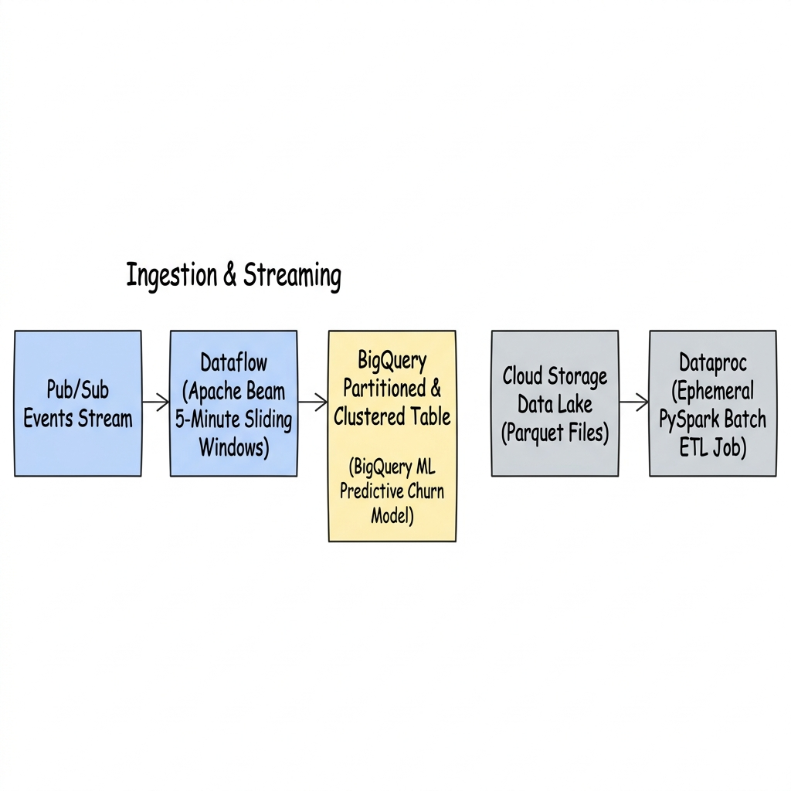
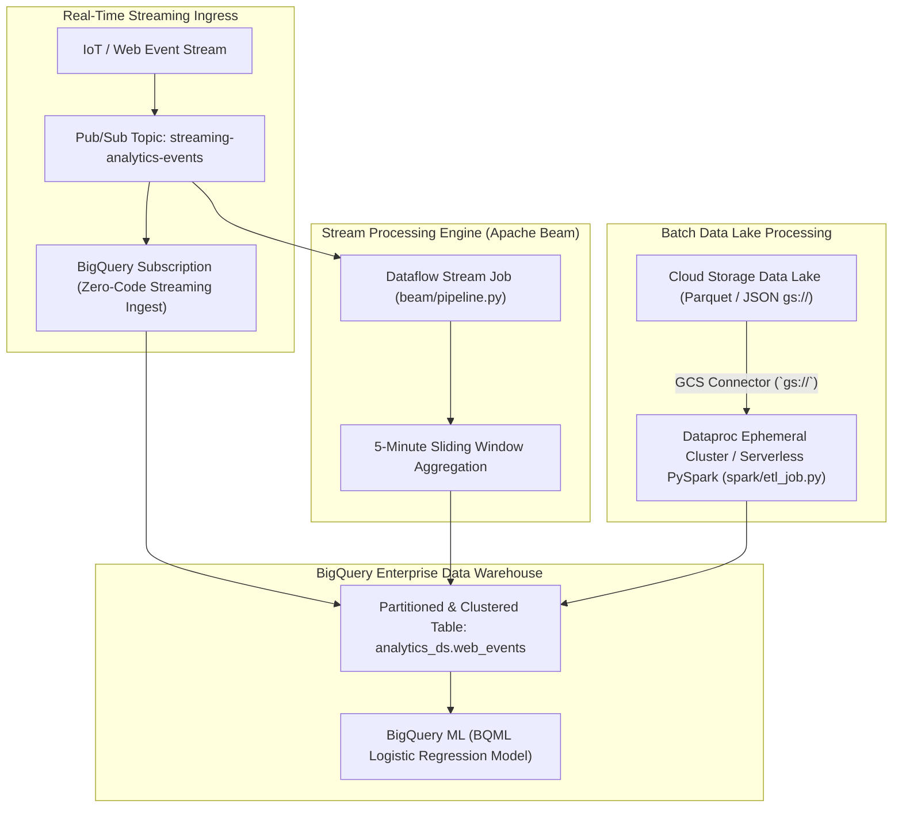

# Project 13: Real-Time Streaming & Batch Analytics Lakehouse Platform

---

## 1. Project Overview

Welcome to **Project 13: Real-Time Streaming & Batch Analytics Lakehouse Platform**. This hands-on project synthesizes all 4 topics in **Module 13 (Data & Analytics)** into an enterprise-grade big data processing architecture on GCP, optimized for **GCP Free Trial Accounts**.

### Objectives
In this project, you will:
1. **Stream Events Real-Time via Pub/Sub & BigQuery Subscriptions**: Ingest streaming event payloads into Pub/Sub topics and route JSON streams directly to BigQuery tables zero-code.
2. **Author Data Pipelines with Apache Beam (Dataflow)**: Write unified stream processing pipelines in Python implementing 5-minute sliding window aggregations and side-output error routing.
3. **Optimize BigQuery Data Warehouse & BQML**: Create partitioned and clustered tables, execute analytical dry runs, and train SQL-native Machine Learning (BQML) logistic regression models.
4. **Execute Ephemeral PySpark Jobs on Dataproc**: Run PySpark batch ETL jobs reading Parquet files from Cloud Storage lakes using Dataproc Serverless / Ephemeral clusters.
5. **Enforce Storage Durability & Zero-Leak Teardown**: Store persistent raw data in GCS (`gs://`) instead of HDFS, executing clean teardowns.

---

## 2. Architecture & Data Lakehouse Flow

The project implements a real-time streaming and batch analytics lakehouse:





> [!IMPORTANT]
> **Free Trial Safety & Cost Controls**:
> - **BigQuery Free Tier**: 10 GB active storage and 1 TB query processing free per month.
> - **Pub/Sub Free Tier**: 10 GB message ingestion free per month.
> - **Ephemeral Dataproc**: PySpark jobs execute on ephemeral clusters that boot, process data, and self-delete immediately.
> - **Automated Cleanup**: Always execute `./scripts/cleanup_analytics.sh` after completing your lab exercises to delete BigQuery datasets, Pub/Sub topics, and GCS buckets!

---

## 3. Module Topics Covered

| Topic Number & Name | Project Integration Point |
|---|---|
| **113. BigQuery** | Partitioned (`DATE(timestamp)`) and Clustered tables, `--dry_run` cost estimates, and BigQuery ML (BQML). |
| **114. Pub/Sub** | Direct BigQuery Subscriptions and Dead-Letter Queue (DLQ) retry routing. |
| **115. Dataflow** | Writing Apache Beam pipelines (`beam/pipeline.py`) with sliding windows and PTransform fusion. |
| **116. Dataproc** | Executing PySpark ETL scripts (`spark/etl_job.py`) using GCS connector (`gs://`) and Spot workers. |

---

## 4. Hands-On Execution Guide

### Step 1: Navigate to Project 13 Workspace

Open Google Cloud Shell or local terminal:

```bash
cd "13-data-and-analytics/project-13-data-and-analytics"
chmod +x scripts/*.sh
```

---

### Step 2: Inspect Apache Beam, PySpark, and BQML Code

Inspect the pipeline transforms and SQL machine learning model definitions:

```bash
# 1. View Apache Beam Streaming Pipeline
cat beam/pipeline.py

# 2. View Dataproc PySpark Batch ETL Job
cat spark/etl_job.py

# 3. View BigQuery Partitioning & BQML DDL
cat sql/bigquery_ml.sql
```

---

### Step 3: Deploy Analytics Platform & Seed Data

Execute `scripts/deploy_analytics_platform.sh` to automate:
1. Enabling BigQuery, Pub/Sub, Dataflow, Dataproc, and Cloud Storage APIs.
2. Creating GCS data lake bucket `gs://${PROJECT_ID}-analytics-lake`.
3. Creating BigQuery Dataset `analytics_ds` and Partitioned/Clustered table `web_events`.
4. Creating Pub/Sub topic `streaming-analytics-events` with a Direct BigQuery Subscription.
5. Publishing test event payloads and training a BigQuery ML (BQML) model.

```bash
./scripts/deploy_analytics_platform.sh
```

*Expected Script Output Snippet*:
```text
=====================================================
GCP Real-Time Streaming & Batch Analytics Deployment
=====================================================
[INFO] Enabling BigQuery, Pub/Sub, Dataflow, Dataproc APIs...
[SUCCESS] Analytics APIs active.
[INFO] Creating BigQuery Dataset: analytics_ds & Partitioned Table...
[SUCCESS] BigQuery Partitioned & Clustered Table created.
[INFO] Creating Pub/Sub Topic & Direct BigQuery Subscription...
[SUCCESS] Zero-code streaming ingestion active.
[INFO] Training BigQuery ML (BQML) Churn Prediction Model...
[SUCCESS] BQML Logistic Regression Model trained successfully.
```

---

### Step 4: Execute Dry-Run SQL Queries in BigQuery

Test BigQuery cost control by estimating data scan volumes using `--dry_run`:

```bash
bq query --use_legacy_sql=false --dry_run '
SELECT user_id, COUNT(*) AS event_count
FROM `analytics_ds.web_events`
WHERE DATE(event_timestamp) = CURRENT_DATE() AND event_type = "click"
GROUP BY user_id;
'
```

---

## 5. Verification & Testing

Verify dataset partitions and streaming message ingestion via CLI:

```bash
# 1. Inspect BigQuery table partition details
bq show --format=prettyjson analytics_ds.web_events

# 2. Inspect trained BigQuery ML model attributes
bq show --model analytics_ds.churn_model
```

---

## 6. Troubleshooting & Common Issues

| Symptom / Error | Root Cause | Resolution |
|---|---|---|
| BigQuery query scans 100% of table bytes | Query missing `WHERE DATE(event_timestamp)` partition filter. | Include partition column filters in `WHERE` clauses to prune un-needed date segments. |
| Pub/Sub Direct BigQuery subscription fails | BigQuery Service Agent lacks write permissions to target table. | Grant `BigQuery Data Editor` role to Pub/Sub service account. |
| Dataproc PySpark job fails with `File Not Found` | Script referencing local HDFS path instead of Cloud Storage (`gs://`). | Update input/output file paths to use `gs://bucket-name/data.parquet`. |

---

## 7. Project Cleanup

To delete BigQuery datasets, Pub/Sub topics, and GCS buckets, run:

```bash
./scripts/cleanup_analytics.sh
```

---

## 8. Summary & Next Steps

Congratulations! You have completed **Project 13: Real-Time Streaming & Batch Analytics Lakehouse Platform**. You have mastered BigQuery partitioning, BQML, Pub/Sub streaming subscriptions, Dataflow, and Dataproc PySpark ETL.

- **Next Project**: [Project 14: SRE Reliability Engineering Framework with SLOs, DR & Chaos Testing](../../14-reliability-engineering/project-14-reliability-engineering/README.md)
