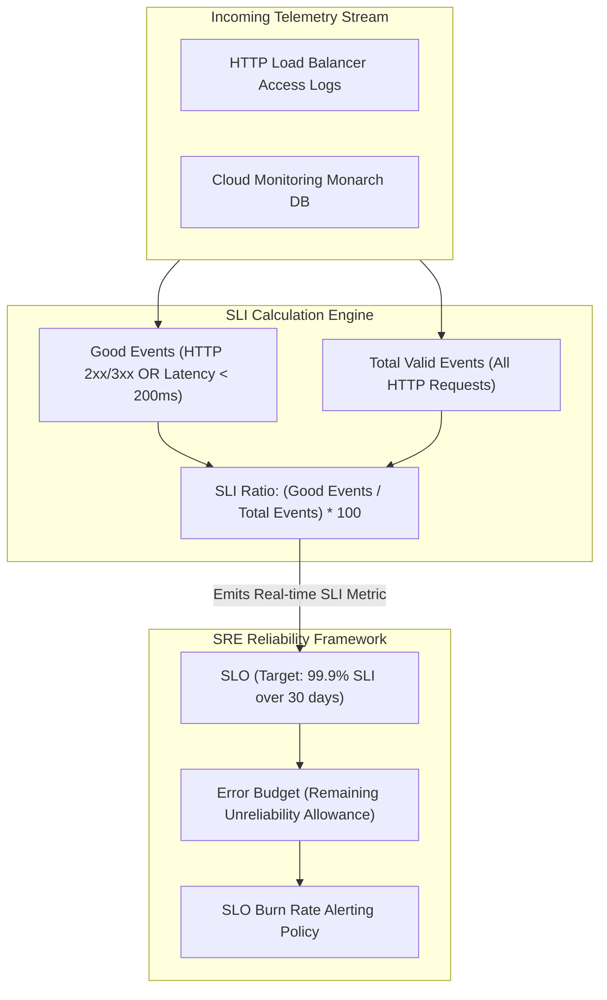

# Topic 117: SLI (Service Level Indicator)

---

## 1. What Is It?

A **Service Level Indicator (SLI)** is a quantifiable, real-time metric defined by Site Reliability Engineering (SRE) teams that measures the actual operational performance, availability, latency, or quality of a service as experienced by its users.

SLIs form the foundation of Google's SRE framework through three core principles:
1. **Ratio-Based Telemetry**: Formulated as the ratio of *good events* divided by *total valid events* expressed as a percentage ($SLI = \frac{Good Events}{Total Events} \times 100$).
2. **User-Centric Measurement**: Measures performance at the boundary closest to the user (e.g., HTTP load balancer responses or client-side probes) rather than internal VM CPU metrics.
3. **Four Golden Signals**: Aligned to key operational dimensions: **Latency** (response time), **Availability** (error rates), **Traffic** (demand rate), and **Saturation** (capacity utilization).

### Real-World Analogy
Think of an SLI like a digital speedometer and fuel gauge on an automobile dashboard:
- **Internal Engine Metrics (CPU/RAM)**: The internal oil temperature inside the engine block. It matters to mechanics, but tells you nothing about whether you are arriving at your destination on time.
- **SLI (Speedometer & On-Time Arrival Ratio)**: Calculating: "Out of 100 trips taken this month, how many trips arrived at the destination within 30 minutes without breaking down?" ($SLI = \frac{98 Successful Trips}{100 Total Trips} = 98\%$). It directly reflects the driver's actual travel experience.

---

## 2. Where Does It Fit?

SLIs sit directly on incoming user telemetry streams, feeding data into Service Level Objectives (SLOs) and Error Budgets.



---

## 3. Core Concepts

| SLI Type | Math Formula | Good Event Definition | Example Use Case |
|---|---|---|---|
| **Availability SLI** | $\frac{\text{Successful Requests}}{\text{Total Requests}}$ | Response status code is NOT 5xx (`status < 500`). | Web APIs, REST endpoints. |
| **Latency SLI** | $\frac{\text{Fast Requests}}{\text{Total Requests}}$ | Response time is less than threshold (e.g., `< 300ms`). | User-facing web frontends. |
| **Throughput SLI** | $\frac{\text{Processed Jobs}}{\text{Submitted Jobs}}$ | Job completes successfully within SLA window. | Batch data pipelines, queue workers. |
| **Freshness SLI** | $\frac{\text{Updated Records}}{\text{Total Records}}$ | Record updated within freshness threshold (e.g., `< 60s`). | Real-time dashboards, search indexes. |
| **Correctness SLI** | $\frac{\text{Valid Payloads}}{\text{Total Payloads}}$ | Payload passes schema validation checks. | Data pipelines, Pub/Sub schemas. |

---

## 4. How It Works

Calculating an SLI in Cloud Monitoring follows a standardized ratio aggregation pipeline:

```text
Incoming HTTP Requests stream into Cloud Monitoring
                               ↓
1. Filter Total Events: `metric.type="loadbalancing.googleapis.com/https/request_count"`
                               ↓
2. Filter Good Events: `response_code_class != "5xx"` AND `latency < 250ms`
                               ↓
3. Compute Ratio: `sum(Good Events) / sum(Total Events)` over 1-minute alignment windows
                               ↓
4. Emits SLI metric stream to Cloud Monitoring Services API
```

1. **Standardized Ratio Formula**: Converting raw metrics into a 0% to 100% ratio allows disparate services (gRPC APIs, Cloud Run webhooks, database queries) to be evaluated under a unified SRE framework.
2. **Excluding Invalid Events**: Client-side errors (HTTP 4xx invalid user requests) are typically excluded from "Total Events" so bad user input does not unfairly degrade the service's SLI score.

---

## 5. Production Scenario

### Defining Availability and Latency SLIs for a Cloud Run Checkout Microservice

```text
Requirement: Establish production SLIs for a Cloud Run payment checkout microservice measuring: 1) Availability (HTTP Non-5xx), and 2) Latency (HTTP response time < 300ms).
    ↓
Architecture: Cloud Monitoring Services API + PromQL / MQL Ratio Definition.
    ↓
Step 1: Define Availability SLI Ratio:
  - Good Events: `response_code_class != "5xx"`
  - Total Events: `response_code_class IN ["2xx", "3xx", "4xx", "5xx"]`
  - Formula: `sum(rate(good_events[5m])) / sum(rate(total_events[5m]))`
    ↓
Step 2: Define Latency SLI Ratio:
  - Good Events: `latency < 300ms` AND `response_code_class != "5xx"`
  - Total Events: All valid HTTP requests.
  - Formula: `sum(rate(fast_events[5m])) / sum(rate(total_events[5m]))`
    ↓
Step 3: Create Custom Service in Cloud Monitoring Services API (`checkout-service`).
    ↓
Result: Real-time SLI metrics streaming to Cloud Monitoring, providing clear visibility into user-perceived checkout health.
```

*Why Selected*: Illustrates standard Google SRE practice of defining ratio-based Availability and Latency SLIs.

---

## 6. Hands-On Lab

### Prerequisites
- Active GCP Project with Cloud Monitoring API enabled.
- Cloud Shell or local machine with `gcloud` CLI installed.

### CLI Method

```bash
# 1. Environment configuration
export PROJECT_ID=$(gcloud config get-value project)

# 2. Enable Monitoring API
gcloud services enable monitoring.googleapis.com

# 3. Create a custom Service in Cloud Monitoring for SLI tracking
gcloud alpha monitoring services create \
  --service-id="payment-checkout-service" \
  --display-name="Payment Checkout Microservice"

# 4. List registered monitoring services
gcloud alpha monitoring services list

# 5. Describe the newly created service
gcloud alpha monitoring services describe projects/${PROJECT_ID}/services/payment-checkout-service
```

### Verification
Execute `gcloud alpha monitoring services list` and confirm `"Payment Checkout Microservice"` is listed.

### Cleanup

```bash
gcloud alpha monitoring services delete projects/${PROJECT_ID}/services/payment-checkout-service --quiet
```

---

## 7. Security

### SLI Data Governance & Telemetry Access
- **IAM Permission**: Viewing SLI metrics requires `roles/monitoring.viewer`. Creating or modifying SLI definitions requires `roles/monitoring.editor` or `roles/monitoring.admin`.
- **Exclude PII from SLI Labels**: Ensure custom SLI metric descriptors do not include sensitive user data (emails, credit card hashes) in label keys.

```text
BAD PRACTICE:
Measuring internal VM CPU utilization as an Availability SLI or including raw customer emails in SLI metric labels.

PRODUCTION PRACTICE:
Measure user-facing request success ratios at the Load Balancer or API Gateway, restricting SLI editing to SRE teams.
```

---

## 8. Scaling & High Availability

SLI aggregation and windowing architecture:

```text
Global User Traffic (100,000 requests / sec across 10 GCP Regions)
                       ↓
Cloud Monitoring Aligner (Computes 1-minute Good/Total event sums per region)
                       ↓
Global Reducer (Combines regional ratios into single Global Service SLI)
                       ↓
Feeds real-time 99.9% SLO Error Budget tracker
```

- **Global SLI Aggregation**: Cloud Monitoring automatically aggregates SLIs across multi-region deployment targets, presenting a single unified availability score for global microservices.

---

## 9. Cost

### SLI Pricing Model

| Component | Cost Model | Note |
|---|---|---|
| **Native GCP Metric SLIs** | 100% FREE | SLIs built on native GCP metrics incur zero ingestion fees. |
| **Custom Metric SLIs** | Standard Custom Metric rates | $0.2580 per MB for custom time-series beyond free tier. |
| **Services API & SLO Tracking** | 100% FREE | Managing Services, SLIs, and SLOs in Cloud Monitoring is free. |

---

## 10. Monitoring & Troubleshooting

### Operational Telemetry & Diagnostics
- **Metrics Explorer**: Query custom SLI ratio metrics directly using MQL or PromQL to inspect historical reliability trends.
- **SLI Degradation Debugging**: Correlate SLI drops with Cloud Trace waterfall spikes to isolate backend dependencies causing latency breaches.

### Troubleshooting Matrix

| Symptom | Cause | Resolution |
|---|---|---|
| SLI ratio dropping due to HTTP 4xx errors | HTTP 4xx (client errors) included in total events count without filtering | Exclude HTTP 4xx (user error) from Total Events if measuring server health. |
| SLI showing "No Data" | Metric filter typo or zero traffic reaching load balancer | Verify filter string in Metrics Explorer and send test HTTP requests. |
| Latency SLI fluctuating wildly | Small sample size (low traffic volume) causing ratio volatility | Increase alignment window from 1m to 5m to smooth ratio curve. |

---

## 11. Common Mistakes

```text
Mistake: Using internal server metrics (e.g., CPU utilization < 80%) as an Availability SLI.
Why: Server metrics are easily accessible.
Impact: Servers can run at 95% CPU while serving 100% successful requests, or run at 5% CPU while failing 100% of requests due to a database deadlock. Internal CPU tells you nothing about user experience.
Correct Approach: Measure user-perceived success ratios (`Good Requests / Total Requests`) at the service boundary.

Mistake: Counting client-side input validation errors (HTTP 400 Bad Request) as service failures in an Availability SLI.
Why: Filtering by `status != 200`.
Impact: Punishes the engineering team's reliability score when users type invalid passwords or bad credit card numbers.
Correct Approach: Exclude HTTP 4xx client errors from total valid request counters, or count non-5xx responses as good events.
```

---

## 12. Production Best Practices

- [ ] Formulate all SLIs as a ratio of **`Good Events / Total Events`**.
- [ ] Measure SLIs at the **service perimeter** (Load Balancer, Gateway) closest to users.
- [ ] Align SLIs to SRE **Four Golden Signals** (Latency, Availability, Traffic, Saturation).
- [ ] Exclude client-side errors (HTTP 4xx) from service availability SLIs.
- [ ] Define **Latency SLIs** based on specific response time thresholds (e.g., `< 250ms`).
- [ ] Register SLIs in **Cloud Monitoring Services API** using Terraform.

---

## 13. Hyperscaler / Enterprise Perspective

```text
Personal / Learning
  No SLIs → CPU Metric Monitoring → Manual Server Restart Rules
        ↓
Small Production
  Basic HTTP 5xx Ratio → Cloud Monitoring Custom Metrics → Slack Alerts
        ↓
Enterprise Environment
  Cloud Monitoring Services API → Standardized Availability & Latency SLIs → Automated SLO Error Budget Tracking
        ↓
Hyperscaler Environment
  Sloth / OpenSLO Declarative Spec → Multi-Cluster Service Mesh SLI Ingestion → Automated Feature Freeze Deployment Blockers
```

Enterprise hyperscalers adopt **OpenSLO** or **Sloth** declarative YAML specs, storing SLI definitions alongside application code in Git repositories and automatically deploying SLIs to Cloud Monitoring via CI/CD pipelines.

---

## 14. Real Project Questions

### Q1: What is the exact mathematical definition of a Service Level Indicator (SLI)?
**Answer:** An SLI is a ratio of *good events* divided by *total valid events* expressed as a percentage:
$$\text{SLI} = \left( \frac{\text{Good Events}}{\text{Total Valid Events}} \right) \times 100$$
For example, an Availability SLI calculates the number of non-5xx HTTP responses divided by the total number of valid HTTP requests received over a given time window.

### Q2: Why are user-facing boundary metrics superior to internal server metrics for SLIs?
**Answer:** User-facing boundary metrics (e.g., HTTP Load Balancer latency or response codes) measure real-time operational performance as experienced directly by end-users. Internal server metrics (like CPU or memory usage) describe resource utilization, which does not correlate directly to whether users are successfully completing transactions.

### Q3: What are the Four Golden Signals in Site Reliability Engineering?
**Answer:** The Four Golden Signals are:
1. **Latency**: Time taken to service a request.
2. **Traffic**: Demand placed on the system (e.g., requests/sec).
3. **Errors**: Rate of requests that fail.
4. **Saturation**: How full the service's constrained resources are (e.g., memory or thread pool usage).

---

## 15. Quick Decision Guide

| Service Component | Recommended SLI Type | Good Event Definition |
|---|---|---|
| User-Facing Web Frontend | Latency SLI | HTTP Response Time < 200ms. |
| REST / gRPC Microservice | Availability SLI | HTTP Status Code != 5xx (Non-server error). |
| Asynchronous Batch Queue | Throughput / Freshness SLI | Queue item processed & updated < 60 seconds. |

### When to Use SLIs
- Mandatory foundation for defining SRE Service Level Objectives (SLOs), Error Budgets, and automated burn rate alerting.

### When NOT to Use SLIs
- Un-quantifiable qualitative feedback (e.g., user survey opinions).

---

## 16. Related Services

```text
                      [117. SLI]
                     /    |     \
            Cloud Monitoring SLO  Error Budgets
           (Metric Ingest)(Target)(Reliability Margin)
                  |       |       |
            Provides Raw  Defines Calculates Remaining
            Ratio Stream  Target  Error Allowance
```

- **Cloud Monitoring**: Ingestion engine storing real-time SLI time-series ratio metrics.
- **SLO (Service Level Objective)**: Target goal established for an SLI (e.g., SLI >= 99.9%).
- **Error Budget**: The mathematical margin of allowed unreliability derived from an SLO.

---

## 17. Cheat Sheet

### Common SLI MQL Ratio Snippet

```text
# Availability SLI MQL Ratio: Non-5xx Requests / Total Requests
fetch https_lb_rule
| filter resource.project_id == 'my-gcp-project'
| {
    filter response_code_class != '5xx' ;
    ident
  }
| group_by [resource.backend_service_name], count_true()
| ratio
```

```bash
# Create a Custom Monitoring Service for SLI tracking
gcloud alpha monitoring services create --service-id="user-auth-service" --display-name="User Auth Service"
```

---

## 18. Learning Connection

- **Previous Topic**: [116. Dataproc](../../13-data-and-analytics/116-dataproc/README.md)
- **Next Topic**: [118. SLO](../118-slo/README.md)
