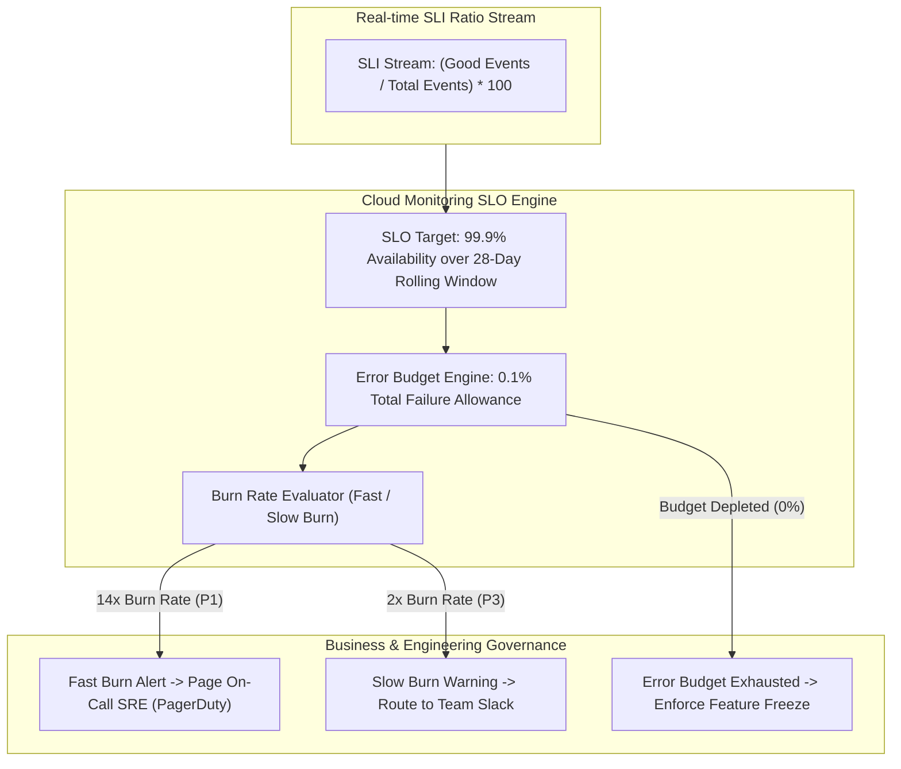

# Topic 118: SLO (Service Level Objective)

---

## 1. What Is It?

A **Service Level Objective (SLO)** is a target reliability goal set for a Service Level Indicator (SLI) over a specified time window (e.g., 99.9% availability over a 30-day rolling window). It defines the precise operational boundary separating acceptable service performance from unacceptable unreliability.

SLOs serve four critical functions within Google's Site Reliability Engineering (SRE) framework:
1. **Target Reliability Boundary**: Establishes a formal, agreed-upon performance goal between product developers, SREs, and business stakeholders.
2. **Error Budget Derivation**: Mathematically defines the allowable unreliability margin ($Error Budget = 100\% - SLO\%$).
3. **Data-Driven Feature Velocity**: Balances rapid product feature deployments against system stability (e.g., if the SLO is breached, feature deployments are paused to focus on reliability).
4. **Time Window Architectures**: Evaluated over **Rolling Windows** (e.g., past 30 days continuously) or **Calendar Windows** (e.g., monthly/quarterly).

### Real-World Analogy
Think of an SLO like the published on-time arrival goal for a major commercial airline:
- **SLI (Actual Speedometer Ratio)**: Measuring that 99.2% of flights arrived on time this month.
- **SLO (Target Goal - 99.0% On-Time)**: The airline's internal performance target: "We aim for 99.0% of our flights to arrive on time over any rolling 30-day period."
- **Decision Engine**: If on-time performance sits at 99.2% (Exceeding the 99.0% SLO), the airline continues expanding flight routes (Deploying new code features). If performance drops to 98.1% (Breaching the SLO), executives halt new route expansions and focus 100% of staff on aircraft maintenance and scheduling overhauls (Reliability Engineering).

---

## 2. Where Does It Fit?

SLOs convert real-time SLI metric ratios into actionable SRE operational governance rules and alerting triggers.



---

## 3. Core Concepts

| Concept | Description | Production Best Practice |
|---|---|---|
| **Target Percentage** | The specific reliability percentage goal (e.g., `99.9%` or `99.95%`). | Never set 100% SLOs; 100% reliability is impossibly expensive and blocks innovation. |
| **Rolling Window** | Continuously shifting time period (e.g., past 28 or 30 days) evaluating performance. | Preferred for operational SRE alerting and continuous health tracking. |
| **Calendar Window** | Fixed calendar time period (e.g., Month of August or Q3) resetting at period start. | Preferred for executive business reporting and compliance auditing. |
| **Burn Rate** | The speed at which a service is consuming its Error Budget (1x = budget consumed exactly over window). | Trigger P1 alerts when burn rate exceeds 14x (consumes 2% of budget in 1 hour). |
| **Services API** | Native Cloud Monitoring API for declaring and monitoring SLOs programmatically. | Manage SLO definitions as code using Terraform. |

---

## 4. How It Works

Evaluating an SLO and tracking its Error Budget proceeds through continuous time-series calculations:

```text
SLI ratio metrics ingested continuously into Cloud Monitoring
                               ↓
SLO Engine compares 28-Day Rolling SLI Average against Target (e.g., 99.9%)
                               ↓
Current Rolling SLI = 99.94% -> SLO Status = MET -> Remaining Error Budget = 40%
                               ↓
Service experiences outage -> SLI drops to 95.0% for 20 minutes
                               ↓
Burn Rate spikes to 36x -> Triggers Burn Rate Alerting Policy -> Pages On-Call SRE
```

1. **The "Nines" of Reliability**:
   - **99% (Two Nines)**: ~7.3 hours allowed downtime / month.
   - **99.9% (Three Nines)**: ~43.8 minutes allowed downtime / month.
   - **99.99% (Four Nines)**: ~4.38 minutes allowed downtime / month.
2. **Cost Non-Linearity**: Moving from 99.9% to 99.99% reliability increases infrastructure and operational engineering costs by an order of magnitude.

---

## 5. Production Scenario

### Terraform-Provisioned 99.9% Availability SLO with Burn Rate Alerting

```text
Requirement: Establish a 99.9% Availability SLO over a 28-day rolling window for a Cloud Run API service using Terraform, attaching automated Burn Rate alerting policies.
    ↓
Architecture: Terraform + `google_monitoring_slo` + `google_monitoring_alert_policy`.
    ↓
Step 1: Declare SLO in Terraform (`slo.tf`):
    resource "google_monitoring_slo" "api_availability_slo" {
      service      = google_monitoring_service.api_service.service_id
      slo_id       = "api-availability-slo"
      display_name = "99.9% API Availability over 28 Days"
      goal         = 0.999
      rolling_period_days = 28

      basic_sli {
        availability {
          enabled = true
        }
      }
    }
    ↓
Step 2: Create Fast Burn Rate Alerting Policy (Consumes 2% budget in 1 hour = 14.4x burn rate).
    ↓
Step 3: Apply configuration via Terraform.
    ↓
Result: Programmatic reliability objective with intelligent burn-rate alerting, eliminating static threshold alert noise.
```

*Why Selected*: Demonstrates native GCP infrastructure-as-code SLO implementation.

---

## 6. Hands-On Lab

### Prerequisites
- Active GCP Project with Cloud Monitoring API enabled.
- Cloud Shell or local machine with `gcloud` CLI installed.

### CLI Method

```bash
# 1. Environment configuration
export PROJECT_ID=$(gcloud config get-value project)

# 2. Enable Monitoring API
gcloud services enable monitoring.googleapis.com

# 3. Create a custom Service in Cloud Monitoring
gcloud alpha monitoring services create \
  --service-id="user-profile-service" \
  --display-name="User Profile Service"

# 4. Create an SLO JSON definition file
cat <<EOF > profile-slo.json
{
  "displayName": "99.9% Profile Service Availability",
  "goal": 0.999,
  "rollingPeriodDays": 28,
  "serviceLevelIndicator": {
    "basicSli": {
      "availability": {}
    }
  }
}
EOF

# 5. Create SLO attached to the custom service
gcloud alpha monitoring services slos create \
  --service="user-profile-service" \
  --config-from-file=profile-slo.json

# 6. List SLOs for the service
gcloud alpha monitoring services slos list --service="user-profile-service"
```

### Verification
Execute `gcloud alpha monitoring services slos list --service="user-profile-service"` and confirm `"99.9% Profile Service Availability"` is listed.

### Cleanup

```bash
SLO_ID=$(gcloud alpha monitoring services slos list --service="user-profile-service" --format='value(name)')
gcloud alpha monitoring services slos delete ${SLO_ID} --quiet
gcloud alpha monitoring services delete projects/${PROJECT_ID}/services/user-profile-service --quiet
rm -f profile-slo.json
```

---

## 7. Security

### SLO Governance & IAM Security
- **Role Isolation**: Managing SLO targets requires `roles/monitoring.editor` or `roles/monitoring.admin`. Restrict SLO target modification permissions to prevent developers from lowering targets during outages.
- **Audit Logging**: Monitor `google.monitoring.v3.ServiceLevelObjectiveService` API events to trace who modified SLO goals or time windows.

```text
BAD PRACTICE:
Lowering an SLO target (e.g., changing from 99.9% to 95.0%) during an active incident just to stop PagerDuty alerts from firing.

PRODUCTION PRACTICE:
Maintain immutable SLO targets agreed upon by business stakeholders; use Snooze or Silence rules during planned maintenance windows.
```

---

## 8. Scaling & High Availability

Multi-service SLO management architecture:

```text
Microservices Architecture (50+ Interconnected Microservices)
                       ↓ (Tiered SLO Hierarchy)
SLO Tiering:
├── Tier 1 (Critical Path - Checkout & Auth): 99.95% SLO (~21 mins downtime/mo)
├── Tier 2 (Core Features - Search & Product Pages): 99.9% SLO (~43 mins downtime/mo)
└── Tier 3 (Non-Critical - Analytics & Recommendations): 99.0% SLO (~7.3 hours downtime/mo)
```

- **Tiered SLO Allocation**: Assign strict high SLOs (99.95%) only to core user-facing critical payment paths, setting lower SLOs (99.0%) for non-critical features to reduce infrastructure costs.

---

## 9. Cost

### SLO Feature Pricing

| Component | Cost Model | Note |
|---|---|---|
| **Cloud Monitoring SLO Engine** | 100% FREE | Creating, monitoring, and alerting on SLOs is free. |
| **Services API** | 100% FREE | No charges for declaring custom services or SLO objects. |

---

## 10. Monitoring & Troubleshooting

### Operational Telemetry & Diagnostics
- **SLO Status Dashboard**: View real-time SLO compliance graphs and remaining Error Budget percentages in Cloud Console.
- **Burn Rate Alerts**: Use Burn Rate alerts instead of raw static threshold alerts to eliminate false alarms for transient 30-second spikes.

### Troubleshooting Matrix

| Symptom | Cause | Resolution |
|---|---|---|
| SLO shows 0% compliant on launch | Service newly created without sufficient time-series history | Allow 24 hours of traffic telemetry for rolling window calculations to stabilize. |
| Frequent P1 alerts for non-critical bugs | SLO set unrealistically high (e.g., 99.99% for internal tool) | Align SLO target to realistic business user requirements (e.g., 99.0%). |
| Error budget depleting despite low error count | Aggressive rolling window or high latency threshold breach | Inspect Latency SLI threshold boundaries and adjust latency targets. |

---

## 11. Common Mistakes

```text
Mistake: Setting a 100% SLO for a web application.
Why: Striving for "perfection".
Impact: 100% reliability is impossible. A single transient internet network glitch or routine GCP maintenance window breaches the SLO, causing permanent developer feature freezes.
Correct Approach: Always leave an Error Budget (e.g., 99.9% SLO = 0.1% Error Budget).

Mistake: Creating SLOs without business stakeholder alignment.
Why: SRE team defining targets in isolation.
Impact: Developers ignore SLO breaches, or business teams complain about unnecessary reliability engineering work.
Correct Approach: Co-design SLOs with Product Managers, SREs, and Business Leads to align reliability targets with user happiness.
```

---

## 12. Production Best Practices

- [ ] Never set a **100% SLO**; always preserve an Error Budget.
- [ ] Tier SLOs by criticality (Tier 1: 99.95%, Tier 2: 99.9%, Tier 3: 99.0%).
- [ ] Use **28-Day or 30-Day Rolling Windows** for SRE operational alerting.
- [ ] Implement **Burn Rate Alerting Policies** to page on-call SREs.
- [ ] Manage SLO definitions as code using **Terraform**.
- [ ] Establish **Feature Freeze Policies** when Error Budgets are 100% exhausted.

---

## 13. Hyperscaler / Enterprise Perspective

```text
Personal / Learning
  No SLOs → Static CPU Threshold Alerts → Manual Incident Triaging
        ↓
Small Production
  Single 99.9% Availability SLO → Basic Rolling Window → Email Alerts
        ↓
Enterprise Environment
  Terraform Provisioned SLOs → Multi-Tiered SLO Matrix → PagerDuty Burn Rate Alerting
        ↓
Hyperscaler Environment
  Sloth / OpenSLO Automated Deployment → Automated Error Budget Gate in CI/CD → Executive SLO Compliance Dashboards
```

Enterprise hyperscalers integrate SLO status directly into **CI/CD Deployment Pipelines**. If a service's 30-day Error Budget is exhausted (0% remaining), CI/CD pipelines automatically block non-essential feature deployments until the Error Budget recovers.

---

## 14. Real Project Questions

### Q1: What is the relationship between an SLI, an SLO, and an Error Budget?
**Answer:** An **SLI** (Service Level Indicator) is the real-time metric ratio measuring performance (e.g., 99.92% success rate). An **SLO** (Service Level Objective) is the target goal set for that SLI (e.g., 99.9% over 30 days). The **Error Budget** is the allowable unreliability margin calculated as $100\% - \text{SLO}\%$ (e.g., 0.1% allowed failures).

### Q2: Why is a Rolling Window preferred over a Calendar Window for SRE operational alerting?
**Answer:** A **Rolling Window** (e.g., past 30 days continuously) shifts every minute, providing a continuous, real-time assessment of recent reliability. A **Calendar Window** resets to 100% budget on the first day of every month, which can obscure severe outages that happen late in the month or create artificial panic early in the month.

### Q3: What is "Burn Rate" in SRE and why is Burn Rate alerting better than static threshold alerting?
**Answer:** **Burn Rate** is the speed at which a service is consuming its Error Budget. A 1x burn rate consumes 100% of the budget over the exact SLO window. Burn Rate alerting triggers pages based on how rapidly the budget is being depleted (e.g., a 14.4x burn rate consumes 2% of budget in 1 hour), alerting SREs only when an incident poses a real threat to breaching the monthly SLO.

---

## 15. Quick Decision Guide

| Service Criticality Tier | Recommended SLO Goal | Allowed Downtime / Month |
|---|---|---|
| Tier 1: Core Payment & Auth Paths | 99.95% SLO | ~21.9 Minutes / Month |
| Tier 2: Core User Web Features | 99.9% SLO | ~43.8 Minutes / Month |
| Tier 3: Internal Admin & Analytics Tools | 99.0% SLO | ~7.3 Hours / Month |

### When to Use SLOs
- Mandatory for enterprise SRE reliability governance, error budget tracking, burn rate alerting, and balancing feature velocity with stability.

### When NOT to Use SLOs
- Temporary disposable sandbox projects or internal non-operational research scripts.

---

## 16. Related Services

```text
                     [118. SLO]
                    /    |     \
            SLI Stream  Error Budget  Cloud Alerting
           (Input Metric)(Allowance)  (Burn Rate Alerts)
                 |       |            |
            Measures Real Calculates  Dispatches P1 Pages
            Performance  Margin       on Rapid Burn
```

- **SLI**: Input metric ratio feeding data into the SLO.
- **Error Budget**: Mathematical allowance of unreliability derived from the SLO.
- **Cloud Alerting**: Alerting engine dispatching burn rate notifications.

---

## 17. Cheat Sheet

### Common gcloud & Terraform SLO Snippets

```hcl
# Terraform google_monitoring_slo snippet
resource "google_monitoring_slo" "app_slo" {
  service      = "projects/my-proj/services/my-service"
  slo_id       = "app-availability-slo"
  display_name = "99.9% Availability"
  goal         = 0.999
  rolling_period_days = 28
  basic_sli {
    availability { enabled = true }
  }
}
```

```bash
# List SLOs for a specific monitoring service
gcloud alpha monitoring services slos list --service=my-service

# Describe an SLO configuration
gcloud alpha monitoring services slos describe SLO_ID --service=my-service
```

---

## 18. Learning Connection

- **Previous Topic**: [117. SLI](../117-sli/README.md)
- **Next Topic**: [119. SLA](../119-sla/README.md)
