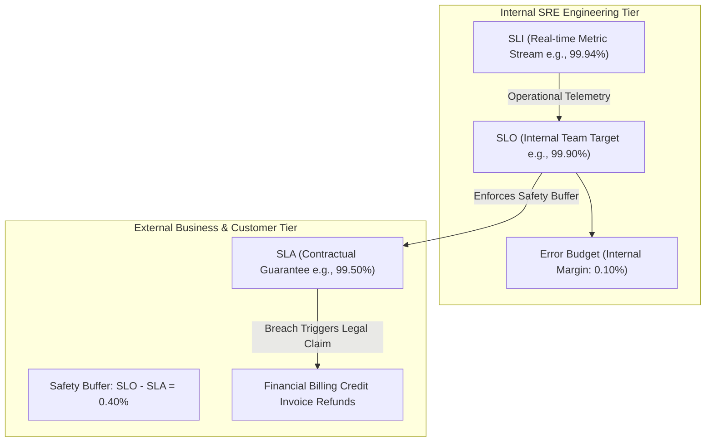

# Topic 119: SLA (Service Level Agreement)

---

## 1. What Is It?

A **Service Level Agreement (SLA)** is an explicit, legally binding contractual agreement between a service provider (e.g., Google Cloud or an enterprise SaaS vendor) and its paying customers that defines the formal reliability commitments, availability guarantees, and financial penalty structures (service credits) enforced if the service fails to meet the specified targets.

SLAs differ fundamentally from internal operational metrics across four key pillars:
1. **Contractual & Financial Consequences**: Breaching an SLA results in direct financial consequences, typically issuing percentage billing credits (e.g., 10% to 50% invoice credit) back to paying customers.
2. **Conservative Availability Targets**: SLAs are deliberately set lower than internal operational SLOs ($SLA < SLO < SLI$) to provide a safety buffer before financial penalties trigger.
3. **Formal Exclusion Rules**: Defines explicit contractual exclusions (e.g., outages caused by customer misconfigurations, scheduled maintenance, or force majeure events).
4. **Google Cloud Platform SLAs**: Publicly published service-by-service uptime guarantees governing GCP infrastructure (e.g., GKE Autopilot 99.95%, Cloud Storage Multi-Region 99.99%).

### Real-World Analogy
Think of an SLA like a commercial landlord's lease contract with a retail store tenant:
- **SLI (Actual Sensor Performance)**: The air conditioning running smoothly 99.8% of the month.
- **SLO (Internal Property Manager Target - 99.5%)**: The building manager's internal operational goal to keep tenants happy.
- **SLA (Legal Lease Contract - 98.0% Guarantee with Rent Discount)**: The formal legal contract clause: "If the air conditioning fails for more than 14 hours in a month (dropping below 98.0% availability), the landlord must issue a 25% discount on the tenant's monthly rent." The landlord sets the lease contract target (98.0%) lower than their internal goal (99.5%) to avoid paying rent refunds during minor maintenance hiccups.

---

## 2. Where Does It Fit?

SLAs represent the outermost legal layer surrounding internal engineering reliability frameworks.



---

## 3. Core Concepts

| Reliability Metric | Target Audience | Primary Purpose | Consequences of Breach |
|---|---|---|---|
| **SLI (Indicator)** | SRE & Software Engineers | Real-time operational measurement. | Triggers automated alerts. |
| **SLO (Objective)** | Product Managers & SREs | Internal reliability target. | Triggers feature freeze / reliability work. |
| **SLA (Agreement)** | Customers, Legal & Sales | Contractual uptime guarantee. | Triggers financial billing credits. |

| Representative GCP Service | Published GCP SLA Guarantee | Credit Refund Threshold |
|---|---|---|
| **Compute Engine (Multi-Zone)** | 99.99% Availability | < 99.99% -> 10% Credit, < 95.0% -> 50% Credit |
| **GKE Autopilot Control Plane** | 99.95% Availability | < 99.95% -> 10% Credit, < 99.0% -> 25% Credit |
| **Cloud Storage (Multi-Region)** | 99.99% Availability | < 99.99% -> 10% Credit, < 95.0% -> 50% Credit |
| **Cloud SQL (High Availability)** | 99.95% Availability | < 99.95% -> 10% Credit, < 99.0% -> 25% Credit |
| **Cloud Spanner (Multi-Region)** | 99.999% Availability (Five Nines) | < 99.999% -> 10% Credit, < 99.0% -> 50% Credit |

---

## 4. How It Works

Evaluating an SLA breach and processing service credit claims operates through formal business workflows:

```text
Service experiences major multi-zone outage lasting 3 hours
                               ↓
Internal SLI drops -> SLO breached -> Error Budget exhausted (Internal SRE Alert)
                               ↓
Outage duration exceeds legal SLA threshold (Monthly Uptime < 99.9%)
                               ↓
Customer files formal SLA Service Credit claim with GCP Support / Account Manager
                               ↓
GCP validates Cloud Audit Logs & Outage Exclusions -> Issues Billing Invoice Credit (e.g., 25%)
```

1. **Safety Buffer Principle**: Engineers set $SLO > SLA$ (e.g., SLO = 99.9%, SLA = 99.5%). This ensures internal SRE alerts fire and teams resolve incidents *before* the outage breaches the legal SLA threshold.
2. **Claim Requirement**: GCP SLA service credits are not applied automatically in most cases; customers must submit a claim to GCP Support within a specified timeframe (typically 30 days).

---

## 5. Production Scenario

### Designing a SaaS Architecture to Match Enterprise Customer SLAs

```text
Requirement: Design a multi-region enterprise SaaS application architecture on GCP that guarantees a 99.9% customer SLA while backing it with GCP infrastructure SLAs and an internal 99.95% SRE SLO.
    ↓
Architecture: Multi-Region GKE + High-Availability Cloud SQL + Global Load Balancers.
    ↓
Step 1: Map Infrastructure SLAs to SaaS SLA:
  - Global External HTTP(S) Load Balancer: 99.99% SLA.
  - Multi-Zone GKE Autopilot Cluster: 99.95% SLA.
  - Regional High Availability Cloud SQL: 99.95% SLA.
    ↓
Step 2: Establish Internal SRE Targets:
  - Legal External Customer SLA: 99.9% (~43 mins downtime/mo).
  - Internal SRE Operational SLO: 99.95% (~21 mins downtime/mo).
  - Safety Buffer: 0.05% (~22 mins buffer before financial penalties apply).
    ↓
Step 3: Define Service Credit Penalty Rules in Customer Contract:
  - Monthly Availability < 99.9%: 10% Invoice Credit.
  - Monthly Availability < 99.0%: 25% Invoice Credit.
    ↓
Result: Robust enterprise SaaS architecture with positive safety buffers preventing accidental SLA breach financial penalties.
```

*Why Selected*: Illustrates how enterprise software companies align underlying GCP infrastructure SLAs with customer contractual commitments.

---

## 6. Hands-On Lab

### Prerequisites
- Active GCP Project with Compute Engine API enabled.
- Cloud Shell or local machine with `gcloud` CLI installed.

### CLI Method

```bash
# 1. Environment configuration
export PROJECT_ID=$(gcloud config get-value project)

# 2. Enable Compute Engine API
gcloud services enable compute.googleapis.com

# 3. Create a High Availability Multi-Zone Instance Template to satisfy Compute Engine 99.99% SLA prerequisite
gcloud compute instance-templates create ha-vm-template \
  --machine-type=e2-medium \
  --network=default \
  --maintenance-policy=MIGRATE

# 4. Create a Regional Managed Instance Group (MIG) spanning 3 zones
gcloud compute instance-groups managed create ha-regional-mig \
  --template=ha-vm-template \
  --size=3 \
  --region=us-central1

# 5. Verify Regional MIG distribution across zones
gcloud compute instance-groups managed list-instances ha-regional-mig --region=us-central1
```

### Verification
Execute `gcloud compute instance-groups managed list-instances ha-regional-mig --region=us-central1` and verify instance replicas are distributed across `us-central1-a`, `us-central1-b`, and `us-central1-c`.

### Cleanup

```bash
gcloud compute instance-groups managed delete ha-regional-mig --region=us-central1 --quiet
gcloud compute instance-templates delete ha-vm-template --quiet
```

---

## 7. Security

### SLA Compliance & Exclusions
- **Exclusion Audit Trail**: Retain Cloud Audit Logs and Cloud Monitoring historical metrics to defend or validate SLA credit claims during customer disputes.
- **Security Outage Exclusions**: Standard SLAs explicitly exclude downtime caused by external DDoS attacks, customer security misconfigurations, or un-patched application code.

```text
BAD PRACTICE:
Promising a 99.99% SLA to external customers while building on single-zone non-HA GCP infrastructure with a 99.9% underlying SLA.

PRODUCTION PRACTICE:
Build on multi-zone/multi-region HA GCP architectures, enforce $SLO > SLA$ safety buffers, and maintain detailed Cloud Audit Logs.
```

---

## 8. Scaling & High Availability

High-Availability SLA prerequisite mapping:

```text
Single-Zone Compute Instance -> 99.9% GCP SLA (~43 mins downtime/mo allowed)
                       ↓ (Architecture Upgrade for Higher SLA)
Multi-Zone Regional MIG + HA Database -> 99.99% GCP SLA (~4.3 mins downtime/mo allowed)
                       ↓ (Multi-Region Failover Architecture)
Multi-Region Cloud Spanner / Global Load Balancing -> 99.999% GCP SLA (Five Nines: ~26 seconds downtime/mo allowed)
```

- **Architectural Prerequisites**: Most GCP service SLAs require specific high-availability configurations (e.g., deploying VMs across at least 2 zones or enabling Cloud SQL High Availability) to qualify for published uptime guarantees.

---

## 9. Cost

### Financial Impact of SLAs

| Operational Dimension | Impact | Financial Model |
|---|---|---|
| **SLA Service Credit Refunds** | Direct Financial Loss | Invoice credits (10% to 50% of monthly bill) paid to customers. |
| **High Availability Architecture Cost** | Increased Infrastructure Spend | Multi-zone/multi-region redundancy increases cloud spend by 2x to 3x. |

---

## 10. Monitoring & Troubleshooting

### Telemetry & SLA Claim Verification
- **GCP Service Health Dashboard**: Review historical GCP platform outages at `status.cloud.google.com` when verifying whether an outage was caused by GCP infrastructure or application code.
- **Audit Logs Verification**: Extract exact outage start and end timestamps from Cloud Logging to support formal support tickets.

### Troubleshooting Matrix

| Symptom | Cause | Resolution |
|---|---|---|
| GCP denies SLA credit claim | Instance was single-zone (failed HA prerequisite) | Ensure architecture complies with published GCP SLA deployment prerequisites. |
| Outage caused by external DDoS attack | Standard SLA exclusion applies | Deploy Cloud Armor WAF to mitigate DDoS attacks at edge. |
| Customer claims SLA breach without proof | Discrepancy between client-side and server-side metrics | Provide server-side Cloud Load Balancing access logs confirming uptime. |

---

## 11. Common Mistakes

```text
Mistake: Setting an external customer SLA equal to internal engineering SLO targets ($SLA = SLO = 99.9\%$).
Why: Assuming legal contracts should mirror internal goals.
Impact: Gives zero operational buffer. The moment an internal SLO is breached by a few minutes, the company incurs immediate legal and financial credit penalties.
Correct Approach: Always maintain a safety buffer between internal SLOs and external SLAs ($SLA < SLO$).

Mistake: Offering a 99.99% SLA without verifying that underlying GCP infrastructure supports it.
Why: Over-promising in customer sales contracts.
Impact: Single-zone GKE or Cloud SQL instances fail, causing outages that breach customer SLAs while GCP's own SLA remains un-breached.
Correct Approach: Review official GCP SLA terms and build multi-zone/multi-region HA architectures to back up customer commitments.
```

---

## 12. Production Best Practices

- [ ] Ensure internal SRE targets maintain a safety buffer above external SLAs ($SLA < SLO$).
- [ ] Review official **GCP Published SLAs** and comply with all HA architecture prerequisites.
- [ ] Deploy workloads across **multiple zones or regions** to qualify for higher SLA tiers.
- [ ] Retain **Cloud Audit Logs** and Cloud Load Balancing metrics to verify outage durations.
- [ ] Explicitly define **Exclusion Rules** (DDoS, customer misconfiguration, maintenance) in customer contracts.
- [ ] Include clear **Service Credit Percentage Tables** in legal customer agreements.

---

## 13. Hyperscaler / Enterprise Perspective

```text
Personal / Learning
  No Formal SLAs → Single-Zone VM Deployment → No Financial Guarantees
        ↓
Small Production
  Standard Contract SLA → Single-Region HA Setup → Basic Credit Claim Process
        ↓
Enterprise Environment
  Multi-Zone HA Prerequisites Compliance → $SLO > SLA$ Buffer Architecture → Dedicated Account Support
        ↓
Hyperscaler Environment
  Five Nines (99.999%) Multi-Region Spanner Infrastructure → Automated Legal Credit Auditing → Multi-Cloud Contractual SLA Backstops
```

Enterprise hyperscalers deploy **Multi-Region Active-Active Architectures** (such as Cloud Spanner Multi-Region and Global Load Balancers), achieving 99.999% ("Five Nines") availability guarantees backed by formal contractual SLAs.

---

## 14. Real Project Questions

### Q1: What is the fundamental difference between an SLO (Service Level Objective) and an SLA (Service Level Agreement)?
**Answer:** An **SLO** is an internal operational target set by engineering teams to manage reliability and balance feature velocity (e.g., 99.9% availability target). An **SLA** is a legally binding contractual agreement with external customers that defines formal availability guarantees and enforces direct financial penalties (billing credits) if breached.

### Q2: Why should an engineering organization always enforce $SLA < SLO$?
**Answer:** Enforcing $SLA < SLO$ (setting internal SLO targets higher than external legal SLAs) creates a critical operational safety buffer. When an incident occurs, internal SRE alerts fire and teams resolve the outage when the SLO is threatened, long before the outage duration breaches the external SLA threshold and triggers customer financial penalties.

### Q3: What architectural prerequisite is required for Compute Engine VMs to qualify for Google's 99.99% SLA?
**Answer:** To qualify for Google's 99.99% Compute Engine SLA, VM instances must be deployed as a **Regional Managed Instance Group (MIG)** spanning at least **two or more zones** within a region, behind a load balancer, ensuring that if a single zone experiences an outage, instances in surviving zones continue serving traffic.

---

## 15. Quick Decision Guide

| Service Level Term | Audience | Primary Metric Focus | Penalty for Failure |
|---|---|---|---|
| **SLI (Indicator)** | SRE & Dev Teams | Real-time Ratio Metric | None (Fires Alert) |
| **SLO (Objective)** | Engineering & Product | Internal Target | Feature Freeze / Reliability Sprint |
| **SLA (Agreement)** | External Customers & Legal | Contractual Guarantee | Financial Credit Refund |

### When to Use SLAs
- Mandatory for commercial SaaS customer contracts, enterprise vendor procurement, and public cloud infrastructure guarantees.

### When NOT to Use SLAs
- Internal microservice communication between teams within the same company (use internal SLOs instead).

---

## 16. Related Services

```text
                     [119. SLA]
                    /    |     \
            Cloud Support SLO   Cloud Billing
          (Credit Claims)(Buffer)(Invoice Refunds)
                 |       |       |
            Validates    Internal Issues Service
            Outage Logs  Target   Credit Refunds
```

- **Cloud Support**: Operational team validating and processing customer SLA credit claims.
- **SLO**: Internal engineering target positioned higher than the legal SLA.
- **Cloud Billing**: Financial engine issuing invoice credit refunds following SLA breaches.

---

## 17. Cheat Sheet

### Summary of Key GCP Published SLAs

```text
- Cloud Spanner (Multi-Region): 99.999% SLA (~5.2 minutes downtime/year)
- Compute Engine (Multi-Zone MIG): 99.99% SLA (~52.5 minutes downtime/year)
- Cloud Storage (Multi-Region): 99.99% SLA (~52.5 minutes downtime/year)
- GKE Autopilot Control Plane: 99.95% SLA (~4.38 hours downtime/year)
- Cloud SQL (High Availability): 99.95% SLA (~4.38 hours downtime/year)
```

---

## 18. Learning Connection

- **Previous Topic**: [118. SLO](../118-slo/README.md)
- **Next Topic**: [120. Error Budgets](../120-error-budgets/README.md)
