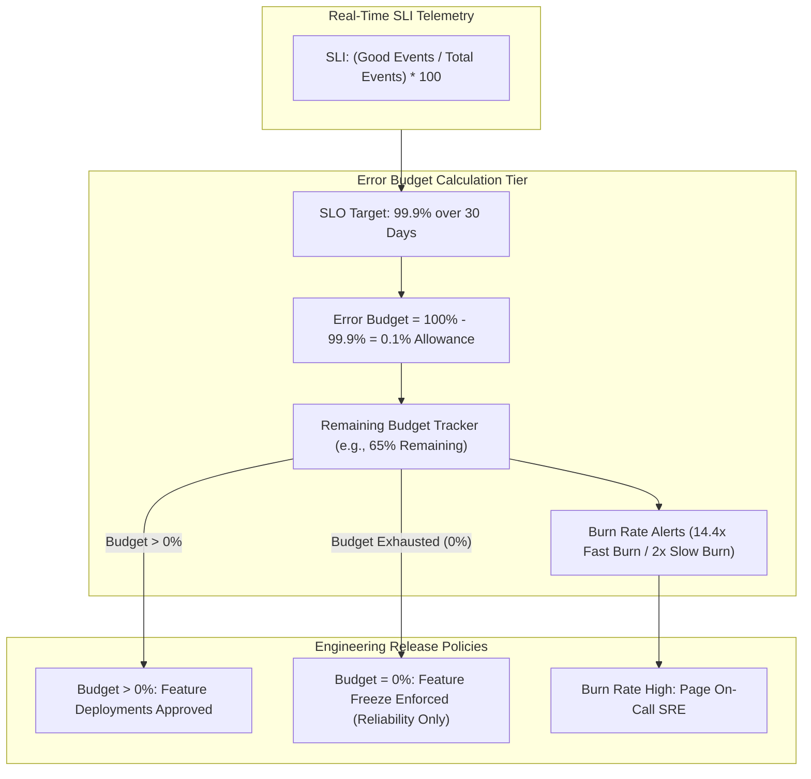

# Topic 120: Error Budgets

---

## 1. What Is It?

An **Error Budget** is the exact mathematical allowance of unreliability a service can tolerate over a specified time window before violating its Service Level Objective (SLO). Calculated as $Error Budget = 100\% - SLO\%$, it transforms abstract reliability goals into a tangible, consumable operational resource.

Error Budgets drive four core Site Reliability Engineering (SRE) governance mechanisms:
1. **Unreliability Allowance**: Acknowledges that 100% uptime is impossible, providing an explicit budget for planned maintenance, experimentation, and software releases.
2. **Neutral Arbiter for Feature Velocity**: Serves as the objective decision engine balancing product velocity (pushing new features) against system stability (fixing technical debt).
3. **Burn Rate Telemetry**: Tracks the rate of budget consumption to detect catastrophic outages (fast burn) or slow performance degradation (slow burn).
4. **Policy-Driven Feature Freezes**: Enforces automated governance rules: if a service's Error Budget is 100% exhausted (0% remaining), feature deployments are frozen until the budget recovers.

### Real-World Analogy
Think of an Error Budget like a monthly personal vacation time allowance at a company:
- **Annual Paid Time Off (Error Budget = 100% - SLO%)**: You are granted 20 days of vacation per year (Your allowable budget for being away from work).
- **Consuming Vacation Days (Outages & Deployments)**: Taking 2 days off for a planned trip (Scheduled maintenance release) or missing a day due to illness (Unplanned outage).
- **Over-Expending Vacation (Budget Exhaustion = 0% Remaining)**: If you use up all 20 days by July, your manager enforces a strict "No Extra Time Off" rule (Feature Freeze). You must work continuously without taking non-essential days off for the rest of the year until your vacation balance replenishes.

---

## 2. Where Does It Fit?

Error Budgets bridge the gap between real-time SLI metrics and high-level product release policies.



---

## 3. Core Concepts

| Concept | Description | Production Best Practice |
|---|---|---|
| **Error Budget Formula** | $100\% - SLO\%$ expressed in percentage or event counts. | Calculate budget in terms of both downtime minutes and failed request counts. |
| **Burn Rate** | The speed of budget consumption (1x = 100% budget consumed over window). | Trigger P1 pages at 14.4x burn rate (2% budget consumed in 1 hour). |
| **Budget Exhaustion** | Reaching 0% remaining Error Budget over the rolling window. | Automatically block non-emergency feature deployments in CI/CD pipelines. |
| **Fast Burn vs. Slow Burn** | **Fast Burn**: Rapid outage consuming budget in hours. **Slow Burn**: Subtle leak consuming budget over weeks. | Use multi-window burn rate alerts (1h/6h for Fast, 3d/14d for Slow). |
| **Policy Agreement** | Contract between Product Managers and SREs defining action when budget is spent. | Sign the Error Budget Policy *before* launching the service to production. |

---

## 4. How It Works

Error Budget calculation and burn rate alert evaluation proceed in real time:

```text
1. Define SLO = 99.9% over 30-day window -> Total Error Budget = 0.1%
                               ↓
2. Total Monthly Requests = 10,000,000 -> Total Bad Request Allowance = 10,000 requests
                               ↓
3. Service experiences 15-minute outage -> 4,000 failed requests occur
                               ↓
4. Error Budget Consumed = 4,000 / 10,000 = 40% -> Remaining Error Budget = 60%
                               ↓
5. Burn Rate = 38x -> Triggers Fast Burn PagerDuty Page -> SRE mitigates incident
```

1. **Burn Rate Calculation**: $\text{Burn Rate} = \frac{\text{Actual Unreliability Rate}}{100\% - \text{SLO}\%}$. A 1x burn rate consumes 100% of the budget over the exact window (e.g., 30 days). A 14.4x burn rate consumes 100% of the budget in 50 hours (or 2% in 1 hour).
2. **Budget Recovery**: As the 30-day rolling window moves forward, past outage events drop off the trailing edge of the window, automatically restoring the remaining Error Budget balance.

---

## 5. Production Scenario

### SRE Error Budget Policy & CI/CD Automated Feature Freeze Gate

```text
Requirement: Establish a 99.9% Availability SLO with a 30-day rolling Error Budget, enforcing an automated feature deployment freeze in Cloud Build when the Error Budget falls below 10%.
    ↓
Architecture: Cloud Monitoring Services API + Cloud Build Pipeline Gate + Pub/Sub.
    ↓
Step 1: Calculate 30-Day Budget Allowance for 99.9% SLO:
  - Allowed Unreliability: 0.1% of total requests (~43 minutes downtime/month).
    ↓
Step 2: Define Error Budget Policy:
  - Budget > 20%: Normal feature releases approved.
  - Budget 10%-20%: Heightened release review required.
  - Budget < 10%: Non-emergency feature freeze enforced; 100% SRE focus on bug fixes.
    ↓
Step 3: Integrate Cloud Build CI/CD Gate:
  - Pipeline queries Cloud Monitoring API (`services.serviceLevelObjectives.get`).
  - If `remainingErrorBudget < 0.10`, fail build step with message:
    "DEPLOYMENT BLOCKED: Error Budget exhausted. SRE Feature Freeze in effect."
    ↓
Result: Data-driven release governance aligning developer velocity with real-time system stability.
```

*Why Selected*: Illustrates standard Google SRE practice connecting Error Budget tracking directly to automated deployment gates.

---

## 6. Hands-On Lab

### Prerequisites
- Active GCP Project with Cloud Monitoring API enabled.
- Cloud Shell or local machine with `gcloud` CLI installed.

### CLI Method

```bash
# 1. Environment configuration
export PROJECT_ID=$(gcloud config get-value project)

# 2. Enable Monitoring API
gcloud services enable monitoring.googleapis.com

# 3. Query remaining Error Budget metrics for existing SLOs
gcloud alpha monitoring services slos list --service=canonical-service-id

# 4. Describe an SLO to inspect its goal and time window
# (Simulated inspection of SLO object attributes)
cat <<EOF > error-budget-calc.py
# Python Error Budget Calculator Example
slo_target = 0.999 # 99.9%
total_requests = 5000000
good_requests = 4992000

error_budget_percentage = (1.0 - slo_target) * 100
total_bad_allowed = total_requests * (1.0 - slo_target)
actual_bad = total_requests - good_requests
remaining_budget_percent = ((total_bad_allowed - actual_bad) / total_bad_allowed) * 100

print(f"SLO Target: {slo_target * 100}%")
print(f"Total Bad Requests Allowed: {int(total_bad_allowed)}")
print(f"Actual Bad Requests: {actual_bad}")
print(f"Remaining Error Budget: {remaining_budget_percent:.2f}%")
EOF

python3 error-budget-calc.py
```

### Verification
Execute `python3 error-budget-calc.py` and confirm the script outputs the remaining Error Budget calculation percentage.

### Cleanup

```bash
rm -f error-budget-calc.py
```

---

## 7. Security

### Error Budget Governance & Security
- **Policy Enforcement Authorization**: Restrict permissions to override Error Budget feature freezes (`roles/monitoring.admin` or SRE Lead approvals).
- **Prevent Budget Manipulation**: Lock down SLO configuration editing to prevent developers from arbitrarily increasing error budget allowances to bypass deployment freezes.

```text
BAD PRACTICE:
Bypassing Error Budget feature freezes without SRE approval or resetting SLO goals during outages to artificial numbers.

PRODUCTION PRACTICE:
Enforce automated CI/CD deployment blockers when Error Budgets are exhausted, requiring formal SRE Lead "break-glass" approval for emergency hotfixes.
```

---

## 8. Scaling & High Availability

Multi-window burn rate alert scaling architecture:

```text
Burn Rate Monitoring Engine (Ingests 1-Minute SLI Ratios)
                       ↓
Evaluates Multi-Window Burn Rate Thresholds:
├── 14.4x Burn Rate over 1 Hour AND 6 Hours (Fast Burn -> Consumes 2% Budget -> Page P1 On-Call)
├── 6x Burn Rate over 6 Hours AND 30 Hours (Medium Burn -> Consumes 5% Budget -> Ticket P2)
└── 2x Burn Rate over 3 Days AND 14 Days (Slow Burn -> Consumes 10% Budget -> Slack P3 Warning)
```

- **Multi-Window Burn Rate Alerting**: Prevents false positive pages for brief 1-minute bursts while guaranteeing rapid notification during major sustained outages.

---

## 9. Cost

### Error Budget Feature Pricing

| Component | Cost Model | Note |
|---|---|---|
| **Error Budget Calculations** | 100% FREE | Included free within Cloud Monitoring SLOs. |
| **Burn Rate Alerting Policies** | 100% FREE | Native alerting policy evaluations incur zero fees. |

---

## 10. Monitoring & Troubleshooting

### Operational Telemetry & Diagnostics
- **Error Budget UI Widget**: Add the Error Budget widget to Cloud Monitoring Dashboards to display real-time remaining budget percentages.
- **Burn Rate Debugging**: Correlate burn rate spikes with recent CI/CD code deployments in Cloud Audit Logs to identify bad code releases.

### Troubleshooting Matrix

| Symptom | Cause | Resolution |
|---|---|---|
| Error budget depleted rapidly without outages | Microservice experienced high latency exceeding Latency SLI | Inspect Latency SLI thresholds and optimize slow database queries. |
| False positive P1 pages for brief spikes | Single-window burn rate alert triggered on 1-minute anomaly | Switch to multi-window burn rate alerting (1h/6h lookback). |
| Feature freeze policy ignored by developers | Manual deployment override without CI/CD gate | Enforce automated CI/CD pipeline blocking based on Error Budget API. |

---

## 11. Common Mistakes

```text
Mistake: Treating a 100% remaining Error Budget at the end of the year as a victory.
Why: Believing zero unreliability is always best.
Impact: Indicates the engineering team is moving too slowly, over-engineering infrastructure, and failing to release features rapidly enough to innovate.
Correct Approach: Spend your Error Budget! Use unspent Error Budget to accelerate feature deployments, perform chaos engineering experiments, and push innovation boundaries.

Mistake: Failing to establish a clear, signed Error Budget Policy *before* launching a service.
Why: Delaying governance discussions.
Impact: When the Error Budget is exhausted during an outage, product managers and developers argue about whether to continue pushing features, nullifying SRE governance.
Correct Approach: Get formal sign-off from Product and Engineering Leads on the Error Budget Policy prior to launch.
```

---

## 12. Production Best Practices

- [ ] Calculate Error Budgets as **$100\% - \text{SLO}\%$**.
- [ ] Implement **Multi-Window Burn Rate Alerting** (14.4x for P1, 2x for P3).
- [ ] Establish a formal, signed **Error Budget Policy** detailing feature freeze rules.
- [ ] Automate CI/CD **Deployment Blockers** when Error Budgets fall below 10%.
- [ ] Use unspent Error Budget to conduct **Chaos Engineering Experiments**.
- [ ] Display real-time **Error Budget Widgets** on SRE team dashboards.

---

## 13. Hyperscaler / Enterprise Perspective

```text
Personal / Learning
  No Error Budgets → Static Uptime Metrics → Un-coordinated Feature Releases
        ↓
Small Production
  Basic Error Budget Tracking → Email Alerts on 0% Budget → Manual Feature Freeze
        ↓
Enterprise Environment
  Multi-Window Burn Rate Alerting → Automated CI/CD Feature Freeze Gates → Product-SRE Signed Policy Agreements
        ↓
Hyperscaler Environment
  Sloth / OpenSLO Declarative Error Budget Automation → Dynamic Chaos Fault Injection Spend → Executive Velocity vs Reliability Analytics
        ↓
```

Enterprise hyperscalers view Error Budgets as a **Capital Resource**. If a service consistently retains 90%+ of its Error Budget, SRE teams automatically loosen reliability requirements or increase deployment velocity, maximizing product innovation speed up to the exact safety margin of the budget.

---

## 14. Real Project Questions

### Q1: What is the exact mathematical relationship between an SLO and an Error Budget?
**Answer:** The Error Budget is the exact complement of the SLO percentage calculated over a specified time window:
$$\text{Error Budget}\% = 100\% - \text{SLO}\%$$
For a 99.9% availability SLO, the Error Budget is 0.1% (or 1000 ppm). For a 99.95% SLO, the Error Budget is 0.05% (or 500 ppm).

### Q2: What is the primary operational purpose of an Error Budget in software engineering governance?
**Answer:** An Error Budget provides an objective, data-driven mechanism to balance product feature velocity against system stability. When a service has remaining Error Budget, developers can push new features rapidly. When the Error Budget is exhausted (0% remaining), non-emergency feature deployments are frozen so engineering can focus 100% of effort on reliability and bug fixes.

### Q3: Why is Multi-Window Burn Rate Alerting superior to single-window alerting for SRE teams?
**Answer:** Single-window burn rate alerts often trigger false positive pages during brief 1-minute transient spikes. **Multi-Window Burn Rate Alerting** requires a high burn rate to persist across both a short window (e.g., 1 hour) AND a longer window (e.g., 6 hours), ensuring that pages are dispatched strictly when a sustained outage poses a real threat to consuming a significant portion (e.g., 2%) of the monthly budget.

---

## 15. Quick Decision Guide

| Burn Rate Scenario | Operational Severity | Action Required |
|---|---|---|
| 14.4x Burn Rate (Consumes 2% Budget in 1 Hour) | Critical P1 Emergency | Page On-Call SRE immediately via PagerDuty. |
| 6.0x Burn Rate (Consumes 5% Budget in 6 Hours) | High P2 Incident | Create high-priority ticket & notify team Slack. |
| 2.0x Burn Rate (Consumes 10% Budget in 3 Days) | Moderate P3 Warning | Notify team lead for upcoming sprint planning. |

### When to Use Error Budgets
- Mandatory for Site Reliability Engineering (SRE) governance, burn rate alerting, balancing feature velocity, and automated CI/CD feature freezes.

### When NOT to Use Error Budgets
- Stateless internal research scripts with no reliability requirements.

---

## 16. Related Services

```text
                  [120. Error Budgets]
                 /         |          \
         SLO Engine    Cloud Build    PagerDuty
        (Calculates   (Enforces      (Burn Rate
        Budget)        Freezes)       Pages)
             |             |              |
        Tracks Remaining Blocks Pipelines Pages On-Call
        Allowance        on 0% Budget   SRE on Fast Burn
```

- **SLO Engine**: Core Cloud Monitoring component calculating remaining Error Budgets.
- **Cloud Build**: CI/CD build engine enforcing automated deployment freezes.
- **PagerDuty**: Incident dispatch platform receiving fast burn rate alerts.

---

## 17. Cheat Sheet

### Common Burn Rate Calculation Formulas & Alerting Rules

```text
# Burn Rate Calculation Formula:
Burn Rate = (1 - Current_SLI) / (1 - Target_SLO)

# Standard SRE Burn Rate Alert Thresholds:
- 14.4x Burn Rate = Consumes 2% of 30-day budget in 1 hour (Page P1)
- 6.0x Burn Rate  = Consumes 5% of 30-day budget in 6 hours (Ticket P2)
- 2.0x Burn Rate  = Consumes 10% of 30-day budget in 3 days (Warning P3)
```

```bash
# Query current SLO Error Budget status via gcloud
gcloud alpha monitoring services slos describe SLO_ID --service=SERVICE_ID --format="yaml(goal, rollingPeriodDays)"
```

---

## 18. Learning Connection

- **Previous Topic**: [119. SLA](../119-sla/README.md)
- **Next Topic**: [121. Incident Management](../121-incident-management/README.md)
