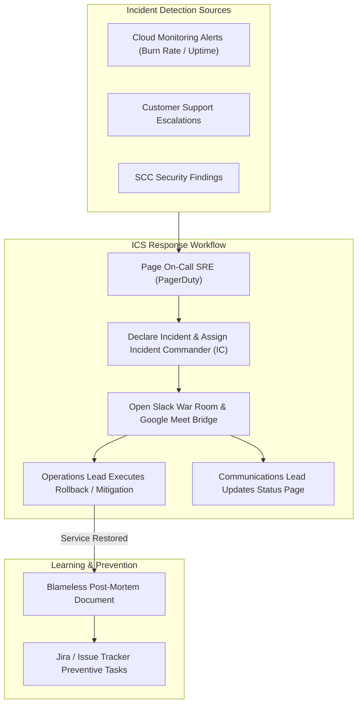

# Topic 121: Incident Management

---

## 1. What Is It?

**Incident Management** on Google Cloud Platform represents the structured, operational workflow, communication framework, toolchain integration, and post-mortem analysis discipline used by Site Reliability Engineering (SRE) and Operations teams to detect, triage, mitigate, resolve, and learn from unexpected service disruptions and outages.

Google's SRE Incident Management framework rests on four core pillars:
1. **Incident Command System (ICS)**: Formal role delegation (Incident Commander, Operations Lead, Communications Lead) during outages to eliminate chaos and guarantee single-point decision making.
2. **Clear Severity Tiering**: Standardized incident categorization (P0/P1 Critical Outage down to P4 Minor Glitch) dictating response SLA expectations and escalation paths.
3. **Automated Tooling Integration**: Seamless connectivity between Cloud Monitoring alerts, PagerDuty, Slack war rooms, Google Meet bridges, and Status Dashboards.
4. **Blameless Post-Mortems**: Structured post-incident reviews focusing on systemic root causes, timeline reconstruction, and preventive action items without assigning personal blame.

### Real-World Analogy
Think of Incident Management like a city emergency fire department responding to a structural fire:
- **Un-managed Incident (Chaos)**: 20 firefighters arriving at a burning building simultaneously, shouting over each other, spraying water into random windows, and arguing about who should connect the hose while the building burns down.
- **Incident Management (ICS Response)**: An Incident Commander arrives in a command vehicle, takes charge of the radio channel, assigns Fire Captain A to search-and-rescue (Ops Lead), assigns Fire Captain B to water supply (Tech Lead), and assigns a Press Officer to update news reporters (Comms Lead). Once the fire is extinguished, the department conducts a blameless investigation to fix faulty electrical wiring codes so future fires don't happen.

---

## 2. Where Does It Fit?

Incident Management sits between automated incident detection engines and long-term reliability engineering remediations.



---

## 3. Core Concepts

| Concept | Description | Production Best Practice |
|---|---|---|
| **Incident Commander (IC)** | Single individual holding ultimate operational authority over incident response and role delegation. | The IC focuses on coordination and strategy, NOT hands-on debugging. |
| **Operations Lead (OL)** | Hands-on engineer executing diagnostic commands, rollbacks, and infrastructure fixes. | Focuses 100% on technical mitigation steps assigned by the IC. |
| **Communications Lead (CL)** | Dedicated individual managing internal executive updates and external status page notices. | Prevents executives from interrupting hands-on engineers during outages. |
| **Severity Tiers (P0-P4)** | Priority rating defining incident urgency (P0/P1 = Total Outage, P2 = Partial Degraded, P3/P4 = Minor). | Establish strict SLA response times per severity tier (e.g., P1 ack < 5 mins). |
| **Blameless Post-Mortem** | Post-incident report documenting timeline, root cause, impact, and preventive action items. | Focus on system flaws, missing guardrails, and process gaps—never individual human error. |

---

## 4. How It Works

The lifecycle of a production incident proceeds through five deterministic phases:

```text
1. DETECT: Cloud Monitoring detects 14.4x Burn Rate -> Pages On-Call SRE via PagerDuty
                               ↓
2. TRIAGE & DECLARE: On-Call SRE assesses impact -> Declares P1 Incident -> Assumes IC Role
                               ↓
3. MITIGATE: IC delegates Ops Lead -> Rollback recent Cloud Run release -> Traffic recovers
                               ↓
4. RESOLVE: Verify SLI metrics back to normal -> Declare Incident RESOLVED -> Close War Room
                               ↓
5. LEARN: Conduct Blameless Post-Mortem -> Log preventative JIRA action items within 48 hours
```

1. **Mitigation First, Root Cause Second**: During active outages, the primary goal is *rapid mitigation* (e.g., rolling back code, restarting instances, routing traffic away), NOT deep root-cause debugging.
2. **Dedicated Comms Channel**: Keep internal technical chatter in a dedicated Slack channel (`#inc-20260809-checkout-down`) and public updates on status pages.

---

## 5. Production Scenario

### P1 Outage Incident Response and Blameless Post-Mortem Workflow

```text
Requirement: Respond to a P1 production database connection exhaustion incident, mitigate user impact within 15 minutes, and publish a Blameless Post-Mortem.
    ↓
Architecture: PagerDuty + Slack Incident Bot + Cloud SQL + Blameless Post-Mortem Template.
    ↓
Step 1: Detection & Declaration (00:00 - 00:03):
  - Cloud Monitoring triggers P1 alert: Cloud SQL connections > 95%.
  - On-Call SRE accepts page -> Declares P1 Incident via Slack `/incident declare`.
  - SRE assumes Incident Commander (IC) role; assigns Engineer B as Ops Lead.
    ↓
Step 2: Mitigation (00:03 - 00:12):
  - Ops Lead identifies a rogue background worker script spawning un-pooled DB connections.
  - IC authorizes killing background worker deployment (`kubectl scale deployment worker --replicas=0`).
  - Active connections drop -> Checkout API SLI recovers to 100%.
    ↓
Step 3: Post-Mortem & Preventive Actions (Day 2):
  - Conduct Blameless Post-Mortem meeting.
  - Root Cause: Missing connection pooling configuration in worker code.
  - Action Items: 1) Implement PgBouncer connection proxy, 2) Add DB connection limits in staging CI/CD tests.
    ↓
Result: Rapid sub-15 minute outage mitigation combined with architectural fixes preventing incident recurrence.
```

*Why Selected*: Illustrates end-to-end Google SRE incident command principles and post-mortem culture.

---

## 6. Hands-On Lab

### Prerequisites
- Active GCP Project with Cloud Monitoring API enabled.
- Cloud Shell or local machine with `gcloud` CLI installed.

### CLI Method

```bash
# 1. Environment configuration
export PROJECT_ID=$(gcloud config get-value project)

# 2. Create a sample Blameless Post-Mortem Markdown Template
cat <<EOF > post_mortem_template.md
# Blameless Post-Mortem: [Incident Title]

**Date**: $(date +%Y-%m-%d)
**Authors**: [Author Names]
**Status**: Complete
**Incident Priority**: P1 (Critical)
**Impact**: [X] users experienced checkout failures for [Y] minutes.

## 1. Executive Summary
Brief high-level summary of what happened, root cause, and resolution.

## 2. Incident Timeline (UTC)
- **14:00** - Cloud Monitoring triggered P1 alert for database connection exhaustion.
- **14:02** - On-Call SRE acknowledged page and assumed Incident Commander role.
- **14:08** - Ops Lead identified rogue worker deployment.
- **14:12** - Worker deployment scaled to zero; database connections normalized.
- **14:15** - Incident declared RESOLVED.

## 3. Root Cause Analysis (5 Whys)
Why did the database connections spike? Worker script opened direct DB connections.
Why did it open direct connections? PgBouncer proxy configuration was missing.
Why was it missing? Staging environment did not mirror production proxy configs.

## 4. What Went Well / What Went Poorly
- **Well**: Fast 2-minute acknowledgement; quick rollback.
- **Poorly**: Lack of staging environment parity allowed un-pooled code into production.

## 5. Preventive Action Items
| Action Item | Type | Owner | Bug Link |
|---|---|---|---|
| Implement PgBouncer proxy on all worker nodes | Prevent | SRE Team | JIRA-101 |
| Add DB connection integration tests to CI/CD | Prevent | Dev Team | JIRA-102 |
EOF

cat post_mortem_template.md
```

### Verification
Execute `cat post_mortem_template.md` and verify the template structure contains Timeline, Root Cause (5 Whys), and Action Items sections.

### Cleanup

```bash
rm -f post_mortem_template.md
```

---

## 7. Security

### Security Incidents & Access Controls
- **Security Incident Escalation**: Security Command Center (SCC) threats or data breach incidents follow a specialized Security Incident Response Plan (SIRP) led by SecOps.
- **Audit Logging Confidentiality**: Ensure war room logs, incident notes, and post-mortems do not leak sensitive PII, customer credentials, or security vulnerabilities before fixes are deployed.

```text
BAD PRACTICE:
Assigning personal blame in post-mortems ("Developer John pushed bad code") or permitting executives to bypass Incident Command to demand status updates from hands-on engineers.

PRODUCTION PRACTICE:
Enforce the Incident Command System (ICS), conduct strictly blameless post-mortems, and assign a Communications Lead to insulate technical operators during outages.
```

---

## 8. Scaling & High Availability

Multi-region incident escalation architecture:

```text
Regional Outage (us-central1 GKE Control Plane Down)
                       ↓
PagerDuty Multi-Tier Escalation Policy:
├── Primary On-Call SRE (5-minute Ack SLA)
├── Secondary On-Call SRE (Escalate after 5 mins if Primary doesn't Ack)
└── SRE Engineering Manager (Escalate after 15 mins)
                       ↓
Incident Commander executes Multi-Region Traffic Failover via Cloud DNS
```

- **Automated Escalation Policies**: Configure multi-tier escalation policies in PagerDuty/Opsgenie to ensure un-acknowledged critical alerts escalate to secondary on-call engineers within 5 minutes.

---

## 9. Cost

### Incident Management Tooling Cost

| Tooling Component | Cost Model | Note |
|---|---|---|
| **Google Cloud Monitoring Alerts** | 100% FREE | Included free with Cloud Monitoring. |
| **PagerDuty / Opsgenie Integration** | Third-party user subscription | Enterprise user licenses. |
| **Incident Post-Mortem Storage** | Free | Google Docs, GitHub, or Notion. |

---

## 10. Monitoring & Troubleshooting

### Operational Telemetry & Post-Incident Auditing
- **Mean Time to Detection (MTTD)**: Measure duration between outage occurrence and automated alert trigger.
- **Mean Time to Resolution (MTTR)**: Measure duration between alert trigger and operational mitigation.

### Troubleshooting Matrix

| Symptom | Cause | Resolution |
|---|---|---|
| Multiple engineers executing conflicting fixes | Lack of clear Incident Commander (ICS) role | Appoint a single Incident Commander immediately to direct response operations. |
| Executive constantly interrupting Ops Lead | No Communications Lead assigned | Appoint a Communications Lead to handle status updates and insulate Ops. |
| Same outage recurs 2 weeks later | Post-mortem action items were not logged or prioritized | Enforce strict tracking of post-mortem action items in JIRA/GitHub Issues. |

---

## 11. Common Mistakes

```text
Mistake: Searching for a "scapegoat" or blaming human error during post-mortems.
Why: Natural human tendency to find quick answers.
Impact: Creates a culture of fear where engineers hide mistakes, delay reporting incidents, and avoid taking operational risks.
Correct Approach: Conduct strictly Blameless Post-Mortems. Assume humans act with good intent based on the information available; fix the underlying software, guardrails, and processes that permitted the error to occur.

Mistake: Attempting to debug the deep root cause of an outage while the service is still down.
Why: Curiosity or wanting to fix the bug directly in production.
Impact: Extends user downtime significantly.
Correct Approach: Focus 100% on immediate MITIGATION (rollback, restart, traffic shift) during active outages; save root-cause debugging for post-incident investigation.
```

---

## 12. Production Best Practices

- [ ] Adopt the **Incident Command System (ICS)** (IC, Ops Lead, Comms Lead roles).
- [ ] Focus on **Rapid Mitigation First**, root-cause debugging second during outages.
- [ ] Appoint a **Communications Lead** to manage executive and customer status updates.
- [ ] Conduct **Blameless Post-Mortems** within 48 hours of major P0/P1 incidents.
- [ ] Use the **"5 Whys" methodology** to identify underlying systemic root causes.
- [ ] Track post-mortem **Preventive Action Items** as high-priority engineering tasks in JIRA.

---

## 13. Hyperscaler / Enterprise Perspective

```text
Personal / Learning
  No Incident Roles → Ad-hoc Debugging in Production → Blaming Developers
        ↓
Small Production
  PagerDuty Escalation → Slack War Room → Basic Post-Mortem Docs
        ↓
Enterprise Environment
  Incident Command System (ICS) → Dedicated Comms Lead → Structured Blameless Post-Mortems
        ↓
Hyperscaler Environment
  Automated Incident Bots (Slack/Teams) → Automated Status Page Ingestion → AI-Assisted Root Cause Telemetry & Action Item Auditing
```

Enterprise hyperscalers operate dedicated **Wheel of Misfortune** role-playing exercises, regularly training engineers on Incident Commander roles by simulating historical production outages in safe sandbox environments.

---

## 14. Real Project Questions

### Q1: What are the primary roles defined under the SRE Incident Command System (ICS)?
**Answer:** The primary roles are:
1. **Incident Commander (IC)**: Holds overall authority, directs high-level strategy, and delegates tasks.
2. **Operations Lead (OL)**: Hands-on engineer executing technical diagnostics, rollbacks, and fixes.
3. **Communications Lead (CL)**: Manages internal executive updates and public status page communications, insulating technical operators from interruptions.

### Q2: Why is "Blamelessness" a non-negotiable requirement for effective post-mortems?
**Answer:** A blameless culture recognizes that humans are inherently fallible and operate in complex environments with incomplete information. If post-mortems assign personal blame, engineers hide mistakes, delay declaring incidents, and withhold critical details. Blameless post-mortems focus on systemic flaws, missing automated guardrails, and process failures, fostering transparent learning and preventing future outages.

### Q3: What is the difference between Mean Time to Detection (MTTD) and Mean Time to Resolution (MTTR)?
**Answer:** **MTTD (Mean Time to Detection)** measures the elapsed time from when an incident actually begins to when it is detected and acknowledged by SREs. **MTTR (Mean Time to Resolution)** measures the elapsed time from when the incident is detected to when technical mitigation restores normal service performance to users.

---

## 15. Quick Decision Guide

| Incident Response Phase | Recommended Action | Primary Role Responsible |
|---|---|---|
| 0-5 Mins: Detection & Acknowledge | Accept Page, Declare Incident, Establish War Room | Incident Commander (IC) |
| 5-15 Mins: Active Outage Mitigation | Execute Rollback, Scale Replicas, Shift DNS Traffic | Operations Lead (OL) |
| 15-30 Mins: Status Updates | Publish Customer Status Page Update & Exec Email | Communications Lead (CL) |
| Post-Incident (Within 48 Hours) | Conduct Blameless Post-Mortem & Create Action Items | SRE & Dev Team Leads |

### When to Use Incident Management
- Mandatory for responding to production service outages, security incidents, data corruption events, and customer-impacting reliability degradations.

### When NOT to Use Incident Management
- Routine planned maintenance or low-priority non-impactful bug fixes in dev environments.

---

## 16. Related Services

```text
               [121. Incident Management]
              /            |            \
    Cloud Monitoring   PagerDuty    Status Dashboards
    (Detects Outage)   (Pages IC)   (Public Comms)
          |                |              |
    Fires Burn Rate    Routes Alert   Updates Users on
    Alert Policies     to On-Call     Outage Mitigation
```

- **Cloud Monitoring**: Alerting engine detecting burn rate spikes and triggering pages.
- **PagerDuty**: Incident dispatch platform executing escalation policies.
- **Status Dashboards**: Public or internal communication platforms updating users during outages.

---

## 17. Cheat Sheet

### Summary of Incident Severity Tiers & Post-Mortem Template

```text
Incident Severity Tiers:
- P0: Total catastrophic outage affecting all users (Ack < 5m)
- P1: Critical core feature outage with no workaround (Ack < 15m)
- P2: Partial degradation affecting a subset of users (Ack < 1h)
- P3: Minor issue with an available workaround (Ack < 1 day)
- P4: Cosmetic bug or low-priority glitch (Standard backlog)
```

```bash
# Example Slack Bot command for declaring incidents
/incident declare priority=P1 title="Checkout API Latency Spike"
```

---

## 18. Learning Connection

- **Previous Topic**: [120. Error Budgets](../120-error-budgets/README.md)
- **Next Topic**: [122. Disaster Recovery](../122-disaster-recovery/README.md)
