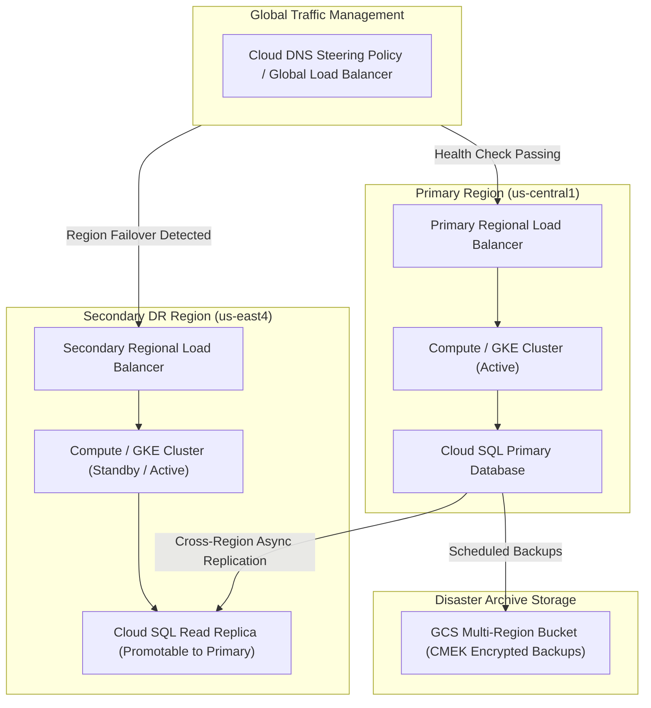

# Topic 122: Disaster Recovery

---

## 1. What Is It?

**Disaster Recovery (DR)** on Google Cloud Platform encompasses the architectural strategies, cross-region failover models, data replication mechanics, and automated restoration procedures engineered to restore critical business applications, database systems, and cloud infrastructure following catastrophic regional outages, natural disasters, human error, or ransomware attacks.

Disaster Recovery architecture centers around four core metrics and patterns:
1. **Recovery Time Objective (RTO)**: The maximum acceptable duration of application downtime following a disaster before business operations are restored.
2. **Recovery Point Objective (RPO)**: The maximum acceptable data loss measured in time (e.g., 5 minutes of lost data) during a disaster recovery failover.
3. **DR Failover Archetypes**: Four standard architectural deployment patterns balancing cost against speed: **Cold Standby** (Pilot Light / Re-create), **Warm Standby** (Scaled Down), **Hot Standby** (Multi-Region Active-Passive), and **Multi-Region Active-Active**.
4. **Cross-Region Data Replication**: Asynchronous or synchronous replication across geographic GCP regions using Cloud Storage Multi-Region, Cloud SQL Cross-Region Replicas, and Cloud Spanner.

### Real-World Analogy
Think of Disaster Recovery like backup arrangements for a major corporate office building:
- **Cold Standby (Backup Storage Lease)**: Keeping an empty commercial space in a neighboring city. If a fire destroys your main building, you order desks, wait for computers to ship (Deploying Terraform), and resume business 3 days later (RTO = 3 Days, Lowest Cost).
- **Warm Standby (Pilot Light Branch)**: Maintaining a small functional branch office in another city with 5 core staff members and live paper records synced daily. If the main office burns, you send the rest of the staff over, scale up workstations, and resume full operations in 2 hours (RTO = 2 Hours).
- **Multi-Region Active-Active (Twin Towers)**: Running two identical 500-person office buildings simultaneously in two different cities, with live video connections and instant work sharing. If a meteor strikes City A, City B handles 100% of customers instantly with zero downtime (RTO = 0, Highest Cost).

---

## 2. Where Does It Fit?

Disaster Recovery design spans network DNS failover routing, cross-region data replication, and automated IaC infrastructure provisioning.



---

## 3. Core Concepts

| DR Archetype | RTO (Downtime) | RPO (Data Loss) | Cost | Architecture Description |
|---|---|---|---|---|
| **Cold Standby (Backup & Restore)** | Hours to Days | Hours to Days | $ (Lowest) | Infrastructure created via Terraform after disaster strikes; data restored from GCS backups. |
| **Warm Standby (Pilot Light)** | Minutes to Hours | Seconds to Minutes | $$ (Moderate) | Minimal core infrastructure running continuously in DR region; DB replica active. |
| **Hot Standby (Active-Passive)** | Seconds to Minutes | Near Zero | $$$ (High) | Full capacity running in DR region; traffic fails over instantly via Load Balancer / DNS. |
| **Active-Active (Multi-Region)** | Zero (Sub-Second) | Zero (Synchronous) | $$$$ (Highest) | Active traffic served simultaneously from 2+ regions using Cloud Spanner / Global LB. |

---

## 4. How It Works

A Regional DR Failover sequence for a Warm Standby architecture functions as follows:

```text
Primary Region (us-central1) experiences catastrophic outage
                               ↓
Global Load Balancer / Cloud DNS Health Checks fail on Primary Region
                               ↓
1. Reroute incoming user traffic to Secondary DR Region (us-east4)
                               ↓
2. Promote Cloud SQL Cross-Region Read Replica to standalone Primary DB
                               ↓
3. Scale up Compute Engine MIGs / GKE Pods in Secondary Region from 10% to 100%
                               ↓
Application fully operational in Secondary Region -> Log RTO & RPO metrics
```

1. **RPO Data Loss Threshold**: In asynchronous database replication, transactions committed in the primary region right before an abrupt regional power loss may not have reached the replica yet, resulting in a small RPO data gap (e.g., 5 seconds of lost transactions).
2. **Synchronous Multi-Region (Cloud Spanner)**: Cloud Spanner uses TrueTime and Paxos consensus across multi-region configurations to achieve synchronous replication with RPO = 0 and RTO = 0.

---

## 5. Production Scenario

### Cross-Region Automated Failover for Cloud SQL and GKE

```text
Requirement: Establish a Warm Standby Disaster Recovery architecture for an enterprise financial portal with RTO < 15 minutes and RPO < 1 minute, failing over from `us-central1` to `us-east4`.
    ↓
Architecture: Global External HTTP(S) Load Balancer + GKE Dual-Region Clusters + Cloud SQL Cross-Region Replica.
    ↓
Step 1: Deploy Primary Cloud SQL in `us-central1` + Cross-Region Read Replica in `us-east4`.
Step 2: Deploy active GKE cluster in `us-central1` (100% capacity) + Standby GKE cluster in `us-east4` (10% minimal capacity).
Step 3: Configure Global Load Balancer with health checks pointing to both GKE backend services.
Step 4: Execute DR Failover Script during primary region failure:
  - Promote Cloud SQL Replica: `gcloud sql instances promote-replica prod-db-replica`
  - Scale up DR GKE Cluster: `gcloud container clusters resize gke-dr --num-nodes=10 --region=us-east4`
  - Global LB automatically routes 100% traffic to `us-east4`.
    ↓
Result: Successful regional failover completed in 8 minutes (RTO = 8m, RPO = 12s), meeting enterprise compliance targets.
```

*Why Selected*: Demonstrates native GCP multi-region database replication and managed load balancer failover capabilities.

---

## 6. Hands-On Lab

### Prerequisites
- Active GCP Project with Cloud SQL and Compute Engine APIs enabled.
- Cloud Shell or local machine with `gcloud` CLI installed.

### CLI Method

```bash
# 1. Environment configuration
export PROJECT_ID=$(gcloud config get-value project)
export PRIMARY_REGION="us-central1"
export DR_REGION="us-east4"
export PRIMARY_DB="lab-db-primary"
export REPLICA_DB="lab-db-replica"

# 2. Enable APIs
gcloud services enable sqladmin.googleapis.com compute.googleapis.com

# 3. Provision Primary Cloud SQL PostgreSQL Instance in us-central1
gcloud sql instances create ${PRIMARY_DB} \
  --database-version=POSTGRES_15 \
  --tier=db-custom-2-7680 \
  --region=${PRIMARY_REGION} \
  --backup-start-time=03:00 \
  --enable-bin-log

# 4. Create Cross-Region Read Replica in us-east4
gcloud sql instances create ${REPLICA_DB} \
  --master-instance-name=${PRIMARY_DB} \
  --region=${DR_REGION} \
  --tier=db-custom-2-7680

# 5. List Cloud SQL instances to verify replication status
gcloud sql instances list
```

### Verification
Execute `gcloud sql instances list` and confirm `${REPLICA_DB}` is listed with primary instance `${PRIMARY_DB}` in `us-east4`.

### Cleanup

```bash
gcloud sql instances delete ${REPLICA_DB} --quiet
gcloud sql instances delete ${PRIMARY_DB} --quiet
```

---

## 7. Security

### DR Security & Encrypted Backups
- **CMEK Replication**: Ensure Customer-Managed Encryption Keys (CMEK) exist in *both* primary and secondary DR regions to decrypt cross-region storage backups.
- **Ransomware Data Protection**: Enable **Object Lock (Bucket Lock)** with Retention Policies on GCS backup buckets to prevent ransomware from deleting or overwriting database backups.

```text
BAD PRACTICE:
Storing backups in a single GCS bucket in the same region as primary servers without versioning or object locking.

PRODUCTION PRACTICE:
Replicate backups to multi-region GCS buckets, enable Object Locking for immutable ransomware protection, and colocate CMEK keys in both DR regions.
```

---

## 8. Scaling & High Availability

Multi-region failover traffic routing topologies:

```text
Global External HTTP(S) Load Balancer (Single Anycast IPv4 Address)
                               ↓
Primary Backend (us-central1) [Health: OK] ---> Serves 100% Global User Traffic
Secondary Backend (us-east4)  [Health: OK] ---> Serves 0% Warm Standby Traffic
                               ↓ (Primary Region Outage Occurs)
Primary Backend (us-central1) [Health: FAIL]
Secondary Backend (us-east4)  [Health: OK] ---> Automatically Serves 100% Traffic (<10s Failover)
```

- **Global Anycast IP Routing**: Global External HTTP(S) Load Balancers use a single anycast IP address, automatically rerouting traffic to secondary regional backends in seconds without requiring DNS propagation delays.

---

## 9. Cost

### Disaster Recovery Cost Economics

| DR Archetype | Compute Cost | Storage & Replication Cost | Business Risk |
|---|---|---|---|
| **Cold Standby** | $0 / month (No running VMs) | Low (GCS backup storage) | High RTO (Hours/Days of downtime) |
| **Warm Standby** | ~10-20% of Primary spend | Moderate (Cross-region DB replica) | Low RTO (Minutes of downtime) |
| **Active-Active** | 200% of Primary spend | High (Dual-region full infrastructure) | Zero RTO (Near-zero downtime) |

---

## 10. Monitoring & Troubleshooting

### Operational Telemetry & DR Testing
- **Replication Lag Metric**: Monitor `cloudsql.googleapis.com/database/replication/replica_lag` in Cloud Monitoring to track real-time RPO metrics.
- **GameDay DR Testing**: Conduct bi-annual simulated regional failover drills ("GameDays") to validate runbooks and measure actual RTO/RPO performance.

### Troubleshooting Matrix

| Symptom | Cause | Resolution |
|---|---|---|
| Replication lag spiking high (>300s) | Heavy write load on primary or network throttling to DR region | Scale up secondary replica machine size or reduce batch write sizes. |
| Cannot promote Cloud SQL replica | Master instance active or network communication intact | Use `--force` flag or break master-replica link in Cloud Console during true disasters. |
| DR region VMs fail to boot during failover | GCP compute quota exceeded in secondary region | Request identical compute vCPU quotas in primary and DR regions. |

---

## 11. Common Mistakes

```text
Mistake: Failing to test Disaster Recovery failover runbooks in a real GameDay drill.
Why: Assuming automation scripts written 2 years ago will work perfectly during a real crisis.
Impact: Failover fails during an actual regional outage due to outdated API calls, missing IAM permissions, or expired credentials.
Correct Approach: Conduct mandatory bi-annual GameDay DR failover drills in staging and production.

Mistake: Storing database backups exclusively in a single regional GCS bucket.
Why: Minimizing storage charges.
Impact: A regional outage or GCS region failure makes both live databases and backups unavailable simultaneously.
Correct Approach: Store backups in Multi-Region GCS buckets or execute cross-region bucket replication (`gcloud storage buckets update --gcs-location=...`).
```

---

## 12. Production Best Practices

- [ ] Formally define **RTO** and **RPO** targets with business leadership per application.
- [ ] Implement **Cross-Region Replication** for primary database systems (Cloud SQL, Spanner).
- [ ] Use **Global External HTTP(S) Load Balancers** for sub-minute Anycast IP failover.
- [ ] Store backups in **Multi-Region GCS Buckets** with Object Lock enabled for ransomware protection.
- [ ] Ensure **vCPU Quotas** in secondary DR regions match primary region allocations.
- [ ] Conduct bi-annual **GameDay DR Failover Drills** to validate operational runbooks.

---

## 13. Hyperscaler / Enterprise Perspective

```text
Personal / Learning
  Single-Zone VM → Manual Database Dumps → No DR Plan
        ↓
Small Production
  Single-Region Multi-Zone MIG → Automated Daily GCS Backups → Cold Standby
        ↓
Enterprise Environment
  Warm Standby (Pilot Light) → Cloud SQL Cross-Region Replica → Anycast IP Load Balancer Failover
        ↓
Hyperscaler Environment
  Multi-Region Active-Active (Cloud Spanner Paxos) → Automated Chaos Engineering Region Drain → Sub-Second RTO / Zero RPO
```

Enterprise hyperscalers utilize **Cloud Spanner Multi-Region** configurations, distributing data across 3+ geographic regions using Paxos consensus, achieving sub-second RTO and absolute zero RPO data loss even during complete regional datacenter destruction.

---

## 14. Real Project Questions

### Q1: What is the technical distinction between Recovery Time Objective (RTO) and Recovery Point Objective (RPO)?
**Answer:** **RTO (Recovery Time Objective)** is the maximum acceptable duration of application downtime following a disaster before systems are restored (e.g., system must be back online within 15 minutes). **RPO (Recovery Point Objective)** is the maximum acceptable data loss measured in time (e.g., maximum 30 seconds of lost database transactions during failover).

### Q2: Why are Global External HTTP(S) Load Balancers superior to traditional DNS failover for Disaster Recovery?
**Answer:** Traditional DNS failover relies on updating A/AAAA records, which is delayed by client-side DNS caching and TTL (Time-To-Live) settings, taking up to 30-60 minutes for all global traffic to migrate. Global Load Balancers use a single **Anycast IPv4/IPv6 Address** that automatically reroutes incoming traffic at Google's global edge network to healthy secondary regional backends within seconds.

### Q3: What is the "Pilot Light" (Warm Standby) Disaster Recovery pattern?
**Answer:** The **Pilot Light** pattern maintains a minimal core version of infrastructure running continuously in a secondary DR region (e.g., a cross-region database replica and scaled-down 1-node Compute/GKE group). When a disaster destroys the primary region, the secondary database is promoted and the compute tier is rapidly scaled up to 100% capacity, offering fast RTO at a fraction of full multi-region active-active costs.

---

## 15. Quick Decision Guide

| Business RTO / RPO Target | Recommended DR Archetype | Cost Impact |
|---|---|---|
| RTO: Hours/Days, RPO: Hours | Cold Standby (Backup & Restore via IaC) | $ (Lowest Cost) |
| RTO: < 15 Mins, RPO: < 1 Min | Warm Standby (Pilot Light + DB Replica) | $$ (Moderate Cost) |
| RTO: Near Zero, RPO: Zero | Multi-Region Active-Active (Spanner / Global LB) | $$$$ (Highest Cost) |

### When to Use Disaster Recovery Architecture
- Mandatory for enterprise mission-critical workloads, financial systems, healthcare platforms, and regulated business environments.

### When NOT to Use Disaster Recovery Architecture
- Disposable sandbox testing environments or temporary internal build workers.

---

## 16. Related Services

```text
                  [122. Disaster Recovery]
                 /           |            \
       Global Load Balancer Cloud SQL     Cloud Storage
      (Anycast Failover)  (Cross-Region) (Multi-Region Backups)
             |               |                 |
       Reroutes Traffic   Replicates Data   Stores Immutable
       in Seconds         to DR Region      Data Archives
```

- **Global Load Balancers**: Anycast network ingress routing traffic to healthy DR regions.
- **Cloud SQL**: Managed relational database engine supporting cross-region read replicas.
- **Cloud Storage**: Multi-region object storage platform holding backup archives.

---

## 17. Cheat Sheet

### Common gcloud DR Commands

```bash
# Promote a Cloud SQL Cross-Region Read Replica to Primary
gcloud sql instances promote-replica my-db-replica

# Scale up a GKE Cluster in DR Region during failover
gcloud container clusters resize my-gke-dr-cluster --region=us-east4 --num-nodes=20

# Create a Cloud Storage Bucket with Multi-Region Geo Redundancy
gcloud storage buckets create gs://my-dr-backups --location=US --default-storage-class=STANDARD

# Update Global Load Balancer backend service to include DR region
gcloud compute backend-services add-backend my-global-backend --instance-group=dr-mig --instance-group-region=us-east4 --global
```

---

## 18. Learning Connection

- **Previous Topic**: [121. Incident Management](../121-incident-management/README.md)
- **Next Topic**: [123. Chaos Engineering](../123-chaos-engineering/README.md)
