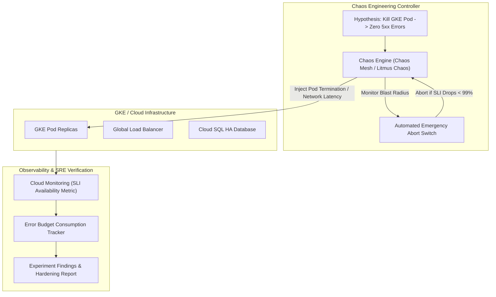

# Topic 123: Chaos Engineering

---

## 1. What Is It?

**Chaos Engineering** on Google Cloud Platform is the disciplined, scientific practice of injecting controlled, simulated failures into production or pre-production cloud systems to uncover hidden architectural vulnerabilities, validate self-healing resilience mechanisms, and build confidence in a system's capability to withstand turbulent operational conditions.

Chaos Engineering rests on four core operational principles:
1. **Hypothesis-Driven Testing**: Formulating explicit hypotheses regarding system behavior before injecting faults (e.g., "Terminating 20% of GKE worker nodes will not increase API latency beyond 250ms").
2. **Blast Radius Control**: Starting fault injection experiments in small, isolated environments (staging) before expanding experiments safely to production with automated emergency abort switches.
3. **Controlled Fault Injection**: Injecting realistic failure modes using open-source tools (Chaos Mesh, LitmusChaos, Gremlin) including packet latency, CPU stress, pod termination, memory leaks, and network partitioning.
4. **SLI/SLO Telemetry Validation**: Observing real-time Cloud Monitoring dashboards during experiments to verify whether automated failover systems (Autoscalers, Load Balancers, Multi-Region DBs) maintain SLO compliance.

### Real-World Analogy
Think of Chaos Engineering like routine commercial airplane emergency simulation drills:
- **Untested System (Hoping Nothing Breaks)**: Pilots flying a passenger airplane praying that an engine never fails in mid-air, having never practiced what controls to pull if a failure occurs.
- **Chaos Engineering**: Pilots deliberately switching off an engine in a high-tech flight simulator (Staging Fault Injection) or conducting controlled single-engine flight tests with safety pilots present (Production Blast Radius Control). The test validates that automatic backup generators switch on seamlessly (Auto-Healing) and that pilots execute emergency checklists calmly without crashing the airplane.

---

## 2. Where Does It Fit?

Chaos Engineering operates across Kubernetes clusters, serverless applications, and cloud network tiers, validating Observability and SRE governance.



---

## 3. Core Concepts

| Concept | Description | Production Best Practice |
|---|---|---|
| **Steady State** | Baseline system performance measured by SLIs under normal operational conditions. | Always establish a stable steady state before launching chaos experiments. |
| **Blast Radius** | The geographic or structural scope of a chaos experiment (Single Pod -> Node Pool -> Region). | Start with minimal blast radius in staging before testing in production. |
| **Fault Injection** | Deliberately introducing failures (e.g., `pod-kill`, `network-delay`, `disk-fill`, `dns-error`). | Test failure modes that have actually caused past historical outages. |
| **Abort Switch** | Automated safety trigger that instantly halts chaos experiments if SLIs breach safety thresholds. | Configure automated abort rules tied to Cloud Monitoring alerting webhooks. |
| **GameDay** | Scheduled team event where engineers execute chaos scenarios and practice incident response. | Conduct monthly GameDays to train new SREs on incident command procedures. |

---

## 4. How It Works

Executing a Chaos Engineering experiment follows a 5-step scientific methodology:

```text
1. Define Steady State -> Verify Availability SLI = 99.95% on Cloud Monitoring
                               ↓
2. Formulate Hypothesis -> "Injecting 200ms latency to Service B will not breach 500ms API SLO"
                               ↓
3. Launch Experiment -> Chaos Mesh applies 200ms synthetic packet delay to Service B
                               ↓
4. Monitor Telemetry -> SLI remains 99.92% (Hypothesis Validated) OR SLI drops to 90% (Abort Switch Triggered)
                               ↓
5. Remediate & Harden -> Implement circuit breakers / timeouts -> Re-run experiment
```

1. **Unspent Error Budget Rule**: Never execute chaos experiments in production if the service's monthly Error Budget is 100% exhausted (0% remaining).
2. **GameDay Role-Playing**: During GameDays, an "Experiment Master" injects unannounced faults while the "On-Call SRE" practices diagnosing and mitigating the issue using standard incident response runbooks.

---

## 5. Production Scenario

### GKE Pod Termination Chaos Experiment using Chaos Mesh and Cloud Monitoring Abort Switches

```text
Requirement: Validate that a GKE payment processing microservice maintains 99.9% availability during random Pod terminations, automatically aborting the experiment if HTTP 5xx error rates exceed 1%.
    ↓
Architecture: GKE Autopilot + Chaos Mesh Controller + Cloud Monitoring Webhook Abort.
    ↓
Step 1: Install Chaos Mesh on GKE cluster via Helm.
Step 2: Define Chaos Experiment YAML (`pod-kill-experiment.yaml`):
    apiVersion: chaos-mesh.org/v1alpha1
    kind: PodChaos
    metadata:
      name: payment-pod-kill-test
      namespace: prod-apps
    spec:
      action: pod-kill
      mode: fixed
      value: '2'
      duration: '5m'
      selector:
        namespaces: ['prod-apps']
        labelSelectors:
          'app': 'payment-api'
      scheduler:
        cron: '@every 10m'
    ↓
Step 3: Apply experiment manifest: `kubectl apply -f pod-kill-experiment.yaml`.
Step 4: Monitor Cloud Monitoring dashboard during 5-minute experiment window.
    ↓
Result: GKE Pod Disruption Budgets (PDB) and Horizontal Pod Autoscalers (HPA) maintain 100% request success; hypothesis validated.
```

*Why Selected*: Demonstrates native Kubernetes chaos injection using open-source tools with automated telemetry monitoring.

---

## 6. Hands-On Lab

### Prerequisites
- Active GCP Project with GKE and Cloud Monitoring APIs enabled.
- Existing GKE cluster or Cloud Shell environment with `kubectl` and `helm` installed.

### CLI Method

```bash
# 1. Environment configuration
export PROJECT_ID=$(gcloud config get-value project)
export REGION="us-central1"
export CLUSTER_NAME="chaos-lab-cluster"

# 2. Enable GKE API
gcloud services enable container.googleapis.com

# 3. Create a GKE Autopilot cluster
gcloud container clusters create-auto ${CLUSTER_NAME} --region=${REGION}

# 4. Get cluster credentials
gcloud container clusters get-credentials ${CLUSTER_NAME} --region=${REGION}

# 5. Install Chaos Mesh using Helm
helm repo add chaos-mesh https://charts.chaos-mesh.org
helm repo update
kubectl create namespace chaos-testing
helm install chaos-mesh chaos-mesh/chaos-mesh \
  --namespace=chaos-testing \
  --set chaosDaemon.runtime=containerd \
  --set chaosDaemon.socketPath=/run/containerd/containerd.sock

# 6. Verify Chaos Mesh pods are running
kubectl get pods -n chaos-testing
```

### Verification
Execute `kubectl get pods -n chaos-testing` and confirm `chaos-controller-manager` and `chaos-daemon` Pods are in `Running` status.

### Cleanup

```bash
helm uninstall chaos-mesh -n chaos-testing
kubectl delete namespace chaos-testing
gcloud container clusters delete ${CLUSTER_NAME} --region=${REGION} --quiet
```

---

## 7. Security

### Chaos Engineering Security & Guardrails
- **RBAC Experiment Isolation**: Restrict Chaos Mesh / Litmus Chaos CRD creation permissions (`chaos-mesh.org/*`) to authorized SRE teams via Kubernetes RBAC.
- **Production Emergency Abort**: Always maintain an automated "Stop All Experiments" script (`kubectl delete chaos --all`) to instantly remove all injected faults during unexpected outages.

```text
BAD PRACTICE:
Running un-monitored chaos experiments in production without an automated abort switch or running chaos tests when the Error Budget is 100% depleted.

PRODUCTION PRACTICE:
Enforce strict RBAC controls over chaos CRDs, require positive Error Budget balances before testing, and implement automated Cloud Monitoring abort webhooks.
```

---

## 8. Scaling & High Availability

Progressive chaos blast radius expansion topology:

```text
Staging Cluster (Inject CPU Stress & Packet Loss -> Validate Circuit Breakers)
                       ↓ (Success -> Expand Scope)
Production Single Pod Kill (Inject 1 Pod Termination -> Validate Pod Disruption Budgets)
                       ↓ (Success -> Expand Scope)
Production Multi-Zone Node Drain (Drain 1 Zone -> Validate Regional LB Failover)
```

- **Blast Radius Escalation**: Never launch multi-zone or cross-region chaos experiments until single-pod and single-node experiments pass cleanly in pre-production staging.

---

## 9. Cost

### Chaos Engineering Tooling Cost

| Tooling Component | License Model | Note |
|---|---|---|
| **Chaos Mesh / LitmusChaos** | 100% Free Open Source (CNCF) | Apache 2.0 open-source license. |
| **GCP Compute / GKE Nodes** | Standard GCP rates | Minor compute spend during CPU/Memory stress tests. |
| **Gremlin (Commercial SaaS)** | Third-Party Subscription | Commercial enterprise chaos platform. |

---

## 10. Monitoring & Troubleshooting

### Operational Telemetry & Experiment Verification
- **Real-Time SLI Monitoring**: Keep Cloud Monitoring dashboards open during chaos runs to track Availability and Latency SLI metric curves.
- **Circuit Breaker Metrics**: Track Istio / Anthos Service Mesh metrics (`envoy_cluster_upstream_rq_pending_overflow`) to verify circuit breakers trip properly.

### Troubleshooting Matrix

| Symptom | Cause | Resolution |
|---|---|---|
| Chaos experiment crashes cluster completely | Blast radius too large or missing Pod Disruption Budgets (PDB) | Execute emergency abort (`kubectl delete chaos --all`) and add PDBs to manifests. |
| Fault injection fails to execute | Chaos Daemon lacks container runtime socket access | Verify `socketPath` matches container runtime (containerd/docker). |
| Application latency remains high after chaos ends | Application thread pool deadlocked by injected delay | Implement connection timeouts and circuit breaker patterns in app code. |

---

## 11. Common Mistakes

```text
Mistake: Running chaos experiments in production without informing the on-call SRE team.
Why: Trying to test team reaction times unannounced.
Impact: Causes genuine panic, wastes SRE time waking up leads, and damages team trust.
Correct Approach: Announce production Chaos Experiments and GameDays in advance; test system resilience, not human panic responses.

Mistake: Injecting faults into production when the service's monthly Error Budget is already exhausted.
Why: Following a rigid chaos testing calendar schedule.
Impact: Consumes remaining non-existent budget, causing customer SLA breaches and legal credit penalties.
Correct Approach: Automatically halt all production chaos experiments if remaining Error Budget falls below 20%.
```

---

## 12. Production Best Practices

- [ ] Formulate a clear **Hypothesis** before every chaos experiment.
- [ ] Establish a **Stable Steady State** using SLI metrics prior to testing.
- [ ] Implement an **Automated Emergency Abort Switch** tied to Cloud Monitoring alerts.
- [ ] Only run production chaos experiments when **Error Budgets are Healthy (>20%)**.
- [ ] Start with a minimal **Blast Radius** in staging before scaling to production.
- [ ] Implement **Pod Disruption Budgets (PDB)** and **Circuit Breakers** in code.

---

## 13. Hyperscaler / Enterprise Perspective

```text
Personal / Learning
  No Chaos Testing → Manual Container Kills → Hope System Recovers
        ↓
Small Production
  Staging Chaos Mesh Tests → Single Pod Kill Experiments → Manual Abort
        ↓
Enterprise Environment
  Automated GameDay Drills → Automated Cloud Monitoring Abort Switches → Circuit Breaker Validation
        ↓
Hyperscaler Environment
  Continuous Production Chaos Engineering (Simian Army / Chaos Automation) → Multi-Region Region Drain Testing → Automated Reliability Verification Pipelines
```

Enterprise hyperscalers operate **Continuous Production Chaos Automation** (inspired by Netflix's Simian Army / Chaos Monkey), randomly terminating production GKE instances and draining entire availability zones during business hours to guarantee continuous architectural resilience.

---

## 14. Real Project Questions

### Q1: What is the primary objective of Chaos Engineering in Site Reliability Engineering?
**Answer:** The primary objective is to proactively identify hidden architectural vulnerabilities, single points of failure, and systemic weaknesses in complex cloud systems *before* they cause real production outages. It validates that automated self-healing mechanisms (Autoscaling, Circuit Breakers, Failover Routing) function as designed under stress.

### Q2: What is an "Emergency Abort Switch" in Chaos Engineering and why is it critical?
**Answer:** An **Emergency Abort Switch** is an automated or manual safety mechanism that immediately halts all active fault injection experiments and removes injected failure conditions (e.g., deleting Chaos CRDs). It is critical because if an experiment causes unexpected cascading failures that threaten customer SLAs, the abort switch restores normal operations instantly.

### Q3: Why should production Chaos Experiments be paused when a service's Error Budget is exhausted?
**Answer:** The Error Budget is the allowable margin of unreliability reserved for software releases and system turbulence. If the Error Budget is exhausted (0% remaining), the service is already in breach of its SLO. Running additional chaos experiments would inject deliberate unreliability, further impacting real paying customers and causing financial SLA penalties.

---

## 15. Quick Decision Guide

| Chaos Testing Goal | Recommended Tool | Advantage |
|---|---|---|
| Kubernetes Pod / Network / CPU Chaos | Chaos Mesh (CNCF) | Native Kubernetes CRD manifests & visual web UI. |
| Enterprise SaaS Chaos Management | Gremlin | Commercial platform with built-in safety guardrails. |
| Service Mesh Traffic & Fault Injection | Anthos Service Mesh / Istio | Zero-code HTTP delay and fault injection at sidecar level. |

### When to Use Chaos Engineering
- Essential for validating high-availability architectures, microservice resilience, SRE GameDays, and automated failover systems on GCP.

### When NOT to Use Chaos Engineering
- Immature systems lacking basic monitoring, alerting, or steady-state SLI definitions.

---

## 16. Related Services

```text
                  [123. Chaos Engineering]
                 /           |            \
       Cloud Monitoring  Chaos Mesh / Litmus GKE / Cloud Run
      (Steady State SLI)(Fault Injector)   (Target Workloads)
             |               |                    |
       Monitors Experiment  Injects Pod / Network Testers Workload
       Blast Radius         Chaos Faults          Resilience
```

- **Cloud Monitoring**: Telemetry engine measuring steady state SLIs and triggering abort rules.
- **Chaos Mesh / LitmusChaos**: Open-source chaos controllers injecting faults into GKE.
- **GKE / Cloud Run**: Target compute runtimes undergoing chaos testing.

---

## 17. Cheat Sheet

### Common Chaos Mesh YAML Snippet & CLI Commands

```yaml
# Pod Chaos Termination Example
apiVersion: chaos-mesh.org/v1alpha1
kind: PodChaos
metadata:
  name: pod-kill-demo
spec:
  action: pod-kill
  mode: one
  selector:
    namespaces: ['default']
    labelSelectors:
      'app': 'web'
```

```bash
# Emergency Abort: Delete all active Chaos Mesh experiments immediately
kubectl delete chaos --all --all-namespaces

# List active Chaos Mesh experiments
kubectl get chaos -A
```

---

## 18. Learning Connection

- **Previous Topic**: [122. Disaster Recovery](../122-disaster-recovery/README.md)
- **Next Topic**: N/A (End of GCP Hyperscaler Curriculum)
