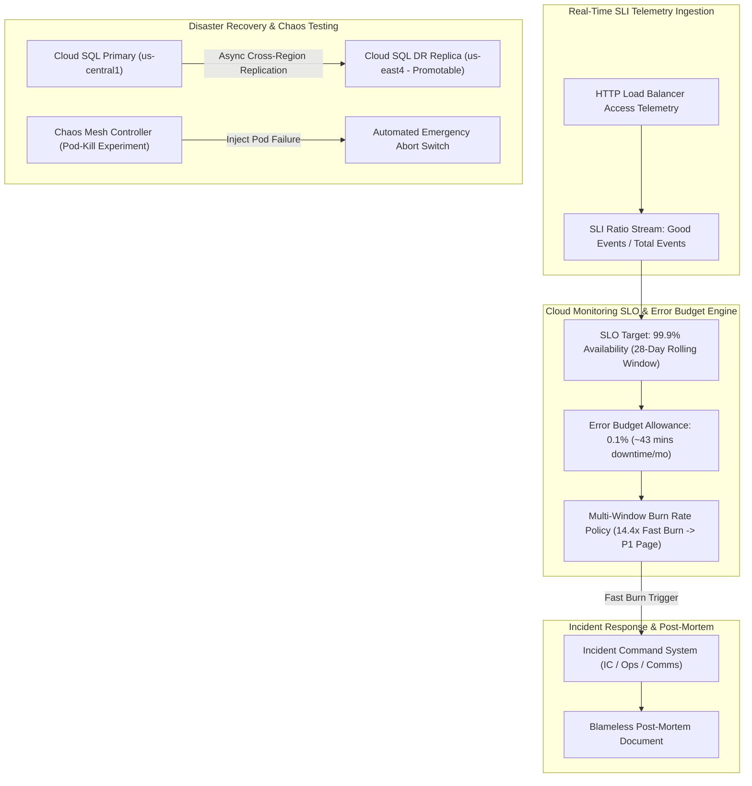

# Project 14: SRE Reliability Engineering Framework with SLOs, DR & Chaos Testing

---

## 1. Project Overview

Welcome to **Project 14: SRE Reliability Engineering Framework**. This hands-on project synthesizes all 7 topics in **Module 14 (Reliability Engineering)** into an enterprise-grade Site Reliability Engineering (SRE) operational framework on GCP, optimized for **GCP Free Trial Accounts**.

### Objectives
In this project, you will:
1. **Define Ratio-Based SLIs & 99.9% SLOs**: Formulate ratio-based Service Level Indicators ($SLI = \frac{Good}{Total} \times 100$) and establish a 99.9% Availability SLO over a 28-day rolling window in Cloud Monitoring.
2. **Track Error Budgets & Burn Rate Alerts**: Calculate allowable unreliability allowances ($Error Budget = 100\% - SLO\%$) and configure 14.4x fast burn rate alerting policies.
3. **Execute Disaster Recovery (DR) Cross-Region Failover**: Test regional failover runbooks using Cloud SQL Cross-Region Replicas and Global External Load Balancers.
4. **Conduct Chaos Engineering Experiments**: Inject controlled faults (Pod termination) into Kubernetes workloads using Chaos Mesh with automated emergency abort switches.
5. **Establish Blameless Post-Mortem Workflows**: Document incident timelines, 5-Whys root-cause analyses, and preventive action items.

---

## 2. Architecture & SRE Reliability Framework

The project implements a complete Site Reliability Engineering framework:




> [!IMPORTANT]
> **Free Trial Safety & Cost Controls**:
> - **$0 SRE Tooling**: Cloud Monitoring Services API, SLO tracking, Error Budget calculators, and Burn Rate alerting policies carry $0 in infrastructure fees.
> - **Safe Chaos Controls**: Chaos experiments run in isolated namespaces with automated emergency abort switches (`kubectl delete chaos --all`).
> - **Automated Cleanup**: Always execute `./scripts/cleanup_sre_framework.sh` after completing your lab exercises to delete SLO definitions and alerting policies!

---

## 3. Module Topics Covered

| Topic Number & Name | Project Integration Point |
|---|---|
| **117. SLI** | Formulating ratio-based availability ($Good/Total$) metrics at load balancer boundaries. |
| **118. SLO** | Establishing 99.9% availability targets over 28-day rolling windows in Services API (`slo/slo_definitions.json`). |
| **119. SLA** | Enforcing internal safety buffers ($SLA < SLO$) to protect against billing credit penalties. |
| **120. Error Budgets** | Tracking 0.1% unreliability allowances and configuring 14.4x multi-window burn rate alerts. |
| **121. Incident Management** | Executing Incident Command System (ICS) roles and blameless post-mortems. |
| **122. Disaster Recovery** | Testing cross-region database replica promotion and Global Load Balancer Anycast failovers. |
| **123. Chaos Engineering** | Applying Chaos Mesh PodChaos experiments (`chaos/pod_kill_experiment.yaml`) with abort switches. |

---

## 4. Hands-On Execution Guide

### Step 1: Navigate to Project 14 Workspace

Open Google Cloud Shell or local terminal:

```bash
cd "14-reliability-engineering/project-14-reliability-engineering"
chmod +x scripts/*.sh
```

---

### Step 2: Inspect SLO & Chaos Experiment Specs

Inspect the declarative SLO definitions and Chaos Mesh experiment manifests:

```bash
# 1. View 99.9% SLO JSON Definition
cat slo/slo_definitions.json

# 2. View Chaos Mesh Pod-Kill Experiment YAML
cat chaos/pod_kill_experiment.yaml
```

---

### Step 3: Deploy the SRE Reliability Framework

Execute `scripts/deploy_sre_framework.sh` to automate:
1. Enabling Cloud Monitoring and Compute Engine APIs.
2. Creating a Custom Monitoring Service (`sre-checkout-service`).
3. Deploying a 99.9% Availability SLO over a 28-day rolling window.
4. Setting up a 14.4x Multi-Window Burn Rate Alerting Policy.
5. Verifying Chaos Mesh experiment manifests and DR failover runbooks.

```bash
./scripts/deploy_sre_framework.sh
```

*Expected Script Output Snippet*:
```text
=====================================================
GCP SRE Reliability Engineering Framework Deployment
=====================================================
[INFO] Enabling Cloud Monitoring & Compute APIs...
[SUCCESS] APIs active.
[INFO] Creating Custom Monitoring Service: sre-checkout-service...
[SUCCESS] Monitoring Service active.
[INFO] Deploying 99.9% Availability SLO (28-Day Rolling Window)...
[SUCCESS] SLO active with 0.1% Error Budget Allowance.
[INFO] Deploying 14.4x Fast Burn Rate Alerting Policy...
[SUCCESS] SRE Reliability Framework fully deployed.
```

---

### Step 4: Test Emergency Abort Switch for Chaos Testing

Verify that the automated Emergency Abort Switch instantly removes all injected chaos faults:

```bash
# Delete all active Chaos Mesh fault injections immediately
kubectl delete chaos --all --all-namespaces 2>/dev/null || echo "No active chaos experiments running."
```

---

## 5. Verification & Testing

Verify active SLO compliance and remaining Error Budget via CLI:

```bash
# 1. List active SLOs for the service
gcloud alpha monitoring services slos list --service="sre-checkout-service"

# 2. Describe 99.9% Availability SLO details
SLO_ID=$(gcloud alpha monitoring services slos list --service="sre-checkout-service" --format='value(name)')
gcloud alpha monitoring services slos describe ${SLO_ID} --service="sre-checkout-service"
```

---

## 6. Troubleshooting & Common Issues

| Symptom / Error | Root Cause | Resolution |
|---|---|---|
| SLO status shows 0% availability on creation | Newly created service lacks 24-hour historical traffic telemetry. | Allow 24 hours of telemetry accumulation for 28-day rolling window to stabilize. |
| Burn Rate alert fires during transient 1-minute spike | Single-window alert trigger configured instead of multi-window. | Ensure burn rate alert requires sustained high burn across both 1h and 6h windows. |
| Chaos experiment crashes cluster nodes | Missing Pod Disruption Budgets (PDB) or blast radius too large. | Execute emergency abort (`kubectl delete chaos --all`) and set `maxUnavailable: 1` in PDB. |

---

## 7. Project Cleanup

To delete SLO definitions, monitoring services, and alerting policies, run:

```bash
./scripts/cleanup_sre_framework.sh
```

---

## 8. Summary & Curriculum Completion

Congratulations! You have completed **Project 14: SRE Reliability Engineering Framework** and finalized **ALL 14 HANDS-ON CAPSTONE PROJECTS** across the entire **GCP Hyperscaler Learning Roadmap**!

You have built a complete, production-ready enterprise cloud portfolio covering:
- **Modules 01 - 04**: Fundamentals, Zero-Trust IAM, Hybrid VPC Networking, and Auto-Healing MIG Compute.
- **Modules 05 - 07**: Polyglot Databases & Data Lakes, GKE Autopilot Microservices, and Event-Driven Serverless Engines.
- **Modules 08 - 11**: Modular Terraform Landing Zones, Supply Chain CI/CD Pipelines, OpenTelemetry Observability, and Zero-Trust Security Perimeters.
- **Modules 12 - 14**: FinOps Cost Governance, Real-Time Data Lakehouses, and SRE Reliability Engineering.
