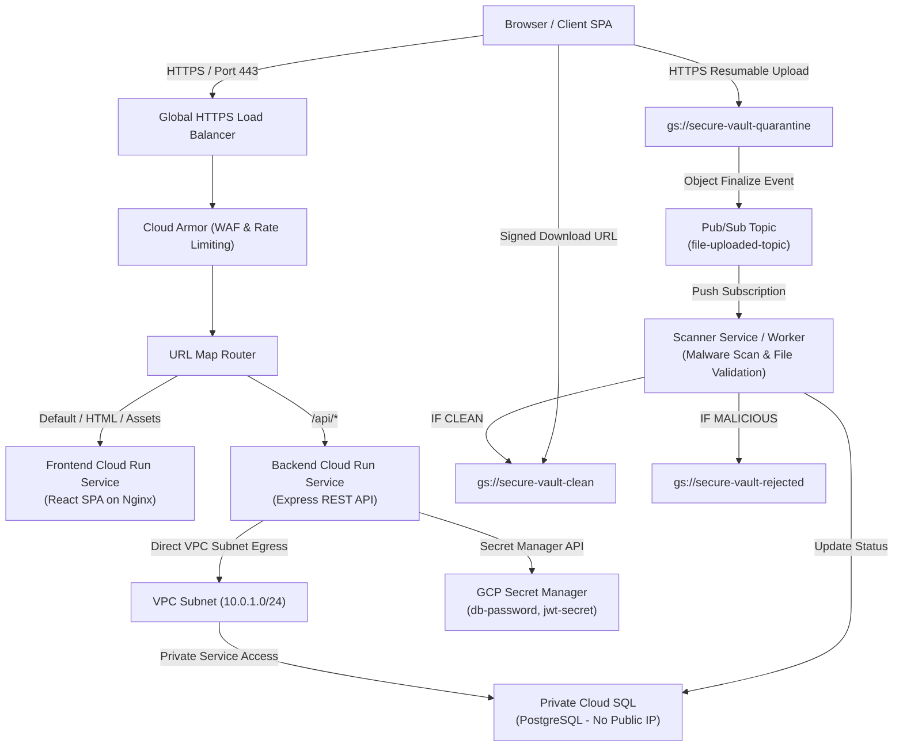
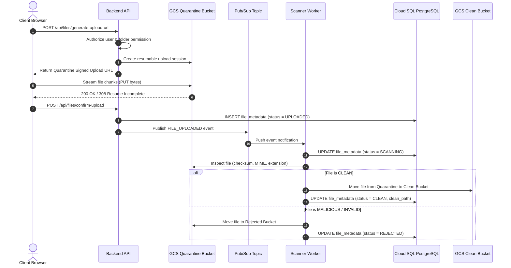

# Target Production Architecture & System Design -- Secure Enterprise File Vault

This document provides a comprehensive technical overview of the production architecture, security controls, networking topology, IAM matrix, file processing pipeline, database design, and scaling strategies for the **Secure Enterprise File Vault**.

---

## 1. System Architecture Diagram

---

## 2. Technical Architecture & Component Rationale

### A. Frontend / Backend Decoupled Architecture
- **Frontend Cloud Run (`secure-file-vault-frontend`)**:
  - Serves static compiled SPA assets via Nginx Alpine on port 8080.
  - Resource profile: 1 vCPU, 256MB RAM, max concurrency 80, min instances 0.
  - Benefit: High throughput for static assets with zero Node.js memory overhead.
- **Backend Cloud Run (`secure-file-vault-backend`)**:
  - Pure Express.js REST API service.
  - Resource profile: 2 vCPU, 1024MB RAM, max concurrency 50, min instances 1 (production).
  - Handles authentication, RBAC authorization, upload session creation, metadata storage, audit logging, and signed URL generation.

### B. Networking & Private Access Security
- **Global HTTPS Load Balancer + Cloud Armor**:
  - Terminate TLS with Google-managed SSL certificates.
  - Cloud Armor WAF policy enforces global rate limiting (500 requests/minute per client IP) to mitigate DDoS and brute-force attacks.
- **Serverless Network Endpoint Groups (NEGs)**:
  - Connect Load Balancer backends directly to Cloud Run services.
  - Backend Cloud Run ingress restricted to `Internal and Cloud Load Balancing`.
- **Private Cloud SQL & Direct VPC Subnet Egress**:
  - Cloud SQL PostgreSQL configured with `ipv4_enabled = false` (no public IP).
  - Cloud Run connects via Direct VPC Subnet Egress (`10.0.1.0/24`) over Private Service Access peering (`servicenetworking.googleapis.com`).

### C. 3-Bucket GCS Isolation & Malware Pipeline

### D. IAM & Service Identity Matrix

| Service Account | Role Bindings | Purpose |
| :--- | :--- | :--- |
| `file-vault-backend-sa` | `roles/cloudsql.client` `roles/secretmanager.secretAccessor` `roles/storage.objectAdmin` (3 buckets) `roles/pubsub.publisher` | Backend API container runtime identity. |
| `file-vault-frontend-sa` | `roles/logging.logWriter` | Frontend SPA static container identity (least privilege). |
| `file-vault-scanner-sa` | `roles/cloudsql.client` `roles/storage.objectAdmin` (3 buckets) `roles/pubsub.subscriber` | Background scanner service identity. |

---

## 3. Database & Scalability Coordination

### Connection Pool Math
$$\text{Cloud Run Max Instances} \times \text{Pool Max} = \text{Total DB Connections}$$
$$10 \times 5 = 50 \le \text{Cloud SQL } \texttt{max\_connections} (100)$$

- **Cloud Run Backend Max Instances**: 10
- **Node.js `pg.Pool` Max per instance**: 5
- **Cloud SQL Default `max_connections`**: 100
- **Safety Margin**: 50% connection pool headroom reserved for administrative tasks and background worker queries.

---

## 4. Disaster Recovery & Backup Strategy

- **RPO (Recovery Point Objective)**: < 5 minutes (via Cloud SQL Point-in-Time Recovery and transaction log archiving).
- **RTO (Recovery Time Objective)**: < 30 minutes (via automated Terraform provisioning and GCS soft-delete restoration).
- **GCS Clean Bucket Retention**:
  - Object versioning enabled (retains last 3 versions of every file).
  - 7-day soft-delete policy (enables recovery of accidentally deleted objects).
