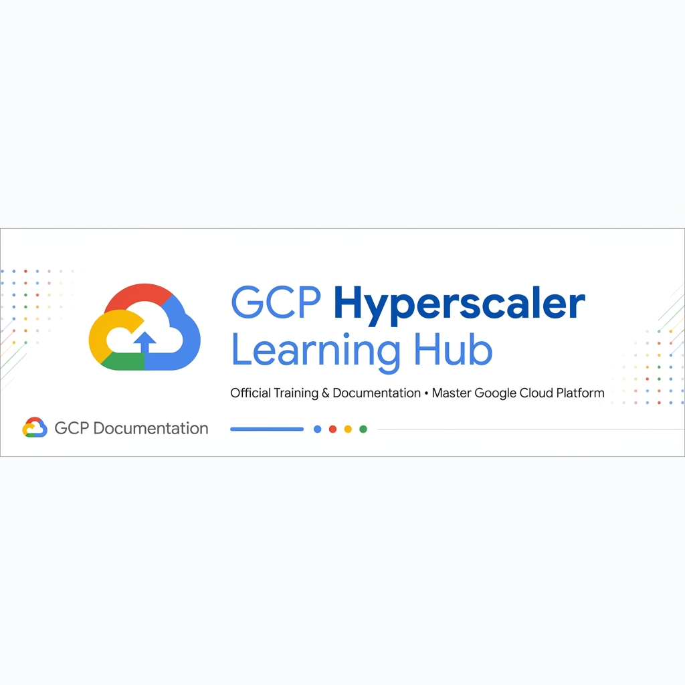

# GCP Hyperscaler Enterprise Learning Roadmap & Architecture Hub

Welcome to the **GCP Hyperscaler Enterprise Learning Curriculum**. This repository is a comprehensive, production-grade learning platform designed to train cloud engineers, architects, DevOps, and SRE professionals on **Google Cloud Platform (GCP)**—from foundational concepts to complex multi-region enterprise architectures.

---

## Key Highlights

- **123 In-Depth Topic Modules**: Covers every core GCP service, architectural pattern, security boundary, and SRE operational framework in standard 18-section detail.
- **14 Hands-On Capstone Projects**: Production-ready code, Terraform HCL, Kubernetes manifests, OpenTelemetry pipelines, and BQML machine learning models across 14 dedicated project directories.
- **100% GCP Free Trial & Always Free Tier Compatible**: Engineered for $0 idle cost on GCP Free Trial ($300 credit) accounts with automated zero-leak cleanup scripts (`cleanup_*.sh`).
- **Automatic Project Auto-Detection**: Built-in shell scripts auto-detect active GCP projects in Cloud Shell to prevent configuration errors.
- **Rich Visual Diagrams**: Includes clean, human-designed 2D architecture diagrams (`architecture.png`) and Mermaid flowcharts across every project and topic README.

---

## Learning Progression & Architectural Map

```text
Section 01: GCP Fundamentals  ────────►  Section 02: IAM & Identity Governance
                                                     │
                                                     ▼
Section 04: Compute Engine & MIGs  ◄────  Section 03: Hybrid VPC Networking
            │
            ▼
Section 05: Polyglot Storage & DBs ─────►  Section 06: GKE Autopilot Platform
                                                     │
                                                     ▼
Section 08: Infrastructure as Code ◄────  Section 07: Serverless Event-Driven
 (Terraform & GCS State Backend)
            │
            ▼
Section 09: GitOps CI/CD Pipelines ─────►  Section 10: Full-Stack Observability
(Cloud Build & Cloud Deploy)              (OpenTelemetry, Trace & Dashboards)
                                                     │
                                                     ▼
Section 12: FinOps Cost Governance ◄────  Section 11: Zero-Trust Security
 (Recommender API & Auto-Capper)           (WAF, KMS CMEK, Secret Manager)
            │
            ▼
Section 13: Data & Analytics ──────────►  Section 14: Reliability Engineering (SRE)
 (BigQuery, Dataflow, Dataproc)            (SLOs, Error Budgets, Chaos Mesh)
```

---

## Master Hands-On Capstone Projects Index

| Module # & Name | Hands-On Capstone Project | Key GCP Services & Tech Stack | Free Tier Cost | Project Guide |
|---|---|---|---|---|
| **01. GCP Fundamentals** | Project 01: Foundation Setup | Org Hierarchy, Billing Budgets, `gcloud` SDK | $0 (Free Tier) | [Project 01 README](01-gcp-fundamentals/project-01-gcp-fundamentals/README.md) |
| **02. IAM & Identity** | Project 02: Zero-Trust IAM | Custom Roles, Workload Identity Federation (OIDC) | $0 (Free Tier) | [Project 02 README](02-iam-and-identity/project-02-iam-and-identity/README.md) |
| **03. Networking / VPC** | Project 03: Hybrid Secure VPC | Dual-Region Subnets, Cloud NAT, PSC | $0 (Free Tier) | [Project 03 README](03-networking-vpc/project-03-networking-vpc/README.md) |
| **04. Compute / VMs** | Project 04: Auto-Healing MIG | Instance Templates (`e2-micro`), Autoscaling | $0 (Free Tier) | [Project 04 README](04-compute-virtual-machines/project-04-compute-virtual-machines/README.md) |
| **05. Storage & DBs** | Project 05: Polyglot Storage | Cloud SQL PostgreSQL, GCS Lifecycle, Firestore | $0 (Free Tier) | [Project 05 README](05-storage-and-databases/project-05-storage-and-databases/README.md) |
| **06. Containers & GKE** | Project 06: Enterprise GKE Platform | GKE Autopilot, Artifact Registry, HPA | $0 (Free Tier) | [Project 06 README](06-containers-and-kubernetes/project-06-containers-and-kubernetes/README.md) |
| **07. Serverless** | Project 07: Event-Driven Engine | Cloud Run, Cloud Functions 2nd Gen, Pub/Sub | $0 (Free Tier) | [Project 07 README](07-serverless-event-driven/project-07-serverless-event-driven/README.md) |
| **08. IaC / Terraform** | Project 08: Modular Landing Zone | Terraform HCL, GCS Remote State Locking | $0 (Free Tier) | [Project 08 README](08-infrastructure-as-code/project-08-infrastructure-as-code/README.md) |
| **09. CI/CD Pipelines** | Project 09: Supply Chain GitOps | Cloud Build, Container Analysis, Cloud Deploy | $0 (Free Tier) | [Project 09 README](09-cicd/project-09-cicd/README.md) |
| **10. Observability** | Project 10: Full-Stack Suite | OpenTelemetry Collector, 4 Golden Signals | $0 (Free Tier) | [Project 10 README](10-observability/project-10-observability/README.md) |
| **11. Security** | Project 11: Zero-Trust Perimeter | Cloud Armor WAF, Cloud KMS CMEK, Secret Manager | $0 (Free Tier) | [Project 11 README](11-security/project-11-security/README.md) |
| **12. Cost Management** | Project 12: FinOps Governance | BigQuery Billing Export SQL, Recommender API | $0 (Free Tier) | [Project 12 README](12-cost-management/project-12-cost-management/README.md) |
| **13. Data & Analytics** | Project 13: Analytics Lakehouse | BigQuery Partitioning, Apache Beam Dataflow, BQML | $0 (Free Tier) | [Project 13 README](13-data-and-analytics/project-13-data-and-analytics/README.md) |
| **14. Reliability / SRE** | Project 14: SRE Framework | 99.9% SLOs, 14.4x Burn Rate Alerts, Chaos Mesh | $0 (Free Tier) | [Project 14 README](14-reliability-engineering/project-14-reliability-engineering/README.md) |

---

## Production Projects

| Project Name | Architecture Highlights | Key GCP Services & Tech Stack | Documentation & Deployment Guide |
|---|---|---|---|
| **Secure Enterprise File Vault** | Decoupled SPA/API, Private Cloud SQL (No Public IP), Direct VPC Subnet Egress, 3-Bucket GCS Pipeline, Async Malware Scanner State Machine, Centralized RBAC (BOLA/IDOR defense), Secret Manager | Cloud Run (Frontend & Backend), Cloud SQL PostgreSQL, GCS, Secret Manager, Pub/Sub, Cloud Armor WAF, Terraform, React SPA, Node.js Express API | [Project README](Production%20Projects/secure-file-vault/README.md) \| [GCP Deployment Guide](Production%20Projects/secure-file-vault/DEPLOYMENT.md) \| [Architecture Spec](Production%20Projects/secure-file-vault/ARCHITECTURE.md) \| [Production Audit](Production%20Projects/secure-file-vault/PRODUCTION_READINESS.md) |

---

## Quick Start Guide: Deploying Projects in Cloud Shell

### 1. Clone Repository in GCP Cloud Shell
Open [Google Cloud Shell](https://shell.cloud.google.com) and clone the repository:

```bash
git clone https://github.com/tusquake/GCP-HyperScaler.git
cd GCP-HyperScaler
```

### 2. Run Any Project Deployment Script
Navigate to any project directory and run its automated deployment script (with built-in project auto-detection):

```bash
# Example: Deploying Project 07 (Serverless Engine)
cd 07-serverless-event-driven/project-07-serverless-event-driven
chmod +x scripts/*.sh
./scripts/deploy_serverless_engine.sh
```

### 3. Teardown & Clean Up Resources
After completing your hands-on exercise, run the cleanup script to maintain $0 idle cost:

```bash
./scripts/cleanup_serverless.sh
```

---

## Curriculum Master Index (123 Detailed Topics)

### Section 01: GCP Fundamentals
- **[01. Setup Free Account](01-gcp-fundamentals/01-setup-free-account/README.md)** - Setting up Google Cloud $300 free trial credit, configuring Always Free tier resource constraints, and establishing billing alert guardrails for $0 idle cost operation.
- **[02. What is GCP](01-gcp-fundamentals/02-what-is-gcp/README.md)** - Overview of Google Cloud Platform's global infrastructure, core cloud computing paradigms, managed service offerings, and enterprise product architecture.
- **[03. Why GCP is Used](01-gcp-fundamentals/03-why-gcp-is-used/README.md)** - Key business differentiators of Google Cloud, including planetary-scale private fiber networking, BigQuery analytical speeds, GKE Kubernetes heritage, and live VM migration capabilities.
- **[04. Cloud Computing Fundamentals](01-gcp-fundamentals/04-cloud-computing-fundamentals/README.md)** - Core cloud delivery models (IaaS, PaaS, SaaS, FaaS, Serverless), multi-tenant virtualized compute mechanics, and cloud elasticity principles.
- **[05. Global Infrastructure](01-gcp-fundamentals/05-global-infrastructure/README.md)** - Deep dive into Google's physical infrastructure layout, Points of Presence (PoPs), Edge PoP caching points, and undersea fiber cable routes.
- **[06. Regions & Zones](01-gcp-fundamentals/06-regions-and-zones/README.md)** - Geographic region placement strategies, multi-zone fault isolation domains, inter-zone latency considerations, and disaster recovery region selection.
- **[07. Projects](01-gcp-fundamentals/07-projects/README.md)** - The primary administrative, IAM access control, API enablement, quota allocation, and billing isolation boundary in GCP.
- **[08. Resource Hierarchy](01-gcp-fundamentals/08-resource-hierarchy/README.md)** - Top-down enterprise organization structure mapping Organization Nodes, Folders, Projects, and Child Resources with policy inheritance rules.
- **[09. Billing Accounts](01-gcp-fundamentals/09-billing-accounts/README.md)** - Managing Cloud Billing accounts, sub-accounts, credit allocations, payment profiles, invoice linkages, and currency parameters.
- **[10. Cloud Console](01-gcp-fundamentals/10-cloud-console/README.md)** - Navigating the web UI management interface, customizing monitoring dashboards, accessing service metrics, and using integrated Cloud Shell terminals.
- **[11. Cloud Shell](01-gcp-fundamentals/11-cloud-shell/README.md)** - Using the browser-based, ephemeral Debian Linux environment pre-loaded with `gcloud`, `kubectl`, `terraform`, `git`, and a 5 GB persistent home directory.
- **[12. gcloud CLI](01-gcp-fundamentals/12-gcloud-cli/README.md)** - Mastering the primary command-line interface for controlling GCP services, configuring properties, formatting output (`--format=json/yaml/table/value`), and automating shell scripts.
- **[13. Google Cloud SDK](01-gcp-fundamentals/13-google-cloud-sdk/README.md)** - Installing, updating, component-managing, and authenticating `gcloud`, `gsutil`, `bq`, and client libraries across local workstation environments.
- **[14. Shared Responsibility Model](01-gcp-fundamentals/14-shared-responsibility-model/README.md)** - Understanding the division of security, infrastructure, hypervisor patching, data protection, and operational duties between Google Cloud and customer teams across IaaS, PaaS, and SaaS.
- **[15. Quotas & Limits](01-gcp-fundamentals/15-quotas-and-limits/README.md)** - Understanding rate limits, allocation quotas, regional API caps, monitoring quota consumption, and executing formal quota increase requests.

### Section 02: IAM & Identity
- **[16. IAM Fundamentals](02-iam-and-identity/16-iam-fundamentals/README.md)** - Core identity and access management architecture based on Who (Identities), Can Do What (Roles/Permissions), On Which Resource (Resource Scope) under Zero-Trust principles.
- **[17. Users](02-iam-and-identity/17-users/README.md)** - Managing Google Workspace and Cloud Identity user accounts, domain verification, lifecycle provisioning, and single sign-on (SSO) SAML integration.
- **[18. Groups](02-iam-and-identity/18-groups/README.md)** - Aggregating users into functional Google Groups to streamline role assignment, simplify access audits, and enforce group-based permission inheritance.
- **[19. Service Accounts](02-iam-and-identity/19-service-accounts/README.md)** - Non-human identities used by applications, Compute Engine VMs, Cloud Functions, and GKE workloads for secure GCP API authorization.
- **[20. Basic Roles](02-iam-and-identity/20-basic-roles/README.md)** - Understanding legacy primitive roles (Owner, Editor, Viewer) and why they violate security best practices by granting excessively broad project-level permissions.
- **[21. Predefined Roles](02-iam-and-identity/21-predefined-roles/README.md)** - Utilizing Google-maintained, fine-grained service roles (e.g., `roles/storage.objectViewer`) granting precise permissions aligned with job functions.
- **[22. Custom Roles](02-iam-and-identity/22-custom-roles/README.md)** - Tailoring enterprise permission sets using granular IAM permissions (e.g., `compute.instances.start`) to satisfy strict principle of least privilege mandates.
- **[23. IAM Policies](02-iam-and-identity/23-iam-policies/README.md)** - Structuring IAM policy bindings, configuring conditional IAM rules based on request attributes and time windows, and evaluating effective permission inheritance.
- **[24. Organization Policies](02-iam-and-identity/24-organization-policies/README.md)** - Enforcing top-down centralized guardrails and restriction constraints across all projects (e.g., restricting public IP creation or enforcing service account key creation blocks).
- **[25. Service Account Keys](02-iam-and-identity/25-service-account-keys/README.md)** - Security risks associated with long-lived service account JSON keys, key rotation automation, and migrating to keyless authentication alternatives.
- **[26. Workload Identity](02-iam-and-identity/26-workload-identity/README.md)** - Keyless authentication mechanism allowing external workloads (AWS, Azure, GitHub Actions, GKE) to authenticate to GCP APIs securely using short-lived OIDC federated tokens.

### Section 03: Networking / VPC
- **[27. VPC](03-networking-vpc/27-vpc/README.md)** - Global Virtual Private Cloud virtual network providing private, logically isolated RFC1918 IPv4/IPv6 communication across all GCP regions within a single project.
- **[28. Subnets](03-networking-vpc/28-subnets/README.md)** - Regional subnetwork IP address range allocation (`10.0.0.0/24`), custom vs auto mode VPCs, primary ranges, and secondary IP ranges for Kubernetes pods and services.
- **[29. Routes](03-networking-vpc/29-routes/README.md)** - Virtual routing tables governing traffic paths between subnets, default internet gateways, custom next-hop virtual appliances, and Cloud VPN gateways.
- **[30. Firewall Rules](03-networking-vpc/30-firewall-rules/README.md)** - Distributed, stateful ingress and egress packet filtering by IP CIDR ranges, protocols, ports, service account identities, and network tags.
- **[31. Cloud DNS](03-networking-vpc/31-cloud-dns/README.md)** - High-performance, scalable managed DNS authoritative server providing public domain name resolution and internal private DNS zones for VPC instances.
- **[32. Cloud Router](03-networking-vpc/32-cloud-router/README.md)** - Dynamic BGP (Border Gateway Protocol) routing service managing route discovery and propagation over Cloud VPN tunnels and Dedicated Interconnect circuits.
- **[33. Cloud NAT](03-networking-vpc/33-cloud-nat/README.md)** - Fully managed Network Address Translation service allowing private VM instances without public IP addresses to access the internet securely for outbound patches and API calls.
- **[34. Load Balancing](03-networking-vpc/34-load-balancing/README.md)** - Portfolio of global and regional External/Internal HTTP(S), TCP Proxy, SSL Proxy, and Network Passthrough load balancers providing high availability and SSL offloading.
- **[35. VPC Peering](03-networking-vpc/35-vpc-peering/README.md)** - Low-latency, high-bandwidth private RFC1918 interconnectivity between independent VPC networks across projects or organizations without public internet exposure.
- **[36. Shared VPC](03-networking-vpc/36-shared-vpc/README.md)** - Enterprise networking architecture delegating centralized network administration to a host project while sharing subnets with application service projects.
- **[37. Private Service Connect](03-networking-vpc/37-private-service-connect/README.md)** - Private Endpoint abstraction allowing VPC workloads to connect privately to Google APIs, third-party SaaS, and internal producer services via internal IP endpoints.

### Section 04: Compute / Virtual Machines
- **[38. Virtual Machines](04-compute-virtual-machines/38-virtual-machines/README.md)** - Provisioning and configuring Compute Engine IaaS instances, selecting Linux/Windows boot images, startup scripts, and OS customization parameters.
- **[39. Machine Types](04-compute-virtual-machines/39-machine-types/README.md)** - Selecting optimal vCPU and memory ratios across General-Purpose (E2, N2), Compute-Optimized (C2), Memory-Optimized (M2), and GPU instance families.
- **[40. Persistent Disks](04-compute-virtual-machines/40-persistent-disks/README.md)** - Durable network-attached block storage options including Standard (pd-standard), Balanced (pd-balanced), Performance SSD (pd-ssd), and Extreme (pd-extreme) disks.
- **[41. Snapshots](04-compute-virtual-machines/41-snapshots/README.md)** - Incremental point-in-time disk backups stored redundantly in Cloud Storage for disaster recovery, disk cloning, and automated backup schedules.
- **[42. Instance Templates](04-compute-virtual-machines/42-instance-templates/README.md)** - Declarative, immutable configuration blueprints defining machine specs, boot disks, network tags, service accounts, and startup scripts for scaling fleets.
- **[43. Managed Instance Groups](04-compute-virtual-machines/43-managed-instance-groups/README.md)** - Clusters of identical VM instances providing automated horizontal scaling, multi-zone high availability, HTTP health checks, auto-healing, and rolling updates.
- **[44. Autoscaling](04-compute-virtual-machines/44-autoscaling/README.md)** - Dynamically adjusting MIG VM capacity based on CPU utilization metrics, load balancer capacity, Pub/Sub queue depth, or custom Cloud Monitoring metrics.
- **[45. Load Balancers](04-compute-virtual-machines/45-load-balancers/README.md)** - Connecting Compute Engine instance groups to global external and internal HTTP(S) load balancers with health check probes and session affinity.

### Section 05: Storage & Databases
- **[46. Cloud Storage](05-storage-and-databases/46-cloud-storage/README.md)** - Scalable, highly durable object storage service designed for storing unstructured files, media assets, analytical data lakes, and backup archives.
- **[47. Buckets](05-storage-and-databases/47-buckets/README.md)** - Creating and configuring storage containers, region/multi-region location selection, Uniform Bucket-Level Access (UBLA), and public access prevention rules.
- **[48. Objects](05-storage-and-databases/48-objects/README.md)** - Uploading, downloading, generating signed URLs for temporary delegation, object immutability, and managing custom metadata.
- **[49. Storage Classes](05-storage-and-databases/49-storage-classes/README.md)** - Selecting cost-optimized data access tiers: Standard (frequent), Nearline (30-day), Coldline (90-day), and Archive (365-day minimum retention period).
- **[50. Lifecycle Policies](05-storage-and-databases/50-lifecycle-policies/README.md)** - Automating object class transitions and object deletion rules based on object age, creation date, or storage class conditions.
- **[51. Versioning](05-storage-and-databases/51-versioning/README.md)** - Retaining historical object state versions to protect against accidental deletion, file overwrites, and ransomware modifications.
- **[52. Encryption](05-storage-and-databases/52-encryption/README.md)** - Understanding default server-side Google-Managed Encryption Keys (GMEK), Customer-Managed Encryption Keys (CMEK via Cloud KMS), and Customer-Supplied Keys (CSEK).
- **[53. Cloud SQL](05-storage-and-databases/53-cloud-sql/README.md)** - Fully managed relational database engine supporting PostgreSQL, MySQL, and SQL Server with automated backups, High Availability (HA) failover, and read replicas.
- **[54. Firestore](05-storage-and-databases/54-firestore/README.md)** - Serverless, auto-scaling NoSQL document database featuring real-time data synchronization, multi-region replication, and offline mobile app support.
- **[55. Bigtable](05-storage-and-databases/55-bigtable/README.md)** - Ultra-low latency, high-throughput NoSQL wide-column database engine optimized for large-scale analytical, IoT time-series, and financial streaming workloads.
- **[56. Spanner](05-storage-and-databases/56-spanner/README.md)** - Globally distributed, relational database combining horizontal scalability with ACID transactional consistency and 99.999% SLA availability.
- **[57. Memorystore](05-storage-and-databases/57-memorystore/README.md)** - Fully managed in-memory data store service providing sub-millisecond caching using Redis and Memcached engines for application performance acceleration.

### Section 06: Containers & Kubernetes
- **[58. Container Fundamentals](06-containers-and-kubernetes/58-container-fundamentals/README.md)** - Understanding OCI image standards, Docker container runtime mechanics, image layers, multi-stage Dockerfiles, and container isolation principles.
- **[59. Artifact Registry](06-containers-and-kubernetes/59-artifact-registry/README.md)** - Enterprise regional repository for storing and managing container images and language packages with automated vulnerability scanning.
- **[60. GKE Overview](06-containers-and-kubernetes/60-gke-overview/README.md)** - Managed Google Kubernetes Engine platform for orchestrating, scaling, upgrading, and monitoring containerized microservice workloads.
- **[61. Cluster Architecture](06-containers-and-kubernetes/61-cluster-architecture/README.md)** - Deep dive into Kubernetes Control Plane components (API Server, etcd, Scheduler, Controller Manager) and Worker Node architecture (Kubelet, Containerd).
- **[62. GKE Cluster Types](06-containers-and-kubernetes/62-gke-cluster-types/README.md)** - Comparing Zonal single/multi-zone control planes vs Regional highly available control planes distributed across three zones.
- **[63. Autopilot vs Standard](06-containers-and-kubernetes/63-autopilot-vs-standard/README.md)** - Fully managed hands-off GKE Autopilot mode (per-pod billing, managed nodes, hardened defaults) vs GKE Standard mode (full node control and custom worker pools).
- **[64. Node Pools](06-containers-and-kubernetes/64-node-pools/README.md)** - Provisioning worker node clusters with distinct machine types, GPU accelerators, Local SSDs, and Spot VM pricing options.
- **[65. Workloads](06-containers-and-kubernetes/65-workloads/README.md)** - Authoring declarative Kubernetes manifests for Pods, Deployments (rolling updates), StatefulSets (stable identity/storage), DaemonSets, and CronJobs.
- **[66. Services](06-containers-and-kubernetes/66-services/README.md)** - Internal networking abstractions including ClusterIP (internal VIP), NodePort, and External LoadBalancer for routing traffic to dynamic pod IPs.
- **[67. Ingress](06-containers-and-kubernetes/67-ingress/README.md)** - Deploying GKE Ingress controllers to provision Google Cloud External HTTP(S) Load Balancers with managed SSL certificates and Cloud Armor integration.
- **[68. ConfigMaps](06-containers-and-kubernetes/68-configmaps/README.md)** - Decoupling non-sensitive environment configuration parameters and mounting them as environment variables or volume files inside pods.
- **[69. Secrets](06-containers-and-kubernetes/69-secrets/README.md)** - Injecting sensitive credentials, API keys, and TLS certificates securely into pods using base64 Kubernetes Secrets or Secret Manager CSI drivers.
- **[70. GKE Networking](06-containers-and-kubernetes/70-gke-networking/README.md)** - Implementing VPC-native clusters with IP Alias ranges, Pod IP allocation, Service IP allocation, and Network Policies for pod micro-segmentation.
- **[71. GKE Storage](06-containers-and-kubernetes/71-gke-storage/README.md)** - Dynamic persistent storage allocation using PersistentVolumeClaims (PVC), StorageClasses, and Google Cloud Storage / Persistent Disk CSI drivers.
- **[72. GKE Security](06-containers-and-kubernetes/72-gke-security/README.md)** - Cluster hardening practices including RBAC, Workload Identity, Pod Security Admission, Shielded GKE Nodes, and Private Cluster configurations.
- **[73. Autoscaling](06-containers-and-kubernetes/73-autoscaling/README.md)** - Dynamically scaling clusters using Horizontal Pod Autoscaler (HPA), Vertical Pod Autoscaler (VPA), and GKE Cluster Autoscaler for node fleet adjustments.
- **[74. Multi-cluster GKE](06-containers-and-kubernetes/74-multi-cluster-gke/README.md)** - Managing multi-cluster fleets across regions using Anthos / GKE Enterprise, Connect Gateways, Multi-Cluster Ingress, and Service Directory.

### Section 07: Serverless & Event-Driven
- **[75. Cloud Run](07-serverless-event-driven/75-cloud-run/README.md)** - Fully managed serverless container runtime executing stateless HTTP microservices with automatic concurrency scaling, scale-to-zero, and webhooks.
- **[76. Cloud Functions](07-serverless-event-driven/76-cloud-functions/README.md)** - Lightweight Event-Driven Function-as-a-Service (FaaS) platform for running discrete Python/Node.js/Go event handler code.
- **[77. Cloud Scheduler](07-serverless-event-driven/77-cloud-scheduler/README.md)** - Fully managed enterprise cron job service invoking Cloud Run endpoints, Cloud Functions, Pub/Sub topics, or external HTTP URLs on cron schedules.
- **[78. Pub/Sub Integration](07-serverless-event-driven/78-pubsub-integration/README.md)** - Asynchronous messaging middleware connecting producers and serverless consumers via push/pull subscriptions with dead-letter queues.
- **[79. Eventarc](07-serverless-event-driven/79-eventarc/README.md)** - Uniform event routing platform listening to GCP Audit Logs, Cloud Storage events, and Pub/Sub streams to trigger serverless workloads asynchronously.
- **[80. API Gateway](07-serverless-event-driven/80-api-gateway/README.md)** - Fully managed API front-door for securing, rate-limiting, authenticating (OpenID/API keys), and routing incoming public traffic to Cloud Run and Cloud Functions.
- **[81. Event-Driven Architectures](07-serverless-event-driven/81-event-driven-architectures/README.md)** - Designing loosely coupled, event-driven reactive microservices architectures using Pub/Sub, Eventarc, and scale-to-zero compute.

### Section 08: Infrastructure as Code
- **[82. Terraform on GCP](08-infrastructure-as-code/82-terraform-on-gcp/README.md)** - Automating Google Cloud resource provisioning declaratively using HashiCorp Terraform HCL, resource dependencies, and state graphs.
- **[83. Providers](08-infrastructure-as-code/83-providers/README.md)** - Configuring the official `hashicorp/google` and `hashicorp/google-beta` providers, service account impersonation, and regional defaults.
- **[84. Variables](08-infrastructure-as-code/84-variables/README.md)** - Parameterizing HCL configurations using input variables (`variables.tf`), output values (`outputs.tf`), local values (`locals.tf`), and `.tfvars` files.
- **[85. Modules](08-infrastructure-as-code/85-modules/README.md)** - Constructing modular, reusable Terraform building blocks (`modules/vpc`, `modules/gke`) to standardize infrastructure across development, staging, and production environments.
- **[86. State Management](08-infrastructure-as-code/86-state-management/README.md)** - Managing the `terraform.tfstate` metadata file, inspecting tracked resources (`terraform state list`), import operations, and state locking mechanisms.
- **[87. Remote Backend](08-infrastructure-as-code/87-remote-backend/README.md)** - Configuring GCS remote state backends (`backend.tf`) with state locking and object versioning to enable safe team collaboration and prevent state drift.

### Section 09: CI/CD
- **[88. CI/CD Concepts](09-cicd/88-cicd-concepts/README.md)** - Principles of Continuous Integration, Continuous Delivery, GitOps workflows, automated testing, and release automation on Google Cloud.
- **[89. Cloud Build](09-cicd/89-cloud-build/README.md)** - Serverless CI/CD platform executing automated builds, tests, and deployments defined in `cloudbuild.yaml` using parallel build steps.
- **[90. Artifact Registry Integration](09-cicd/90-artifact-registry-integration/README.md)** - Automating Docker image compilation, vulnerability scanning, tagging with Git commit hashes (`$SHORT_SHA`), and pushing to Artifact Registry.
- **[91. Deploy to Cloud Run](09-cicd/91-deploy-to-cloud-run/README.md)** - Authoring Cloud Build pipeline steps to deploy new container revisions to Cloud Run with automated traffic splitting and rollback capabilities.
- **[92. Deploy to GKE](09-cicd/92-deploy-to-gke/README.md)** - Progressive delivery release pipelines using Cloud Deploy, Skaffold, Helm, or Kustomize to promote manifests across staging and production GKE clusters.

### Section 10: Observability
- **[93. Cloud Monitoring](10-observability/93-cloud-monitoring/README.md)** - Enterprise operations platform collecting metrics, time-series data, health status, and infrastructure performance across GCP services.
- **[94. Cloud Logging](10-observability/94-cloud-logging/README.md)** - Real-time log ingestion, storage, filtering with Logging Query Language (LQL), and routing log sinks to BigQuery, Pub/Sub, or Cloud Storage.
- **[95. Metrics Explorer](10-observability/95-metrics-explorer/README.md)** - Querying and visualizing time-series metrics using PromQL (Prometheus Query Language) and MQL (Monitoring Query Language) alignment functions.
- **[96. Dashboards](10-observability/96-dashboards/README.md)** - Provisioning declarative custom JSON dashboards visualizing real-time metrics, system throughput, error rates, and resource utilization.
- **[97. Alerting Policies](10-observability/97-alerting-policies/README.md)** - Establishing automated incident notification rules triggering emails, PagerDuty incidents, Slack webhooks, or Pub/Sub events upon metric threshold breach.
- **[98. Uptime Checks](10-observability/98-uptime-checks/README.md)** - Synthetic HTTP, HTTPS, and TCP probe monitors checking global service endpoint availability from probe locations across North America, Europe, and Asia-Pacific.
- **[99. Cloud Trace](10-observability/99-cloud-trace/README.md)** - Distributed tracing service collecting RPC latency data from instrumented microservices to visualize request waterfall charts and identify latency bottlenecks.
- **[100. Cloud Profiler](10-observability/100-cloud-profiler/README.md)** - Low-overhead continuous CPU and memory heap profiling agent analyzing production application code execution to identify performance hotspots.
- **[101. OpenTelemetry](10-observability/101-opentelemetry/README.md)** - Vendor-neutral telemetry collector standard (`otel-collector/config.yaml`) exporting OTLP metrics, logs, and distributed traces to GCP Observability APIs.

### Section 11: Security
- **[102. Secret Manager](11-security/102-secret-manager/README.md)** - Centralized, encrypted storage service for managing versioned passwords, API tokens, database credentials, and TLS certificates with IAM accessor controls.
- **[103. Cloud KMS](11-security/103-cloud-kms/README.md)** - Key Management Service for managing symmetric and asymmetric Customer-Managed Encryption Keys (CMEK), automated key rotation, and hardware security modules (HSM).
- **[104. Security Command Center](11-security/104-security-command-center/README.md)** - Enterprise security posture management (BSPM) platform scanning for asset misconfigurations, vulnerabilities, and threat findings in real time.
- **[105. Certificate Manager](11-security/105-certificate-manager/README.md)** - Provisioning, validating, and renewing Google-managed SSL/TLS certificates for global HTTP(S) Load Balancers across custom domain maps.
- **[106. Cloud Armor](11-security/106-cloud-armor/README.md)** - Web Application Firewall (WAF) and DDoS mitigation service enforcing OWASP Top 10 protection rules, IP rate limiting, and geo-fencing at edge load balancers.
- **[107. Identity-Aware Proxy](11-security/107-identity-aware-proxy/README.md)** - Context-aware zero-trust authentication proxy securing web applications and SSH/RDP access based on identity and device health without public IPs.
- **[108. Binary Authorization](11-security/108-binary-authorization/README.md)** - Deploy-time container security policy service validating digital KMS signatures and attestations before allowing pods to run in GKE.

### Section 12: Cost Management
- **[109. Billing Reports](12-cost-management/109-billing-reports/README.md)** - Analyzing cloud expenditures using interactive billing dashboards, resource labels, SKU breakdowns, and exporting raw billing data to BigQuery.
- **[110. Budgets & Alerts](12-cost-management/110-budgets-and-alerts/README.md)** - Configuring Cloud Billing budget thresholds ($50, $100) with 50%, 90%, and 100% notification triggers publishing events to Pub/Sub.
- **[111. Cost Optimization Techniques](12-cost-management/111-cost-optimization-techniques/README.md)** - Leveraging Spot VMs, Committed Use Discounts (CUDs), GCS lifecycle auto-tiering, and idle resource removal to minimize spend.
- **[112. Rightsizing Resources](12-cost-management/112-rightsizing-resources/README.md)** - Using GCP Recommender API recommendations to discover underutilized VM instances, unattached persistent disks, and over-provisioned machine types.

### Section 13: Data & Analytics
- **[113. BigQuery](13-data-and-analytics/113-bigquery/README.md)** - Fully managed serverless enterprise data warehouse supporting SQL queries, column-level security, table partitioning (`DATE(timestamp)`), clustering, and BQML machine learning models.
- **[114. Pub/Sub](13-data-and-analytics/114-pubsub/README.md)** - Scalable event streaming platform supporting high-throughput ingestion, push/pull subscriptions, and direct zero-code streaming insertion into BigQuery tables.
- **[115. Dataflow](13-data-and-analytics/115-dataflow/README.md)** - Unified stream and batch data processing pipeline service powered by Apache Beam supporting windowed aggregations, side outputs, and fault-tolerant execution.
- **[116. Dataproc](13-data-and-analytics/116-dataproc/README.md)** - Managed Apache Spark and Apache Hadoop cluster service supporting ephemeral clusters and serverless PySpark ETL execution reading directly from Cloud Storage (`gs://`).

### Section 14: Reliability Engineering
- **[117. SLI](14-reliability-engineering/117-sli/README.md)** - Service Level Indicators measuring real-time operational performance ratios ($Good Events / Total Events$) across HTTP load balancer boundaries.
- **[118. SLO](14-reliability-engineering/118-slo/README.md)** - Service Level Objectives defining targeted reliability goals (e.g., 99.9% availability over a 28-day rolling window) agreed upon between engineering and business teams.
- **[119. SLA](14-reliability-engineering/119-sla/README.md)** - Service Level Agreements defining formal contractually binding uptime commitments with financial credit penalties if breached.
- **[120. Error Budgets](14-reliability-engineering/120-error-budgets/README.md)** - Mathematical unreliability allowance ($100\% - SLO\%$) balancing feature deployment velocity against platform stability, backed by 14.4x fast-burn rate alerting.
- **[121. Incident Management](14-reliability-engineering/121-incident-management/README.md)** - Structured Incident Command System (ICS) operational response roles (Incident Commander, Operations Lead, Comms) and blameless post-mortem post-incident reviews.
- **[122. Disaster Recovery](14-reliability-engineering/122-disaster-recovery/README.md)** - Formulating Recovery Time Objectives (RTO) and Recovery Point Objectives (RPO), executing cross-region database replica failovers, and DNS traffic redirection.
- **[123. Chaos Engineering](14-reliability-engineering/123-chaos-engineering/README.md)** - Controlled fault injection testing (Pod termination, network latency injection) using Chaos Mesh tools to validate system resilience under stress.

---

## Topic Module Standard Architecture (18 Sections)

Every single topic `README.md` across all 123 topics follows a strict, standardized 18-section architectural pattern:

1. **What Is It?**: Deep technical explanation, real-world analogies, core concepts.
2. **Where Does It Fit?**: 2D Architecture Diagram & Mermaid Flowchart.
3. **Core Concepts**: Key terminology, parameters, and design pillars.
4. **Key Features & Capabilities**: Technical breakdown of feature sets.
5. **How It Works**: Under the hood execution flows.
6. **Architecture & Topology**: Deep dive network/compute topology.
7. **Hands-On Setup (GCP Console)**: Step-by-step Web UI instructions.
8. **Hands-On Setup (`gcloud` CLI)**: Complete copy-pasteable CLI commands.
9. **Configuration & Code Examples**: Declarative HCL, YAML, and Python samples.
10. **Security & IAM Best Practices**: Role bindings, encryption, least privilege.
11. **Cost & FinOps Considerations**: Pricing mechanics and budget guardrails.
12. **Production Use Cases & Patterns**: Enterprise architectural scenarios.
13. **Antipatterns & Pitfalls**: Common mistakes and anti-patterns to avoid.
14. **Monitoring, Logging & Diagnostics**: Observability, metric names, log filters.
15. **Troubleshooting Guide**: Diagnostic matrix with root causes & solutions.
16. **Decision Matrix / Comparison Table**: Comparative feature evaluation.
17. **Real Project Q&A**: Interview questions with expert answers.
18. **Next Steps**: Seamless links to downstream topics.
